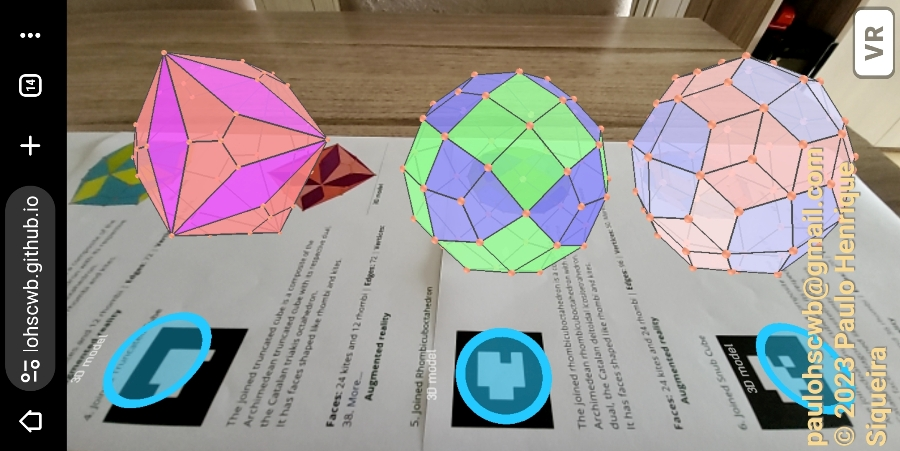
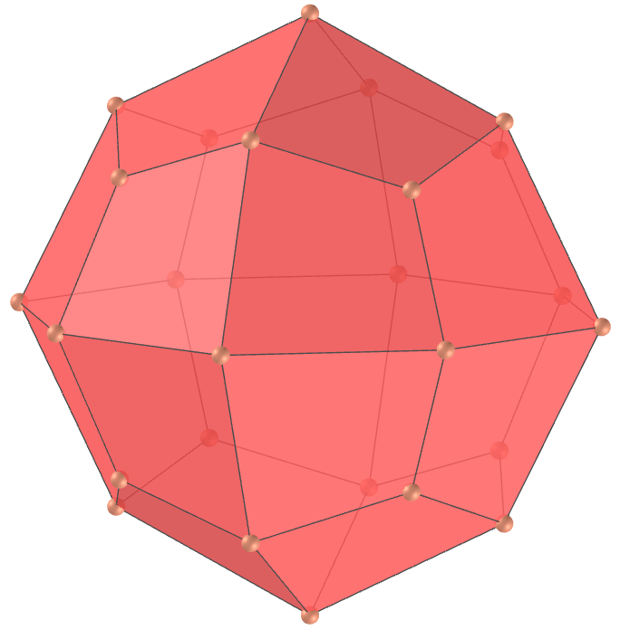

<link rel="stylesheet" href="../scripts/style.css">
<link rel="icon" type="image/png" href="vr/salas/imagens/icone.png">
<h2>Visualization of polyhedra with Augmented Reality (AR) and Virtual Reality (VR) in A-frame</h2>
 <b>author:</b> Paulo Henrique Siqueira - Universidade Federal do Paraná
  <b>contact:</b> <a href="#">paulohscwb@gmail.com</a>
  <a href="https://paulohscwb.github.io/polyhedra2/ArchimedeanCatalanHulls/pt-br/">versão em português</a>
 <form style="margin: 0 auto; float:right; text-align:right; width:100%; margin-bottom:15px;">
	<select id="url" onchange="urlHandler(this.value)" style="color:royalblue;">
		<option disabled selected value>More polyhedra:</option>
		<option disabled value="../ArchimedeanCatalanHulls/">Archimedean and Catalan Convex Hulls</option>
		<option value="../Fractal/">Fractal polyhedra</option>
	</select>
</form>

  <h2 align="center"> Archimedean and Catalan Convex Hulls</h2>
Each polyhedron on this page is the convex hull of an solid of Archimedes compounded with its Catalan dual. This operation is equivalent to John Conway's 'join' operation applied to either the Archimedean solid or the respective Catalan dual.

 
<!--
<a href="#ra">Augmented Reality</a>&nbsp;&nbsp;|&nbsp;&nbsp;<a href="#m3d">3D Models</a>&nbsp;&nbsp;|&nbsp;&nbsp;<a href="../">Home</a>

  

  <h3 align="center">Immersive room</h3>
  
<iframe width="100%" src="sala.htm" title="Sala Imersiva dos cascos convexos de Arquimedes e Catalan" frameborder="0" loading="lazy"></iframe>

  
<a href="sala.htm" target="_blank">&#x1f517; room link</a>

 

  <h3 id="ra" align="center">Augmented Reality</h3>
To view Archimedean and Catalan Convex Hulls in AR, simply visit:

<a href="ra.html" target="_blank">https://paulohscwb.github.io/polyhedra2/ArchimedeanCatalanHulls/ra.html</a>
 
with any browser with a webcam device (smartphone, tablet or notebook). 
 Access to the VR sites is done by clicking on the blue circle that appears on top of the marker.

<h3 id="m3d" align="center">3D models</h3>
<iframe width="560" height="315" style="max-width:100%" src="https://www.youtube.com/embed/videoseries?list=PLy0I_lGW8HxU-mneUmSsccpRAAwbErHFq" title="YouTube video player" frameborder="0" allow="accelerometer; autoplay; clipboard-write; encrypted-media; gyroscope; picture-in-picture; web-share" allowfullscreen></iframe>-->
<h4>1. Joined truncated tetrahedron</h4>

   The joined truncated tetrahedron is a composite of the Archimedean truncated tetrahedron with its respective dual, the Catalan triakis tetrahedron. 
  It has faces shaped like rhombi and kites.
   <b>Faces:</b> 12 kites and 6 rhombi | <b>Edges:</b> 36 | <b>Vertices:</b> 20. <a href="http://dmccooey.com/polyhedra/JoinedTruncatedTetrahedron.html" target="_blank">More...</a>

<h4>2. Joined Cuboctahedron</h4>

   The joined cuboctahedron is a composite of the Archimedean cuboctahedron with its respective dual, the Catalan rhombic dodecahedron. 
  It has faces shaped like kites.
   <b>Faces:</b> 24 kites | <b>Edges:</b> 48 | <b>Vertices:</b> 26. <a href="http://dmccooey.com/polyhedra/JoinedCuboctahedron.html" target="_blank">More...</a>

<h4>3. Joined Truncated Octahedron</h4>

   The joined truncated octahedron is a composite of the Archimedean truncated octahedron with its respective dual, the Catalan tetrakis hexahedron. 
  It has faces shaped like rhombi and kites.
   <b>Faces:</b> 24 kites and 12 rhombi | <b>Edges:</b> 72 | <b>Vertices:</b> 38. <a href="http://dmccooey.com/polyhedra/JoinedTruncatedOctahedron.html" target="_blank">More...</a>

<h4>4. Joined Truncated Cube</h4>

   The joined truncated cube is a composite of the Archimedean truncated cube with its respective dual, the Catalan triakis octahedron. 
  It has faces shaped like rhombi and kites.
   <b>Faces:</b> 24 kites and 12 rhombi | <b>Edges:</b> 72 | <b>Vertices:</b> 38. <a href="http://dmccooey.com/polyhedra/JoinedTruncatedCube.html" target="_blank">More...</a>

<h4>5. Joined Rhombicuboctahedron</h4>

   The joined rhombicuboctahedron is a composite of the Archimedean rhombicuboctahedron with its respective dual, the Catalan deltoidal icositetrahedron. 
  It has faces shaped like rhombi and kites.
   <b>Faces:</b> 24 kites and 24 rhombi | <b>Edges:</b> 96 | <b>Vertices:</b> 50. <a href="http://dmccooey.com/polyhedra/JoinedRhombicuboctahedron.html" target="_blank">More...</a>

<h4>6. Joined Snub Cube</h4>

   The joined snub cube is a composite of the Archimedean snub cube with its respective dual, the Catalan pentagonal icositetrahedron. 
  It has faces shaped like rhombi and kites.
   <b>Faces:</b> 24 kites and 36 rhombi | <b>Edges:</b> 120 | <b>Vertices:</b> 62. <a href="http://dmccooey.com/polyhedra/JoinedLsnubCube.html" target="_blank">More...</a>

<h4>7. Joined Icosidodecahedron</h4>

   The joined icosidodecahedron is a composite of the Archimedean icosidodecahedron with its respective dual, the Catalan rhombic triacontahedron. 
  It has faces shaped like kites.
   <b>Faces:</b> 60 kites | <b>Edges:</b> 120 | <b>Vertices:</b> 62. <a href="http://dmccooey.com/polyhedra/JoinedIcosidodecahedron.html" target="_blank">More...</a>

<h4>8. Joined Truncated Cuboctahedron</h4>

   The joined truncated cuboctahedron is a composite of the Archimedean truncated cuboctahedron with its respective dual, the Catalan disdyakis dodecahedron. 
  It has faces shaped like 24 short, 24 medium and 24 long kites.
   <b>Faces:</b> 72 kites | <b>Edges:</b> 144 | <b>Vertices:</b> 74. <a href="http://dmccooey.com/polyhedra/JoinedTruncatedCuboctahedron.html" target="_blank">More...</a>

<h4>9. Joined Truncated Icosahedron</h4>

   The joined truncated icosahedron is a composite of the Archimedean truncated icosahedron with its respective dual, the Catalan pentakis dodecahedron. 
  It has faces shaped like rhombi and kites.
   <b>Faces:</b> 60 kites and 30 rhombi | <b>Edges:</b> 180 | <b>Vertices:</b> 92. <a href="http://dmccooey.com/polyhedra/JoinedTruncatedIcosahedron.html" target="_blank">More...</a>

<h4>10. Joined Truncated Dodecahedron</h4>

   The joined truncated dodecahedron is a composite of the Archimedean truncated dodecahedron with its respective dual, the Catalan triakis icosahedron. 
  It has faces shaped like rhombi and kites.
   <b>Faces:</b> 60 kites and 30 rhombi | <b>Edges:</b> 180 | <b>Vertices:</b> 92. <a href="http://dmccooey.com/polyhedra/JoinedTruncatedDodecahedron.html" target="_blank">More...</a>

<h4>11. Joined Rhombicosidodecahedron</h4>

   The joined rhombicosidodecahedron is a composite of the Archimedean rhombicosidodecahedron with its respective dual, the Catalan deltoidal hexecontahedron. 
  It has faces shaped like 60 short kites and 60 medium kites.
   <b>Faces:</b> 120 kites | <b>Edges:</b> 240 | <b>Vertices:</b> 122. <a href="http://dmccooey.com/polyhedra/JoinedRhombicosidodecahedron.html" target="_blank">More...</a>

<h4>12. Joined Snub Dodecahedron</h4>

   The joined snub dodecahedron is a composite of the Archimedean snub dodecahedron with its respective dual, the Catalan pentagonal hexecontahedron. 
  It has faces shaped like kites and rhombi.
   <b>Faces:</b> 60 kites and 90 rhombi | <b>Edges:</b> 300 | <b>Vertices:</b> 152. <a href="http://dmccooey.com/polyhedra/JoinedLsnubDodecahedron.html" target="_blank">More...</a>

<h4>13. Joined Truncated Icosidodecahedron</h4>

   The joined truncated icosidodecahedron is a composite of the Archimedean truncated icosidodecahedron with its respective dual, the Catalan disdyakis triacontahedron. 
  It has faces shaped like 60 short, 60 medium and 60 long kites.
   <b>Faces:</b> 180 kites | <b>Edges:</b> 360 | <b>Vertices:</b> 182. <a href="http://dmccooey.com/polyhedra/JoinedTruncatedIcosidodecahedron.html" target="_blank">More...</a>

<a href="#p1" class="topo">back to top</a>

  Archimedean Catalan Convex Hulls - Visualization of polyhedra with Augmented Reality and Virtual Reality by <a xmlns:cc="http://creativecommons.org/ns#" href="https://paulohscwb.github.io/polyhedra2/ArchimedeanCatalanHulls/pt-br/" property="cc:attributionName" rel="cc:attributionURL">Paulo Henrique Siqueira</a> is licensed with a license <a rel="license" href="http://creativecommons.org/licenses/by-nc-nd/4.0/">Creative Commons Attribution-NonCommercial-NoDerivatives 4.0 International</a>.

<h4>How to cite this work:</h4> 

Siqueira, P.H., "Archimedean Catalan Convex Hulls - Visualization of polyhedra with Augmented Reality and Virtual Reality". Available in: <https://paulohscwb.github.io/polyhedra2/ArchimedeanCatalanHulls/pt-br/>, October 2023.

<!---->
  <b>References:</b>
 Weisstein, Eric W. "Archimedean Solid" From MathWorld-A Wolfram Web Resource. <a href="http://mathworld.wolfram.com/ArchimedeanSolid.html" target="_blank">http://mathworld.wolfram.com/ArchimedeanSolid.html</a>
 Weisstein, Eric W. "Platonic Solid" From MathWorld-A Wolfram Web Resource. <a href="http://mathworld.wolfram.com/PlatonicSolid.html" target="_blank">http://mathworld.wolfram.com/PlatonicSolid.html</a>
 Weisstein, Eric W. "Archimedean Dual" From MathWorld-A Wolfram Web Resource. <a href="https://mathworld.wolfram.com/ArchimedeanDual.html" target="_blank">https://mathworld.wolfram.com/ArchimedeanDual.html</a>
 Weisstein, Eric W. "Uniform Polyhedron." From MathWorld--A Wolfram Web Resource. <a href="https://mathworld.wolfram.com/UniformPolyhedron.html" target="_blank">https://mathworld.wolfram.com/UniformPolyhedron.html</a>
 Wikipedia <a href="https://en.wikipedia.org/wiki/Archimedean_solid" target="_blank">https://en.wikipedia.org/wiki/Archimedean_solid</a>
 Wikipedia <a href="https://en.wikipedia.org/wiki/en.wikipedia.org/wiki/Platonic_solid" target="_blank">https://en.wikipedia.org/wiki/Platonic_solid</a>
 McCooey, David I. "Visual Polyhedra". <a href="http://dmccooey.com/polyhedra/" target="_blank">http://dmccooey.com/polyhedra/</a>
