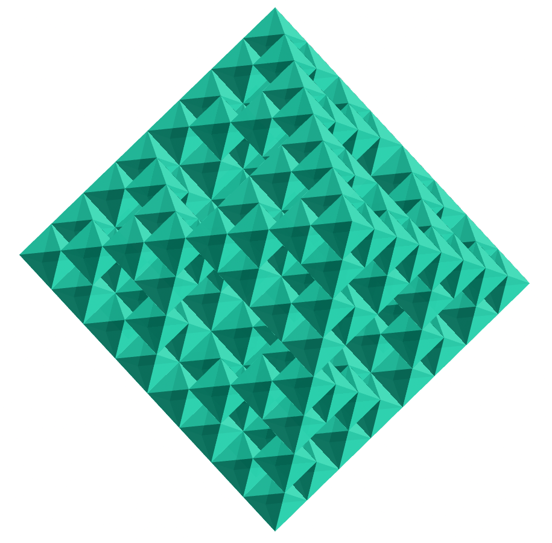
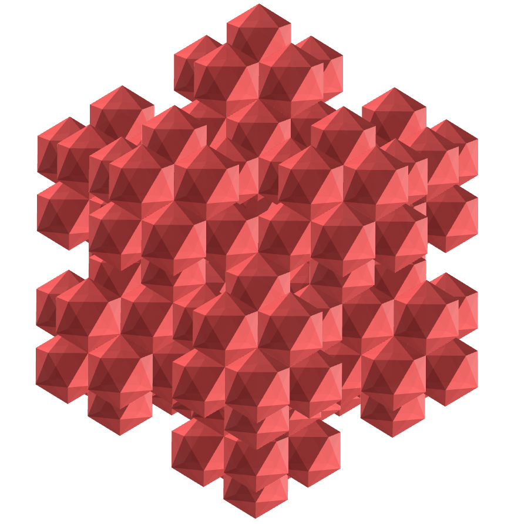
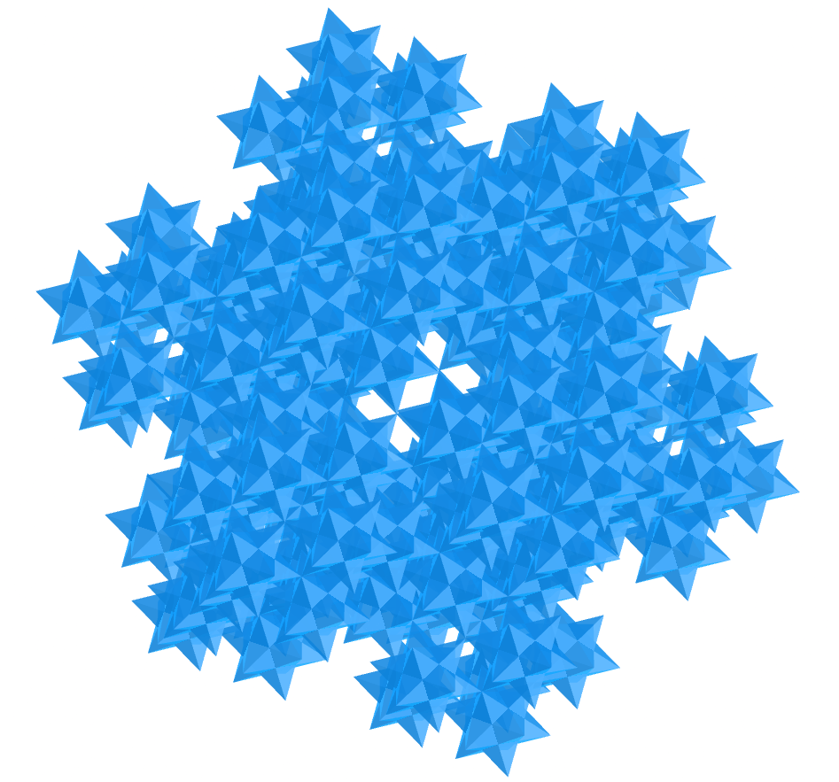
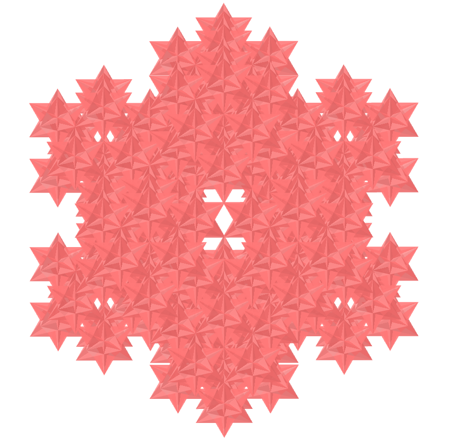
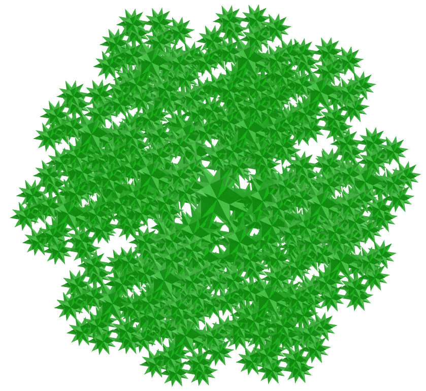

<link rel="stylesheet" href="../scripts/style.css">
<link rel="icon" type="image/png" href="vr/salas/imagens/icone.png">
<h2>Visualization of polyhedra with Augmented Reality (AR) and Virtual Reality (VR) in A-frame</h2>
 <b>author:</b> Paulo Henrique Siqueira - Universidade Federal do Paraná
  <b>contact:</b> <a href="#">paulohscwb@gmail.com</a>
  <a href="https://paulohscwb.github.io/polyhedra2/Fractal/pt-br/">versão em português</a>
 <form style="margin: 0 auto; float:right; text-align:right; width:100%; margin-bottom:15px;">
	<select id="url" onchange="urlHandler(this.value)" style="color:royalblue;">
		<option disabled selected value>More polyhedra:</option>
		<option value="../ArchimedeanCatalanHulls/">Archimedean and Catalan Convex Hulls</option>
		<option disabled value="../Fractal/">Polyhedra fractals</option>
	</select>
</form>

  <h2 align="center"> Polyhedra fractals</h2>
Using the same principle as the construction of the Sierpinski triangle, we can construct fractals from other regular polygons. When these polygons form a polyhedron, we have the construction of a fractal polyhedron.

 
<!--
<a href="#ra">Augmented Reality</a>&nbsp;&nbsp;|&nbsp;&nbsp;<a href="#m3d">3D Models</a>&nbsp;&nbsp;|&nbsp;&nbsp;<a href="../">Home</a>

  

  <h3 align="center">Immersive room</h3>
  
<iframe width="100%" src="sala.htm" title="Sala Imersiva de Fractais de poliedros" frameborder="0" loading="lazy"></iframe>

  
<a href="sala.htm" target="_blank">&#x1f517; room link</a>

 

  <h3 id="ra" align="center">Augmented Reality</h3>
To view fractal polyhedra in AR, simply visit:

<a href="ra.html" target="_blank">https://paulohscwb.github.io/polyhedra2/Fractal/ra.html</a>
 
with any browser with a webcam device (smartphone, tablet or notebook). 
 Access to the VR sites is done by clicking on the blue circle that appears on top of the marker.

<h3 id="m3d" align="center">3D models</h3>
<iframe width="560" height="315" style="max-width:100%" src="https://www.youtube.com/embed/videoseries?list=PLy0I_lGW8HxU-mneUmSsccpRAAwbErHFq" title="YouTube video player" frameborder="0" allow="accelerometer; autoplay; clipboard-write; encrypted-media; gyroscope; picture-in-picture; web-share" allowfullscreen></iframe>-->
<h4>1. Fractal tetrahedron</h4>

   The joined truncated tetrahedron is a composite of the Archimedean truncated tetrahedron with its respective dual, the Catalan triakis tetrahedron. 
  It has faces shaped like rhombi and kites.
   <b>Faces:</b> 12 kites and 6 rhombi | <b>Edges:</b> 36 | <b>Vertices:</b> 20. <a href="http://dmccooey.com/polyhedra/JoinedTruncatedTetrahedron.html" target="_blank">More...</a>

<h4>2. Fractal octahedron</h4>

   The joined cuboctahedron is a composite of the Archimedean cuboctahedron with its respective dual, the Catalan rhombic dodecahedron. 
  It has faces shaped like kites.
   <b>Faces:</b> 24 kites | <b>Edges:</b> 48 | <b>Vertices:</b> 26. <a href="http://dmccooey.com/polyhedra/JoinedCuboctahedron.html" target="_blank">More...</a>

<h4>3. Fractal icosahedron</h4>

   The joined truncated octahedron is a composite of the Archimedean truncated octahedron with its respective dual, the Catalan tetrakis hexahedron. 
  It has faces shaped like rhombi and kites.
   <b>Faces:</b> 24 kites and 12 rhombi | <b>Edges:</b> 72 | <b>Vertices:</b> 38. <a href="http://dmccooey.com/polyhedra/JoinedTruncatedOctahedron.html" target="_blank">More...</a>

<h4>4. Fractal cube</h4>

   The joined truncated cube is a composite of the Archimedean truncated cube with its respective dual, the Catalan triakis octahedron. 
  It has faces shaped like rhombi and kites.
   <b>Faces:</b> 24 kites and 12 rhombi | <b>Edges:</b> 72 | <b>Vertices:</b> 38. <a href="http://dmccooey.com/polyhedra/JoinedTruncatedCube.html" target="_blank">More...</a>

<h4>5. Fractal dodecahedron</h4>

   The joined rhombicuboctahedron is a composite of the Archimedean rhombicuboctahedron with its respective dual, the Catalan deltoidal icositetrahedron. 
  It has faces shaped like rhombi and kites.
   <b>Faces:</b> 24 kites and 24 rhombi | <b>Edges:</b> 96 | <b>Vertices:</b> 50. <a href="http://dmccooey.com/polyhedra/JoinedRhombicuboctahedron.html" target="_blank">More...</a>

<h4>6. Escher solid fractal</h4>

   The joined snub cube is a composite of the Archimedean snub cube with its respective dual, the Catalan pentagonal icositetrahedron. 
  It has faces shaped like rhombi and kites.
   <b>Faces:</b> 24 kites and 36 rhombi | <b>Edges:</b> 120 | <b>Vertices:</b> 62. <a href="http://dmccooey.com/polyhedra/JoinedLsnubCube.html" target="_blank">More...</a>

<h4>7. Small stellated dodecahedron fractal</h4>

   The joined icosidodecahedron is a composite of the Archimedean icosidodecahedron with its respective dual, the Catalan rhombic triacontahedron. 
  It has faces shaped like kites.
   <b>Faces:</b> 60 kites | <b>Edges:</b> 120 | <b>Vertices:</b> 62. <a href="http://dmccooey.com/polyhedra/JoinedIcosidodecahedron.html" target="_blank">More...</a>

<h4>8. Great icosahedron fractal</h4>

   The joined truncated cuboctahedron is a composite of the Archimedean truncated cuboctahedron with its respective dual, the Catalan disdyakis dodecahedron. 
  It has faces shaped like 24 short, 24 medium and 24 long kites.
   <b>Faces:</b> 72 kites | <b>Edges:</b> 144 | <b>Vertices:</b> 74. <a href="http://dmccooey.com/polyhedra/JoinedTruncatedCuboctahedron.html" target="_blank">More...</a>

<h4>9. Great dodecahedron fractal</h4>

   The joined truncated icosahedron is a composite of the Archimedean truncated icosahedron with its respective dual, the Catalan pentakis dodecahedron. 
  It has faces shaped like rhombi and kites.
   <b>Faces:</b> 60 kites and 30 rhombi | <b>Edges:</b> 180 | <b>Vertices:</b> 92. <a href="http://dmccooey.com/polyhedra/JoinedTruncatedIcosahedron.html" target="_blank">More...</a>

<h4>10. Great stellated dodecahedron fractal</h4>

   The joined truncated dodecahedron is a composite of the Archimedean truncated dodecahedron with its respective dual, the Catalan triakis icosahedron. 
  It has faces shaped like rhombi and kites.
   <b>Faces:</b> 60 kites and 30 rhombi | <b>Edges:</b> 180 | <b>Vertices:</b> 92. <a href="http://dmccooey.com/polyhedra/JoinedTruncatedDodecahedron.html" target="_blank">More...</a>

<a href="#p1" class="topo">back to top</a>

  Fractal polyhedra - Visualization of polyhedra with Augmented Reality and Virtual Reality by <a xmlns:cc="http://creativecommons.org/ns#" href="https://paulohscwb.github.io/polyhedra2/Fractal/pt-br/" property="cc:attributionName" rel="cc:attributionURL">Paulo Henrique Siqueira</a> is licensed with a license <a rel="license" href="http://creativecommons.org/licenses/by-nc-nd/4.0/">Creative Commons Attribution-NonCommercial-NoDerivatives 4.0 International</a>.

<h4>How to cite this work:</h4> 

Siqueira, P.H., "Fractal polyhedra - Visualization of polyhedra with Augmented Reality and Virtual Reality". Available in: <https://paulohscwb.github.io/polyhedra2/Fractal/pt-br/>, October 2023.

<!---->
  <b>References:</b>
 Weisstein, Eric W. "Archimedean Solid" From MathWorld-A Wolfram Web Resource. <a href="http://mathworld.wolfram.com/ArchimedeanSolid.html" target="_blank">http://mathworld.wolfram.com/ArchimedeanSolid.html</a>
 Weisstein, Eric W. "Platonic Solid" From MathWorld-A Wolfram Web Resource. <a href="http://mathworld.wolfram.com/PlatonicSolid.html" target="_blank">http://mathworld.wolfram.com/PlatonicSolid.html</a>
 Weisstein, Eric W. "Archimedean Dual" From MathWorld-A Wolfram Web Resource. <a href="https://mathworld.wolfram.com/ArchimedeanDual.html" target="_blank">https://mathworld.wolfram.com/ArchimedeanDual.html</a>
 Weisstein, Eric W. "Uniform Polyhedron." From MathWorld--A Wolfram Web Resource. <a href="https://mathworld.wolfram.com/UniformPolyhedron.html" target="_blank">https://mathworld.wolfram.com/UniformPolyhedron.html</a>
 Wikipedia <a href="https://en.wikipedia.org/wiki/Archimedean_solid" target="_blank">https://en.wikipedia.org/wiki/Archimedean_solid</a>
 Wikipedia <a href="https://en.wikipedia.org/wiki/en.wikipedia.org/wiki/Platonic_solid" target="_blank">https://en.wikipedia.org/wiki/Platonic_solid</a>
 McCooey, David I. "Visual Polyhedra". <a href="http://dmccooey.com/polyhedra/" target="_blank">http://dmccooey.com/polyhedra/</a>
