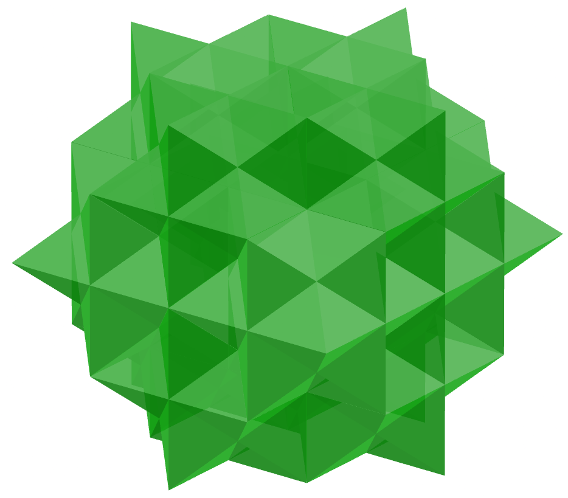
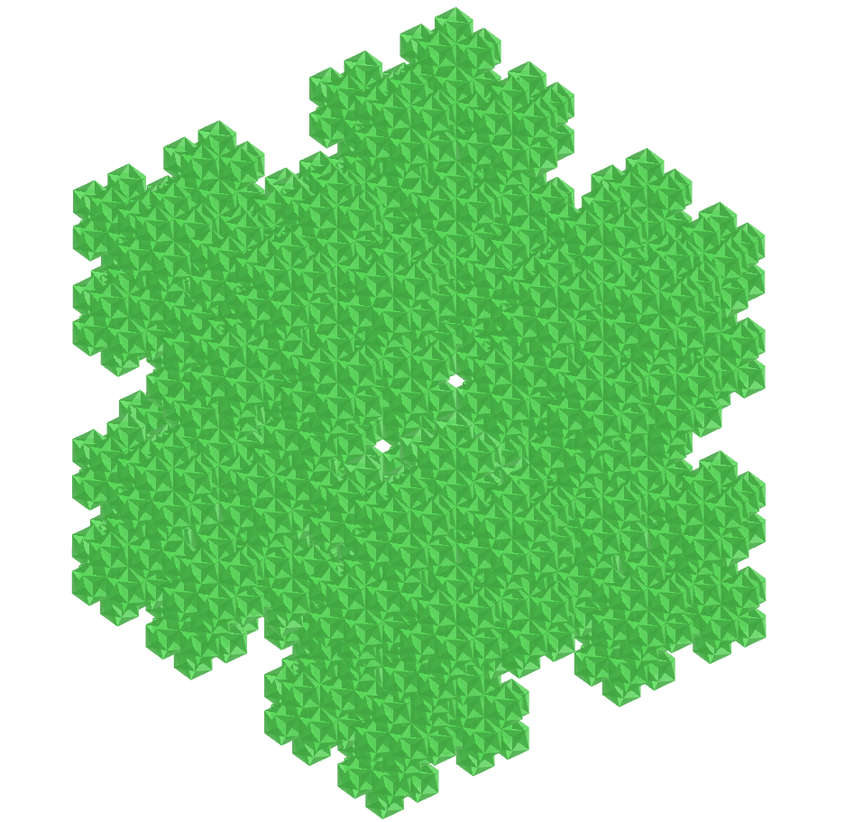
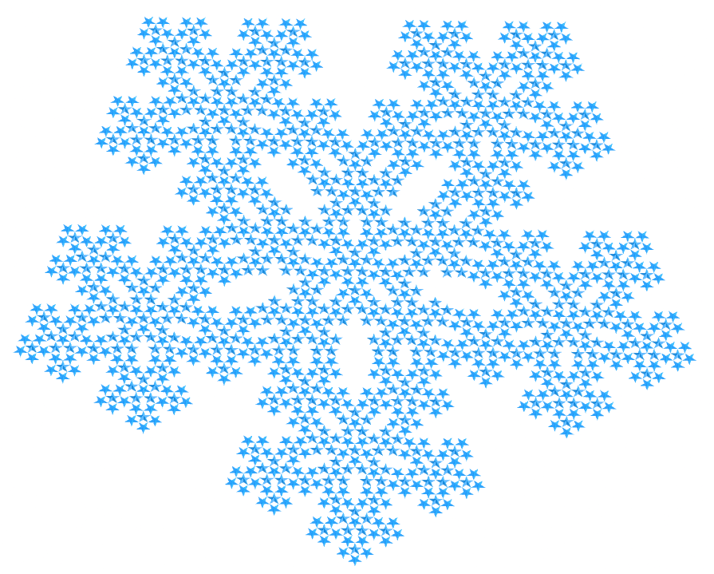
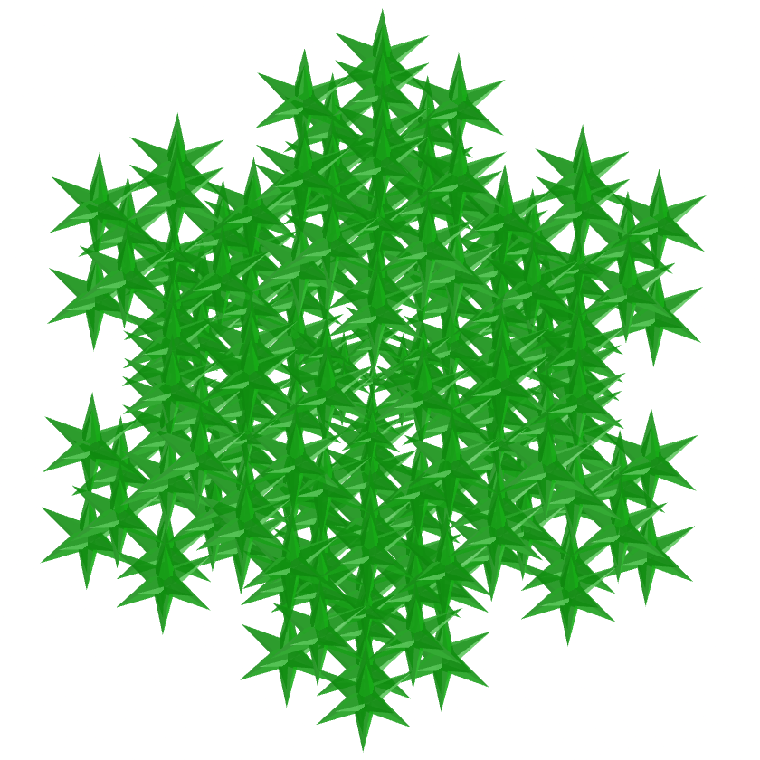

<link rel="stylesheet" href="../../scripts/style.css">
<link rel="icon" type="image/png" href="../vr/salas/imagens/icone.png">
<h2>Visualização de poliedros com Realidade Aumentada (RA) e Realidade Virtual (RV) em A-frame</h2>
<b>autor:</b> Paulo Henrique Siqueira - Universidade Federal do Paraná
 <b>contato:</b> <a href="#"> paulohscwb@gmail.com </a>
 <a href="https://paulohscwb.github.io/polyhedra2/ArchimedeanCatalanHulls/">english version</a>
<form style="margin: 0 auto; float:right; text-align:right; width:100%; margin-bottom:15px;">
	<select id="url" onchange="urlHandler(this.value)" style="color:royalblue;">
		<option disabled selected>Mais poliedros:</option>
		<option value="../../ArchimedeanCatalanHulls/pt-br/">Cascos convexos de Arquimedes e Catalan</option>
		<option disabled value="../../Fractal/pt-br/">Fractais de poliedros</option>
	</select>
</form>

  <h2 align="center"> Fractais de poliedros</h2>
  Utilizando o mesmo princípio da construção do triângulo de Sierpinski, podemos construir fractais de outros polígonos regulares. Quando estes polígonos formam um poliedro, temos a construção de um poliedro fractal.
 

<!-- 
<a href="#ra">Realidade Aumentada</a>&nbsp;&nbsp;|&nbsp;&nbsp;<a href="#m3d">Modelos 3D</a>&nbsp;&nbsp;|&nbsp;&nbsp;<a href="../../pt-br/">Página Inicial</a>

  

  <h3 align="center">Sala imersiva</h3>
  
<iframe width="100%" src="../sala.htm" title="Sala Imersiva de fractais de poliedros" frameborder="0" loading="lazy"></iframe>

  
<a href="../sala.htm" target="_blank">&#x1f517; link da sala</a>

  <h3 id="ra" align="center">Realidade Aumentada</h3>
  Para visualizar os fractais de poliedros em RA, visite a página:

<a href="../ra.html" target="_blank">https://paulohscwb.github.io/polyhedra2/Fractal/ra.html</a>
 
com qualquer navegador com um dispositivo de webcam (smartphone, tablet ou notebook).
 O acesso às páginas de RV é feito clicando no círculo azul que aparece em cima de cada marcador.

<h3 id="m3d" align="center">Modelos 3D</h3>
 <iframe width="560" height="315" style="max-width:100%" src="https://www.youtube.com/embed/videoseries?list=PLy0I_lGW8HxU-mneUmSsccpRAAwbErHFq" title="YouTube video player" frameborder="0" allow="accelerometer; autoplay; clipboard-write; encrypted-media; gyroscope; picture-in-picture; web-share" allowfullscreen></iframe>-->
<h4>1. Tetraedro fractal</h4>

   Aplicando-se o princípio de construção do triângulo de Sierpinski nas 4 faces do tetraedro regular, obtemos um tetraedro regular fractal. Na primeira ordem de construção do fractal, construímos um novo sólido em cada vértice do poliedro original. Neste exemplo, temos as representações do sólido nas ordens 0, 1, 2, 3 e 4.
 <table>
	<tr>
		<th>ordem</th>
		<th>poliedros</th>
		<th>faces</th>
		<th>arestas</th>
		<th>vértices</th>
	</tr>
	<tr>
		<td>0</td>
		<td>1</td>
		<td>4</td>
		<td>6</td>
		<td>4</td>
	</tr>
	<tr>
		<td>1</td>
		<td>4</td>
		<td>16</td>
		<td>24</td>
		<td>16</td>
	</tr>
	<tr>
		<td>2</td>
		<td>16</td>
		<td>64</td>
		<td>96</td>
		<td>64</td>
	</tr>
	<tr>
		<td>3</td>
		<td>64</td>
		<td>256</td>
		<td>384</td>
		<td>256</td>
	</tr>
	<tr>
		<td>4</td>
		<td>256</td>
		<td>1024</td>
		<td>1536</td>
		<td>1024</td>
	</tr>
 </table>

<h4>2. Octaedro fractal</h4>

   Aplicando-se o princípio de construção do triângulo de Sierpinski nas 8 faces do octaedro regular, obtemos um octaedro regular fractal. Na primeira ordem de construção do fractal, construímos um novo sólido em cada vértice do poliedro original. Neste exemplo, temos as representações do sólido nas ordens 0, 1, 2, 3 e 4.
 <table>
	<tr>
		<th>ordem</th>
		<th>poliedros</th>
		<th>faces</th>
		<th>arestas</th>
		<th>vértices</th>
	</tr>
	<tr>
		<td>0</td>
		<td>1</td>
		<td>8</td>
		<td>12</td>
		<td>6</td>
	</tr>
	<tr>
		<td>1</td>
		<td>6</td>
		<td>48</td>
		<td>72</td>
		<td>36</td>
	</tr>
	<tr>
		<td>2</td>
		<td>36</td>
		<td>288</td>
		<td>432</td>
		<td>216</td>
	</tr>
	<tr>
		<td>3</td>
		<td>216</td>
		<td>1728</td>
		<td>2592</td>
		<td>1296</td>
	</tr>
	<tr>
		<td>4</td>
		<td>1296</td>
		<td>10368</td>
		<td>15552</td>
		<td>7776</td>
	</tr>
 </table>
 

<h4>3. Icosaedro fractal</h4>

   Aplicando-se o princípio de construção do triângulo de Sierpinski nas 20 faces do icosaedro regular, obtemos um icosaedro regular fractal. Na primeira ordem de construção do fractal, construímos um novo sólido em cada vértice do poliedro original. Neste exemplo, temos as representações do sólido nas ordens 0, 1, 2 e 3.
 <table>
	<tr>
		<th>ordem</th>
		<th>poliedros</th>
		<th>faces</th>
		<th>arestas</th>
		<th>vértices</th>
	</tr>
	<tr>
		<td>0</td>
		<td>1</td>
		<td>20</td>
		<td>30</td>
		<td>12</td>
	</tr>
	<tr>
		<td>1</td>
		<td>12</td>
		<td>240</td>
		<td>360</td>
		<td>144</td>
	</tr>
	<tr>
		<td>2</td>
		<td>144</td>
		<td>2880</td>
		<td>4320</td>
		<td>1728</td>
	</tr>
	<tr>
		<td>3</td>
		<td>1728</td>
		<td>34560</td>
		<td>51840</td>
		<td>20736</td>
	</tr>
 </table>
 

<h4>4. Cubo fractal</h4>

   Aplicando-se o princípio de construção do triângulo de Sierpinski nas 6 faces do cubo, obtemos um cubo fractal. Na primeira ordem de construção do fractal, construímos 8 novos sólidos em cada face do poliedro original, todas com &frac13; da medida da aresta do cubo. Neste exemplo, temos as representações do sólido nas ordens 0, 1, 2 e 3.
 <table>
	<tr>
		<th>ordem</th>
		<th>poliedros</th>
		<th>faces</th>
		<th>arestas</th>
		<th>vértices</th>
	</tr>
	<tr>
		<td>0</td>
		<td>1</td>
		<td>6</td>
		<td>12</td>
		<td>8</td>
	</tr>
	<tr>
		<td>1</td>
		<td>20</td>
		<td>120</td>
		<td>240</td>
		<td>160</td>
	</tr>
	<tr>
		<td>2</td>
		<td>400</td>
		<td>2400</td>
		<td>4800</td>
		<td>3200</td>
	</tr>
	<tr>
		<td>3</td>
		<td>8000</td>
		<td>48000</td>
		<td>96000</td>
		<td>64000</td>
	</tr>
 </table>
 

<h4>5. Dodecaedro fractal</h4>

   Aplicando-se o princípio de construção do triângulo de Sierpinski nas 12 faces do dodecaedro regular, obtemos um dodecaedro regular fractal. Na primeira ordem de construção do fractal, construímos um novo sólido em cada vértice do poliedro original. Neste exemplo, temos as representações do sólido nas ordens 0, 1, 2 e 3.
 <table>
	<tr>
		<th>ordem</th>
		<th>poliedros</th>
		<th>faces</th>
		<th>arestas</th>
		<th>vértices</th>
	</tr>
	<tr>
		<td>0</td>
		<td>1</td>
		<td>12</td>
		<td>30</td>
		<td>20</td>
	</tr>
	<tr>
		<td>1</td>
		<td>20</td>
		<td>240</td>
		<td>600</td>
		<td>400</td>
	</tr>
	<tr>
		<td>2</td>
		<td>400</td>
		<td>4800</td>
		<td>12000</td>
		<td>8000</td>
	</tr>
	<tr>
		<td>3</td>
		<td>8000</td>
		<td>96000</td>
		<td>240000</td>
		<td>160000</td>
	</tr>
 </table>
 

<h4>6. Fractal do sólido de Escher</h4>

   Aplicando-se o princípio de construção do triângulo de Sierpinski nas 48 faces do sólido de Escher, obtemos um fractal do sólido de Escher. Na primeira ordem de construção do fractal, construímos um novo sólido em 12 vértices do poliedro original. Neste exemplo, temos as representações do sólido nas ordens 0, 1, 2 e 3.
 <table>
	<tr>
		<th>ordem</th>
		<th>poliedros</th>
		<th>faces</th>
		<th>arestas</th>
		<th>vértices</th>
	</tr>
	<tr>
		<td>0</td>
		<td>1</td>
		<td>48</td>
		<td>72</td>
		<td>26</td>
	</tr>
	<tr>
		<td>1</td>
		<td>12</td>
		<td>576</td>
		<td>864</td>
		<td>312</td>
	</tr>
	<tr>
		<td>2</td>
		<td>144</td>
		<td>6912</td>
		<td>10368</td>
		<td>3744</td>
	</tr>
	<tr>
		<td>3</td>
		<td>1728</td>
		<td>82944</td>
		<td>124416</td>
		<td>44928</td>
	</tr>
 </table>
 

<h4>7. Fractal do pequeno dodecaedro estrelado</h4>

   Aplicando-se o princípio de construção do triângulo de Sierpinski nas 12 faces do pequeno dodecaedro estrelado, obtemos um fractal do pequeno dodecaedro estrelado. Na primeira ordem de construção do fractal, construímos um novo sólido em cada vértice do poliedro original. Neste exemplo, temos as representações do sólido nas ordens 0, 1, 2 e 3.
 <table>
	<tr>
		<th>ordem</th>
		<th>poliedros</th>
		<th>faces</th>
		<th>arestas</th>
		<th>vértices</th>
	</tr>
	<tr>
		<td>0</td>
		<td>1</td>
		<td>12</td>
		<td>30</td>
		<td>12</td>
	</tr>
	<tr>
		<td>1</td>
		<td>12</td>
		<td>144</td>
		<td>360</td>
		<td>144</td>
	</tr>
	<tr>
		<td>2</td>
		<td>144</td>
		<td>1728</td>
		<td>4320</td>
		<td>1728</td>
	</tr>
	<tr>
		<td>3</td>
		<td>1728</td>
		<td>20736</td>
		<td>51840</td>
		<td>20736</td>
	</tr>
 </table>
 

<h4>8. Fractal do grande icosaedro</h4>

   Aplicando-se o princípio de construção do triângulo de Sierpinski nas 20 faces do grande icosaedro, obtemos um fractal do grande icosaedro. Na primeira ordem de construção do fractal, construímos um novo sólido em cada vértice do poliedro original. Neste exemplo, temos as representações do sólido nas ordens 0, 1, 2 e 3.
 <table>
	<tr>
		<th>ordem</th>
		<th>poliedros</th>
		<th>faces</th>
		<th>arestas</th>
		<th>vértices</th>
	</tr>
	<tr>
		<td>0</td>
		<td>1</td>
		<td>20</td>
		<td>30</td>
		<td>12</td>
	</tr>
	<tr>
		<td>1</td>
		<td>12</td>
		<td>240</td>
		<td>360</td>
		<td>144</td>
	</tr>
	<tr>
		<td>2</td>
		<td>144</td>
		<td>2880</td>
		<td>4320</td>
		<td>1728</td>
	</tr>
	<tr>
		<td>3</td>
		<td>1728</td>
		<td>34560</td>
		<td>51840</td>
		<td>20736</td>
	</tr>
 </table>
 

<h4>9. Fractal do grande dodecaedro</h4>

   Aplicando-se o princípio de construção do triângulo de Sierpinski nas 12 faces do grande dodecaedro, obtemos um fractal do grande dodecaedro. Na primeira ordem de construção do fractal, construímos um novo sólido em cada vértice do poliedro original. Neste exemplo, temos as representações do sólido nas ordens 0, 1, 2 e 3.
 <table>
	<tr>
		<th>ordem</th>
		<th>poliedros</th>
		<th>faces</th>
		<th>arestas</th>
		<th>vértices</th>
	</tr>
	<tr>
		<td>0</td>
		<td>1</td>
		<td>12</td>
		<td>30</td>
		<td>12</td>
	</tr>
	<tr>
		<td>1</td>
		<td>12</td>
		<td>144</td>
		<td>360</td>
		<td>144</td>
	</tr>
	<tr>
		<td>2</td>
		<td>144</td>
		<td>1728</td>
		<td>4320</td>
		<td>1728</td>
	</tr>
	<tr>
		<td>3</td>
		<td>1728</td>
		<td>20736</td>
		<td>51840</td>
		<td>20736</td>
	</tr>
 </table>
 

<h4>10. Fractal do grande dodecaedro estrelado</h4>

   Aplicando-se o princípio de construção do triângulo de Sierpinski nas 12 faces do grande dodecaedro estrelado, obtemos um fractal do grande dodecaedro estrelado. Na primeira ordem de construção do fractal, construímos um novo sólido em cada vértice do poliedro original. Neste exemplo, temos as representações do sólido nas ordens 0, 1, 2 e 3.
 <table>
	<tr>
		<th>ordem</th>
		<th>poliedros</th>
		<th>faces</th>
		<th>arestas</th>
		<th>vértices</th>
	</tr>
	<tr>
		<td>0</td>
		<td>1</td>
		<td>12</td>
		<td>30</td>
		<td>20</td>
	</tr>
	<tr>
		<td>1</td>
		<td>21</td>
		<td>252</td>
		<td>630</td>
		<td>420</td>
	</tr>
	<tr>
		<td>2</td>
		<td>441</td>
		<td>5292</td>
		<td>13230</td>
		<td>8820</td>
	</tr>
	<tr>
		<td>3</td>
		<td>9261</td>
		<td>111132</td>
		<td>277830</td>
		<td>185220</td>
	</tr>
 </table>

<a href="#p1" class="topo">voltar ao topo</a>

<h4>11. Fractal da dipirâmide pentagrâmica</h4>

   Aplicando-se o princípio de construção da curva de Koch nas arestas que formam o pentagrama da dipirâmide pentagrâmica, obtemos um fractal da dipirâmide pentagrâmica. Na primeira ordem de construção do fractal, construímos um novo sólido em 5 vértices do poliedro original. Neste exemplo, temos as representações do sólido nas ordens 0, 1, 2 e 3.
 <table>
	<tr>
		<th>ordem</th>
		<th>poliedros</th>
		<th>faces</th>
		<th>arestas</th>
		<th>vértices</th>
	</tr>
	<tr>
		<td>0</td>
		<td>1</td>
		<td>10</td>
		<td>15</td>
		<td>7</td>
	</tr>
	<tr>
		<td>1</td>
		<td>6</td>
		<td>60</td>
		<td>90</td>
		<td>42</td>
	</tr>
	<tr>
		<td>2</td>
		<td>36</td>
		<td>360</td>
		<td>540</td>
		<td>252</td>
	</tr>
	<tr>
		<td>3</td>
		<td>216</td>
		<td>2160</td>
		<td>3240</td>
		<td>1512</td>
	</tr>
 </table>
 

<h4>12. Fractal do icosaedro triâmbico medial</h4>

   Aplicando-se o princípio de construção da curva de Koch nas faces do icosaedro triâmbico medial, obtemos um fractal da dipirâmide pentagrâmica. Na primeira ordem de construção do fractal, construímos um novo sólido em 12 vértices do poliedro original. Neste exemplo, temos as representações do sólido nas ordens 0, 1, 2 e 3.
 <table>
	<tr>
		<th>ordem</th>
		<th>poliedros</th>
		<th>faces</th>
		<th>arestas</th>
		<th>vértices</th>
	</tr>
	<tr>
		<td>0</td>
		<td>1</td>
		<td>20</td>
		<td>60</td>
		<td>24</td>
	</tr>
	<tr>
		<td>1</td>
		<td>13</td>
		<td>260</td>
		<td>780</td>
		<td>312</td>
	</tr>
	<tr>
		<td>2</td>
		<td>169</td>
		<td>3380</td>
		<td>10140</td>
		<td>4056</td>
	</tr>
	<tr>
		<td>3</td>
		<td>2197</td>
		<td>43940</td>
		<td>131820</td>
		<td>52728</td>
	</tr>
 </table>

<a href="#p1" class="topo">voltar ao topo</a>

  Fractal polyhedra - Visualization of polyhedra with Augmented Reality and Virtual Reality de <a xmlns:cc="http://creativecommons.org/ns#" href="https://paulohscwb.github.io/polyhedra2/Fractal/" property="cc:attributionName" rel="cc:attributionURL">Paulo Henrique Siqueira</a> está licenciado com uma Licença <a rel="license" href="http://creativecommons.org/licenses/by-nc-nd/4.0/">Creative Commons Atribuição-NãoComercial-SemDerivações 4.0 Internacional</a>.

<h4>Como citar este trabalho:</h4> 

Siqueira, P.H., "Fractal polyhedra - Visualization of polyhedra with Augmented Reality and Virtual Reality". Disponível em: <https://paulohscwb.github.io/polyhedra2/Fractal/>, Outubro de 2023.

<!---->
  <b>Referências:</b>
 Weisstein, Eric W. "Archimedean Solid" From MathWorld-A Wolfram Web Resource. <a href="http://mathworld.wolfram.com/ArchimedeanSolid.html" target="_blank">http://mathworld.wolfram.com/ArchimedeanSolid.html</a>
 Weisstein, Eric W. "Platonic Solid" From MathWorld-A Wolfram Web Resource. <a href="http://mathworld.wolfram.com/PlatonicSolid.html" target="_blank">http://mathworld.wolfram.com/PlatonicSolid.html</a>
 Weisstein, Eric W. "Archimedean Dual" From MathWorld-A Wolfram Web Resource. <a href="https://mathworld.wolfram.com/ArchimedeanDual.html" target="_blank">https://mathworld.wolfram.com/ArchimedeanDual.html</a>
 Weisstein, Eric W. "Uniform Polyhedron." From MathWorld--A Wolfram Web Resource. <a href="https://mathworld.wolfram.com/UniformPolyhedron.html" target="_blank">https://mathworld.wolfram.com/UniformPolyhedron.html</a>
 Wikipedia <a href="https://en.wikipedia.org/wiki/Archimedean_solid" target="_blank">https://en.wikipedia.org/wiki/Archimedean_solid</a>
 Wikipedia <a href="https://en.wikipedia.org/wiki/en.wikipedia.org/wiki/Platonic_solid" target="_blank">https://en.wikipedia.org/wiki/Platonic_solid</a>
 McCooey, David I. "Visual Polyhedra". <a href="http://dmccooey.com/polyhedra/" target="_blank">http://dmccooey.com/polyhedra/</a>
