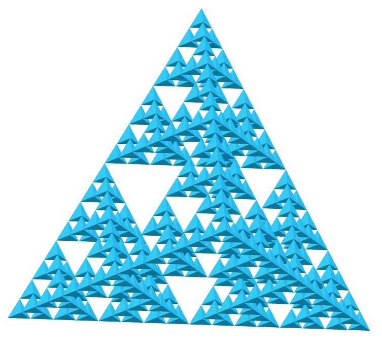
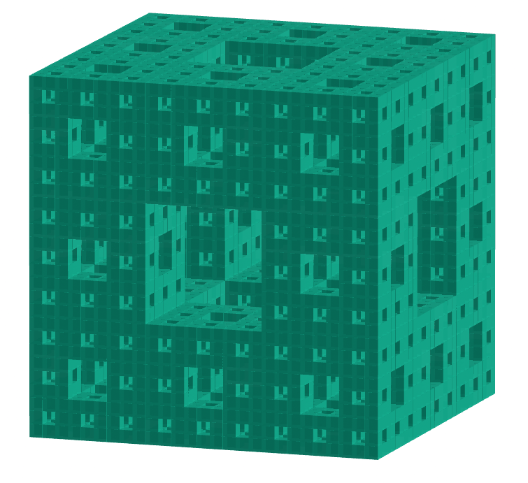

<link rel="stylesheet" href="../../scripts/style.css">
<link rel="icon" type="image/png" href="../vr/salas/imagens/icone.png">
<h2>Visualização de poliedros com Realidade Aumentada (RA) e Realidade Virtual (RV) em A-frame</h2>
<b>autor:</b> Paulo Henrique Siqueira - Universidade Federal do Paraná
 <b>contato:</b> <a href="#"> paulohscwb@gmail.com </a>
 <a href="https://paulohscwb.github.io/polyhedra2/ArchimedeanCatalanHulls/">english version</a>
<form style="margin: 0 auto; float:right; text-align:right; width:100%; margin-bottom:15px;">
	<select id="url" onchange="urlHandler(this.value)" style="color:royalblue;">
		<option disabled selected>Mais poliedros:</option>
		<option value="../../ArchimedeanCatalanHulls/">Cascos convexos de Arquimedes e Catalan</option>
		<option disabled value="../../Fractal/">Fractais de poliedros</option>
	</select>
</form>

  <h2 align="center"> Fractais de poliedros</h2>
  Utilizando o mesmo princípio da construção do triângulo de Sierpinski, podemos construir fractais de outros polígonos regulares. Quando estes polígonos formam um poliedro, temos a construção de um poliedro fractal.
 

<!-- 
<a href="#ra">Realidade Aumentada</a>&nbsp;&nbsp;|&nbsp;&nbsp;<a href="#m3d">Modelos 3D</a>&nbsp;&nbsp;|&nbsp;&nbsp;<a href="../../pt-br/">Página Inicial</a>

  

  <h3 align="center">Sala imersiva</h3>
  
<iframe width="100%" src="../sala.htm" title="Sala Imersiva de fractais de poliedros" frameborder="0" loading="lazy"></iframe>

  
<a href="../sala.htm" target="_blank">&#x1f517; link da sala</a>

  <h3 id="ra" align="center">Realidade Aumentada</h3>
  Para visualizar os fractais de poliedros em RA, visite a página:

<a href="../ra.html" target="_blank">https://paulohscwb.github.io/polyhedra2/Fractal/ra.html</a>
 
com qualquer navegador com um dispositivo de webcam (smartphone, tablet ou notebook).
 O acesso às páginas de RV é feito clicando no círculo azul que aparece em cima de cada marcador.

<h3 id="m3d" align="center">Modelos 3D</h3>
 <iframe width="560" height="315" style="max-width:100%" src="https://www.youtube.com/embed/videoseries?list=PLy0I_lGW8HxU-mneUmSsccpRAAwbErHFq" title="YouTube video player" frameborder="0" allow="accelerometer; autoplay; clipboard-write; encrypted-media; gyroscope; picture-in-picture; web-share" allowfullscreen></iframe>-->
<h4>1. Tetraedro fractal</h4>

   O tetraedro truncado combinado é uma composição do tetraedro truncado Arquimediano com o seu respectivo dual, o tetraedro triakis de Catalan. 
  Possui faces com formatos de losangos e de pipas.
   <b>Faces:</b> 12 pipas e 6 losangos | <b>Arestas:</b> 36 | <b>Vértices:</b> 20. <a href="http://dmccooey.com/polyhedra/JoinedTruncatedTetrahedron.html" target="_blank">Mais sobre...</a>

<h4>2. Octaedro fractal</h4>

   O cuboctaedro combinado é uma composição do cuboctaedro Arquimediano com o seu respectivo dual, o dodecaedro rômbico de Catalan. 
  Possui faces com formatos de pipas.
   <b>Faces:</b> 24 pipas | <b>Arestas:</b> 48 | <b>Vértices:</b> 26. <a href="http://dmccooey.com/polyhedra/JoinedCuboctahedron.html" target="_blank">Mais sobre...</a>

<h4>3. Icosaedro fractal</h4>

   O octaedro truncado combinado é uma composição do octaedro truncado Arquimediano com o seu respectivo dual, o hexaedro tetrakis de Catalan. 
  Possui faces com formatos de losangos e de pipas.
   <b>Faces:</b> 24 pipas e 12 losangos | <b>Arestas:</b> 72 | <b>Vértices:</b> 38. <a href="http://dmccooey.com/polyhedra/JoinedTruncatedOctahedron.html" target="_blank">Mais sobre...</a>

<h4>4. Cubo fractal</h4>

   O cubo truncado combinado é uma composição do cubo truncado Arquimediano com o seu respectivo dual, o octaedro triakis de Catalan. 
  Possui faces com formatos de losangos e de pipas.
   <b>Faces:</b> 24 pipas e 12 losangos | <b>Arestas:</b> 72 | <b>Vértices:</b> 38. <a href="http://dmccooey.com/polyhedra/JoinedTruncatedCube.html" target="_blank">Mais sobre...</a>

<h4>5. Dodecaedro fractal</h4>

   O rombicuboctaedro combinado é uma composição do rombicuboctaedro Arquimediano com o seu respectivo dual, o icositetraedro deltoidal de Catalan. 
  Possui faces com formatos de losangos e de pipas.
   <b>Faces:</b> 24 pipas e 24 losangos | <b>Arestas:</b> 96 | <b>Vértices:</b> 50. <a href="http://dmccooey.com/polyhedra/JoinedRhombicuboctahedron.html" target="_blank">Mais sobre...</a>

<h4>6. Fractal do sólido de Escher</h4>

   O cubo snub combinado é uma composição do cubo snub Arquimediano com o seu respectivo dual, o icositetraedro pentagonal de Catalan. 
  Possui faces com formatos de losangos e de pipas.
   <b>Faces:</b> 24 pipas e 36 losangos | <b>Arestas:</b> 120 | <b>Vértices:</b> 62. <a href="http://dmccooey.com/polyhedra/JoinedLsnubCube.html" target="_blank">Mais sobre...</a>

<h4>7. Fractal do pequeno dodecaedro estrelado</h4>

   O icosidodecaedro combinado é uma composição do icosidodecaedro Arquimediano com o seu respectivo dual, o triacontaedro rômbico de Catalan. 
  Possui faces com formatos de pipas.
   <b>Faces:</b> 60 pipas | <b>Arestas:</b> 120 | <b>Vértices:</b> 62. <a href="http://dmccooey.com/polyhedra/JoinedIcosidodecahedron.html" target="_blank">Mais sobre...</a>

<h4>8. Fractal do grande icosaedro</h4>

   O cuboctaedro truncado combinado é uma composição do cuboctaedro truncado Arquimediano com o seu respectivo dual, o dodecaedro disdiakis de Catalan. 
  Possui faces com formatos de 24 pipas curtas, 24 médias e 24 longas.
   <b>Faces:</b> 72 pipas | <b>Arestas:</b> 144 | <b>Vértices:</b> 74. <a href="http://dmccooey.com/polyhedra/JoinedTruncatedCuboctahedron.html" target="_blank">Mais sobre...</a>

<h4>9. Fractal do grande dodecaedro</h4>

   O icosaedro truncado combinado é uma composição do icosaedro truncado Arquimediano com o seu respectivo dual, o dodecaedro pentakis de Catalan. 
  Possui faces com formatos de losangos e de pipas.
   <b>Faces:</b> 60 pipas e 30 losangos | <b>Arestas:</b> 180 | <b>Vértices:</b> 92. <a href="http://dmccooey.com/polyhedra/JoinedTruncatedIcosahedron.html" target="_blank">Mais sobre...</a>

<h4>10. Fractal do grande dodecaedro estrelado</h4>

   O dodecaedro truncado combinado é uma composição do dodecaedro truncado Arquimediano com o seu respectivo dual, o icosaedro triakis de Catalan. 
  Possui faces com formatos de losangos e de pipas.
   <b>Faces:</b> 60 pipas e 30 losangos | <b>Arestas:</b> 180 | <b>Vértices:</b> 92. <a href="http://dmccooey.com/polyhedra/JoinedTruncatedDodecahedron.html" target="_blank">Mais sobre...</a>

<a href="#p1" class="topo">voltar ao topo</a>

  Fractal polyhedra - Visualization of polyhedra with Augmented Reality and Virtual Reality de <a xmlns:cc="http://creativecommons.org/ns#" href="https://paulohscwb.github.io/polyhedra2/Fractal/" property="cc:attributionName" rel="cc:attributionURL">Paulo Henrique Siqueira</a> está licenciado com uma Licença <a rel="license" href="http://creativecommons.org/licenses/by-nc-nd/4.0/">Creative Commons Atribuição-NãoComercial-SemDerivações 4.0 Internacional</a>.

<h4>Como citar este trabalho:</h4> 

Siqueira, P.H., "Fractal polyhedra - Visualization of polyhedra with Augmented Reality and Virtual Reality". Disponível em: <https://paulohscwb.github.io/polyhedra2/Fractal/>, Outubro de 2023.

<!---->
  <b>Referências:</b>
 Weisstein, Eric W. "Archimedean Solid" From MathWorld-A Wolfram Web Resource. <a href="http://mathworld.wolfram.com/ArchimedeanSolid.html" target="_blank">http://mathworld.wolfram.com/ArchimedeanSolid.html</a>
 Weisstein, Eric W. "Platonic Solid" From MathWorld-A Wolfram Web Resource. <a href="http://mathworld.wolfram.com/PlatonicSolid.html" target="_blank">http://mathworld.wolfram.com/PlatonicSolid.html</a>
 Weisstein, Eric W. "Archimedean Dual" From MathWorld-A Wolfram Web Resource. <a href="https://mathworld.wolfram.com/ArchimedeanDual.html" target="_blank">https://mathworld.wolfram.com/ArchimedeanDual.html</a>
 Weisstein, Eric W. "Uniform Polyhedron." From MathWorld--A Wolfram Web Resource. <a href="https://mathworld.wolfram.com/UniformPolyhedron.html" target="_blank">https://mathworld.wolfram.com/UniformPolyhedron.html</a>
 Wikipedia <a href="https://en.wikipedia.org/wiki/Archimedean_solid" target="_blank">https://en.wikipedia.org/wiki/Archimedean_solid</a>
 Wikipedia <a href="https://en.wikipedia.org/wiki/en.wikipedia.org/wiki/Platonic_solid" target="_blank">https://en.wikipedia.org/wiki/Platonic_solid</a>
 McCooey, David I. "Visual Polyhedra". <a href="http://dmccooey.com/polyhedra/" target="_blank">http://dmccooey.com/polyhedra/</a>
