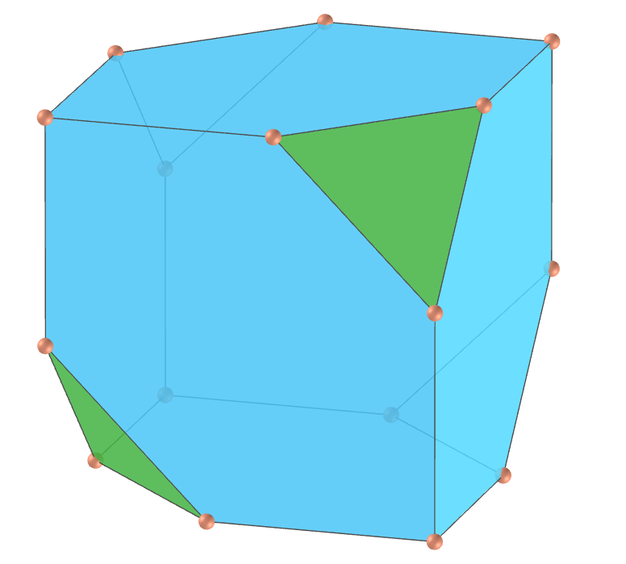

<link rel="stylesheet" href="scripts/style.css">
<meta charset="utf-8">
<link rel="icon" type="image/png" href="ArchimedeanCatalanHulls/vr/salas/imagens/icone.png">
<h2>Visualization of polyhedra with Augmented Reality (AR) and Virtual Reality (VR) in A-frame</h2>
 <b>author:</b> Paulo Henrique Siqueira - Universidade Federal do Paraná
  <b>contact:</b> <a href="#">paulohscwb@gmail.com</a>
  <a href="https://paulohscwb.github.io/polyhedra2/pt-br/">versão em português</a>
    New page: polyhedra can be seen in Augmented Reality (AR) with the indicated markers, and through the links created in the markers, the 3D model of each polyhedron can be seen in Virtual Reality (VR).

<h3 style="margin-top:3px"><a target="_blank" href="ArchimedeanCatalanHulls/"> Archimedean and Catalan Convex Hulls</a></h3>
<h3 style="margin-top:3px"><a target="_blank" href="fractalplatonic/"> Platonic polyhedra fractals</a></h3>
<h3 style="margin-top:3px"><a target="_blank" href="fractalnonconvex/"> Non convex polyhedra fractals</a></h3>
<h3 style="margin-top:3px"><a target="_blank" href="fractalarchimedean/"> Archimedean polyhedra fractals</a></h3>
<h3 style="margin-top:3px"><a target="_blank" href="chamfered/"> Chamfered polyhedra</a></h3>
<h3 style="margin-top:3px"><a target="_blank" href="propellor/"> Propellor polyhedra</a></h3>
<h3 style="margin-top:3px"><a target="_blank" href="diamonds/"> Diamond polyhedra</a></h3>

<!--<h3 style="margin-top:5px; text-align:center;"><a target="_blank" href="all/">&#x1f4c4; Complete list of polyhedra</a></h3>-->

<h3 align="center">Immersive rooms</h3>

<h3 align="center">Augmented Reality and 3D models</h3>

 The Augmented Reality environments were created with the <b>Jerome Etienne</b> scripts: <a href="https://github.com/jeromeetienne/AR.js" target="_blank">AR.js - Augmented Reality for the Web</a>.
 The orbit scripts developed by <b>Kevin Ngo</b> were used in the Virtual Reality pages of the 3D models: <a href="https://github.com/supermedium/superframe/tree/master/components/orbit-controls/" target="_blank"> Orbit controls for A-Frame</a>.
 The immersive rooms use the physical properties of 3D objects developed by <b>Micah Blumberg</b>: <a  href="https://github.com/c-frame/aframe-physics-system" target="_blank"> Physics for A-Frame VR</a>
 The interaction controls used in the immersive rooms were developed by <b>Will Murphy</b>: <a  href="https://github.com/c-frame/aframe-super-hands-component" target="_blank"> Super Hands</a>
 

  Polyhedra: Visualization of polyhedra with Augmented Reality and Virtual Reality by <a xmlns:cc="http://creativecommons.org/ns#" href="https://paulohscwb.github.io/polyhedra/" property="cc:attributionName" rel="cc:attributionURL">Paulo Henrique Siqueira</a> is licensed with a license <a rel="license" href="http://creativecommons.org/licenses/by-nc-nd/4.0/">Creative Commons Attribution-NonCommercial-NoDerivatives 4.0 International</a>.

<h4>How to cite this work:</h4> 

Siqueira, P.H., "Polyhedra 2: Visualization of polyhedra with Augmented Reality and Virtual Reality". Available in: <https://paulohscwb.github.io/polyhedra2/>, October 2023.

<!---->

 <b>References:</b>
 Weisstein, Eric W. "Archimedean Solid" From MathWorld-A Wolfram Web Resource. <a href="http://mathworld.wolfram.com/ArchimedeanSolid.html" target="_blank">http://mathworld.wolfram.com/ArchimedeanSolid.html</a>
 Weisstein, Eric W. "Platonic Solid" From MathWorld-A Wolfram Web Resource. <a href="http://mathworld.wolfram.com/PlatonicSolid.html" target="_blank">http://mathworld.wolfram.com/PlatonicSolid.html</a>
 Weisstein, Eric W. "Archimedean Dual" From MathWorld-A Wolfram Web Resource. <a href="https://mathworld.wolfram.com/ArchimedeanDual.html" target="_blank">https://mathworld.wolfram.com/ArchimedeanDual.html</a>
 Weisstein, Eric W. "Uniform Polyhedron." From MathWorld--A Wolfram Web Resource. <a href="https://mathworld.wolfram.com/UniformPolyhedron.html" target="_blank">https://mathworld.wolfram.com/UniformPolyhedron.html</a>
 Wikipedia <a href="https://en.wikipedia.org/wiki/Archimedean_solid" target="_blank">https://en.wikipedia.org/wiki/Archimedean_solid</a>
 Wikipedia <a href="https://en.wikipedia.org/wiki/en.wikipedia.org/wiki/Platonic_solid" target="_blank">https://en.wikipedia.org/wiki/Platonic_solid</a>
 McCooey, David I. "Visual Polyhedra". <a href="http://dmccooey.com/polyhedra/" target="_blank">http://dmccooey.com/polyhedra/</a>
