<link rel="stylesheet" href="../scripts/style.css">
<meta charset="utf-8">
<link rel="icon" type="image/png" href="../fractalplatonic/vr/salas/imagens/icone.png">
<h2>Visualization of polyhedra with Augmented Reality (AR) and Virtual Reality (VR) in A-frame</h2>
 <b>author:</b> Paulo Henrique Siqueira - Universidade Federal do Paraná
  <b>contact:</b> <a href="#">paulohscwb@gmail.com</a>
  <a href="../todos/">versão em português</a>
  <a href="../">Home</a>

<h2>List of polyhedra</h2>
<h3>Archimedean and Catalan convex hulls</h3>
<table align="center">
	<tr>
		<th>Name</th>
		<th>3D model</th>
		<th>Video</th>
		<th>Immersive room</th>
	</tr>
	<tr>
		<td class="titulo1"><a href="../ArchimedeanCatalanHulls/#m3d" target="_blank">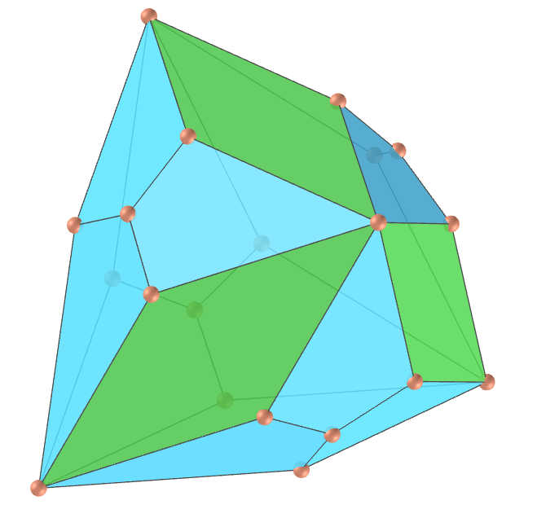 Joined truncated tetrahedron</a></td>
		<td><a href="../ArchimedeanCatalanHulls/vr/JoinedTruncatedTetrahedron.htm" target="_blank">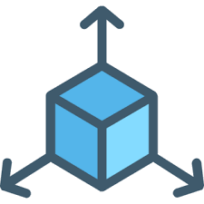</a></td>
		<td></td>
		<td rowspan="13"></td>
	</tr>
	<tr>
		<td class="titulo1"><a href="../ArchimedeanCatalanHulls/#m3d" target="_blank"> Joined cuboctahedron</a></td>
		<td></td>
		<td></td>
	</tr>
	<tr>
		<td class="titulo1"><a href="../ArchimedeanCatalanHulls/#m3d" target="_blank"> Joined Truncated Octahedron</a></td>
		<td></td>
		<td></td>
	</tr>
	<tr>
		<td class="titulo1"><a href="../ArchimedeanCatalanHulls/#m3d" target="_blank"> Joined Truncated Cube</a></td>
		<td></td>
		<td></td>
	</tr>
	<tr>
		<td class="titulo1"><a href="../ArchimedeanCatalanHulls/#m3d" target="_blank">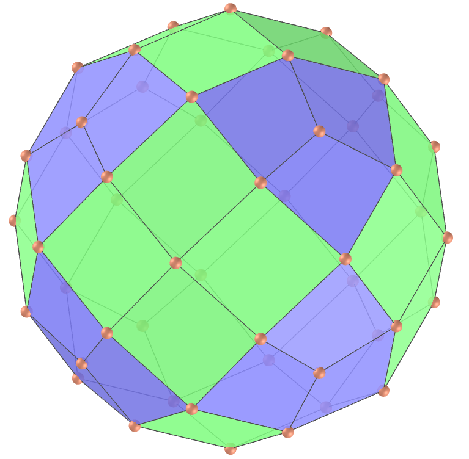 Joined Rhombicuboctahedron</a></td>
		<td></td>
		<td></td>
	</tr>
	<tr>
		<td class="titulo1"><a href="../ArchimedeanCatalanHulls/#m3d" target="_blank"> Joined Snub Cube</a></td>
		<td></td>
		<td></td>
	</tr>
	<tr>
		<td class="titulo1"><a href="../ArchimedeanCatalanHulls/#m3d" target="_blank"> Joined Icosidodecahedron</a></td>
		<td></td>
		<td></td>
	</tr>
	<tr>
		<td class="titulo1"><a href="../ArchimedeanCatalanHulls/#m3d" target="_blank">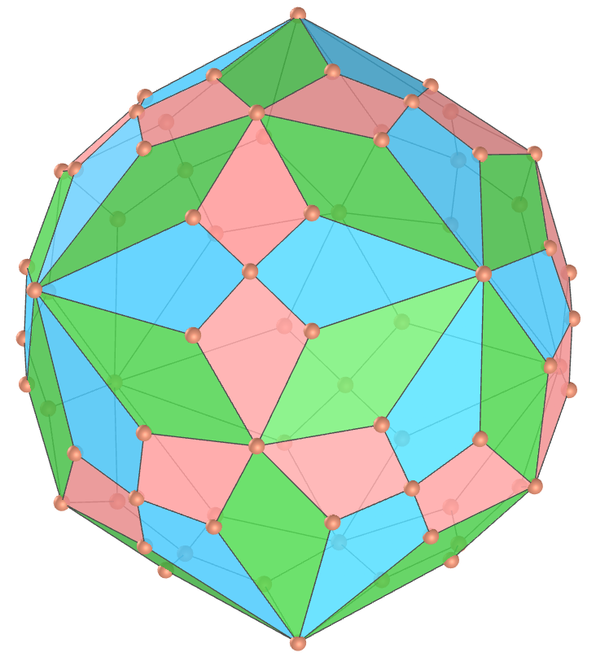 Joined Truncated Cuboctahedron</a></td>
		<td></td>
		<td></td>
	</tr>
	<tr>
		<td class="titulo1"><a href="../ArchimedeanCatalanHulls/#m3d" target="_blank">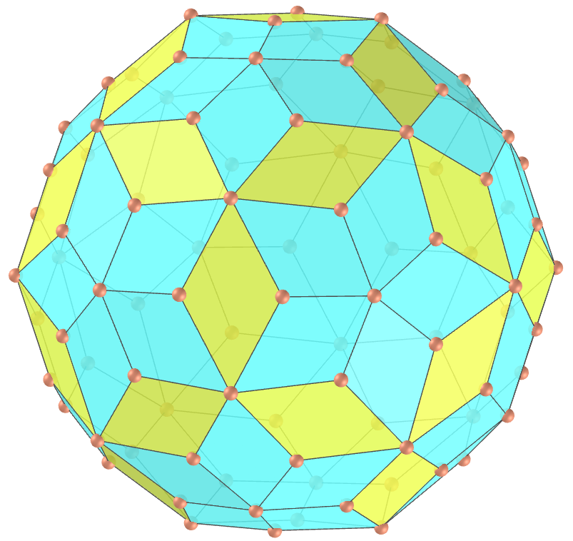 Joined Truncated Icosahedron</a></td>
		<td></td>
		<td></td>
	</tr>
	<tr>
		<td class="titulo1"><a href="../ArchimedeanCatalanHulls/#m3d" target="_blank"> Joined Truncated Dodecahedron</a></td>
		<td></td>
		<td></td>
	</tr>
	<tr>
		<td class="titulo1"><a href="../ArchimedeanCatalanHulls/#m3d" target="_blank"> Joined Rhombicosidodecahedron</a></td>
		<td></td>
		<td></td>
	</tr>
	<tr>
		<td class="titulo1"><a href="../ArchimedeanCatalanHulls/#m3d" target="_blank"> Joined Snub Dodecahedron</a></td>
		<td></td>
		<td></td>
	</tr>
	<tr>
		<td class="titulo1"><a href="../ArchimedeanCatalanHulls/#m3d" target="_blank">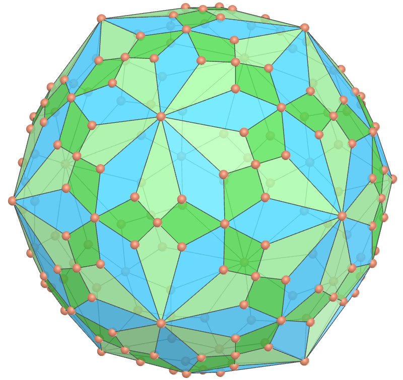 Joined Truncated Icosidodecahedron</a></td>
		<td></td>
		<td></td>
	</tr>
</table>
<h3>Platonic polyhedra fractals</h3>
<table align="center">
	<tr>
		<th>Name</th>
		<th>3D model</th>
		<th>Video</th>
		<th>Immersive room</th>
	</tr>
	<tr>
		<td class="titulo1"><a href="../fractalplatonic/#m3d" target="_blank"> Fractal tetrahedron</a></td>
		<td></td>
		<td></td>
		<td rowspan="3"></td>
	</tr>
	<tr>
		<td class="titulo1"><a href="../fractalplatonic/#m3d" target="_blank"> Fractal octahedron</a></td>
		<td></td>
		<td></td>
	</tr>
	<tr>
		<td class="titulo1"><a href="../fractalplatonic/#m3d" target="_blank"> Fractal cube</a></td>
		<td></td>
		<td></td>
	</tr>
	<tr>
		<td class="titulo1"><a href="../fractalplatonic/#m3d" target="_blank"> Fractal icosahedron</a></td>
		<td></td>
		<td></td>
		<td rowspan="2"></td>
	</tr>
		<td class="titulo1"><a href="../fractalplatonic/#m3d" target="_blank"> Fractal dodecahedron</a></td>
		<td></td>
		<td></td>
	</tr>
	<tr>
		<td class="titulo1"><a href="../fractalplatonic/#m3d" target="_blank">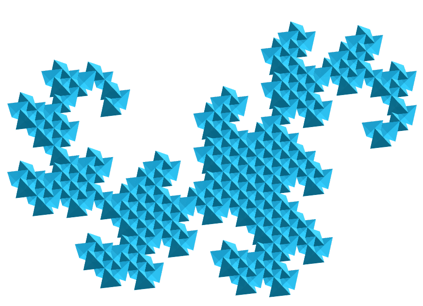 Tetrahedron dragon fractal</a></td>
		<td></td>
		<td></td>
		<td rowspan="2"></td>
	</tr>
	<tr>
		<td class="titulo1"><a href="../fractalplatonic/#m3d" target="_blank">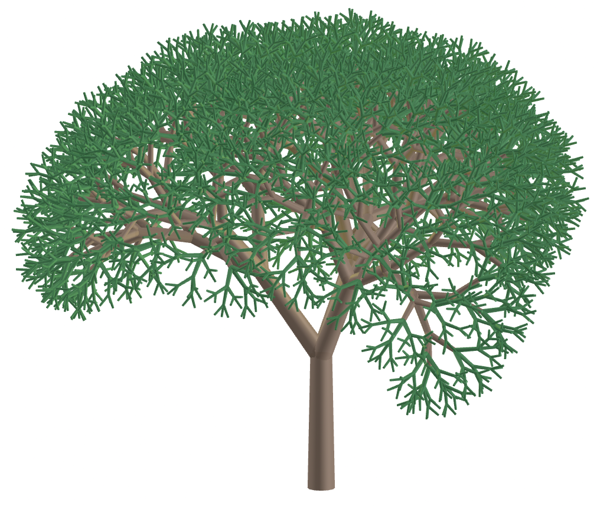 Fractal tree</a></td>
		<td></td>
		<td></td>
	</tr>
	<tr>
		<td class="titulo1"><a href="../fractalplatonic/#m3d" target="_blank">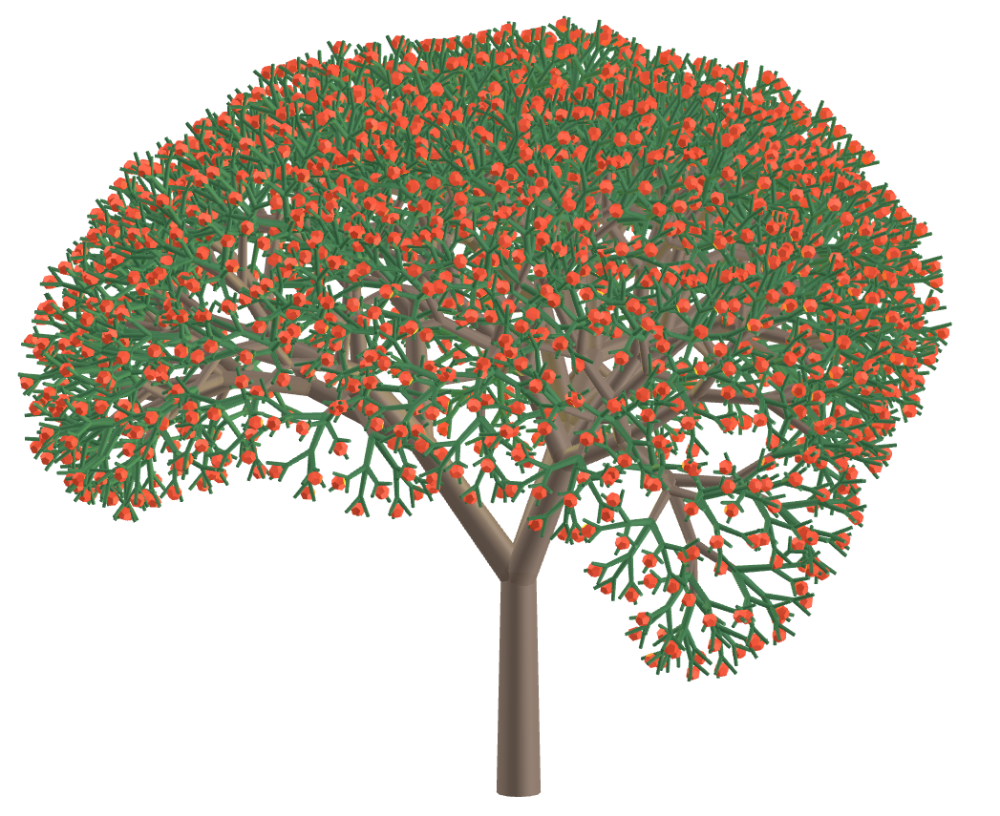 Fractal tree with dodecahedrons</a></td>
		<td></td>
		<td></td>
		<td></td>
	</tr>
	<tr>
		<td class="titulo1"><a href="../fractalplatonic/#m3d" target="_blank">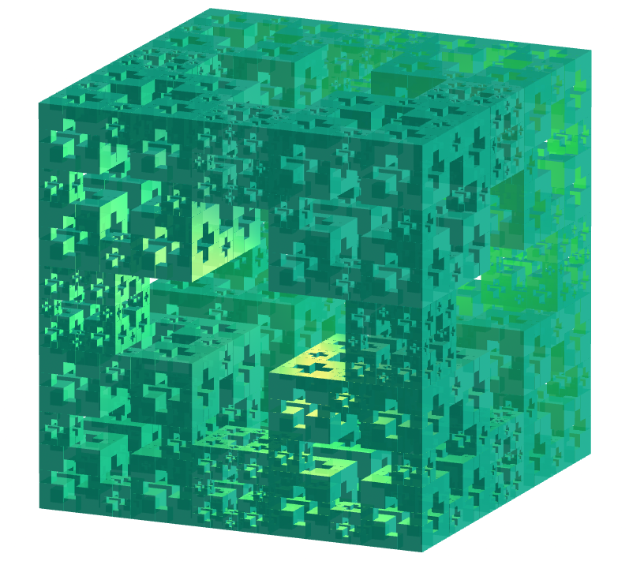 Menger's Cross - Jerusalem: Cube v1</a></td>
		<td></td>
		<td></td>
		<td rowspan="4"></td>
	</tr>
	<tr>
		<td class="titulo1"><a href="../fractalplatonic/#m3d" target="_blank">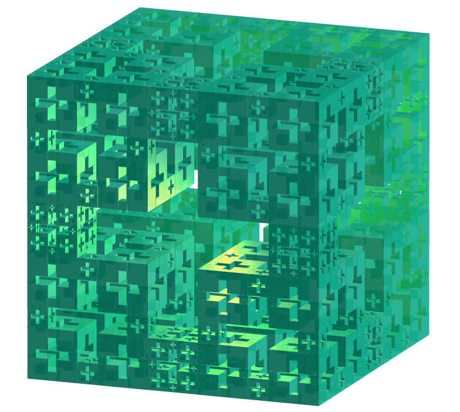 Menger's Cross - Jerusalem: Cube v2</a></td>
		<td></td>
		<td></td>
	</tr>
	<tr>
		<td class="titulo1"><a href="../fractalplatonic/#m3d" target="_blank">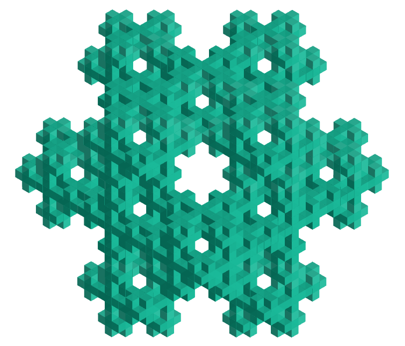 Mosely snowflake: Cube</a></td>
		<td></td>
		<td></td>
	</tr>
	<tr>
		<td class="titulo1"><a href="../fractalplatonic/#m3d" target="_blank">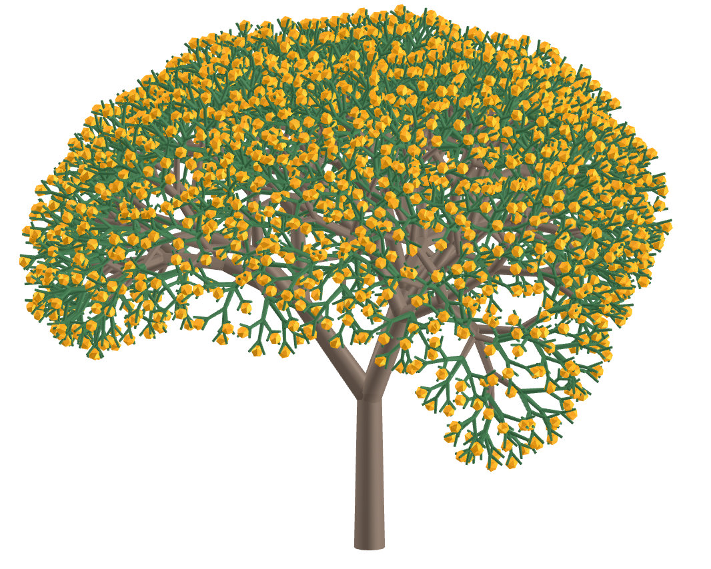 Fractal tree with icosahedrons</a></td>
		<td></td>
		<td></td>
	</tr>
	<tr>
		<td class="titulo1"><a href="../fractalplatonic/#m3d" target="_blank">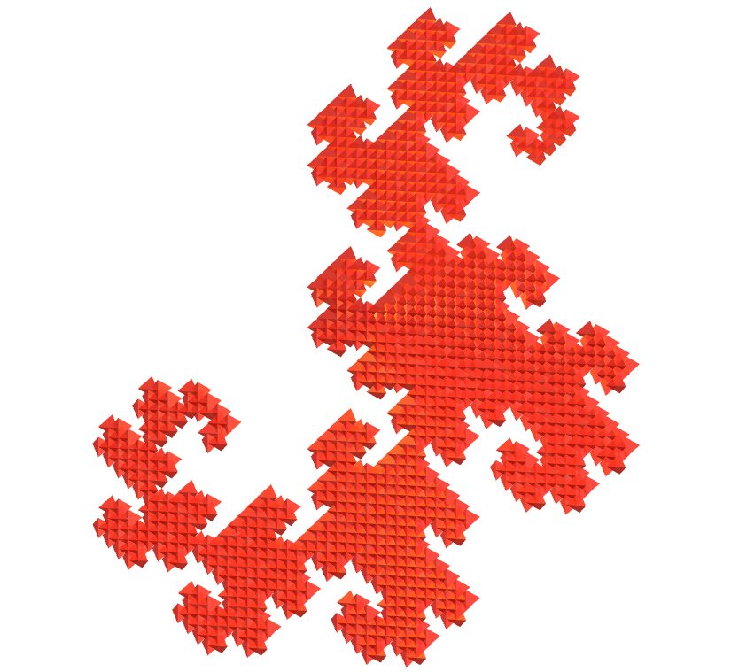 Tetrahedron dragon fractal (3 rotations)</a></td>
		<td></td>
		<td></td>
		<td rowspan="5"></td>
	</tr>
	<tr>
		<td class="titulo1"><a href="../fractalplatonic/#m3d" target="_blank">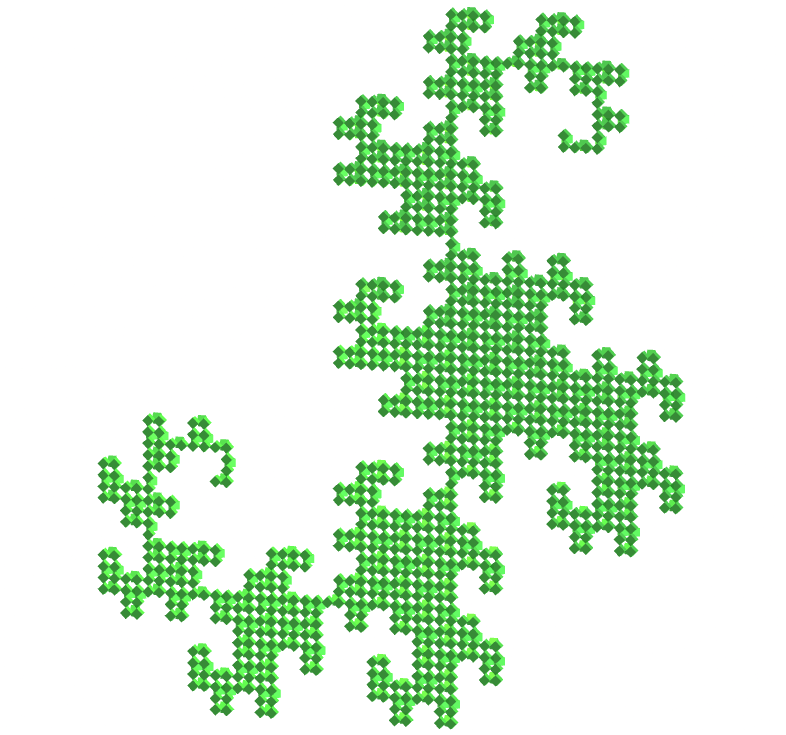 Cube dragon fractal</a></td>
		<td></td>
		<td></td>
	</tr>
	<tr>
		<td class="titulo1"><a href="../fractalplatonic/#m3d" target="_blank">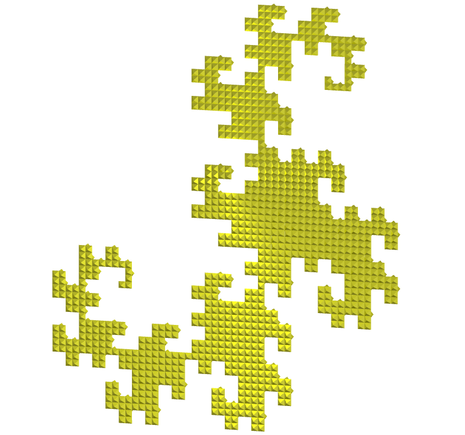 Octahedron dragon fractal</a></td>
		<td></td>
		<td></td>
	</tr>
	<tr>
		<td class="titulo1"><a href="../fractalplatonic/#m3d" target="_blank">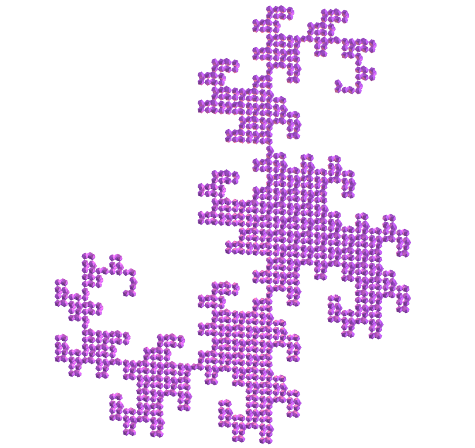 Icosahedron dragon fractal</a></td>
		<td></td>
		<td></td>
	</tr>
	<tr>
		<td class="titulo1"><a href="../fractalplatonic/#m3d" target="_blank">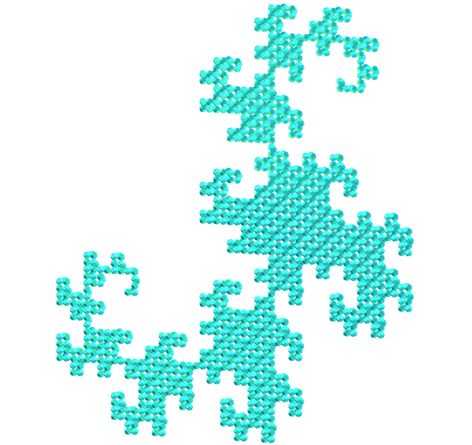 Dodecahedron dragon fractal</a></td>
		<td></td>
		<td></td>
	</tr>
</table>
<h3>Non convex polyhedra fractals</h3>
<table align="center">
	<tr>
		<th>Name</th>
		<th>3D model</th>
		<th>Video</th>
		<th>Immersive room</th>
	</tr>
	<tr>
		<td class="titulo1"><a href="../fractalnonconvex/#m3d" target="_blank">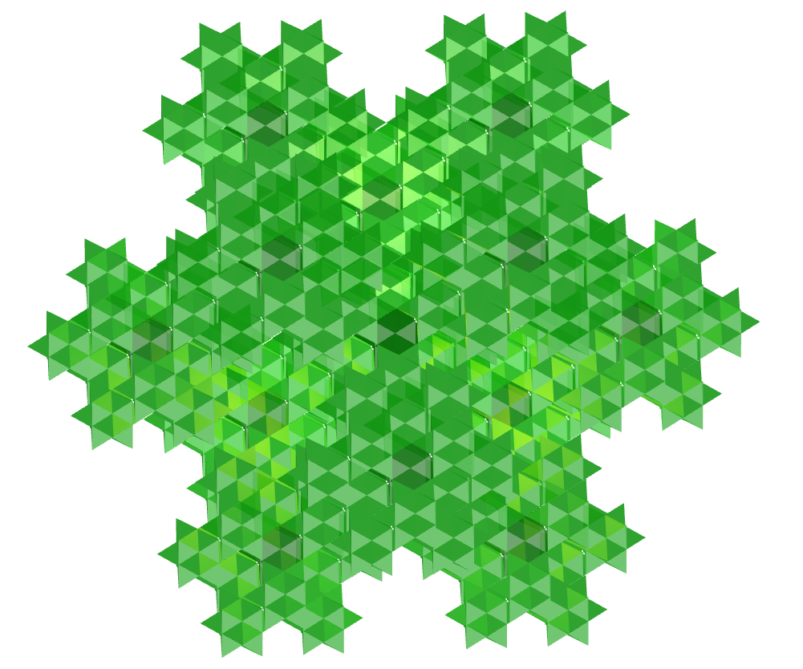 Escher solid fractal</a></td>
		<td></td>
		<td></td>
		<td rowspan="3"></td>
	</tr>
	<tr>
		<td class="titulo1"><a href="../fractalnonconvex/#m3d" target="_blank"> Small stellated dodecahedron fractal</a></td>
		<td></td>
		<td></td>
	</tr>
	<tr>
		<td class="titulo1"><a href="../fractalnonconvex/#m3d" target="_blank"> Great stellated dodecahedron fractal</a></td>
		<td></td>
		<td></td>
	</tr>
	<tr>
		<td class="titulo1"><a href="../fractalnonconvex/#m3d" target="_blank"> Great icosahedron fractal</a></td>
		<td></td>
		<td></td>
		<td rowspan="3"></td>
	</tr>
	<tr>
		<td class="titulo1"><a href="../fractalnonconvex/#m3d" target="_blank">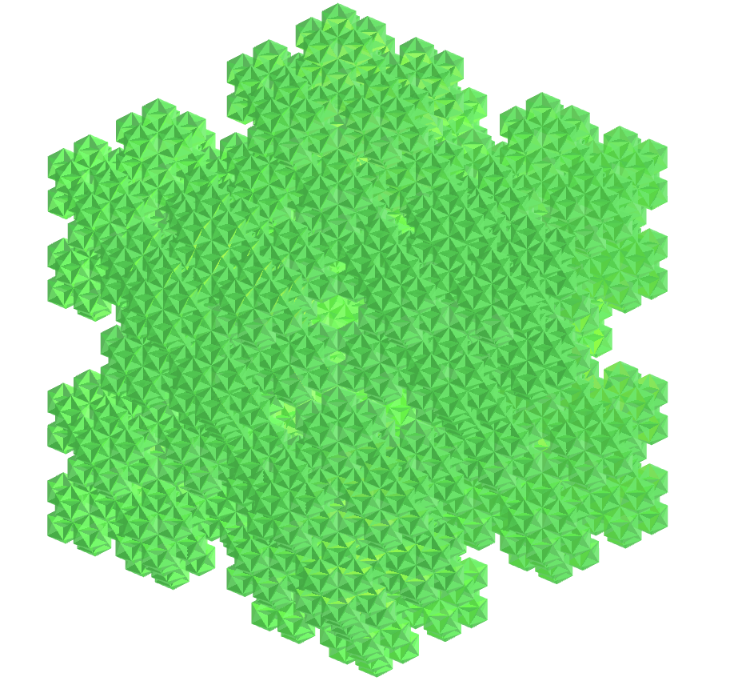 Great dodecahedron fractal</a></td>
		<td></td>
		<td></td>
	</tr>
	<tr>
		<td class="titulo1"><a href="../fractalnonconvex/#m3d" target="_blank">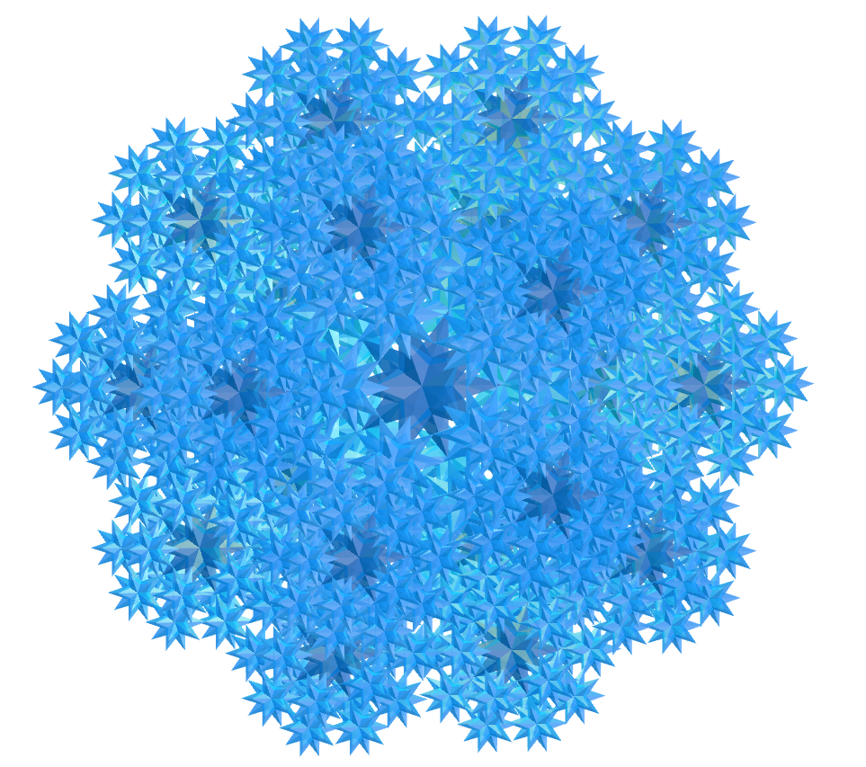 Great stellapentakis dodecahedron fractal</a></td>
		<td></td>
		<td></td>
	</tr>
	<tr>
		<td class="titulo1"><a href="../fractalnonconvex/#m3d" target="_blank"> Pentagramic dipyramid fractal</a></td>
		<td></td>
		<td></td>
		<td rowspan="3"></td>
	</tr>
	<tr>
		<td class="titulo1"><a href="../fractalnonconvex/#m3d" target="_blank"> Medial triambic icosahedron fractal</a></td>
		<td></td>
		<td></td>
	</tr>
	<tr>
		<td class="titulo1"><a href="../fractalnonconvex/#m3d" target="_blank">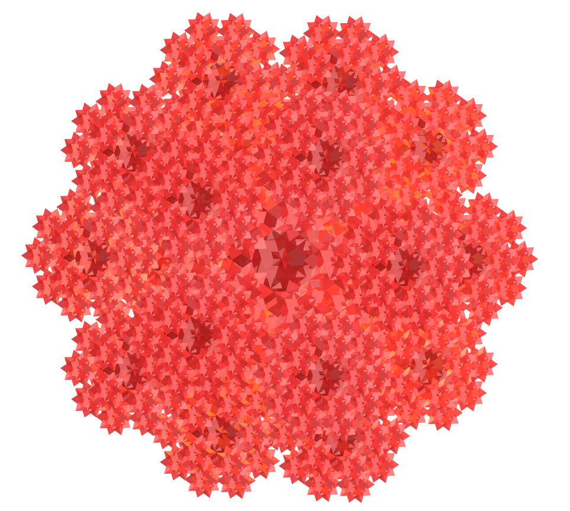 Great rhombic triacontahedron fractal</a></td>
		<td></td>
		<td></td>
	</tr>
	<tr>
		<td class="titulo1"><a href="../fractalnonconvex/#m3d" target="_blank"> Medial rhombic triacontahedron fractal</a></td>
		<td></td>
		<td></td>
		<td rowspan="3"></td>
	</tr>
	<tr>
		<td class="titulo1"><a href="../fractalnonconvex/#m3d" target="_blank"> Small ditrigonal dodecacronic hexecontahedron fractal</a></td>
		<td></td>
		<td></td>
	</tr>
	<tr>
		<td class="titulo1"><a href="../fractalnonconvex/#m3d" target="_blank">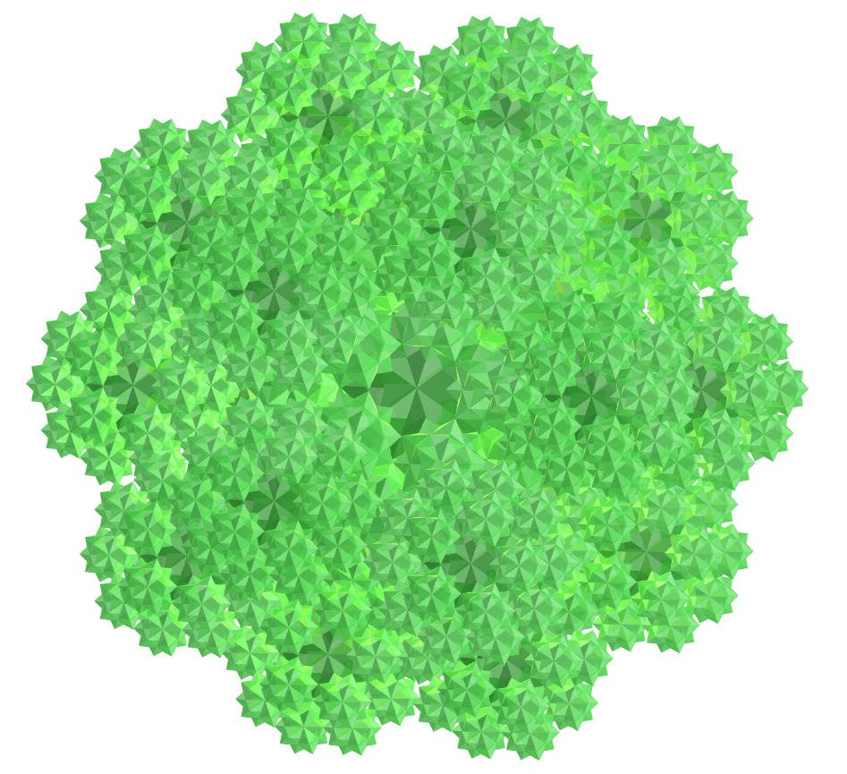 Rhombicosacron fractal</a></td>
		<td></td>
		<td></td>
	</tr>
	<tr>
		<td class="titulo1"><a href="../fractalnonconvex/#m3d" target="_blank"> Small hexacronic icositetrahedron fractal</a></td>
		<td></td>
		<td></td>
		<td rowspan="8"></td>
	</tr>
	<tr>
		<td class="titulo1"><a href="../fractalnonconvex/#m3d" target="_blank"> Great triakis octahedron fractal</a></td>
		<td></td>
		<td></td>
	</tr>
	<tr>
		<td class="titulo1"><a href="../fractalnonconvex/#m3d" target="_blank"> Great disdyakis dodecahedron fractal</a></td>
		<td></td>
		<td></td>
	</tr>
	<tr>
		<td class="titulo1"><a href="../fractalnonconvex/#m3d" target="_blank"> Small rhombidodecacron fractal</a></td>
		<td></td>
		<td></td>
	</tr>
	<tr>
		<td class="titulo1"><a href="../fractalnonconvex/#m3d" target="_blank"> Great triakis icosahedron fractal</a></td>
		<td></td>
		<td></td>
	</tr>
	<tr>
		<td class="titulo1"><a href="../fractalnonconvex/#m3d" target="_blank"> Great truncated icosahedron fractal</a></td>
		<td></td>
		<td></td>
	</tr>
	<tr>
		<td class="titulo1"><a href="../fractalnonconvex/#m3d" target="_blank">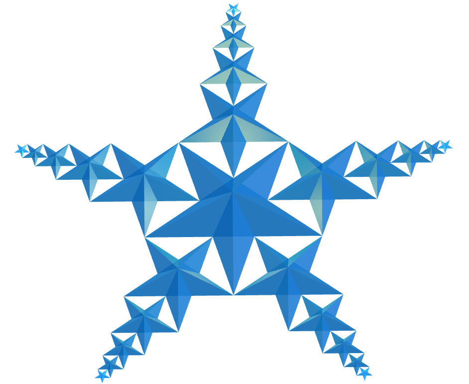 Pentagrammic dipyramid fractal</a></td>
		<td></td>
		<td></td>
	</tr>
	<tr>
		<td class="titulo1"><a href="../fractalnonconvex/#m3d" target="_blank">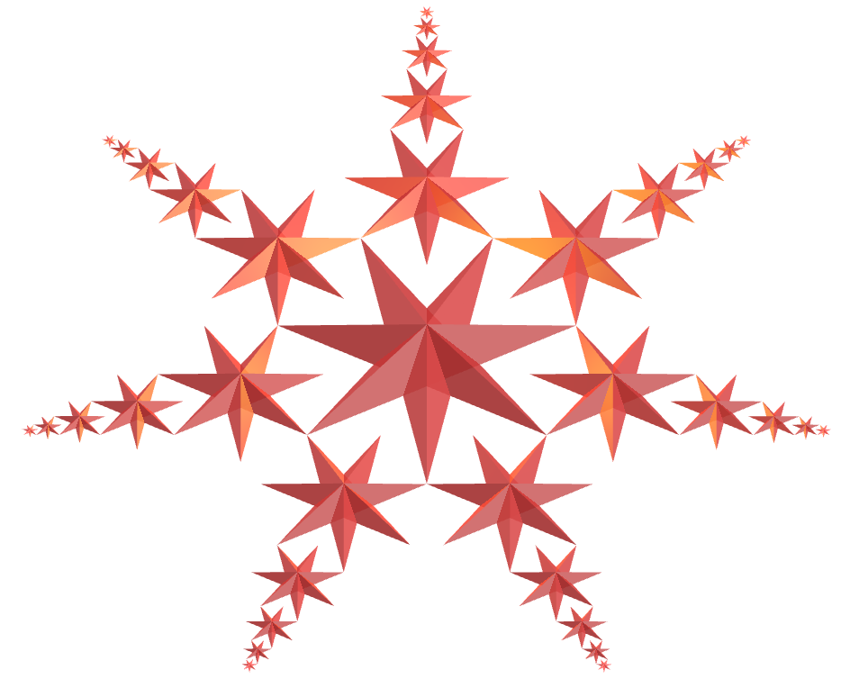 Heptagrammic dipyramid fractal</a></td>
		<td></td>
		<td></td>
	</tr>
	<tr>
		<td class="titulo1"><a href="../fractalnonconvex/#m3d" target="_blank"> Great pentakis dodecahedron fractal</a></td>
		<td></td>
		<td></td>
		<td rowspan="6"></td>
	</tr>
	<tr>
		<td class="titulo1"><a href="../fractalnonconvex/#m3d" target="_blank">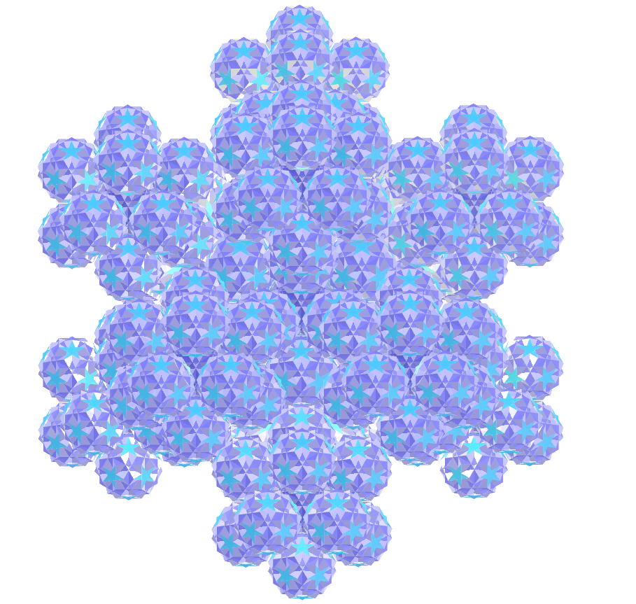 Icosidodecadodecahedron fractal</a></td>
		<td></td>
		<td></td>
	</tr>
	<tr>
		<td class="titulo1"><a href="../fractalnonconvex/#m3d" target="_blank">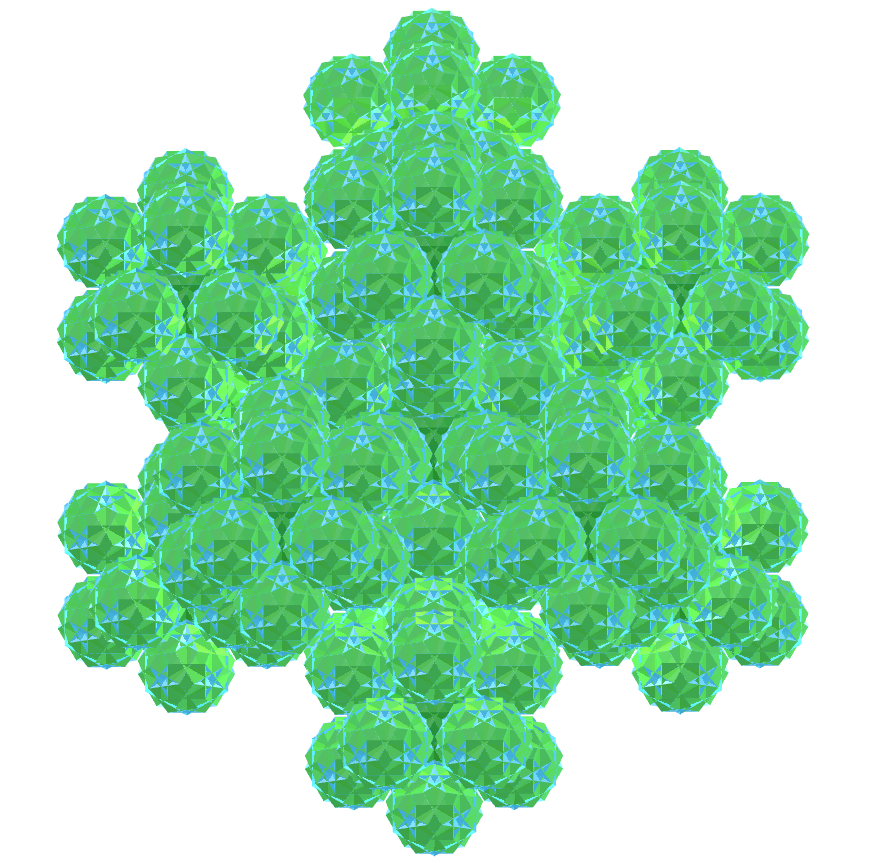 Rhombicosahedron fractal</a></td>
		<td></td>
		<td></td>
	</tr>
	<tr>
		<td class="titulo1"><a href="../fractalnonconvex/#m3d" target="_blank">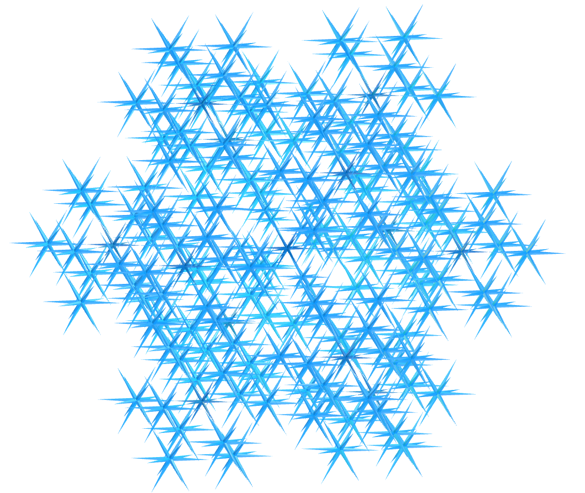 Medial inverted pentagonal hexecontahedron fractal</a></td>
		<td></td>
		<td></td>
	</tr>
	<tr>
		<td class="titulo1"><a href="../fractalnonconvex/#m3d" target="_blank">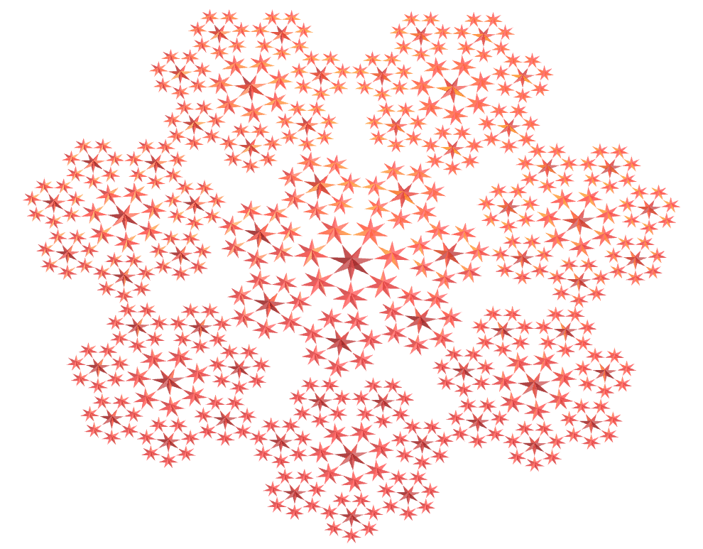 Heptagrammic dipyramid fractal</a></td>
		<td></td>
		<td></td>
	</tr>
	<tr>
		<td class="titulo1"><a href="../fractalnonconvex/#m3d" target="_blank">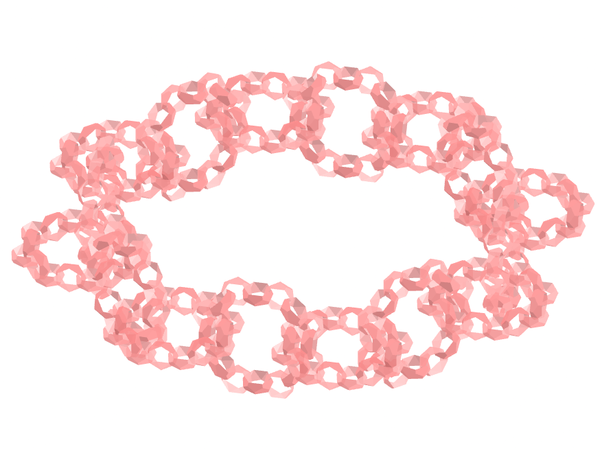 Hexagonal trapezohedron-antiprism toroid fractal</a></td>
		<td></td>
		<td></td>
	</tr>
	<tr>
		<td class="titulo1"><a href="../fractalnonconvex/#m3d" target="_blank">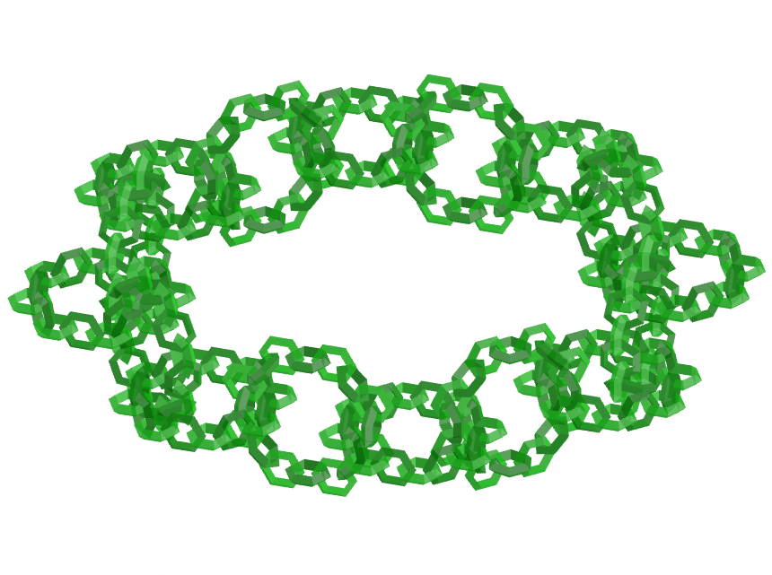 Tetragonal toroid fractal</a></td>
		<td></td>
		<td></td>
		<td rowspan="4"></td>
	</tr>
	<tr>
		<td class="titulo1"><a href="../fractalnonconvex/#m3d" target="_blank">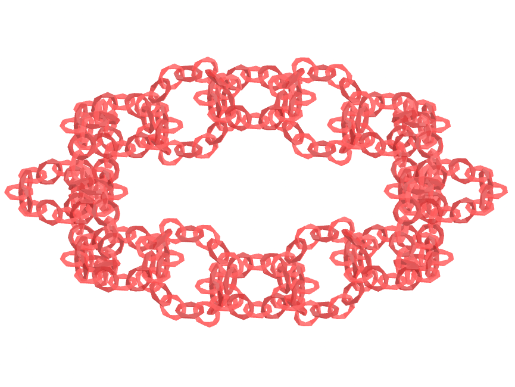 Hexagonal trapezohedron toroid fractal</a></td>
		<td></td>
		<td></td>
	</tr>
	<tr>
		<td class="titulo1"><a href="../fractalnonconvex/#m3d" target="_blank">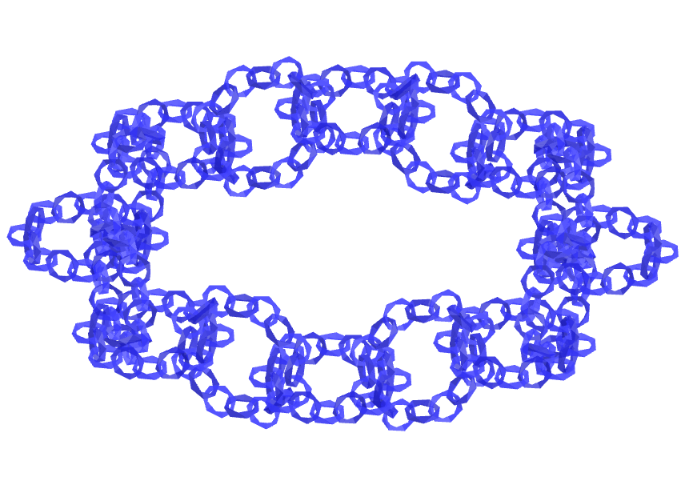 Hexagonal antiprism-trapezohedron toroid fractal</a></td>
		<td></td>
		<td></td>
	</tr>
	<tr>
		<td class="titulo1"><a href="../fractalnonconvex/#m3d" target="_blank">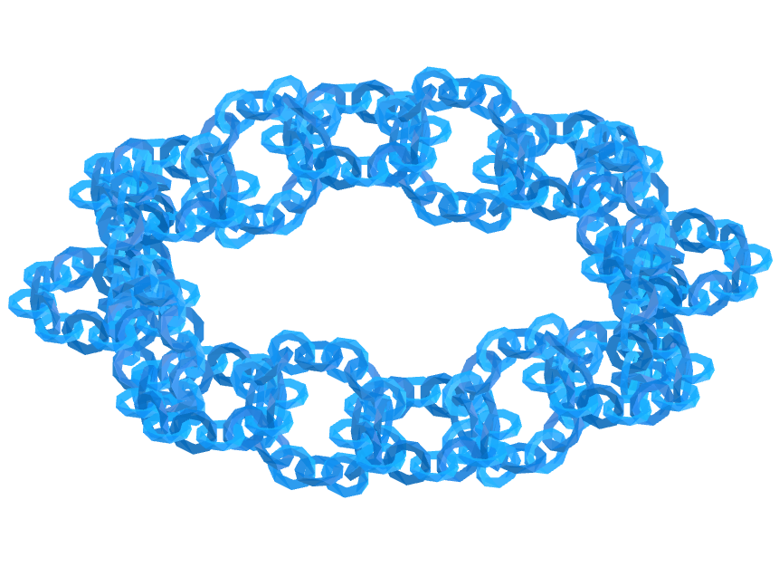 Anti-octagonal iris toroid fractal</a></td>
		<td></td>
		<td></td>
	</tr>
	<tr>
		<td class="titulo1"><a href="../fractalnonconvex/#m3d" target="_blank"> Geometric Christmas tree v1</a></td>
		<td></td>
		<td></td>
		<td rowspan="7"></td>
	</tr>
	<tr>
		<td class="titulo1"><a href="../fractalnonconvex/#m3d" target="_blank"> Geometric Christmas tree v2</a></td>
		<td></td>
		<td></td>
	</tr>
	<tr>
		<td class="titulo1"><a href="../fractalnonconvex/#m3d" target="_blank"> Geometric Christmas tree v3</a></td>
		<td></td>
		<td></td>
	</tr>
	<tr>
		<td class="titulo1"><a href="../fractalnonconvex/#m3d" target="_blank"> Geometric Christmas tree v4</a></td>
		<td></td>
		<td></td>
	</tr>
	<tr>
		<td class="titulo1"><a href="../fractalnonconvex/#m3d" target="_blank"> Geometric Christmas tree v5</a></td>
		<td></td>
		<td></td>
	</tr>
	<tr>
		<td class="titulo1"><a href="../fractalnonconvex/#m3d" target="_blank"> Geometric Christmas tree v6</a></td>
		<td></td>
		<td></td>
	</tr>
	<tr>
		<td class="titulo1"><a href="../fractalnonconvex/#m3d" target="_blank"> Geometric Christmas tree v7</a></td>
		<td></td>
		<td></td>
	</tr>
</table>
<h3>Archimedean polyhedra fractals</h3>
<table align="center">
	<tr>
		<th>Name</th>
		<th>3D model</th>
		<th>Video</th>
		<th>Immersive room</th>
	</tr>
	<tr>
		<td class="titulo1"><a href="../fractalarchimedean/#m3d" target="_blank">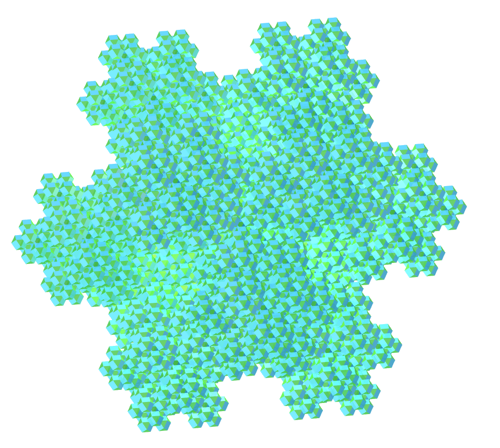 Cuboctahedron fractal</a></td>
		<td></td>
		<td></td>
		<td rowspan="3"></td>
	</tr>
	<tr>
		<td class="titulo1"><a href="../fractalarchimedean/#m3d" target="_blank"> Icosidodecahedron fractal</a></td>
		<td></td>
		<td></td>
	</tr>
	<tr>
		<td class="titulo1"><a href="../fractalarchimedean/#m3d" target="_blank">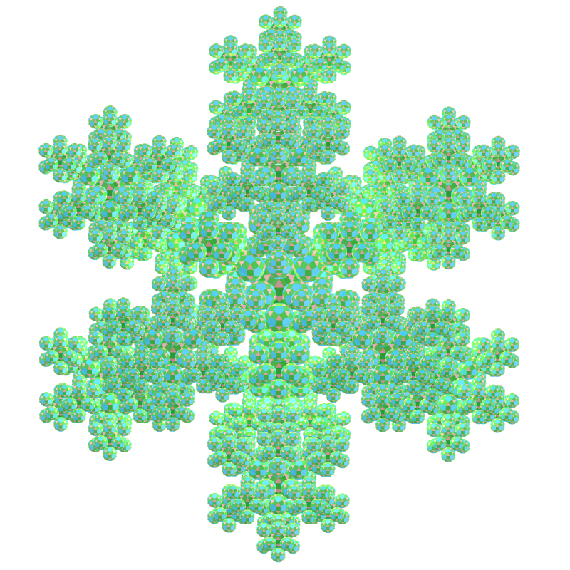 Rhombicosidodecahedron fractal</a></td>
		<td></td>
		<td></td>
	</tr>
	<tr>
		<td class="titulo1"><a href="../fractalarchimedean/#m3d" target="_blank">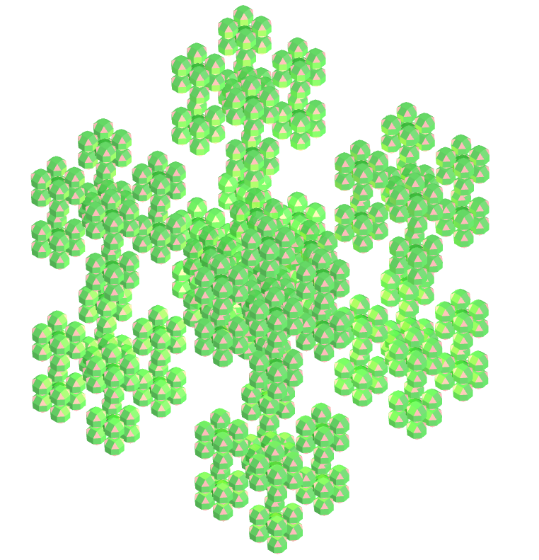 Rhombicuboctahedron fractal</a></td>
		<td></td>
		<td></td>
		<td rowspan="4"></td>
	</tr>
	<tr>
		<td class="titulo1"><a href="../fractalarchimedean/#m3d" target="_blank">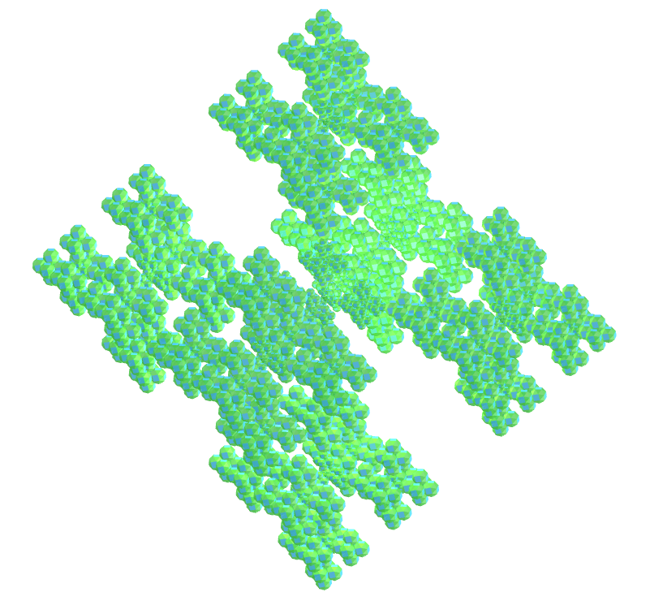 Snub cube fractal</a></td>
		<td></td>
		<td></td>
	</tr>
	<tr>
		<td class="titulo1"><a href="../fractalarchimedean/#m3d" target="_blank"> Snub dodecahedron fractal</a></td>
		<td></td>
		<td></td>
	</tr>
	<tr>
		<td class="titulo1"><a href="../fractalarchimedean/#m3d" target="_blank">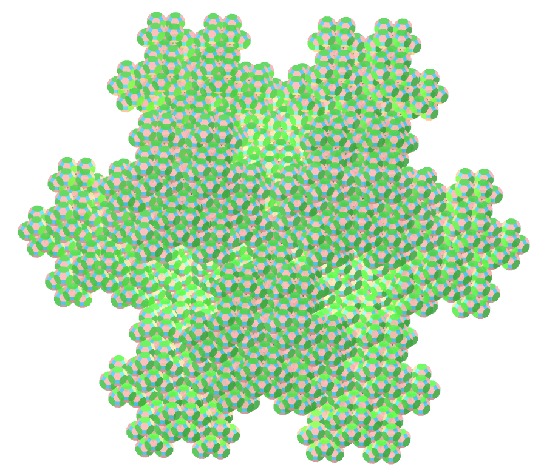 Truncated cuboctahedron fractal</a></td>
		<td></td>
		<td></td>
	</tr>
	<tr>
		<td class="titulo1"><a href="../fractalarchimedean/#m3d" target="_blank">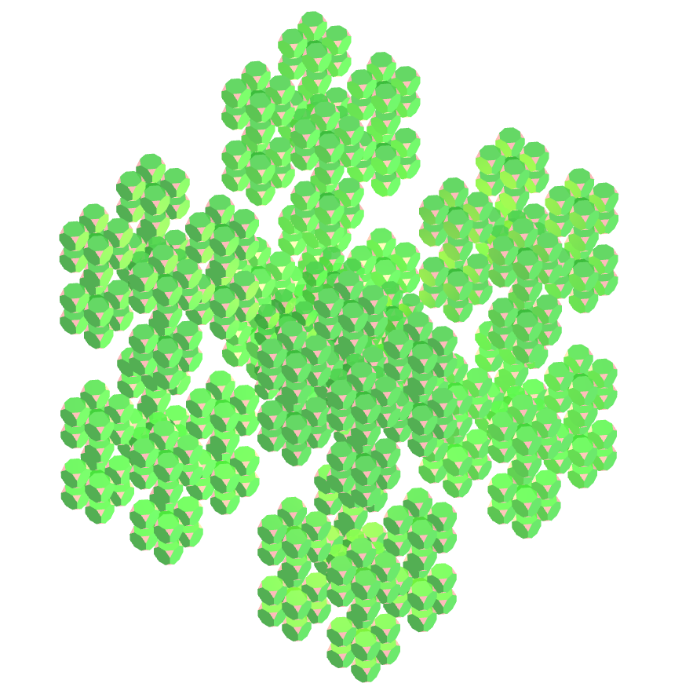 Truncated cube fractal</a></td>
		<td></td>
		<td></td>
		<td rowspan="3"></td>
	</tr>
	<tr>
		<td class="titulo1"><a href="../fractalarchimedean/#m3d" target="_blank"> Truncated dodecahedron fractal</a></td>
		<td></td>
		<td></td>
	</tr>
	<tr>
		<td class="titulo1"><a href="../fractalarchimedean/#m3d" target="_blank"> Truncated icosahedron fractal</a></td>
		<td></td>
		<td></td>
	</tr>
	<tr>
		<td class="titulo1"><a href="../fractalarchimedean/#m3d" target="_blank"> Truncated icosidodecahedron fractal</a></td>
		<td></td>
		<td></td>
		<td rowspan="3"></td>
	</tr>
	<tr>
		<td class="titulo1"><a href="../fractalarchimedean/#m3d" target="_blank">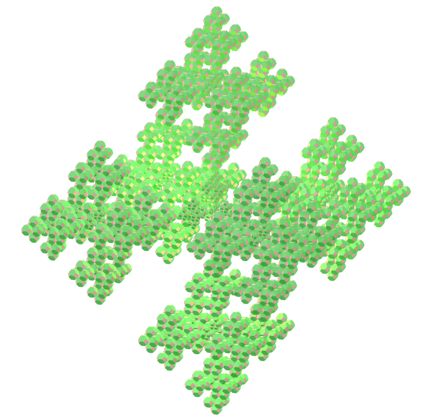 Truncated octahedron fractal</a></td>
		<td></td>
		<td></td>
	</tr>
	<tr>
		<td class="titulo1"><a href="../fractalarchimedean/#m3d" target="_blank"> Truncated tetrahedron fractal</a></td>
		<td></td>
		<td></td>
	</tr>
	<tr>
		<td class="titulo1"><a href="../fractalarchimedean/#m3d" target="_blank">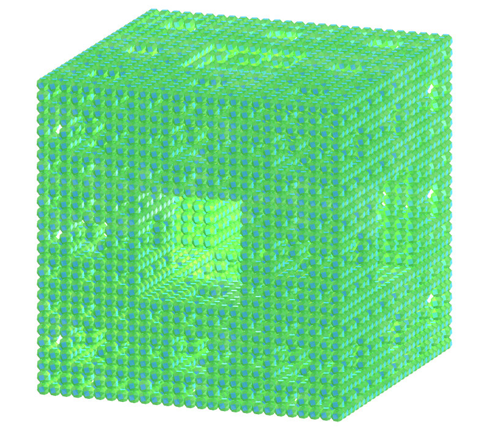 Menger sponge: Snub cube</a></td>
		<td></td>
		<td></td>
		<td rowspan="20"></td>
	</tr>
	<tr>
		<td class="titulo1"><a href="../fractalarchimedean/#m3d" target="_blank"> Menger's Cross - Jerusalem: Snub cube v1</a></td>
		<td></td>
		<td></td>
	</tr>
	<tr>
		<td class="titulo1"><a href="../fractalarchimedean/#m3d" target="_blank">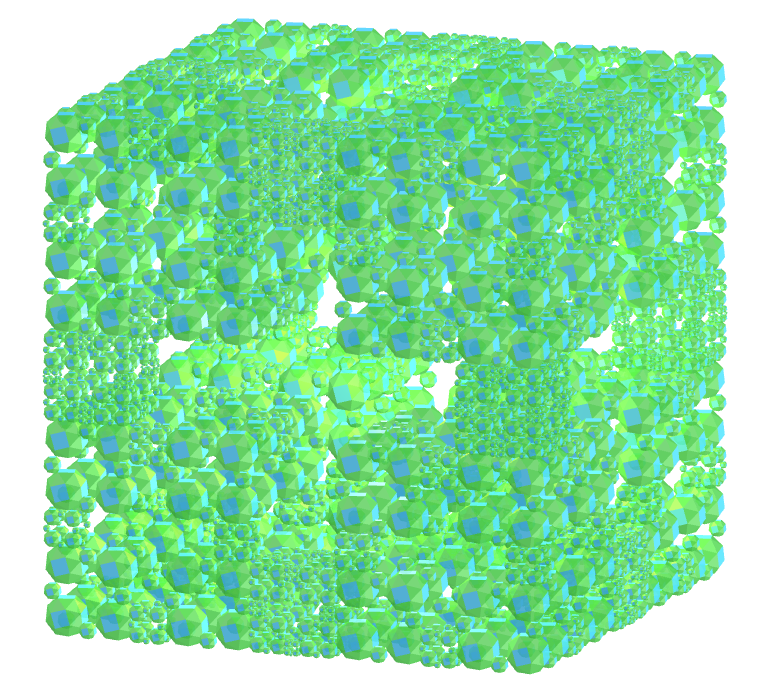 Menger's Cross - Jerusalem: Snub cube v2</a></td>
		<td></td>
		<td></td>
	</tr>
	<tr>
		<td class="titulo1"><a href="../fractalarchimedean/#m3d" target="_blank">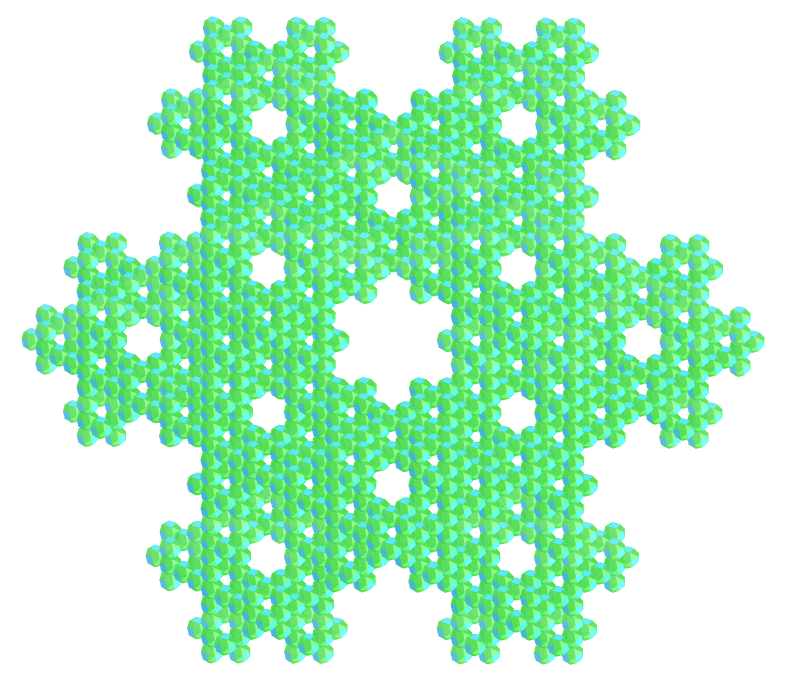 Mosely snowflake: Snub cube</a></td>
		<td></td>
		<td></td>
	</tr>
	<tr>
		<td class="titulo1"><a href="../fractalarchimedean/#m3d" target="_blank">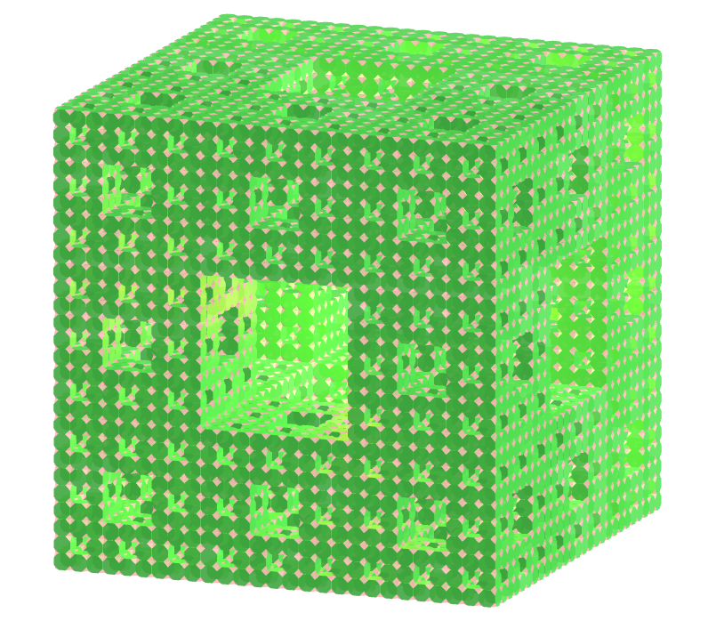 Menger sponge: Truncated cube</a></td>
		<td></td>
		<td></td>
	</tr>
	<tr>
		<td class="titulo1"><a href="../fractalarchimedean/#m3d" target="_blank"> Menger's Cross - Jerusalem: Truncated cube v1</a></td>
		<td></td>
		<td></td>
	</tr>
	<tr>
		<td class="titulo1"><a href="../fractalarchimedean/#m3d" target="_blank"> Menger's Cross - Jerusalem: Truncated cube v2</a></td>
		<td></td>
		<td></td>
	</tr>
	<tr>
		<td class="titulo1"><a href="../fractalarchimedean/#m3d" target="_blank">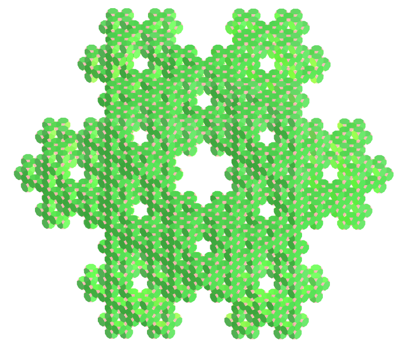 Mosely snowflake: Truncated cube</a></td>
		<td></td>
		<td></td>
	</tr>
	<tr>
		<td class="titulo1"><a href="../fractalarchimedean/#m3d" target="_blank"> Menger sponge: Rhombicuboctahedron</a></td>
		<td></td>
		<td></td>
	</tr>
	<tr>
		<td class="titulo1"><a href="../fractalarchimedean/#m3d" target="_blank"> Menger's Cross - Jerusalem: Rhombicuboctahedron v1</a></td>
		<td></td>
		<td></td>
	</tr>
	<tr>
		<td class="titulo1"><a href="../fractalarchimedean/#m3d" target="_blank"> Menger's Cross - Jerusalem: Rhombicuboctahedron v2</a></td>
		<td></td>
		<td></td>
	</tr>
	<tr>
		<td class="titulo1"><a href="../fractalarchimedean/#m3d" target="_blank">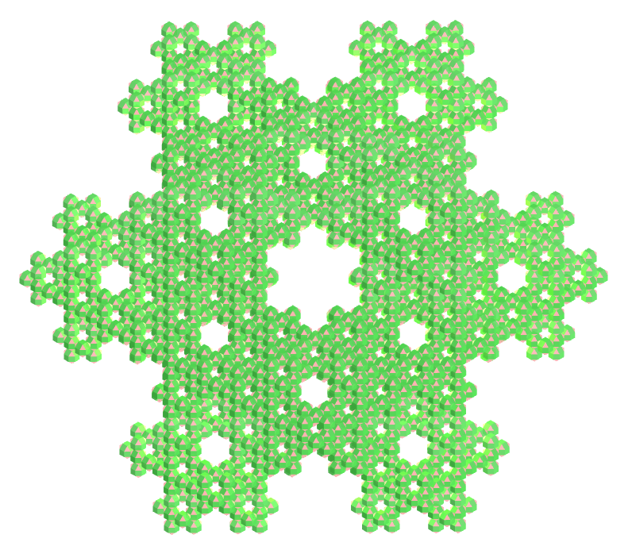 Mosely snowflake: Rhombicuboctahedron</a></td>
		<td></td>
		<td></td>
	</tr>
	<tr>
		<td class="titulo1"><a href="../fractalarchimedean/#m3d" target="_blank"> Menger sponge: Cuboctahedron</a></td>
		<td></td>
		<td></td>
	</tr>
	<tr>
		<td class="titulo1"><a href="../fractalarchimedean/#m3d" target="_blank">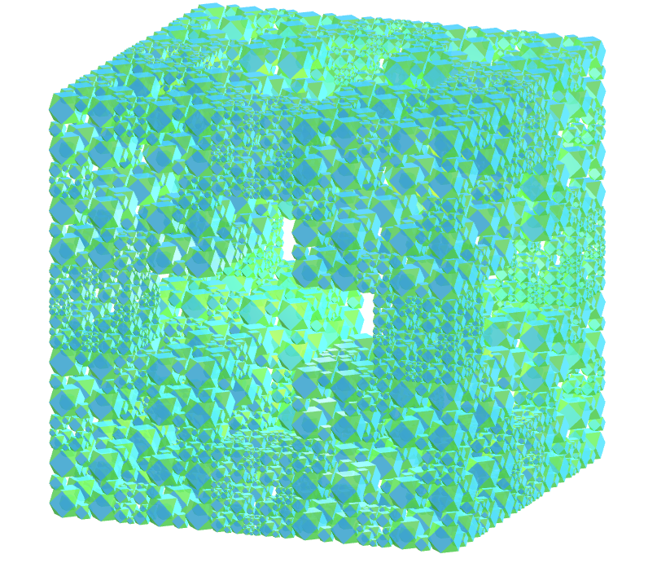 Menger's Cross - Jerusalem: Cuboctahedron v1</a></td>
		<td></td>
		<td></td>
	</tr>
	<tr>
		<td class="titulo1"><a href="../fractalarchimedean/#m3d" target="_blank"> Menger's Cross - Jerusalem: Cuboctahedron v2</a></td>
		<td></td>
		<td></td>
	</tr>
	<tr>
		<td class="titulo1"><a href="../fractalarchimedean/#m3d" target="_blank">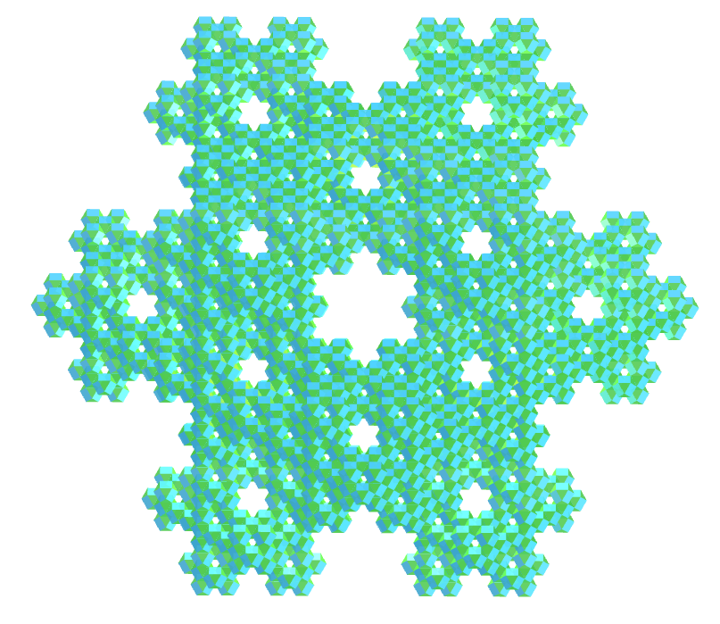 Mosely snowflake: Cuboctahedron</a></td>
		<td></td>
		<td></td>
	</tr>
	<tr>
		<td class="titulo1"><a href="../fractalarchimedean/#m3d" target="_blank"> Menger sponge: Truncated cuboctahedron</a></td>
		<td></td>
		<td></td>
	</tr>
	<tr>
		<td class="titulo1"><a href="../fractalarchimedean/#m3d" target="_blank"> Menger's Cross - Jerusalem: Truncated cuboctahedron v1</a></td>
		<td></td>
		<td></td>
	</tr>
	<tr>
		<td class="titulo1"><a href="../fractalarchimedean/#m3d" target="_blank"> Menger's Cross - Jerusalem: Truncated cuboctahedron v2</a></td>
		<td></td>
		<td></td>
	</tr>
	<tr>
		<td class="titulo1"><a href="../fractalarchimedean/#m3d" target="_blank"> Mosely snowflake: Truncated cuboctahedron</a></td>
		<td></td>
		<td></td>
	</tr>
</table>
<h3>Chamfered polyhedra</h3>
<table align="center">
	<tr>
		<th>Name</th>
		<th>3D model</th>
		<th>Video</th>
		<th>Immersive room</th>
	</tr>
	<tr>
		<td class="titulo1"><a href="../chamfered/#m3d" target="_blank"> Chamfered tetrahedron</a></td>
		<td></td>
		<td></td>
		<td rowspan="6"></td>
	</tr>
	<tr>
		<td class="titulo1"><a href="../chamfered/#m3d" target="_blank"> Chamfered cube</a></td>
		<td></td>
		<td></td>
	</tr>
	<tr>
		<td class="titulo1"><a href="../chamfered/#m3d" target="_blank"> Chamfered octahedron</a></td>
		<td></td>
		<td></td>
	</tr>
	<tr>
		<td class="titulo1"><a href="../chamfered/#m3d" target="_blank"> Chamfered icosahedron</a></td>
		<td></td>
		<td></td>
	</tr>
	<tr>
		<td class="titulo1"><a href="../chamfered/#m3d" target="_blank">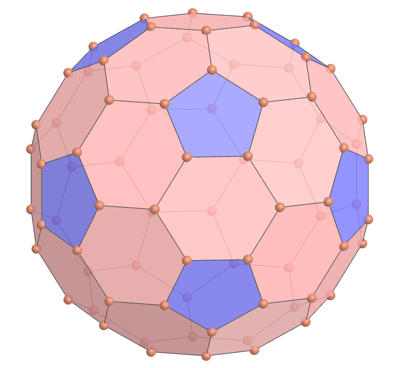 Chamfered dodecahedron</a></td>
		<td></td>
		<td></td>
	</tr>
	<tr>
		<td class="titulo1"><a href="../chamfered/#m3d" target="_blank"> Chamfered truncated icosahedron</a></td>
		<td></td>
		<td></td>
	</tr>
</table>
<h3>Propellor polyhedra</h3>
<table align="center">
	<tr>
		<th>Name</th>
		<th>3D model</th>
		<th>Video</th>
		<th>Immersive room</th>
	</tr>
	<tr>
		<td class="titulo1"><a href="../propellor/#m3d" target="_blank">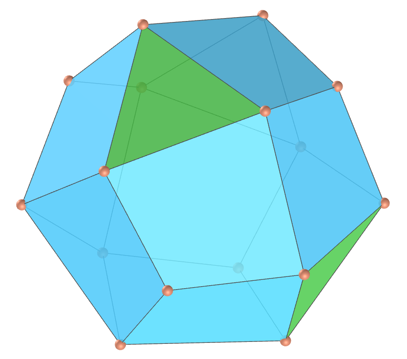 Propellor tetrahedron</a></td>
		<td></td>
		<td></td>
		<td rowspan="15"></td>
	</tr>
	<tr>
		<td class="titulo1"><a href="../propellor/#m3d" target="_blank"> Propellor cube</a></td>
		<td></td>
		<td></td>
	</tr>
	<tr>
		<td class="titulo1"><a href="../propellor/#m3d" target="_blank"> Propellor octahedron</a></td>
		<td></td>
		<td></td>
	</tr>
	<tr>
		<td class="titulo1"><a href="../propellor/#m3d" target="_blank"> Propellor icosahedron</a></td>
		<td></td>
		<td></td>
	</tr>
	<tr>
		<td class="titulo1"><a href="../propellor/#m3d" target="_blank">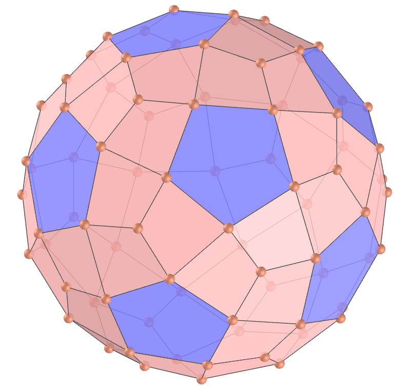 Propellor dodecahedron</a></td>
		<td></td>
		<td></td>
	</tr>
	<tr>
		<td class="titulo1"><a href="../propellor/#m3d" target="_blank">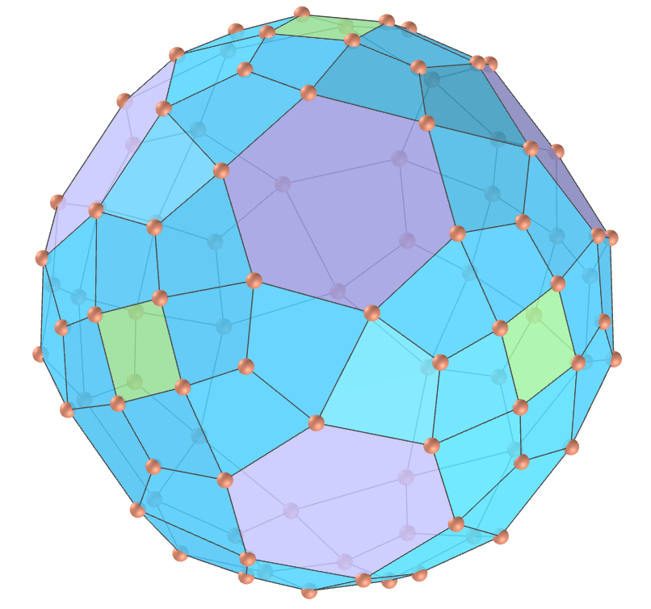 Propellor truncated octahedron</a></td>
		<td></td>
		<td></td>
	</tr>
	<tr>
		<td class="titulo1"><a href="../propellor/#m3d" target="_blank"> Propellor tetrakis hexahedron</a></td>
		<td></td>
		<td></td>
	</tr>
	<tr>
		<td class="titulo1"><a href="../propellor/#m3d" target="_blank">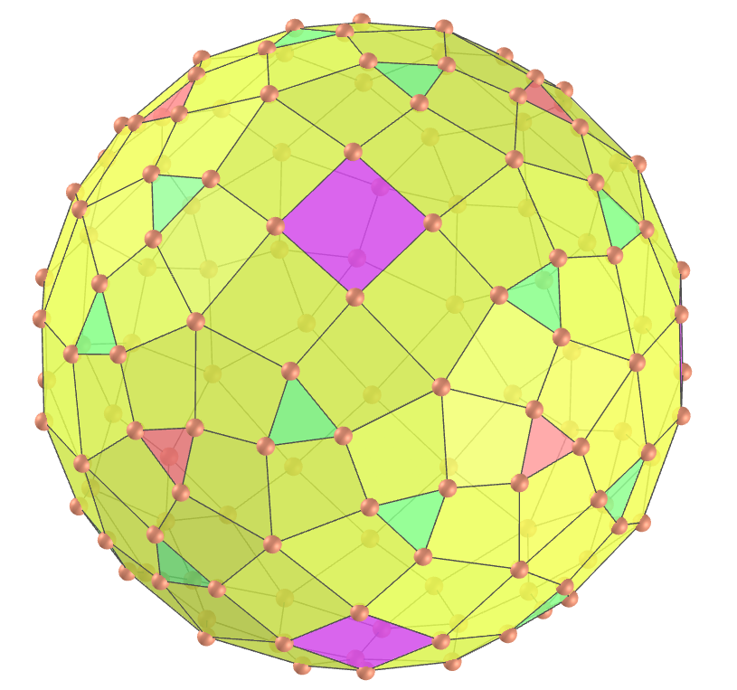 Propellor snub cube</a></td>
		<td></td>
		<td></td>
	</tr>
	<tr>
		<td class="titulo1"><a href="../propellor/#m3d" target="_blank"> Propellor pentagonal icositetrahedron</a></td>
		<td></td>
		<td></td>
	</tr>
	<tr>
		<td class="titulo1"><a href="../propellor/#m3d" target="_blank"> Propellor truncated cuboctahedron</a></td>
		<td></td>
		<td></td>
	</tr>
	<tr>
		<td class="titulo1"><a href="../propellor/#m3d" target="_blank">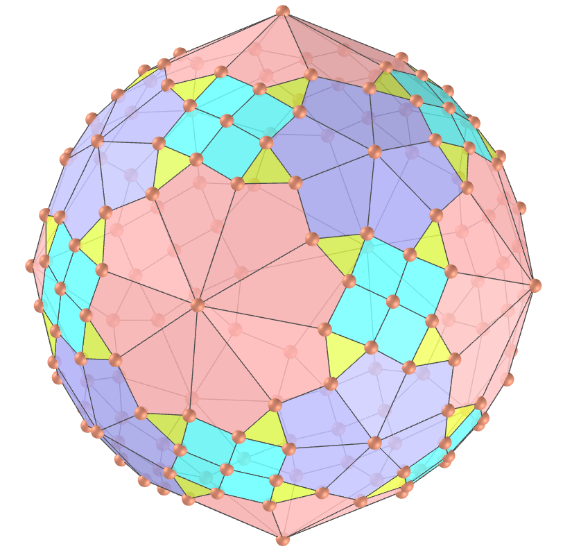 Propellor disdyakis dodecahedron</a></td>
		<td></td>
		<td></td>
	</tr>
	<tr>
		<td class="titulo1"><a href="../propellor/#m3d" target="_blank"> Propellor truncated icosahedron</a></td>
		<td></td>
		<td></td>
	</tr>
	<tr>
		<td class="titulo1"><a href="../propellor/#m3d" target="_blank"> Propellor pentakis dodecahedron</a></td>
		<td></td>
		<td></td>
	</tr>
	<tr>
		<td class="titulo1"><a href="../propellor/#m3d" target="_blank"> Propellor truncated icosidodecahedron</a></td>
		<td></td>
		<td></td>
	</tr>
	<tr>
		<td class="titulo1"><a href="../propellor/#m3d" target="_blank">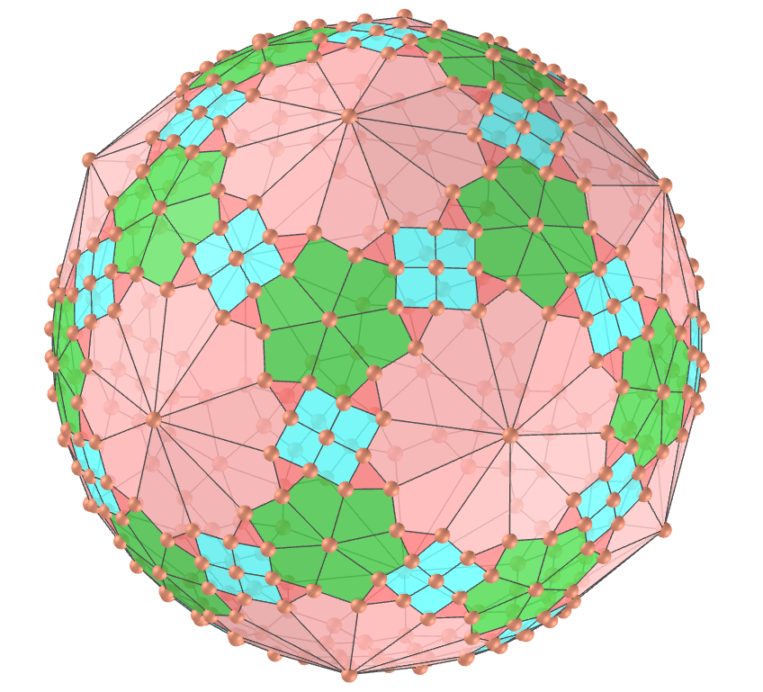 Propellor truncated icosidodecahedron</a></td>
		<td></td>
		<td></td>
	</tr>
</table>
<h3>Diamond polyhedra</h3>
<table align="center">
	<tr>
		<th>Name</th>
		<th>3D model</th>
		<th>Video</th>
		<th>Immersive room</th>
	</tr>
	<tr>
		<td class="titulo1"><a href="../diamonds/#m3d" target="_blank"> Diamond triangular cupola</a></td>
		<td></td>
		<td></td>
		<td rowspan="12"></td>
	</tr>
	<tr>
		<td class="titulo1"><a href="../diamonds/#m3d" target="_blank"> Diamond square cupola</a></td>
		<td></td>
		<td></td>
	</tr>
	<tr>
		<td class="titulo1"><a href="../diamonds/#m3d" target="_blank"> Diamond pentagonal cupola</a></td>
		<td></td>
		<td></td>
	</tr>
	<tr>
		<td class="titulo1"><a href="../diamonds/#m3d" target="_blank">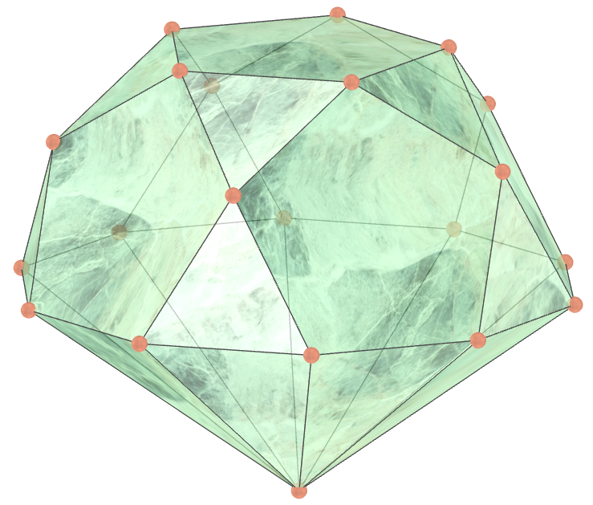 Diamond pentagonal rotunda</a></td>
		<td></td>
		<td></td>
	</tr>
	<tr>
		<td class="titulo1"><a href="../diamonds/#m3d" target="_blank"> Diamond pentagonal dipyramid</a></td>
		<td></td>
		<td></td>
	</tr>
	<tr>
		<td class="titulo1"><a href="../diamonds/#m3d" target="_blank"> Diamond hexagonal dipyramid</a></td>
		<td></td>
		<td></td>
	</tr>
	<tr>
		<td class="titulo1"><a href="../diamonds/#m3d" target="_blank"> Diamond heptagonal dipyramid</a></td>
		<td></td>
		<td></td>
	</tr>
	<tr>
		<td class="titulo1"><a href="../diamonds/#m3d" target="_blank"> Diamond octagonal dipyramid</a></td>
		<td></td>
		<td></td>
	</tr>
	<tr>
		<td class="titulo1"><a href="../diamonds/#m3d" target="_blank">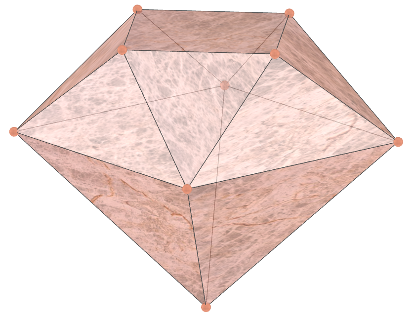 Diamond square antiprism</a></td>
		<td></td>
		<td></td>
	</tr>
	<tr>
		<td class="titulo1"><a href="../diamonds/#m3d" target="_blank">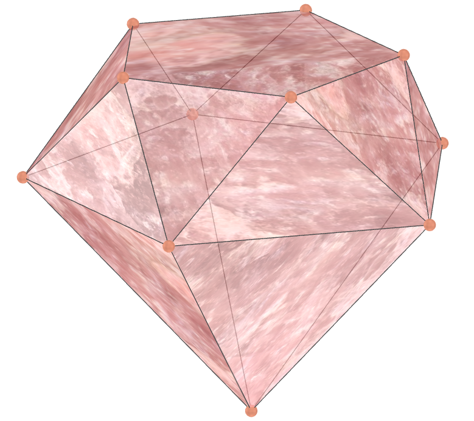 Diamond pentagonal antiprism</a></td>
		<td></td>
		<td></td>
	</tr>
	<tr>
		<td class="titulo1"><a href="../diamonds/#m3d" target="_blank"> Diamond hexagonal antiprism</a></td>
		<td></td>
		<td></td>
	</tr>
	<tr>
		<td class="titulo1"><a href="../diamonds/#m3d" target="_blank"> Diamond heptagonal antiprism</a></td>
		<td></td>
		<td></td>
	</tr>
	<tr>
		<td class="titulo1"><a href="../diamonds/#m3d" target="_blank">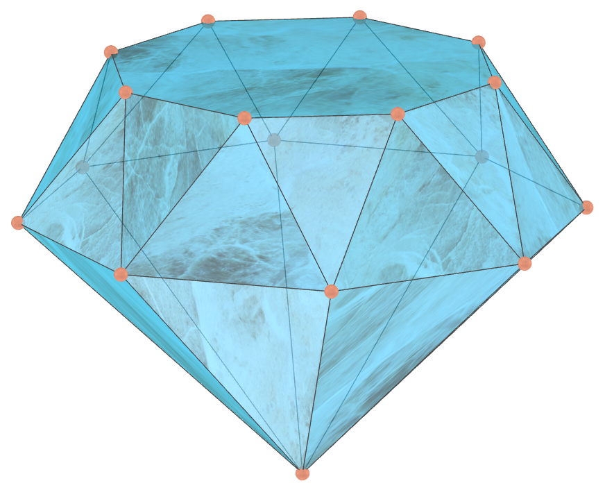 Diamond octagonal antiprism</a></td>
		<td></td>
		<td></td>
		<td rowspan="12"></td>
	</tr>
	<tr>
		<td class="titulo1"><a href="../diamonds/#m3d" target="_blank"> Diamond mirror square antiprism</a></td>
		<td></td>
		<td></td>
	</tr>
	<tr>
		<td class="titulo1"><a href="../diamonds/#m3d" target="_blank"> Diamond mirror pentagonal antiprism</a></td>
		<td></td>
		<td></td>
	</tr>
	<tr>
		<td class="titulo1"><a href="../diamonds/#m3d" target="_blank"> Diamond mirror hexagonal antiprism</a></td>
		<td></td>
		<td></td>
	</tr>
	<tr>
		<td class="titulo1"><a href="../diamonds/#m3d" target="_blank">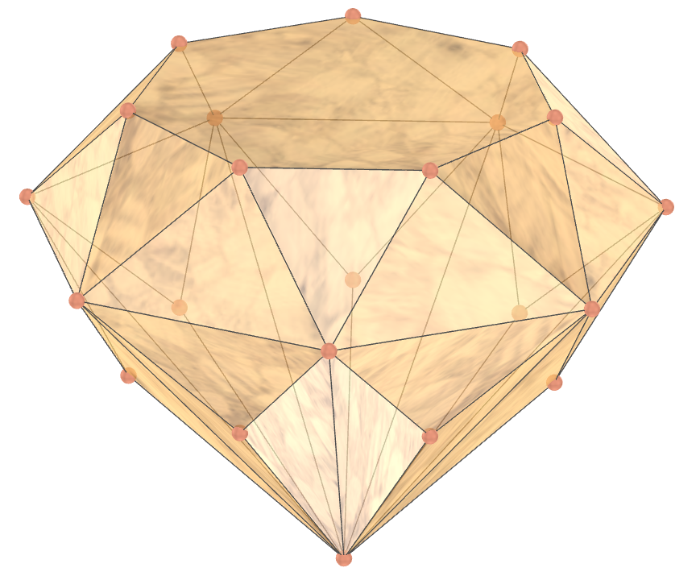 Diamond mirror heptagonal antiprism</a></td>
		<td></td>
		<td></td>
	</tr>
	<tr>
		<td class="titulo1"><a href="../diamonds/#m3d" target="_blank"> Diamond mirror octagonal antiprism</a></td>
		<td></td>
		<td></td>
	</tr>
	<tr>
		<td class="titulo1"><a href="../diamonds/#m3d" target="_blank"> Augmented tridiminished icosahedron</a></td>
		<td></td>
		<td></td>
	</tr>
	<tr>
		<td class="titulo1"><a href="../diamonds/#m3d" target="_blank">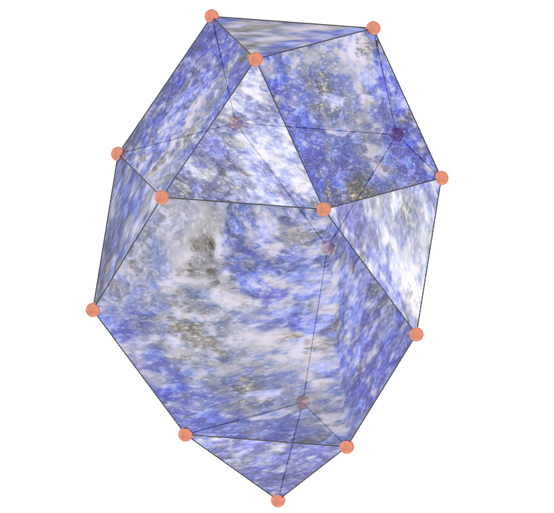 Diamond augmented truncated tetrahedron</a></td>
		<td></td>
		<td></td>
	</tr>
	<tr>
		<td class="titulo1"><a href="../diamonds/#m3d" target="_blank">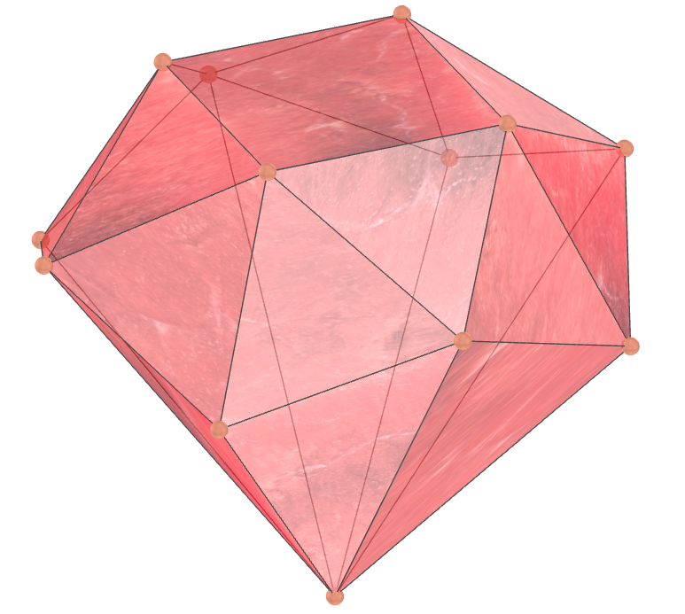 Diamond truncated snub square antiprism</a></td>
		<td></td>
		<td></td>
	</tr>
	<tr>
		<td class="titulo1"><a href="../diamonds/#m3d" target="_blank">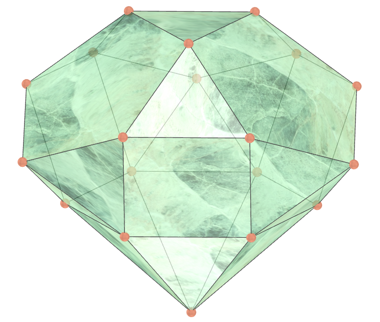 Diamond triangular hebesphenorotunda</a></td>
		<td></td>
		<td></td>
	</tr>
	<tr>
		<td class="titulo1"><a href="../diamonds/#m3d" target="_blank">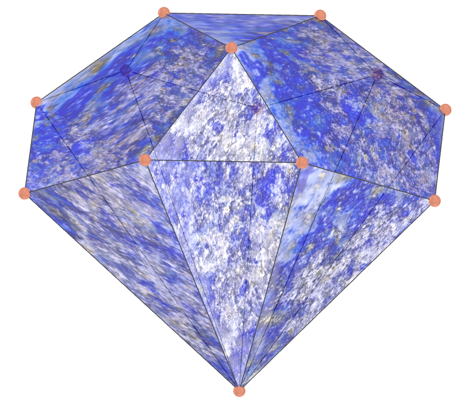 Diamond truncated triangular hebesphenorotunda v1</a></td>
		<td></td>
		<td></td>
	</tr>
	<tr>
		<td class="titulo1"><a href="../diamonds/#m3d" target="_blank"> Diamond truncated triangular hebesphenorotunda v2</a></td>
		<td></td>
		<td></td>
	</tr>
	<tr>
		<td class="titulo1"><a href="../diamonds/#m3d" target="_blank"> Diamond truncated dodecahedron</a></td>
		<td></td>
		<td></td>
		<td rowspan="10"></td>
	</tr>
	<tr>
		<td class="titulo1"><a href="../diamonds/#m3d" target="_blank"> Diamond truncated square pyramid</a></td>
		<td></td>
		<td></td>
	</tr>
	<tr>
		<td class="titulo1"><a href="../diamonds/#m3d" target="_blank">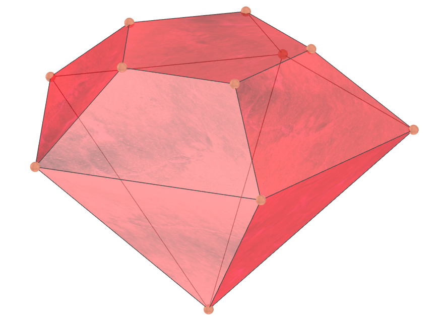 Diamond truncated pentagonal pyramid</a></td>
		<td></td>
		<td></td>
	</tr>
	<tr>
		<td class="titulo1"><a href="../diamonds/#m3d" target="_blank">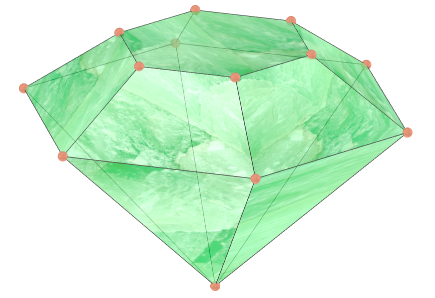 Diamond truncated hexagonal pyramid</a></td>
		<td></td>
		<td></td>
	</tr>
	<tr>
		<td class="titulo1"><a href="../diamonds/#m3d" target="_blank"> Diamond truncated heptagonal pyramid</a></td>
		<td></td>
		<td></td>
	</tr>
	<tr>
		<td class="titulo1"><a href="../diamonds/#m3d" target="_blank"> Diamond truncated octagonal pyramid</a></td>
		<td></td>
		<td></td>
	</tr>
	<tr>
		<td class="titulo1"><a href="../diamonds/#m3d" target="_blank">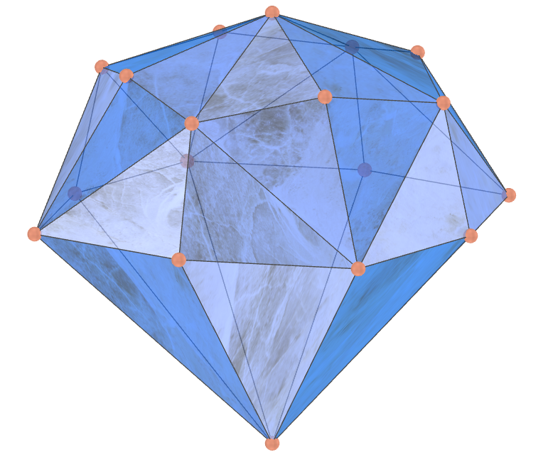 Diamond truncated disdyakis dodecahedron</a></td>
		<td></td>
		<td></td>
	</tr>
	<tr>
		<td class="titulo1"><a href="../diamonds/#m3d" target="_blank">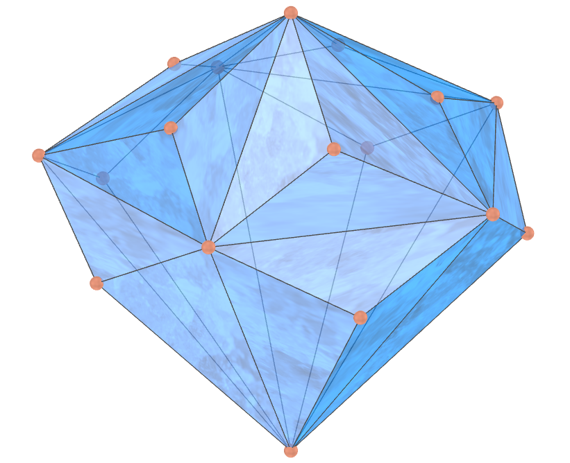 Diamond truncated triakis icosahedron</a></td>
		<td></td>
		<td></td>
	</tr>
	<tr>
		<td class="titulo1"><a href="../diamonds/#m3d" target="_blank">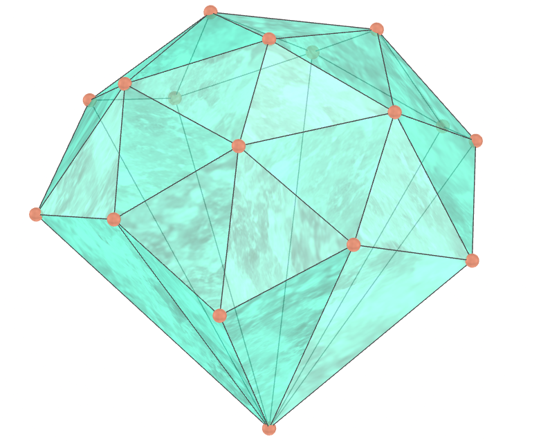 Diamond truncated pentakis dodecahedron</a></td>
		<td></td>
		<td></td>
	</tr>
	<tr>
		<td class="titulo1"><a href="../diamonds/#m3d" target="_blank">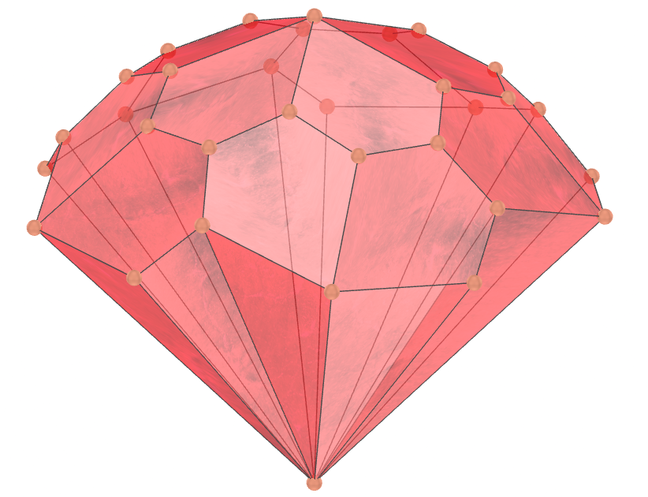 Diamond truncated pentagonal hexecontahedron</a></td>
		<td></td>
		<td></td>
	</tr>
</table>
<h3>Biscribed polyhedra</h3>
<table align="center">
	<tr>
		<th>Name</th>
		<th>3D model</th>
		<th>Video</th>
		<th>Immersive room</th>
	</tr>
	<tr>
		<td class="titulo1"><a href="../biscribed/#m3d" target="_blank"> Biscribed truncated octahedron</a></td>
		<td></td>
		<td></td>
		<td rowspan="13"></td>
	</tr>
	<tr>
		<td class="titulo1"><a href="../biscribed/#m3d" target="_blank">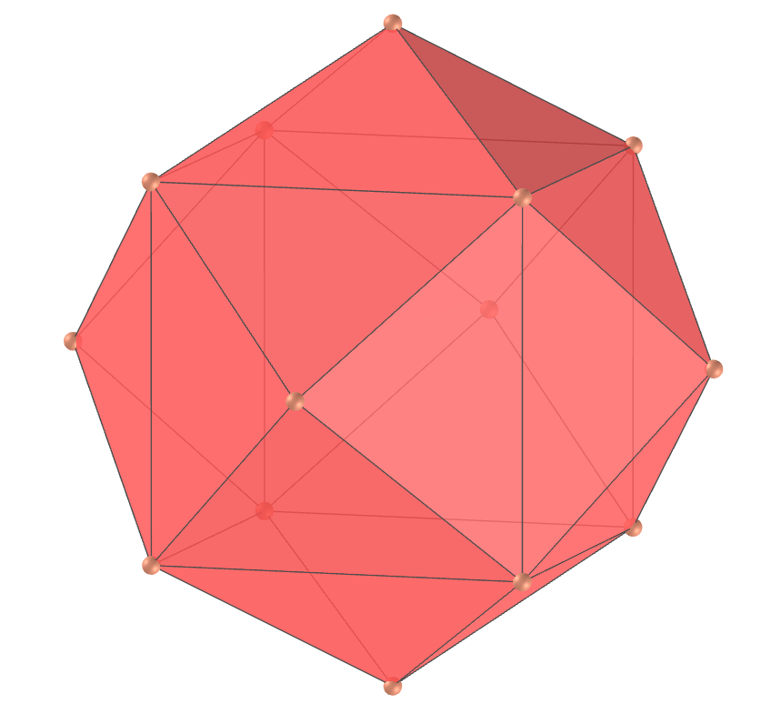 Biscribed tetrakis hexahedron</a></td>
		<td></td>
		<td></td>
	</tr>
	<tr>
		<td class="titulo1"><a href="../biscribed/#m3d" target="_blank">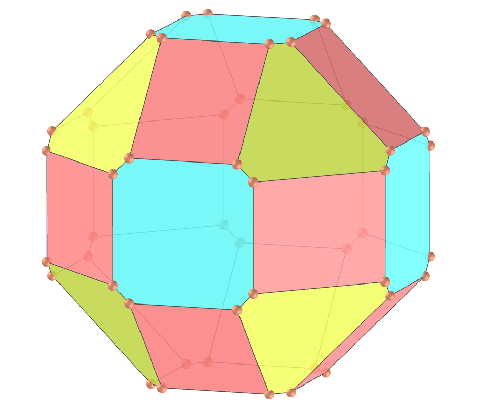 Biscribed truncated cuboctahedron</a></td>
		<td></td>
		<td></td>
	</tr>
	<tr>
		<td class="titulo1"><a href="../biscribed/#m3d" target="_blank">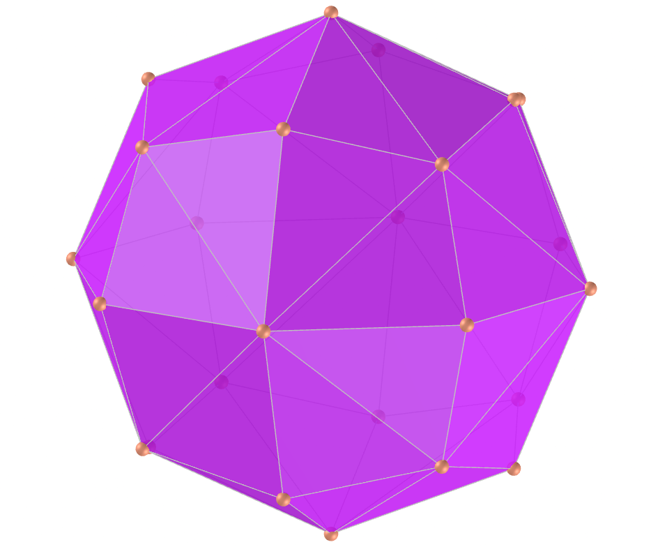 Biscribed disdyakis dodecahedron</a></td>
		<td></td>
		<td></td>
	</tr>
	<tr>
		<td class="titulo1"><a href="../biscribed/#m3d" target="_blank"> Biscribed truncated icosahedron</a></td>
		<td></td>
		<td></td>
	</tr>
	<tr>
		<td class="titulo1"><a href="../biscribed/#m3d" target="_blank">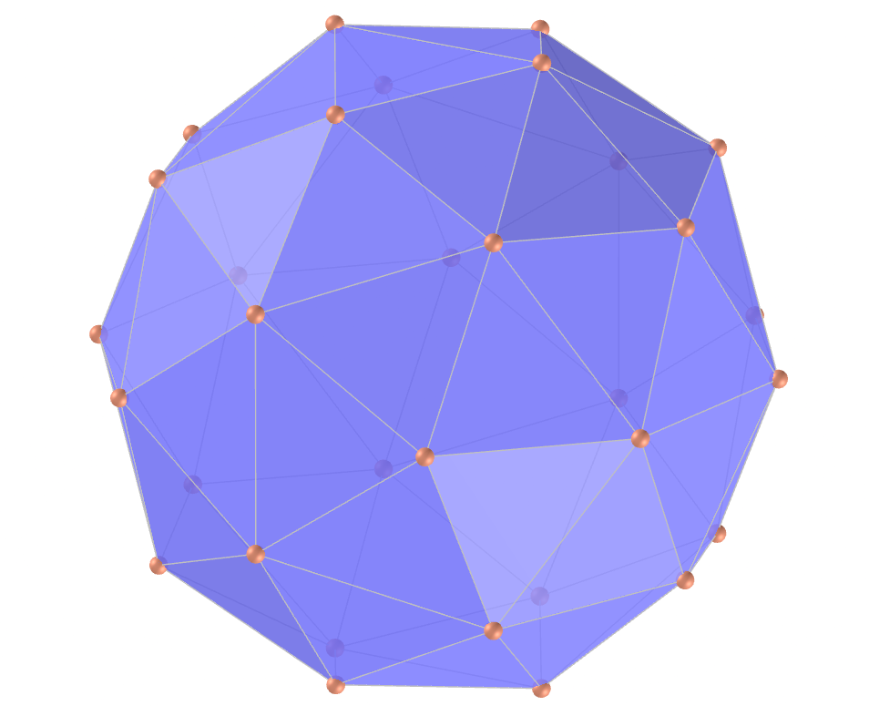 Biscribed pentakis dodecahedron</a></td>
		<td></td>
		<td></td>
	</tr>
	<tr>
		<td class="titulo1"><a href="../biscribed/#m3d" target="_blank"> Biscribed truncated icosidodecahedron</a></td>
		<td></td>
		<td></td>
	</tr>
	<tr>
		<td class="titulo1"><a href="../biscribed/#m3d" target="_blank"> Biscribed disdyakis triacontahedron</a></td>
		<td></td>
		<td></td>
	</tr>
	<tr>
		<td class="titulo1"><a href="../biscribed/#m3d" target="_blank">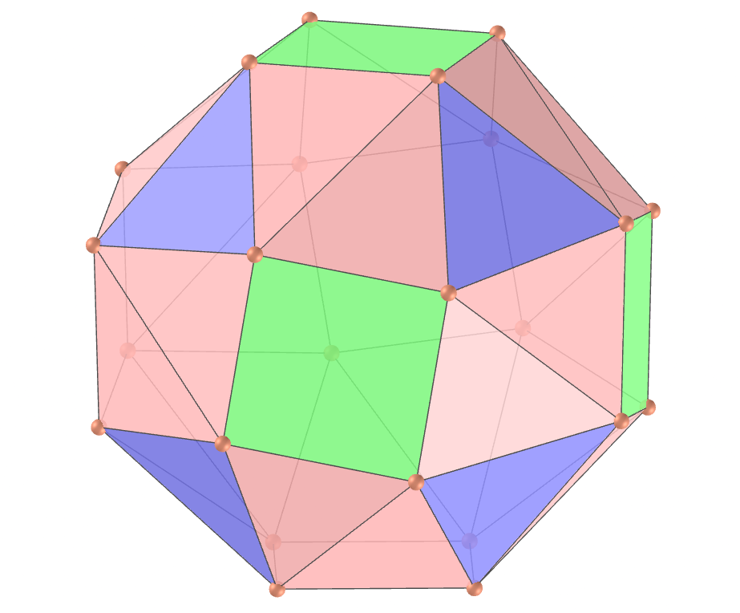 Biscribed snub cube</a></td>
		<td></td>
		<td></td>
	</tr>
	<tr>
		<td class="titulo1"><a href="../biscribed/#m3d" target="_blank"> Biscribed pentagonal icositetrahedron</a></td>
		<td></td>
		<td></td>
	</tr>
	<tr>
		<td class="titulo1"><a href="../biscribed/#m3d" target="_blank"> Biscribed snub dodecahedron</a></td>
		<td></td>
		<td></td>
	</tr>
	<tr>
		<td class="titulo1"><a href="../biscribed/#m3d" target="_blank"> Biscribed pentagonal hexecontahedron</a></td>
		<td></td>
		<td></td>
	</tr>
	<tr>
		<td class="titulo1"><a href="../biscribed/#m3d" target="_blank">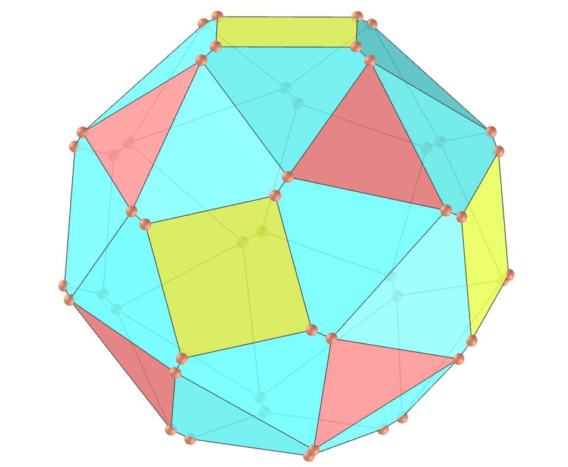 Biscribed orthotruncated propellor octahedron</a></td>
		<td></td>
		<td></td>
	</tr>
	<tr>
		<td class="titulo1"><a href="../biscribed/#m3d" target="_blank"> Biscribed orthokis propellor cube</a></td>
		<td></td>
		<td></td>
		<td rowspan="13"></td>
	</tr>
	<tr>
		<td class="titulo1"><a href="../biscribed/#m3d" target="_blank"> Biscribed orthotruncated propellor icosahedron</a></td>
		<td></td>
		<td></td>
	</tr>
	<tr>
		<td class="titulo1"><a href="../biscribed/#m3d" target="_blank"> Biscribed orthokis propellor dodecahedron</a></td>
		<td></td>
		<td></td>
	</tr>
	<tr>
		<td class="titulo1"><a href="../biscribed/#m3d" target="_blank">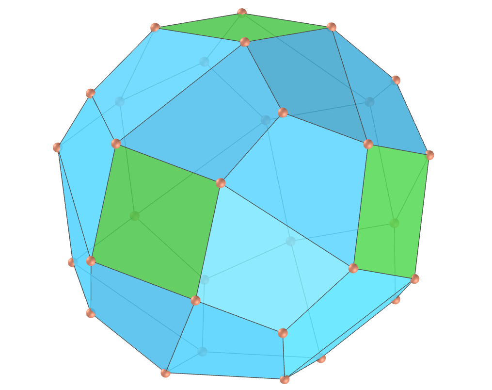 Biscribed propellor cube</a></td>
		<td></td>
		<td></td>
	</tr>
	<tr>
		<td class="titulo1"><a href="../biscribed/#m3d" target="_blank">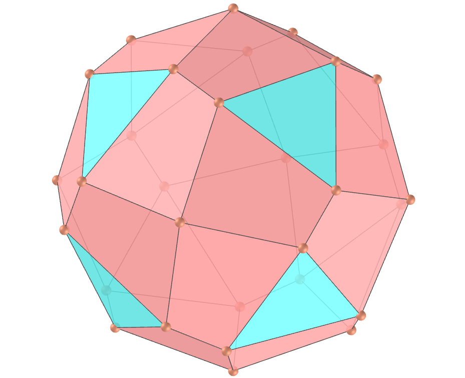 Biscribed propellor octahedron</a></td>
		<td></td>
		<td></td>
	</tr>
	<tr>
		<td class="titulo1"><a href="../biscribed/#m3d" target="_blank">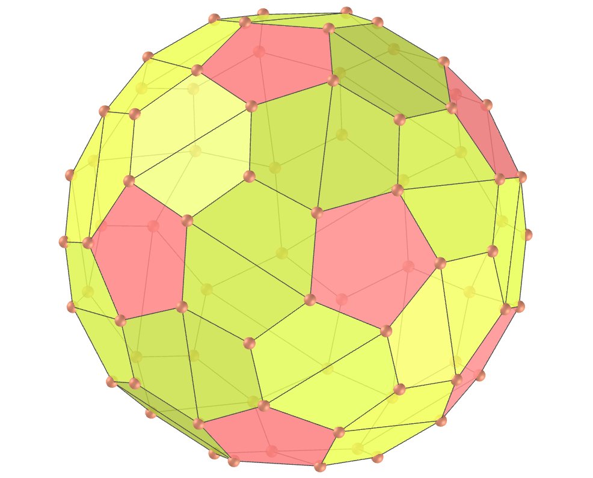 Biscribed propellor dodecahedron</a></td>
		<td></td>
		<td></td>
	</tr>
	<tr>
		<td class="titulo1"><a href="../biscribed/#m3d" target="_blank"> Biscribed propellor icosahedron</a></td>
		<td></td>
		<td></td>
	</tr>
	<tr>
		<td class="titulo1"><a href="../biscribed/#m3d" target="_blank">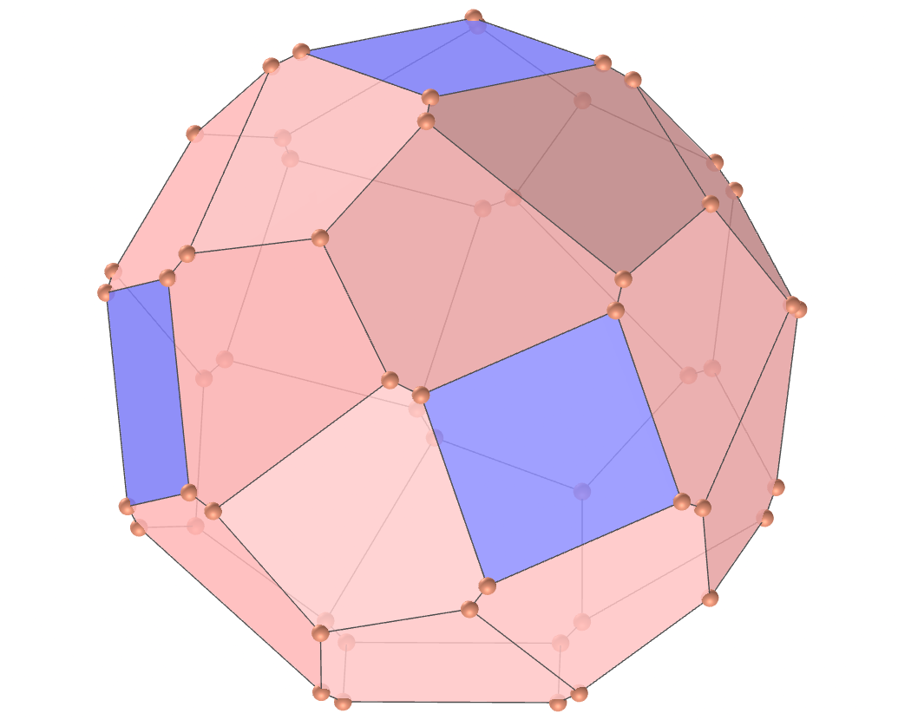 Biscribed hexpropellor cube</a></td>
		<td></td>
		<td></td>
	</tr>
	<tr>
		<td class="titulo1"><a href="../biscribed/#m3d" target="_blank"> Biscribed tetrakis snub cube</a></td>
		<td></td>
		<td></td>
	</tr>
	<tr>
		<td class="titulo1"><a href="../biscribed/#m3d" target="_blank"> Biscribed hexpropellor dodecahedron</a></td>
		<td></td>
		<td></td>
	</tr>
	<tr>
		<td class="titulo1"><a href="../biscribed/#m3d" target="_blank"> Biscribed pentakis snub dodecahedron</a></td>
		<td></td>
		<td></td>
	</tr>
	<tr>
		<td class="titulo1"><a href="../biscribed/#m3d" target="_blank"> Biscribed propellor truncated octahedron</a></td>
		<td></td>
		<td></td>
	</tr>
	<tr>
		<td class="titulo1"><a href="../biscribed/#m3d" target="_blank">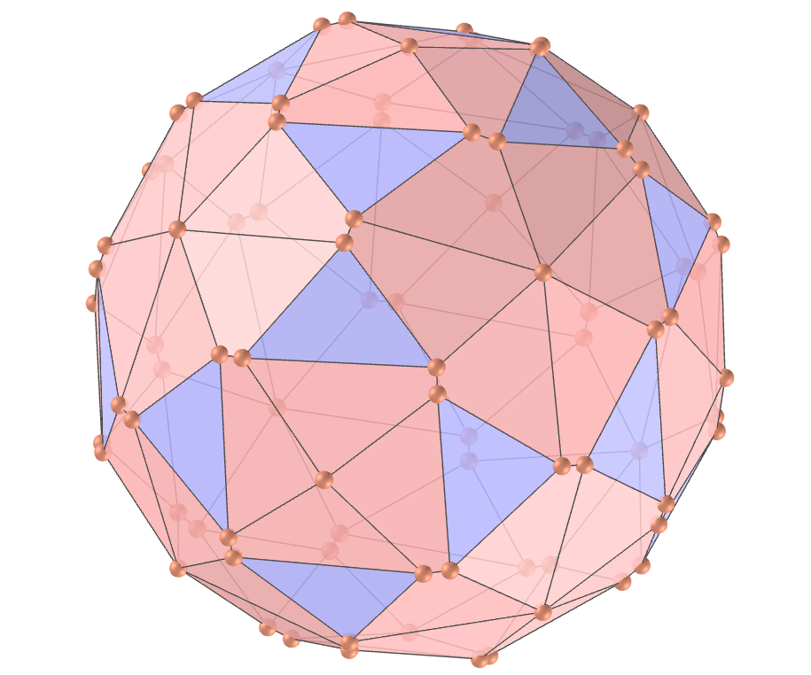 Biscribed propellor tetrakis hexahedron</a></td>
		<td></td>
		<td></td>
	</tr>
	<tr>
		<td class="titulo1"><a href="../biscribed/#m3d" target="_blank">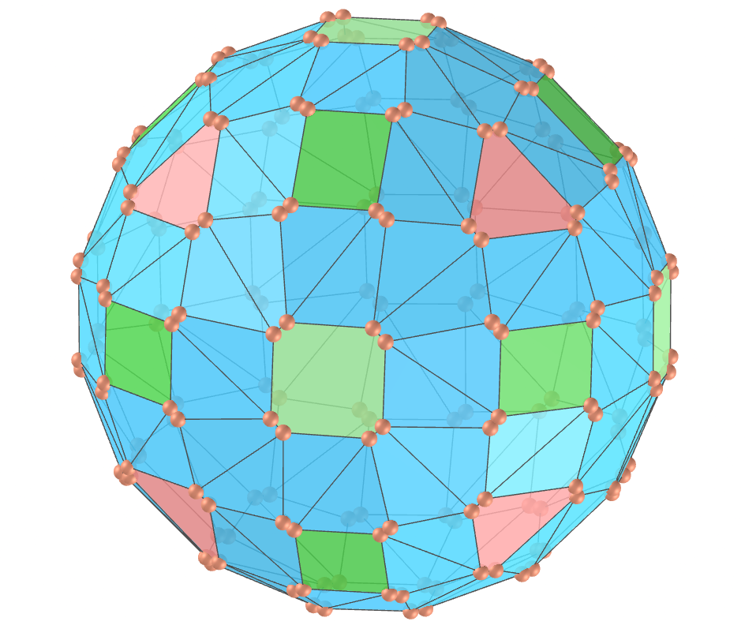 Biscribed propellor truncated cuboctahedron</a></td>
		<td></td>
		<td></td>
		<td rowspan="12"></td>
	</tr>
	<tr>
		<td class="titulo1"><a href="../biscribed/#m3d" target="_blank">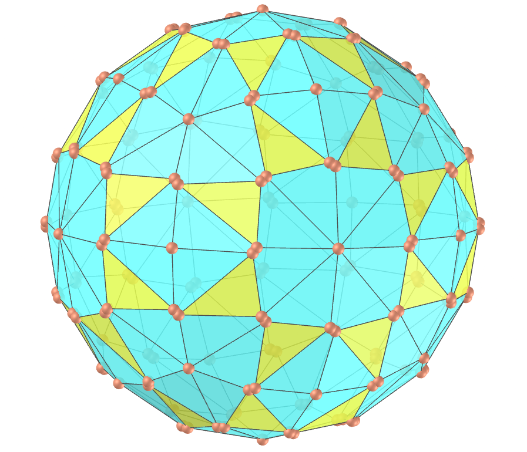 Biscribed propellor disdyakis dodecahedron</a></td>
		<td></td>
		<td></td>
	</tr>
	<tr>
		<td class="titulo1"><a href="../biscribed/#m3d" target="_blank"> Biscribed propellor truncated icosahedron</a></td>
		<td></td>
		<td></td>
	</tr>
	<tr>
		<td class="titulo1"><a href="../biscribed/#m3d" target="_blank"> Biscribed propellor pentakis dodecahedron</a></td>
		<td></td>
		<td></td>
	</tr>
	<tr>
		<td class="titulo1"><a href="../biscribed/#m3d" target="_blank"> Biscribed propellor truncated icosidodecahedron</a></td>
		<td></td>
		<td></td>
	</tr>
	<tr>
		<td class="titulo1"><a href="../biscribed/#m3d" target="_blank">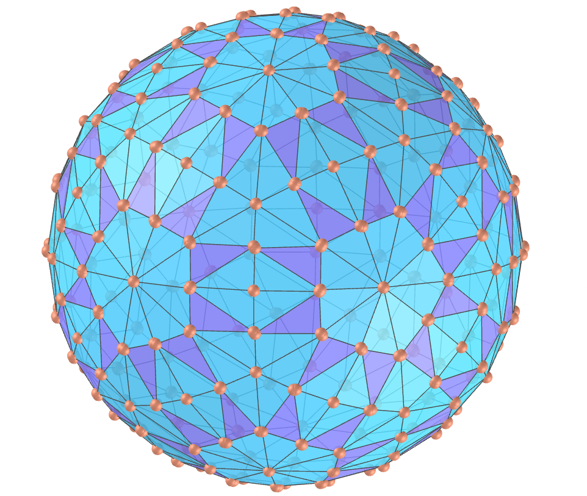 Biscribed propellor disdyakis triacontahedron</a></td>
		<td></td>
		<td></td>
	</tr>
	<tr>
		<td class="titulo1"><a href="../biscribed/#m3d" target="_blank"> Biscribed snub truncated octahedron</a></td>
		<td></td>
		<td></td>
	</tr>
	<tr>
		<td class="titulo1"><a href="../biscribed/#m3d" target="_blank"> Biscribed dual snub truncated octahedron</a></td>
		<td></td>
		<td></td>
	</tr>
	<tr>
		<td class="titulo1"><a href="../biscribed/#m3d" target="_blank"> Biscribed snub truncated icosahedron</a></td>
		<td></td>
		<td></td>
	</tr>
	<tr>
		<td class="titulo1"><a href="../biscribed/#m3d" target="_blank">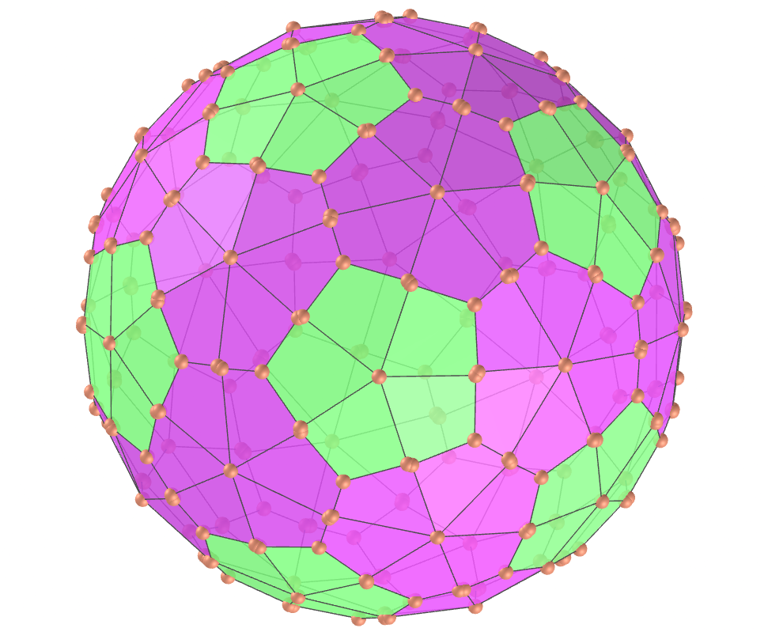 Biscribed dual snub truncated icosahedron</a></td>
		<td></td>
		<td></td>
	</tr>
	<tr>
		<td class="titulo1"><a href="../biscribed/#m3d" target="_blank"> Biscribed propellor snub cube</a></td>
		<td></td>
		<td></td>
	</tr>
	<tr>
		<td class="titulo1"><a href="../biscribed/#m3d" target="_blank">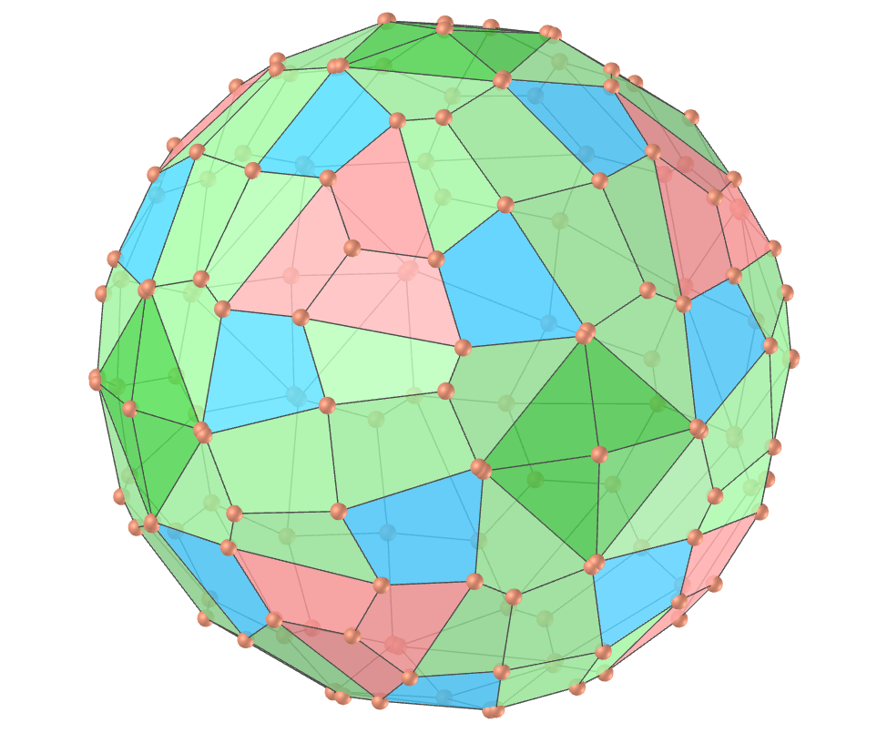 Biscribed propellor pentagonal icositetrahedron</a></td>
		<td></td>
		<td></td>
	</tr>
</table>

  Polyhedra 2: Visualization of polyhedra with Augmented Reality and Virtual Reality by <a xmlns:cc="http://creativecommons.org/ns#" href="https://paulohscwb.github.io/polyhedra2/" property="cc:attributionName" rel="cc:attributionURL">Paulo Henrique Siqueira</a> is licensed with a license <a rel="license" href="http://creativecommons.org/licenses/by-nc-nd/4.0/">Creative Commons Attribution-NonCommercial-NoDerivatives 4.0 International</a>.

<h4>How to cite this work:</h4> 

Siqueira, P.H., "Polyhedra 2: Visualization of polyhedra with Augmented Reality and Virtual Reality". Available in: <https://paulohscwb.github.io/polyhedra2/>, October 2023.

<!---->

 <b>References:</b>
 Weisstein, Eric W. "Archimedean Solid" From MathWorld-A Wolfram Web Resource. <a href="http://mathworld.wolfram.com/ArchimedeanSolid.html" target="_blank">http://mathworld.wolfram.com/ArchimedeanSolid.html</a>
 Weisstein, Eric W. "Platonic Solid" From MathWorld-A Wolfram Web Resource. <a href="http://mathworld.wolfram.com/PlatonicSolid.html" target="_blank">http://mathworld.wolfram.com/PlatonicSolid.html</a>
 Weisstein, Eric W. "Archimedean Dual" From MathWorld-A Wolfram Web Resource. <a href="https://mathworld.wolfram.com/ArchimedeanDual.html" target="_blank">https://mathworld.wolfram.com/ArchimedeanDual.html</a>
 Weisstein, Eric W. "Uniform Polyhedron." From MathWorld--A Wolfram Web Resource. <a href="https://mathworld.wolfram.com/UniformPolyhedron.html" target="_blank">https://mathworld.wolfram.com/UniformPolyhedron.html</a>
 Wikipedia <a href="https://en.wikipedia.org/wiki/Archimedean_solid" target="_blank">https://en.wikipedia.org/wiki/Archimedean_solid</a>
 Wikipedia <a href="https://en.wikipedia.org/wiki/en.wikipedia.org/wiki/Platonic_solid" target="_blank">https://en.wikipedia.org/wiki/Platonic_solid</a>
 McCooey, David I. "Visual Polyhedra". <a href="http://dmccooey.com/polyhedra/" target="_blank">http://dmccooey.com/polyhedra/</a>
