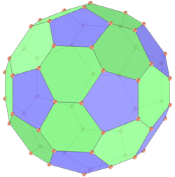
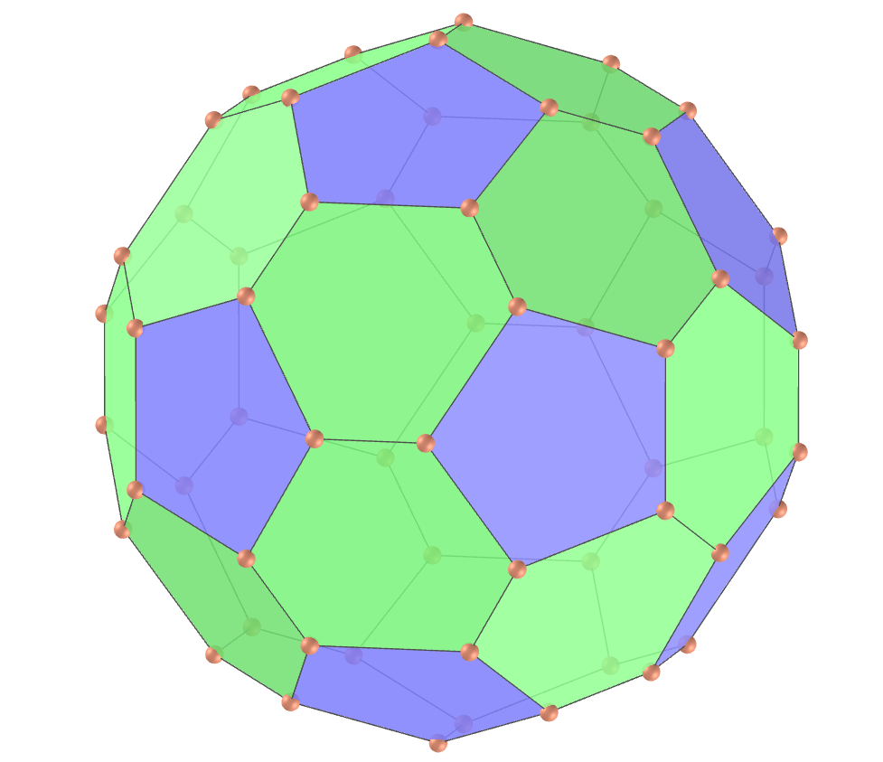

<link rel="stylesheet" href="../scripts/style.css">
<meta charset="utf-8">
<link rel="icon" type="image/png" href="vr/salas/imagens/icone.png">
<h2>Visualization of polyhedra with Augmented Reality (AR) and Virtual Reality (VR) in A-frame</h2>
 <b>author:</b> Paulo Henrique Siqueira - Universidade Federal do Paraná
  <b>contact:</b> <a href="#">paulohscwb@gmail.com</a>
  <a href="https://paulohscwb.github.io/polyhedra2/chamfered/pt-br/">versão em português</a>
 <form style="margin: 0 auto; float:right; text-align:right; width:100%; margin-bottom:15px;">
	<select id="url" onchange="urlHandler(this.value)" style="color:royalblue;">
		<option disabled selected value>More polyhedra:</option>
		<option value="../ArchimedeanCatalanHulls/">Archimedean and Catalan convex hulls</option>
		<option value="../fractalplatonic/">Platonic polyhedra fractals</option>
		<option value="../fractalnonconvex/">Non convex polyhedra fractals</option>
		<option value="../fractalarchimedean/">Archimedean polyhedra fractals</option>
		<option value="../chamfered/">Chamfered polyhedra</option>
		<option value="../propellor/">Propellor polyhedra</option>
		<option value="../diamonds/">Diamond polyhedra</option>
		<option disabled value="../biscribed/pt-br/">Biscribed polyhedra</option>
	</select>
</form>

  <h2 align="center"> Biscribed polyhedra</h2>
We define a biscribed polyhedron as any convex polyhedron that has circumscribed and inscribed concentric spheres, where the center of the sphere is also the centroid of the vertices and the centroid of the points of tangency of the faces.

<a href="#ra">Augmented Reality</a>&nbsp;&nbsp;|&nbsp;&nbsp;<a href="#m3d">3D Models</a>&nbsp;&nbsp;|&nbsp;&nbsp;<a href="../">Home</a>

  

 <h3 align="center">Immersive room</h3>
  
<iframe width="100%" src="sala.htm" title="Sala Imersiva dos Poliedros biscritos" frameborder="0" loading="lazy"></iframe>

  
<a href="sala.htm" target="_blank">&#x1f517; room link</a>
  
  

  <h3 id="ra" align="center">Augmented Reality</h3>
  To view biscribed polyhedra in AR, simply visit:

<a href="ra.html" class="raAR" target="_blank">https://paulohscwb.github.io/polyhedra2/biscribed/ra.html</a>
 
with any browser with a webcam device (smartphone, tablet or notebook). 
 Access to the VR sites is done by clicking on the blue circle that appears on top of the marker.

<h3 id="m3d" align="center">3D models</h3>
<!-- <iframe width="560" height="315" style="max-width:100%" src="https://www.youtube.com/embed/videoseries?list=PLy0I_lGW8HxXlieaiv7p0PWdsNRWPbWRv" title="YouTube video player" frameborder="0" allow="accelerometer; autoplay; clipboard-write; encrypted-media; gyroscope; picture-in-picture; web-share" allowfullscreen></iframe> -->
<h4>1. Biscribed truncated octahedron</h4>

    A biscript truncated octahedron has the shape of the truncated octahedron, one of the Archimedean polyhedra, but does not have the regular hexagons. It is the dual solid of the biscript tetrakis hexahedron.
    <b>Faces:</b> 6 squares and 8 ditrigons | <b>Edges:</b> 36 | <b>Vertices:</b> 24. <a href="http://dmccooey.com/polyhedra/BiscribedNonChiral.html" target="_blank">More...</a>
 

<h4>2. Biscribed tetrakis hexahedron</h4>

    A biscript tetrakis hexahedron has the shape of the tetrakis hexahedron, one of the Catalan polyhedra, but the edge measurements are different. It is the dual solid of the biscript truncated octahedron.
    <b>Faces:</b> 24 isosceles triangles | <b>Edges:</b> 36 | <b>Vertices:</b> 14. <a href="http://dmccooey.com/polyhedra/BiscribedNonChiral.html" target="_blank">More...</a>
 

<h4>3. Biscribed truncated cuboctahedron</h4>

    A biscript truncated cuboctahedron has the shape of the truncated cuboctahedron, one of the Archimedean polyhedra, but does not have the regular faces. It is the dual solid of the biscribed disdyakis dodecahedron.
    <b>Faces:</b> 12 rectangles, 8 ditrigons and 6 ditetragons | <b>Edges:</b> 72 | <b>Vertices:</b> 48. <a href="http://dmccooey.com/polyhedra/BiscribedNonChiral.html" target="_blank">More...</a>
 

<h4>4. Biscribed disdyakis dodecahedron</h4>

    A biscript disdyakis dodecahedron has the shape of the disdyakis dodecahedron, one of the Catalan polyhedra, but the edge measurements are different. It is the dual solid of the biscript truncated cuboctahedron.
    <b>Faces:</b> 48 acute triangles | <b>Edges:</b> 72 | <b>Vertices:</b> 26. <a href="http://dmccooey.com/polyhedra/BiscribedNonChiral.html" target="_blank">More...</a>
 

<h4>5. Biscribed truncated icosahedron</h4>

    A biscript truncated icosahedron has the shape of the truncated icosahedron, one of the Archimedean polyhedra, but does not have the regular hexagons. It is the dual solid of the biscribed pentakis dodecahedron.
    <b>Faces:</b> 12 regular pentagons and 20 ditrigons | <b>Edges:</b> 90 | <b>Vertices:</b> 60. <a href="http://dmccooey.com/polyhedra/BiscribedNonChiral.html" target="_blank">More...</a>
 

<h4>6. Biscribed pentakis dodecahedron</h4>

    A biscribed pentakis dodecahedron has the shape of the pentakis dodecahedron, one of the Catalan polyhedra, but the edge measurements are different. It is the dual solid of the biscript truncated icosahedron.
    <b>Faces:</b> 60 isosceles triangles | <b>Edges:</b> 90 | <b>Vertices:</b> 32. <a href="http://dmccooey.com/polyhedra/BiscribedNonChiral.html" target="_blank">More...</a>
 

<h4>7. Biscribed truncated icosidodecahedron</h4>

    A biscript truncated icosidodecahedron has the shape of the truncated icosidodecahedron, one of the Archimedean polyhedra, but does not have the regular faces. It is the dual solid of the biscribed disdyakis triacontahedron.
    <b>Faces:</b> 30 rectangles, 20 ditrigons and 12 dipentagons | <b>Edges:</b> 180 | <b>Vertices:</b> 120. <a href="http://dmccooey.com/polyhedra/BiscribedNonChiral.html" target="_blank">More...</a>
 
 

<h4>8. Biscribed disdyakis triacontahedron</h4>

    A biscribed disdyakis triacontahedron has the shape of the disdyakis triacontahedron, one of the Catalan polyhedra, but the edge measurements are different. It is the dual solid of the biscript truncated icosidodecahedron.
    <b>Faces:</b> 120 acute triangles | <b>Edges:</b> 180 | <b>Vertices:</b> 62. <a href="http://dmccooey.com/polyhedra/BiscribedNonChiral.html" target="_blank">More...</a>
 

<a href="#p1" class="topo">back to top</a>

  Chamfered polyhedra - Visualization of polyhedra with Augmented Reality and Virtual Reality by <a xmlns:cc="http://creativecommons.org/ns#" href="https://paulohscwb.github.io/polyhedra2/chamfered/" property="cc:attributionName" rel="cc:attributionURL">Paulo Henrique Siqueira</a> is licensed with a license <a rel="license" href="http://creativecommons.org/licenses/by-nc-nd/4.0/">Creative Commons Attribution-NonCommercial-NoDerivatives 4.0 International</a>.

<h4>How to cite this work:</h4> 

Siqueira, P.H., "Chamfered polyhedra - Visualization of polyhedra with Augmented Reality and Virtual Reality". Available in: <https://paulohscwb.github.io/polyhedra2/chamfered/>, November 2023.

<!---->
  <b>References:</b>
 Weisstein, Eric W. "Archimedean Solid" From MathWorld-A Wolfram Web Resource. <a href="http://mathworld.wolfram.com/ArchimedeanSolid.html" target="_blank">http://mathworld.wolfram.com/ArchimedeanSolid.html</a>
 Weisstein, Eric W. "Platonic Solid" From MathWorld-A Wolfram Web Resource. <a href="http://mathworld.wolfram.com/PlatonicSolid.html" target="_blank">http://mathworld.wolfram.com/PlatonicSolid.html</a>
 Weisstein, Eric W. "Archimedean Dual" From MathWorld-A Wolfram Web Resource. <a href="https://mathworld.wolfram.com/ArchimedeanDual.html" target="_blank">https://mathworld.wolfram.com/ArchimedeanDual.html</a>
 Weisstein, Eric W. "Uniform Polyhedron." From MathWorld--A Wolfram Web Resource. <a href="https://mathworld.wolfram.com/UniformPolyhedron.html" target="_blank">https://mathworld.wolfram.com/UniformPolyhedron.html</a>
 Wikipedia <a href="https://en.wikipedia.org/wiki/Archimedean_solid" target="_blank">https://en.wikipedia.org/wiki/Archimedean_solid</a>
 Wikipedia <a href="https://en.wikipedia.org/wiki/en.wikipedia.org/wiki/Platonic_solid" target="_blank">https://en.wikipedia.org/wiki/Platonic_solid</a>
 McCooey, David I. "Visual Polyhedra". <a href="http://dmccooey.com/polyhedra/" target="_blank">http://dmccooey.com/polyhedra/</a>
