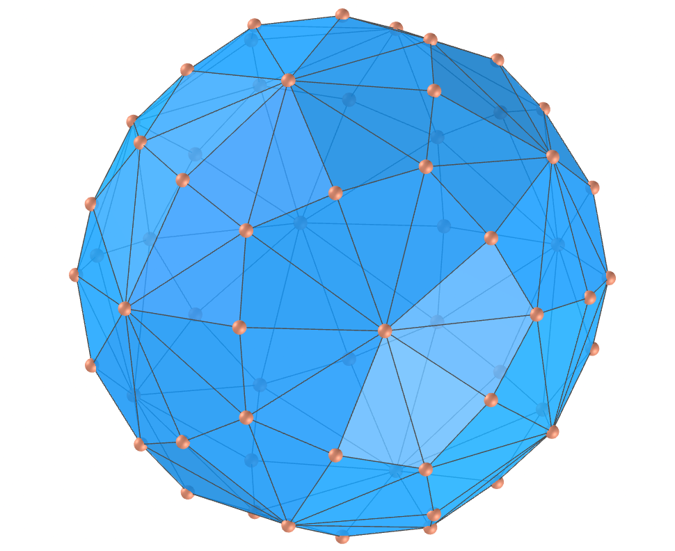
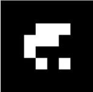

<link rel="stylesheet" href="../scripts/style.css">
<meta charset="utf-8">
<link rel="icon" type="image/png" href="vr/salas/imagens/icone.png">
<h2>Visualization of polyhedra with Augmented Reality (AR) and Virtual Reality (VR) in A-frame</h2>
 <b>author:</b> Paulo Henrique Siqueira - Universidade Federal do Paraná
  <b>contact:</b> <a href="#">paulohscwb@gmail.com</a>
  <a href="https://paulohscwb.github.io/polyhedra2/biscribed/pt-br/">versão em português</a>
 <form style="margin: 0 auto; float:right; text-align:right; width:100%; margin-bottom:15px;">
	<select id="url" onchange="urlHandler(this.value)" style="color:royalblue;">
		<option disabled selected value>More polyhedra:</option>
		<option value="../ArchimedeanCatalanHulls/">Archimedean and Catalan convex hulls</option>
		<option value="../fractalplatonic/">Platonic polyhedra fractals</option>
		<option value="../fractalnonconvex/">Non convex polyhedra fractals</option>
		<option value="../fractalarchimedean/">Archimedean polyhedra fractals</option>
		<option value="../chamfered/">Chamfered polyhedra</option>
		<option value="../propellor/">Propellor polyhedra</option>
		<option value="../diamonds/">Diamond polyhedra</option>
		<option disabled value="../biscribed/pt-br/">Biscribed polyhedra</option>
	</select>
</form>

  <h2 align="center"> Biscribed polyhedra</h2>
We define a biscribed polyhedron as any convex polyhedron that has circumscribed and inscribed concentric spheres, where the center of the sphere is also the centroid of the vertices and the centroid of the points of tangency of the faces.

<a href="#ra">Augmented Reality</a>&nbsp;&nbsp;|&nbsp;&nbsp;<a href="#m3d">3D Models</a>&nbsp;&nbsp;|&nbsp;&nbsp;<a href="../">Home</a>

  

 <h3 align="center">Immersive room</h3>
  
<iframe width="100%" src="sala.htm" title="Sala Imersiva dos Poliedros biscritos" frameborder="0" loading="lazy"></iframe>

  
<a href="sala.htm" target="_blank">&#x1f517; room link</a>
  
  

  <h3 id="ra" align="center">Augmented Reality</h3>
  To view biscribed polyhedra in AR, simply visit:

<a href="ra.html" class="raAR" target="_blank">https://paulohscwb.github.io/polyhedra2/biscribed/ra.html</a>
 
with any browser with a webcam device (smartphone, tablet or notebook). 
 Access to the VR sites is done by clicking on the blue circle that appears on top of the marker.

<h3 id="m3d" align="center">3D models</h3>
<!-- <iframe width="560" height="315" style="max-width:100%" src="https://www.youtube.com/embed/videoseries?list=PLy0I_lGW8HxXlieaiv7p0PWdsNRWPbWRv" title="YouTube video player" frameborder="0" allow="accelerometer; autoplay; clipboard-write; encrypted-media; gyroscope; picture-in-picture; web-share" allowfullscreen></iframe> -->
<h4>1. Biscribed truncated octahedron</h4>

    A biscribed truncated octahedron has the shape of the truncated octahedron, one of the Archimedean polyhedra, but does not have the regular hexagons. It is the dual solid of the biscribed tetrakis hexahedron.
    <b>Faces:</b> 6 squares and 8 ditrigons | <b>Edges:</b> 36 | <b>Vertices:</b> 24. <a href="http://dmccooey.com/polyhedra/BiscribedNonChiral.html" target="_blank">More...</a>
 

<h4>2. Biscribed tetrakis hexahedron</h4>

    A biscribed tetrakis hexahedron has the shape of the tetrakis hexahedron, one of the Catalan polyhedra, but the edge measurements are different. It is the dual solid of the biscribed truncated octahedron.
    <b>Faces:</b> 24 isosceles triangles | <b>Edges:</b> 36 | <b>Vertices:</b> 14. <a href="http://dmccooey.com/polyhedra/BiscribedNonChiral.html" target="_blank">More...</a>
 

<h4>3. Biscribed truncated cuboctahedron</h4>

    A biscribed truncated cuboctahedron has the shape of the truncated cuboctahedron, one of the Archimedean polyhedra, but does not have the regular faces. It is the dual solid of the biscribed disdyakis dodecahedron.
    <b>Faces:</b> 12 rectangles, 8 ditrigons and 6 ditetragons | <b>Edges:</b> 72 | <b>Vertices:</b> 48. <a href="http://dmccooey.com/polyhedra/BiscribedNonChiral.html" target="_blank">More...</a>
 

<h4>4. Biscribed disdyakis dodecahedron</h4>

    A biscribed disdyakis dodecahedron has the shape of the disdyakis dodecahedron, one of the Catalan polyhedra, but the edge measurements are different. It is the dual solid of the biscribed truncated cuboctahedron.
    <b>Faces:</b> 48 acute triangles | <b>Edges:</b> 72 | <b>Vertices:</b> 26. <a href="http://dmccooey.com/polyhedra/BiscribedNonChiral.html" target="_blank">More...</a>
 

<h4>5. Biscribed truncated icosahedron</h4>

    A biscribed truncated icosahedron has the shape of the truncated icosahedron, one of the Archimedean polyhedra, but does not have the regular hexagons. It is the dual solid of the biscribed pentakis dodecahedron.
    <b>Faces:</b> 12 regular pentagons and 20 ditrigons | <b>Edges:</b> 90 | <b>Vertices:</b> 60. <a href="http://dmccooey.com/polyhedra/BiscribedNonChiral.html" target="_blank">More...</a>
 

<h4>6. Biscribed pentakis dodecahedron</h4>

    A biscribed pentakis dodecahedron has the shape of the pentakis dodecahedron, one of the Catalan polyhedra, but the edge measurements are different. It is the dual solid of the biscribed truncated icosahedron.
    <b>Faces:</b> 60 isosceles triangles | <b>Edges:</b> 90 | <b>Vertices:</b> 32. <a href="http://dmccooey.com/polyhedra/BiscribedNonChiral.html" target="_blank">More...</a>
 

<h4>7. Biscribed truncated icosidodecahedron</h4>

    A biscribed truncated icosidodecahedron has the shape of the truncated icosidodecahedron, one of the Archimedean polyhedra, but does not have the regular faces. It is the dual solid of the biscribed disdyakis triacontahedron.
    <b>Faces:</b> 30 rectangles, 20 ditrigons and 12 dipentagons | <b>Edges:</b> 180 | <b>Vertices:</b> 120. <a href="http://dmccooey.com/polyhedra/BiscribedNonChiral.html" target="_blank">More...</a>
 
 

<h4>8. Biscribed disdyakis triacontahedron</h4>

    A biscribed disdyakis triacontahedron has the shape of the disdyakis triacontahedron, one of the Catalan polyhedra, but the edge measurements are different. It is the dual solid of the biscribed truncated icosidodecahedron.
    <b>Faces:</b> 120 acute triangles | <b>Edges:</b> 180 | <b>Vertices:</b> 62. <a href="http://dmccooey.com/polyhedra/BiscribedNonChiral.html" target="_blank">More...</a>
 
 

<h4>9. Biscribed snub cube</h4>

    A biscribed snub cube has the shape of the snub cube, one of the Archimedean polyhedra, but the edge measurements are different. It is the dual solid of the biscribed pentagonal icositetrahedron.
    <b>Faces:</b> 8 equilateral triangles, 24 acute triangles and 6 squares | <b>Edges:</b> 60 | <b>Vertices:</b> 24. <a href="http://dmccooey.com/polyhedra/BiscribedChiral.html" target="_blank">More...</a>
 
 

<h4>10. Biscribed pentagonal icositetrahedron</h4>

    A biscribed pentagonal icositetrahedron has the shape of the pentagonal icositetrahedron, one of the Catalan polyhedra, but the edge measurements are different. It is the dual solid of the biscribed snub cube.
    <b>Faces:</b> 24 irregular pentagons | <b>Edges:</b> 60 | <b>Vertices:</b> 38. <a href="http://dmccooey.com/polyhedra/BiscribedChiral.html" target="_blank">More...</a>
 

<a href="#p1" class="topo">back to top</a>

<h4>11. Biscribed snub dodecahedron</h4>

    A biscribed snub dodecahedron has the shape of the snub dodecahedron, one of the Archimedean polyhedra, but the edge measurements are different. It is the dual solid of the biscribed pentagonal hexecontahedron.
    <b>Faces:</b> 20 equilateral triangles, 60 acute triangles and 12 regular pentagons | <b>Edges:</b> 150 | <b>Vertices:</b> 60. <a href="http://dmccooey.com/polyhedra/BiscribedChiral.html" target="_blank">More...</a>
 
 

<h4>12. Biscribed pentagonal hexecontahedron</h4>

    A biscribed pentagonal hexecontahedron has the shape of the pentagonal hexecontahedron, one of the Catalan polyhedra, but the edge measurements are different. It is the dual solid of the biscribed snub dodecahedron.
    <b>Faces:</b> 60 irregular pentagons | <b>Edges:</b> 150 | <b>Vertices:</b> 92. <a href="http://dmccooey.com/polyhedra/BiscribedChiral.html" target="_blank">More...</a>
 
 

<h4>13. Biscribed orthotruncated propellor octahedron</h4>

    A biscribed orthotruncated propellor octahedron has the shape of the orthotruncated propellor octahedron, but the edge measurements are different. It is the dual solid of the biscribed orthokis propellor cube.
    <b>Faces:</b> 8 equilateral triangles, 6 squares and 24 irregular pentagons | <b>Edges:</b> 84 | <b>Vertices:</b> 48. <a href="http://dmccooey.com/polyhedra/BiscribedChiral.html" target="_blank">More...</a>
 
 

<h4>14. Biscribed orthokis propellor cube</h4>

    A biscribed orthokis propellor cube has the shape of the orthokis propellor cube, but the edge measurements are different. It is the dual solid of the biscribed orthotruncated propellor octahedron.
    <b>Faces:</b> 24 isosceles triangles and 24 irregular tetragons | <b>Edges:</b> 84 | <b>Vertices:</b> 38. <a href="http://dmccooey.com/polyhedra/BiscribedChiral.html" target="_blank">More...</a>
 
 

<h4>15. Biscribed orthotruncated propellor icosahedron</h4>

    A biscribed orthotruncated propellor icosahedron has the shape of the orthotruncated propellor icosahedron, but the edge measurements are different. It is the dual solid of the biscribed orthokis propellor dodecahedron.
    <b>Faces:</b> 20 equilateral triangles, 60 irregular pentagons and 12 regular pentagons | <b>Edges:</b> 210 | <b>Vertices:</b> 120. <a href="http://dmccooey.com/polyhedra/BiscribedChiral.html" target="_blank">More...</a>
 
 

<h4>16. Biscribed orthokis propellor dodecahedron</h4>

    A biscribed orthokis propellor dodecahedron has the shape of the orthokis propellor dodecahedron, but the edge measurements are different. It is the dual solid of the biscribed orthotruncated propellor icosahedron.
    <b>Faces:</b> 60 isosceles triangles and 60 irregular tetragons | <b>Edges:</b> 210 | <b>Vertices:</b> 92. <a href="http://dmccooey.com/polyhedra/BiscribedChiral.html" target="_blank">More...</a>
 
 

<h4>17. Biscribed propellor cube</h4>

    A biscribed propellor cube has the shape of the propellor cube, but the edge measurements are different. It is the dual solid of the biscribed propellor octahedron.
    <b>Faces:</b> 6 squares and 24 irregular tetragons | <b>Edges:</b> 60 | <b>Vertices:</b> 32. <a href="http://dmccooey.com/polyhedra/BiscribedChiral.html" target="_blank">More...</a>
 
 

<h4>18. Biscribed propellor octahedron</h4>

    A biscribed propellor octahedron has the shape of the propellor octahedron, but the edge measurements are different. It is the dual solid of the biscribed propellor cube.
    <b>Faces:</b> 8 equilateral triangles and 24 irregular tetragons | <b>Edges:</b> 60 | <b>Vertices:</b> 30. <a href="http://dmccooey.com/polyhedra/BiscribedChiral.html" target="_blank">More...</a>
 
 

<h4>19. Biscribed propellor dodecahedron</h4>

    A biscribed propellor dodecahedron has the shape of the propellor dodecahedron, but the edge measurements are different. It is the dual solid of the biscribed propellor icosahedron.
    <b>Faces:</b> 12 regular pentagons and 60 irregular tetragons | <b>Edges:</b> 150 | <b>Vertices:</b> 80. <a href="http://dmccooey.com/polyhedra/BiscribedChiral.html" target="_blank">More...</a>
 
 

<h4>20. Biscribed propellor icosahedron</h4>

    A biscribed propellor icosahedron has the shape of the propellor icosahedron, but the edge measurements are different. It is the dual solid of the biscribed propellor dodecahedron.
    <b>Faces:</b> 20 equilateral triangles and 60 irregular tetragons | <b>Edges:</b> 150 | <b>Vertices:</b> 72. <a href="http://dmccooey.com/polyhedra/BiscribedChiral.html" target="_blank">More...</a>
 

<a href="#p1" class="topo">back to top</a>

<h4>21. Biscribed hexpropellor cube</h4>

    A biscribed hexpropellor cube has the shape of the hexpropellor cube, but the edge measurements are different. It is the dual solid of the biscribed tetrakis snub cube.
    <b>Faces:</b> 6 squares and 24 irregular hexagons | <b>Edges:</b> 84 | <b>Vertices:</b> 56. <a href="http://dmccooey.com/polyhedra/BiscribedChiral.html" target="_blank">More...</a>
 
 

<h4>22. Biscribed tetrakis snub cube</h4>

    A biscribed tetrakis snub cube has the shape of the tetrakis snub cube, but the edge measurements are different. It is the dual solid of the biscribed hexpropellor cube.
    <b>Faces:</b> 8 equilateral triangles, 24 isosceles triangles and 24 acute triangles | <b>Edges:</b> 84 | <b>Vertices:</b> 30. <a href="http://dmccooey.com/polyhedra/BiscribedChiral.html" target="_blank">More...</a>
 
 

<h4>23. Biscribed hexpropellor dodecahedron</h4>

    A biscribed hexpropellor dodecahedron has the shape of the hexpropellor dodecahedron, but the edge measurements are different. It is the dual solid of the biscribed pentakis snub dodecahedron.
    <b>Faces:</b> 12 regular pentagons and 60 irregular hexagons | <b>Edges:</b> 210 | <b>Vertices:</b> 140. <a href="http://dmccooey.com/polyhedra/BiscribedChiral.html" target="_blank">More...</a>
 
 

<h4>24. Biscribed pentakis snub dodecahedron</h4>

    A biscribed pentakis snub dodecahedron has the shape of the pentakis snub dodecahedron, but the edge measurements are different. It is the dual solid of the biscribed hexpropellor dodecahedron.
    <b>Faces:</b> 20 equilateral triangles, 60 isosceles triangles and 60 acute triangles | <b>Edges:</b> 210 | <b>Vertices:</b> 72. <a href="http://dmccooey.com/polyhedra/BiscribedChiral.html" target="_blank">More...</a>
 
 

<h4>25. Biscribed propellor truncated octahedron</h4>

    A biscribed propellor truncated octahedron has the shape of the propellor truncated octahedron, but the edge measurements are different. It is the dual solid of the biscribed propellor tetrakis hexahedron.
    <b>Faces:</b> 6 squares, 72 irregular tetragons and 8 ditrigons | <b>Edges:</b> 180 | <b>Vertices:</b> 96. <a href="http://dmccooey.com/polyhedra/BiscribedChiral.html" target="_blank">More...</a>
 
 

<h4>26. Biscribed propellor tetrakis hexahedron</h4>

    A biscribed propellor tetrakis hexahedron has the shape of the propellor tetrakis hexahedron, but the edge measurements are different. It is the dual solid of the biscribed propellor truncated octahedron.
    <b>Faces:</b> 24 acute triangles and 72 irregular tetragons | <b>Edges:</b> 180 | <b>Vertices:</b> 86. <a href="http://dmccooey.com/polyhedra/BiscribedChiral.html" target="_blank">More...</a>
 
 

<h4>27. Biscribed propellor truncated cuboctahedron</h4>

    A biscribed propellor truncated cuboctahedron has the shape of the propellor truncated cuboctahedron, but the edge measurements are different. It is the dual solid of the biscribed propellor disdyakis dodecahedron.
    <b>Faces:</b> 12 rectangles, 144 irregular tetragons, 8 ditrigons and 6 ditetragons | <b>Edges:</b> 360 | <b>Vertices:</b> 192. <a href="http://dmccooey.com/polyhedra/BiscribedChiral.html" target="_blank">More...</a>
 
 

<h4>28. Biscribed propellor disdyakis dodecahedron</h4>

    A biscribed propellor disdyakis dodecahedron has the shape of the propellor disdyakis dodecahedron, but the edge measurements are different. It is the dual solid of the biscribed propellor truncated cuboctahedron.
    <b>Faces:</b> 48 acute triangles and 144 irregular tetragons | <b>Edges:</b> 360 | <b>Vertices:</b> 170. <a href="http://dmccooey.com/polyhedra/BiscribedChiral.html" target="_blank">More...</a>
 
  

<h4>29. Biscribed propellor truncated icosahedron</h4>

    A biscribed propellor truncated icosahedron has the shape of the propellor truncated icosahedron, but the edge measurements are different. It is the dual solid of the biscribed propellor pentakis dodecahedron.
    <b>Faces:</b> 180 irregular tetragons, 12 regular pentagons and 20 ditrigons | <b>Edges:</b> 450 | <b>Vertices:</b> 240. <a href="http://dmccooey.com/polyhedra/BiscribedChiral.html" target="_blank">More...</a>
 
 

<h4>30. Biscribed propellor pentakis dodecahedron</h4>

    A biscribed propellor pentakis dodecahedron has the shape of the propellor pentakis dodecahedron, but the edge measurements are different. It is the dual solid of the biscribed propellor truncated icosahedron.
    <b>Faces:</b> 180 irregular tetragons and 60 acute triangles | <b>Edges:</b> 450 | <b>Vertices:</b> 212. <a href="http://dmccooey.com/polyhedra/BiscribedChiral.html" target="_blank">More...</a>
 

<a href="#p1" class="topo">back to top</a>

<h4>31. Biscribed propellor truncated icosidodecahedron</h4>

    A biscribed propellor truncated icosidodecahedron has the shape of the propellor truncated icosidodecahedron, but the edge measurements are different. It is the dual solid of the biscribed propellor disdyakis triacontahedron.
    <b>Faces:</b> 30 rectangles, 360 irregular tetragons, 20 ditrigons and 12 dipentagons | <b>Edges:</b> 900 | <b>Vertices:</b> 480. <a href="http://dmccooey.com/polyhedra/BiscribedChiral.html" target="_blank">More...</a>
 
 

<h4>32. Biscribed propellor disdyakis triacontahedron</h4>

    A biscribed propellor disdyakis triacontahedron has the shape of the propellor disdyakis triacontahedron, but the edge measurements are different. It is the dual solid of the biscribed propellor truncated icosidodecahedron.
    <b>Faces:</b> 120 acute triangles and 360 irregular tetragons | <b>Edges:</b> 900 | <b>Vertices:</b> 422. <a href="http://dmccooey.com/polyhedra/BiscribedChiral.html" target="_blank">More...</a>
 
 

<h4>33. Biscribed snub truncated octahedron</h4>

    A biscribed snub truncated octahedron has the shape of the snub truncated octahedron, but the edge measurements are different.
    <b>Faces:</b> 96 acute triangles, 6 squares and 8 ditrigons | <b>Edges:</b> 180 | <b>Vertices:</b> 72. <a href="http://dmccooey.com/polyhedra/BiscribedChiral.html" target="_blank">More...</a>
 
 

<h4>34. Biscribed dual snub truncated octahedron</h4>

    A biscribed dual snub truncated octahedron has the shape of the dual snub truncated octahedron, but the edge measurements are different.
    <b>Faces:</b> 72 irregular pentagons | <b>Edges:</b> 180 | <b>Vertices:</b> 110. <a href="http://dmccooey.com/polyhedra/BiscribedChiral.html" target="_blank">More...</a>
 
  

<h4>35. Biscribed snub truncated icosahedron</h4>

    A biscribed snub truncated icosahedron has the shape of the snub truncated icosahedron, but the edge measurements are different.
    <b>Faces:</b> 240 acute triangles, 12 regular pentagons and 20 ditrigons | <b>Edges:</b> 450 | <b>Vertices:</b> 180. <a href="http://dmccooey.com/polyhedra/BiscribedChiral.html" target="_blank">More...</a>
 
 

<h4>36. Biscribed dual snub truncated icosahedron</h4>

    A biscribed dual snub truncated icosahedron has the shape of the dual snub truncated icosahedron, but the edge measurements are different.
    <b>Faces:</b> 180 irregular pentagons | <b>Edges:</b> 450 | <b>Vertices:</b> 272. <a href="http://dmccooey.com/polyhedra/BiscribedChiral.html" target="_blank">More...</a>
 
 

<h4>37. Biscribed propellor snub cube</h4>

    A biscribed propellor snub cube has the shape of the propellor snub cube, but the edge measurements are different. It is the dual solid of the biscribed propellor pentagonal icositetrahedron.
    <b>Faces:</b> 8 equilateral triangles, 24 acute triangles, 6 squares and 120 irregular tetragons | <b>Edges:</b> 300 | <b>Vertices:</b> 144. <a href="http://dmccooey.com/polyhedra/BiscribedChiral.html" target="_blank">More...</a>
 
 

<h4>38. Biscribed propellor pentagonal icositetrahedron</h4>

    A biscribed propellor pentagonal icositetrahedron has the shape of the propellor pentagonal icositetrahedron, but the edge measurements are different. It is the dual solid of the biscribed propellor snub cube.
    <b>Faces:</b> 24 irregular pentagons and 120 irregular tetragons | <b>Edges:</b> 300 | <b>Vertices:</b> 158. <a href="http://dmccooey.com/polyhedra/BiscribedChiral.html" target="_blank">More...</a>
 

<a href="#p1" class="topo">back to top</a>

({24 * 5} irregular tetragons + 24 irregular pentagons)

  Biscribed polyhedra - Visualization of polyhedra with Augmented Reality and Virtual Reality by <a xmlns:cc="http://creativecommons.org/ns#" href="https://paulohscwb.github.io/polyhedra2/biscribed/" property="cc:attributionName" rel="cc:attributionURL">Paulo Henrique Siqueira</a> is licensed with a license <a rel="license" href="http://creativecommons.org/licenses/by-nc-nd/4.0/">Creative Commons Attribution-NonCommercial-NoDerivatives 4.0 International</a>.

<h4>How to cite this work:</h4> 

Siqueira, P.H., "Biscribed polyhedra - Visualization of polyhedra with Augmented Reality and Virtual Reality". Available in: <https://paulohscwb.github.io/polyhedra2/biscribed/>, May 2024.

<!---->
  <b>References:</b>
 Weisstein, Eric W. "Archimedean Solid" From MathWorld-A Wolfram Web Resource. <a href="http://mathworld.wolfram.com/ArchimedeanSolid.html" target="_blank">http://mathworld.wolfram.com/ArchimedeanSolid.html</a>
 Weisstein, Eric W. "Platonic Solid" From MathWorld-A Wolfram Web Resource. <a href="http://mathworld.wolfram.com/PlatonicSolid.html" target="_blank">http://mathworld.wolfram.com/PlatonicSolid.html</a>
 Weisstein, Eric W. "Archimedean Dual" From MathWorld-A Wolfram Web Resource. <a href="https://mathworld.wolfram.com/ArchimedeanDual.html" target="_blank">https://mathworld.wolfram.com/ArchimedeanDual.html</a>
 Weisstein, Eric W. "Uniform Polyhedron." From MathWorld--A Wolfram Web Resource. <a href="https://mathworld.wolfram.com/UniformPolyhedron.html" target="_blank">https://mathworld.wolfram.com/UniformPolyhedron.html</a>
 Wikipedia <a href="https://en.wikipedia.org/wiki/Archimedean_solid" target="_blank">https://en.wikipedia.org/wiki/Archimedean_solid</a>
 Wikipedia <a href="https://en.wikipedia.org/wiki/en.wikipedia.org/wiki/Platonic_solid" target="_blank">https://en.wikipedia.org/wiki/Platonic_solid</a>
 McCooey, David I. "Visual Polyhedra". <a href="http://dmccooey.com/polyhedra/" target="_blank">http://dmccooey.com/polyhedra/</a>
