<link rel="stylesheet" href="../../scripts/style.css">
<meta charset="utf-8">
<link rel="icon" type="image/png" href="../vr/salas/imagens/icone.png">
<h2>Visualização de poliedros com Realidade Aumentada (RA) e Realidade Virtual (RV) em A-frame</h2>
<b>autor:</b> Paulo Henrique Siqueira - Universidade Federal do Paraná
 <b>contato:</b> <a href="#"> paulohscwb@gmail.com </a>
 <a href="https://paulohscwb.github.io/polyhedra2/biscribed/">english version</a>
<form style="margin: 0 auto; float:right; text-align:right; width:100%; margin-bottom:15px;">
	<select id="url" onchange="urlHandler(this.value)" style="color:royalblue;">
		<option disabled selected>Mais poliedros:</option>
		<option value="../../ArchimedeanCatalanHulls/pt-br/">Cascos convexos de Arquimedes e Catalan</option>
		<option value="../../fractalplatonic/pt-br/">Fractais dos poliedros de Platão</option>
		<option value="../../fractalnonconvex/pt-br/">Fractais dos poliedros não convexos</option>
		<option value="../../fractalarchimedean/pt-br/">Fractais dos poliedros de Arquimedes</option>
		<option value="../../chamfered/pt-br/">Poliedros chanfrados</option>
		<option value="../../propellor/pt-br/">Poliedros de hélice</option>
		<option value="../../diamonds/pt-br/">Poliedros de diamante</option>
		<option disabled value="../../biscribed/pt-br/">Poliedros biscritos</option>
	</select>
</form>

<h2 align="center"> Poliedros biscritos</h2>

Definimos um poliedro biscrito como qualquer poliedro convexo que possui as esferas circunscrita e inscrita concêntricas. O centro destas esferas é o centróide dos vértices e dos pontos de tangência das faces.
 
<a href="#ra">Realidade Aumentada</a>&nbsp;&nbsp;|&nbsp;&nbsp;<a href="#m3d">Modelos 3D</a>&nbsp;&nbsp;|&nbsp;&nbsp;<a href="../../pt-br/">Página Inicial</a>

 <h3 align="center">Salas imersivas</h3>

<iframe width="100%" src="../sala1.htm" title="Sala Imersiva dos Poliedros biscritos" frameborder="0" loading="lazy"></iframe>

  
<a href="../sala1.htm" target="_blank">&#x1f517; sala 1</a>&nbsp;&nbsp;|&nbsp;&nbsp;<a href="../sala2.htm" target="_blank">&#x1f517; sala 2</a>&nbsp;&nbsp;|&nbsp;&nbsp;<a href="../sala3.htm" target="_blank">&#x1f517; sala 3</a>

  

<h3 id="ra" align="center">Realidade Aumentada</h3>
Para visualizar os poliedros biscritos em RA, visite as páginas indicadas nos modelos 3D dos sólidos utilizando qualquer navegador com um dispositivo de webcam (smartphone, tablet ou notebook).
 O acesso às páginas de RV é feito clicando no círculo azul que aparece em cima de cada marcador.

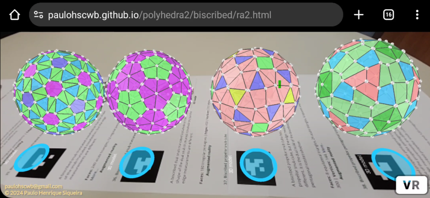

<h3 id="m3d" align="center">Modelos 3D</h3>
<!-- <iframe width="560" height="315" style="max-width:100%" src="https://www.youtube.com/embed/videoseries?list=PLy0I_lGW8HxXlieaiv7p0PWdsNRWPbWRv" title="YouTube video player" frameborder="0" allow="accelerometer; autoplay; clipboard-write; encrypted-media; gyroscope; picture-in-picture; web-share" allowfullscreen></iframe> -->
<h4>1. Octaedro truncado biscrito</h4>

    Um octaedro truncado biscrito tem a forma do octaedro truncado, um dos poliedros Arquimedianos, mas não possui os hexágonos regulares. É o sólido dual do hexaedro tetrakis biscrito.
    <b>Faces:</b> 6 quadrados e 8 ditrígonos | <b>Arestas:</b> 36 | <b>Vértices:</b> 24. <a href="http://dmccooey.com/polyhedra/BiscribedNonChiral.html" target="_blank">Mais sobre...</a>

<h4>2. Hexaedro tetrakis biscrito</h4>

    Um hexaedro tetrakis biscrito tem a forma do hexaedro tetrakis, um dos poliedros de Catalan, mas as medidas das arestas são diferentes. É o sólido dual do octaedro truncado biscrito.
    <b>Faces:</b> 24 triângulos isósceles | <b>Arestas:</b> 36 | <b>Vértices:</b> 14. <a href="http://dmccooey.com/polyhedra/BiscribedNonChiral.html" target="_blank">Mais sobre...</a>

 
<h4>3. Cuboctaedro truncado biscrito</h4>

    Um cuboctaedro truncado biscrito tem a forma do cuboctaedro truncado, um dos poliedros de Arquimedes, mas não possui faces regulares. É o sólido dual do dodecaedro disdyakis biscrito.
    <b>Faces:</b> 12 retângulos, 8 ditrígonos e 6 ditetrágonos | <b>Arestas:</b> 72 | <b>Vértices:</b> 48. <a href="http://dmccooey.com/polyhedra/BiscribedNonChiral.html" target="_blank">Mais sobre...</a>

<h4>4. Dodecaedro disdiakis biscrito</h4>

   Um dodecaedro disdiakis biscrito tem a forma do dodecaedro disdiakis, um dos poliedros de Catalan, mas as medidas das arestas são diferentes. É o sólido dual do cuboctaedro truncado biscrito.
    <b>Faces:</b> 48 triângulos acutângulos | <b>Arestas:</b> 72 | <b>Vértices:</b> 26. <a href="http://dmccooey.com/polyhedra/BiscribedNonChiral.html" target="_blank">Mais sobre...</a>

<h4>5. Icosaedro truncado biscrito</h4>

   Um icosaedro truncado biscrito tem a forma do icosaedro truncado, um dos poliedros de Arquimedes, mas não possui hexágonos regulares. É o sólido dual do dodecaedro pentakis biscrito.
    <b>Faces:</b> 12 pentágonos regulares e 20 ditrígonos | <b>Arestas:</b> 90 | <b>Vértices:</b> 60. <a href="http://dmccooey.com/polyhedra/BiscribedNonChiral.html" target="_blank">Mais sobre...</a>

<h4>6. Dodecaedro pentakis biscrito</h4>

    Um dodecaedro pentakis biscrito tem a forma do dodecaedro pentakis, um dos poliedros de Catalan, mas as medidas das arestas são diferentes. É o sólido dual do icosaedro truncado biscrito.
    <b>Faces:</b> 60 triângulos isósceles | <b>Arestas:</b> 90 | <b>Vértices:</b> 32. <a href="http://dmccooey.com/polyhedra/BiscribedNonChiral.html" target="_blank">Mais sobre...</a>

<h4>7. Icosidodecaedro truncado biscrito</h4>
<a href="../vr/BiscribedTruncatedIcosidodecahedron.htm" target="_blank" title="modelo 3D" class="fotoA">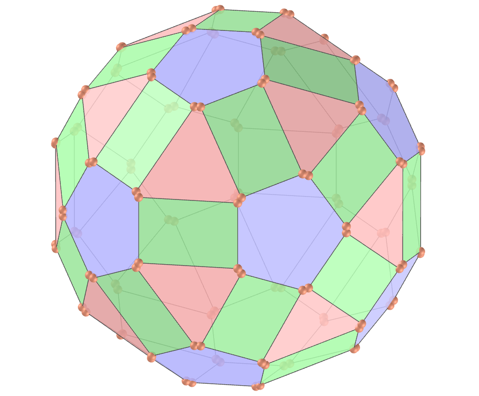</a>
   Um icosidodecaedro truncado biscrito tem a forma do icosidodecaedro truncado, um dos poliedros de Arquimedes, mas não possui faces regulares. É o sólido dual do triacontaedro disdiakis biscrito.
    <b>Faces:</b> 30 retângulos, 20 ditrígonos e 12 dipentágonos | <b>Arestas:</b> 180 | <b>Vértices:</b> 120. <a href="http://dmccooey.com/polyhedra/BiscribedNonChiral.html" target="_blank">Mais sobre...</a>

<h4>8. Triacontaedro disdiakis biscrito</h4>
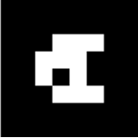
    Um triacontaedro disdiakis biscrito tem a forma do triacontaedro disdiakis, um dos poliedros de Catalan, mas as medidas das arestas são diferentes. É o sólido dual do icosidodecaedro truncado biscrito.
    <b>Faces:</b> 120 triângulos acutângulos | <b>Arestas:</b> 180 | <b>Vértices:</b> 62. <a href="http://dmccooey.com/polyhedra/BiscribedNonChiral.html" target="_blank">Mais sobre...</a>

<h4>9. Cubo snub biscrito</h4>

    Um cubo snub biscrito tem a forma do cubo snub, um dos poliedros de Arquimedes, mas as medidas das arestas são diferentes. É o sólido dual do icositetraedro pentagonal biscrito.
    <b>Faces:</b> 8 triângulos equiláteros, 24 triângulos acutângulos e 6 quadrados | <b>Arestas:</b> 60 | <b>Vértices:</b> 24. <a href="http://dmccooey.com/polyhedra/BiscribedChiral.html" target="_blank">Mais sobre...</a>

<h4>10. Icositetraedro pentagonal biscrito</h4>

    Um icositetraedro pentagonal biscrito tem a forma do icositetraedro pentagonal, um dos poliedros de Catalan, mas as medidas das arestas são diferentes. É o sólido dual do cubo snub biscrito.
    <b>Faces:</b> 24 pentágonos irregulares | <b>Arestas:</b> 60 | <b>Vértices:</b> 38. <a href="http://dmccooey.com/polyhedra/BiscribedChiral.html" target="_blank">Mais sobre...</a>

<a href="#p1" class="topo">voltar ao topo</a>

<h4>11. Dodecaedro snub biscrito</h4>
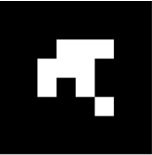
    Um dodecaedro snub biscrito tem a forma do dodecaedro snub, um dos poliedros de Arquimedes, mas as medidas das arestas são diferentes. É o sólido dual do hexecontaedro pentagonal biscrito.
    <b>Faces:</b> 20 triângulos equiláteros, 60 triângulos acutângulos e 12 pentágonos regulares | <b>Arestas:</b> 150 | <b>Vértices:</b> 60. <a href="http://dmccooey.com/polyhedra/BiscribedChiral.html" target="_blank">Mais sobre...</a>

<h4>12. Hexecontaedro pentagonal biscrito</h4>

    Um hexecontaedro pentagonal biscrito tem a forma do hexecontaedro pentagonal, um dos poliedros de Catalan, mas as medidas das arestas são diferentes. É o sólido dual do dodecaedro snub biscrito.
    <b>Faces:</b> 60 pentágonos irregulares | <b>Arestas:</b> 150 | <b>Vértices:</b> 92. <a href="http://dmccooey.com/polyhedra/BiscribedChiral.html" target="_blank">Mais sobre...</a>

<h4>13. Octaedro de hélice ortotruncado biscrito</h4>

    Um octaedro de hélice ortotruncado biscrito tem a forma do octaedro de hélice ortotruncado, mas as medidas das arestas são diferentes. É o sólido dual do cubo ortokis de hélice biscrito.
    <b>Faces:</b> 8 triângulos equiláteros, 6 quadrados e 24 pentágonos irregulares | <b>Arestas:</b> 84 | <b>Vértices:</b> 48. <a href="http://dmccooey.com/polyhedra/BiscribedChiral.html" target="_blank">Mais sobre...</a>

<h4>14. Cubo ortokis de hélice biscrito</h4>

    Um cubo ortokis de hélice biscrito tem a forma do cubo ortokis de hélice, mas as medidas das arestas são diferentes. É o sólido dual do octaedro de hélice ortotruncado biscrito.
    <b>Faces:</b> 24 triângulos isósceles e 24 tetrágonos irregulares | <b>Arestas:</b> 84 | <b>Vértices:</b> 38. <a href="http://dmccooey.com/polyhedra/BiscribedChiral.html" target="_blank">Mais sobre...</a>

<h4>15. Icosaedro de hélice ortotruncado biscrito</h4>
<a href="../vr/BiscribedOrthotruncatedPropelloIcosahedron.htm" target="_blank" title="modelo 3D" class="fotoA">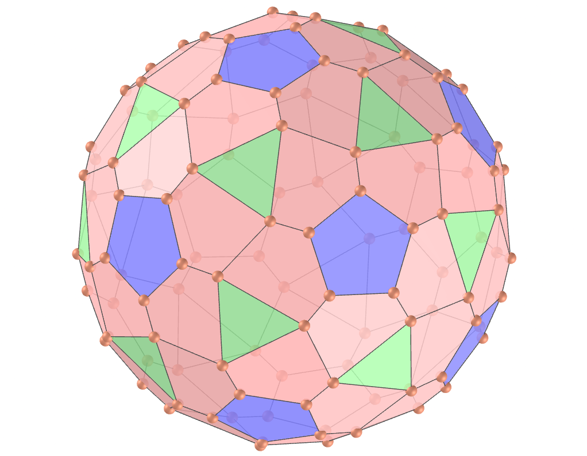</a>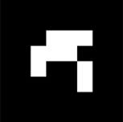
    Um icosaedro de hélice ortotruncado biscrito tem a forma do icosaedro de hélice ortotruncado, mas as medidas das arestas são diferentes. É o sólido dual do dodecaedro ortokis de hélice biscrito.
    <b>Faces:</b> 20 triângulos equiláteros, 60 pentágonos irregulares e 12 pentágonos regulares | <b>Arestas:</b> 210 | <b>Vértices:</b> 84. <a href="http://dmccooey.com/polyhedra/BiscribedChiral.html" target="_blank">Mais sobre...</a>

<h4>16. Dodecaedro ortokis de hélice biscrito</h4>
<a href="../vr/BiscribedOrthokisPropelloDodecahedron.htm" target="_blank" title="modelo 3D" class="fotoA">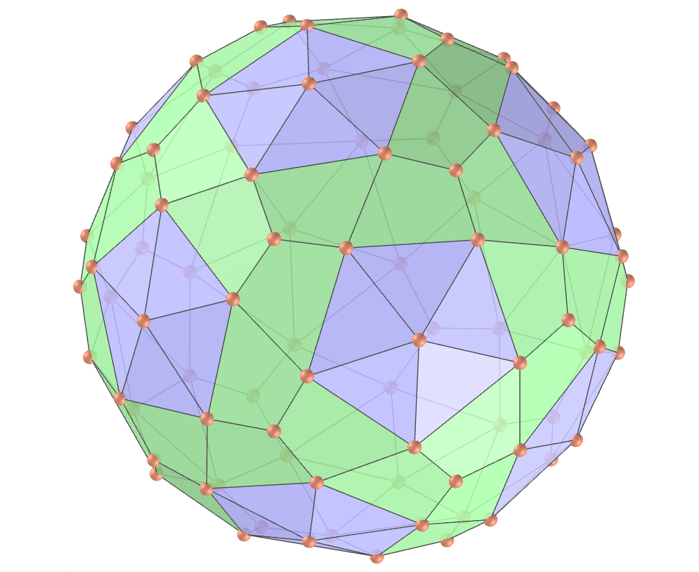</a>
    Um dodecaedro ortokis de hélice biscrito tem a forma do dodecaedro ortokis de hélice, mas as medidas das arestas são diferentes. É o sólido dual do icosaedro de hélice ortotruncado biscrito.
    <b>Faces:</b> 60 triângulos isósceles e 60 tetrágonos irregulares | <b>Arestas:</b> 210 | <b>Vértices:</b> 92. <a href="http://dmccooey.com/polyhedra/BiscribedChiral.html" target="_blank">Mais sobre...</a>

<h4>17. Cubo de hélice biscrito</h4>

    Um cubo de hélice biscrito tem a forma do cubo de hélice, mas as medidas das arestas são diferentes. É o sólido dual do octaedro de hélice biscrito.
    <b>Faces:</b> 6 quadrados e 24 tetrágonos irregulares | <b>Arestas:</b> 60 | <b>Vértices:</b> 32. <a href="http://dmccooey.com/polyhedra/BiscribedChiral.html" target="_blank">Mais sobre...</a>

<h4>18. Octaedro de hélice biscrito</h4>

    Um octaedro de hélice biscrito tem a forma do octaedro de hélice, mas as medidas das arestas são diferentes. É o sólido dual do cubo de hélice biscrito.
    <b>Faces:</b> 8 triângulos equiláteros e 24 tetrágonos irregulares | <b>Arestas:</b> 60 | <b>Vértices:</b> 30. <a href="http://dmccooey.com/polyhedra/BiscribedChiral.html" target="_blank">Mais sobre...</a>

<h4>19. Dodecaedro de hélice biscrito</h4>

    Um dodecaedro de hélice biscrito tem a forma do dodecaedro de hélice, mas as medidas das arestas são diferentes. É o sólido dual do icosaedro de hélice biscrito.
    <b>Faces:</b> 12 pentágonos regulares e 60 tetrágonos irregulares | <b>Arestas:</b> 150 | <b>Vértices:</b> 80. <a href="http://dmccooey.com/polyhedra/BiscribedChiral.html" target="_blank">Mais sobre...</a>

<h4>20. Icosaedro de hélice biscrito</h4>
<a href="../vr/BiscribedPropelloIcosahedron.htm" target="_blank" title="modelo 3D" class="fotoA">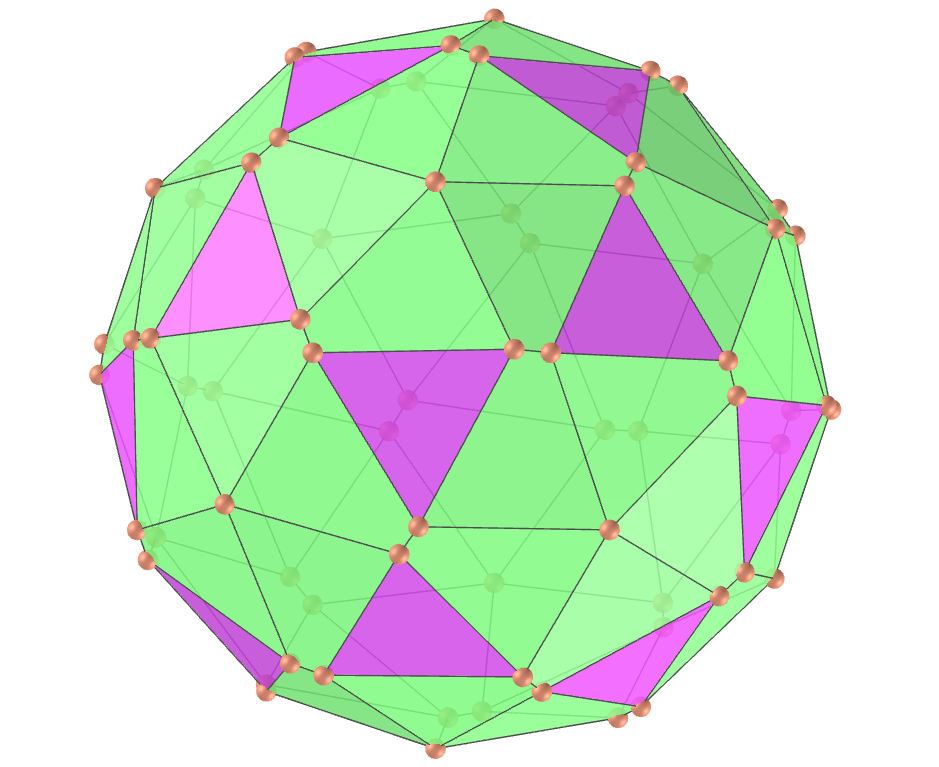</a>
    Um icosaedro de hélice biscrito tem a forma do icosaedro de hélice, mas as medidas das arestas são diferentes. É o sólido dual do dodecaedro de hélice biscrito.
    <b>Faces:</b> 20 triângulos equiláteros e 60 tetrágonos irregulares | <b>Arestas:</b> 150 | <b>Vértices:</b> 72. <a href="http://dmccooey.com/polyhedra/BiscribedChiral.html" target="_blank">Mais sobre...</a>

<a href="#p1" class="topo">voltar ao topo</a>

<h4>21. Cubo de hélice hexagonal biscrito</h4>

    Um cubo de hélice hexagonal biscrito tem a forma do cubo de hélice hexagonal, mas as medidas das arestas são diferentes. É o sólido dual do cubo snub tetrakis biscrito.
    <b>Faces:</b> 6 quadrados e 24 hexágonos irregulares | <b>Arestas:</b> 84 | <b>Vértices:</b> 56. <a href="http://dmccooey.com/polyhedra/BiscribedChiral.html" target="_blank">Mais sobre...</a>

<h4>22. Cubo snub tetrakis biscrito</h4>

    Um cubo snub tetrakis biscrito tem a forma do cubo snub tetrakis, mas as medidas das arestas são diferentes. É o sólido dual do cubo de hélice hexagonal biscrito.
    <b>Faces:</b> 8 triângulos equiláteros, 24 triângulos isósceles e 24 triângulos acutângulos | <b>Arestas:</b> 84 | <b>Vértices:</b> 30. <a href="http://dmccooey.com/polyhedra/BiscribedChiral.html" target="_blank">Mais sobre...</a>

<h4>23. Dodecaedro de hélice hexagonal biscrito</h4>

    Um dodecaedro de hélice hexagonal biscrito tem a forma do dodecaedro de hélice hexagonal, mas as medidas das arestas são diferentes. É o sólido dual do dodecaedro snub pentakis biscrito.
    <b>Faces:</b> 12 pentágonos regulares e 60 hexágonos irregulares | <b>Arestas:</b> 210 | <b>Vértices:</b> 140. <a href="http://dmccooey.com/polyhedra/BiscribedChiral.html" target="_blank">Mais sobre...</a>

<h4>24. Dodecaedro snub pentakis biscrito</h4>

    Um dodecaedro snub pentakis biscrito tem a forma do dodecaedro snub pentakis, mas as medidas das arestas são diferentes. É o sólido dual do dodecaedro de hélice hexagonal biscrito.
    <b>Faces:</b> 20 triângulos equiláteros, 60 triângulos isósceles e 60 triângulos acutângulos | <b>Arestas:</b> 210 | <b>Vértices:</b> 72. <a href="http://dmccooey.com/polyhedra/BiscribedChiral.html" target="_blank">Mais sobre...</a>

<h4>25. Octaedro truncado de hélice biscrito</h4>
<a href="../vr/BiscribedPropelloTruncatedOctahedron.htm" target="_blank" title="modelo 3D" class="fotoA">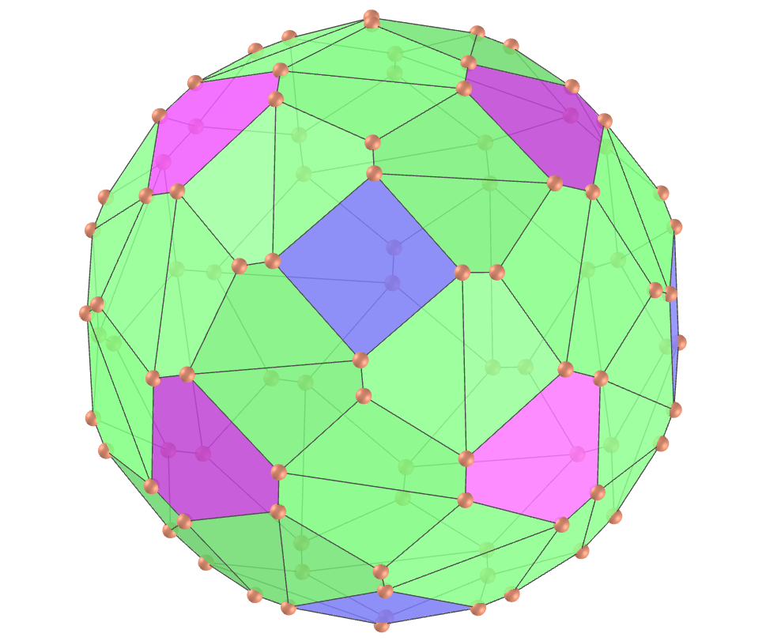</a>
    Um octaedro truncado de hélice biscrito tem a forma do octaedro truncado de hélice, mas as medidas das arestas são diferentes. É o sólido dual do hexaedro tetrakis de hélice biscrito.
    <b>Faces:</b> 6 quadrados, 72 tetrágonos irregulares e 8 ditrígonos | <b>Arestas:</b> 180 | <b>Vértices:</b> 96. <a href="http://dmccooey.com/polyhedra/BiscribedChiral.html" target="_blank">Mais sobre...</a>

<h4>26. Hexaedro tetrakis de hélice biscrito</h4>

    Um hexaedro tetrakis de hélice biscrito tem a forma do hexaedro tetrakis de hélice, mas as medidas das arestas são diferentes. É o sólido dual do octaedro truncado de hélice biscrito.
    <b>Faces:</b> 24 triângulos acutângulos e 72 tetrágonos irregulares | <b>Arestas:</b> 180 | <b>Vértices:</b> 86. <a href="http://dmccooey.com/polyhedra/BiscribedChiral.html" target="_blank">Mais sobre...</a>

<h4>27. Cuboctaedro truncado de hélice biscrito</h4>
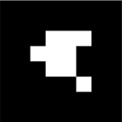
    Um cuboctaedro truncado de hélice biscrito tem a forma do cuboctaedro truncado de hélice, mas as medidas das arestas são diferentes. É o sólido dual do dodecaedro disdiakis de hélice biscrito.
    <b>Faces:</b> 12 retângulos, 144 tetrágonos irregulares, 8 ditrígonos e 6 ditetrágonos | <b>Arestas:</b> 360 | <b>Vértices:</b> 192. <a href="http://dmccooey.com/polyhedra/BiscribedChiral.html" target="_blank">Mais sobre...</a>

<h4>28. Dodecaedro disdiakis de hélice biscrito</h4>

    Um dodecaedro disdiakis de hélice biscrito tem a forma do dodecaedro disdiakis de hélice, mas as medidas das arestas são diferentes. É o sólido dual do cuboctaedro truncado de hélice biscrito.
    <b>Faces:</b> 48 triângulos acutângulos e 144 tetrágonos irregulares | <b>Arestas:</b> 360 | <b>Vértices:</b> 170. <a href="http://dmccooey.com/polyhedra/BiscribedChiral.html" target="_blank">Mais sobre...</a>

<h4>29. Icosaedro truncado de hélice biscrito</h4>

    Um icosaedro truncado de hélice biscrito tem a forma do icosaedro truncado de hélice, mas as medidas das arestas são diferentes. É o sólido dual do dodecaedro pentakis de hélice biscrito.
    <b>Faces:</b> 180 tetrágonos irregulares, 12 pentágonos regulares e 20 ditrígonos | <b>Arestas:</b> 450 | <b>Vértices:</b> 240. <a href="http://dmccooey.com/polyhedra/BiscribedChiral.html" target="_blank">Mais sobre...</a>

<h4>30. Dodecaedro pentakis de hélice biscrito</h4>

    Um dodecaedro pentakis de hélice biscrito tem a forma do dodecaedro pentakis de hélice, mas as medidas das arestas são diferentes. É o sólido dual do icosaedro truncado de hélice biscrito.
    <b>Faces:</b> 180 tetrágonos irregulares e 60 triângulos acutângulos | <b>Arestas:</b> 450 | <b>Vértices:</b> 212. <a href="http://dmccooey.com/polyhedra/BiscribedChiral.html" target="_blank">Mais sobre...</a>

<a href="#p1" class="topo">voltar ao topo</a>

<h4>31. Icosidodecaedro truncado de hélice biscrito</h4>

    Um icosidodecaedro truncado de hélice biscrito tem a forma do icosidodecaedro truncado de hélice, mas as medidas das arestas são diferentes. É o sólido dual do triacontaedro disdiakis de hélice biscrito.
    <b>Faces:</b> 30 retângulos, 360 tetrágonos irregulares, 20 ditrígonos e 12 dipentágonos | <b>Arestas:</b> 900 | <b>Vértices:</b> 480. <a href="http://dmccooey.com/polyhedra/BiscribedChiral.html" target="_blank">Mais sobre...</a>

<h4>32. Triacontaedro disdiakis de hélice biscrito</h4>

    Um triacontaedro disdiakis de hélice biscrito tem a forma do triacontaedro disdiakis de hélice, mas as medidas das arestas são diferentes. É o sólido dual do icosidodecaedro truncado de hélice biscrito.
    <b>Faces:</b> 360 tetrágonos irregulares e 120 triângulos acutângulos | <b>Arestas:</b> 900 | <b>Vértices:</b> 422. <a href="http://dmccooey.com/polyhedra/BiscribedChiral.html" target="_blank">Mais sobre...</a>

<h4>33. Octaedro truncado snub biscrito</h4>
<a href="../vr/BiscribedSnubTruncatedOctahedron.htm" target="_blank" title="modelo 3D" class="fotoA">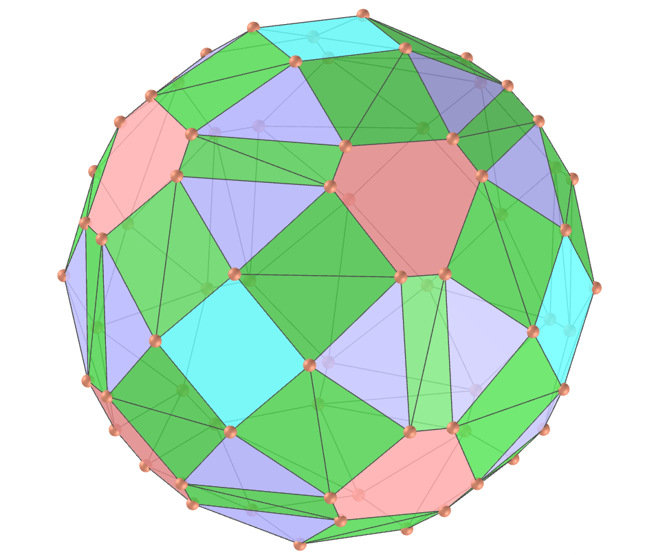</a>
    Um octaedro truncado snub biscrito tem a forma do octaedro truncado snub, mas as medidas das arestas são diferentes.
    <b>Faces:</b> 6 quadrados, 8 ditrígonos e 96 triângulos acutângulos | <b>Arestas:</b> 180 | <b>Vértices:</b> 72. <a href="http://dmccooey.com/polyhedra/BiscribedChiral.html" target="_blank">Mais sobre...</a>

<h4>34. Dual do octaedro truncado snub biscrito</h4>
<a href="../vr/BiscribedDualSnubTruncatedOctahedron.htm" target="_blank" title="modelo 3D" class="fotoA">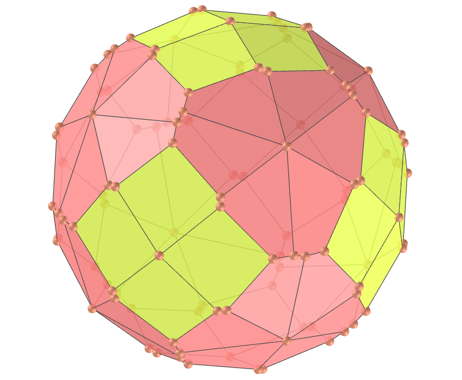</a>
    Um dual do octaedro truncado snub biscrito tem a forma do dual do octaedro truncado snub, mas as medidas das arestas são diferentes.
    <b>Faces:</b> 72 pentágonos irregulares | <b>Arestas:</b> 180 | <b>Vértices:</b> 110. <a href="http://dmccooey.com/polyhedra/BiscribedChiral.html" target="_blank">Mais sobre...</a>

<h4>35. Icosaedro truncado snub biscrito</h4>
<a href="../vr/BiscribedSnubTruncatedIcosahedron.htm" target="_blank" title="modelo 3D" class="fotoA">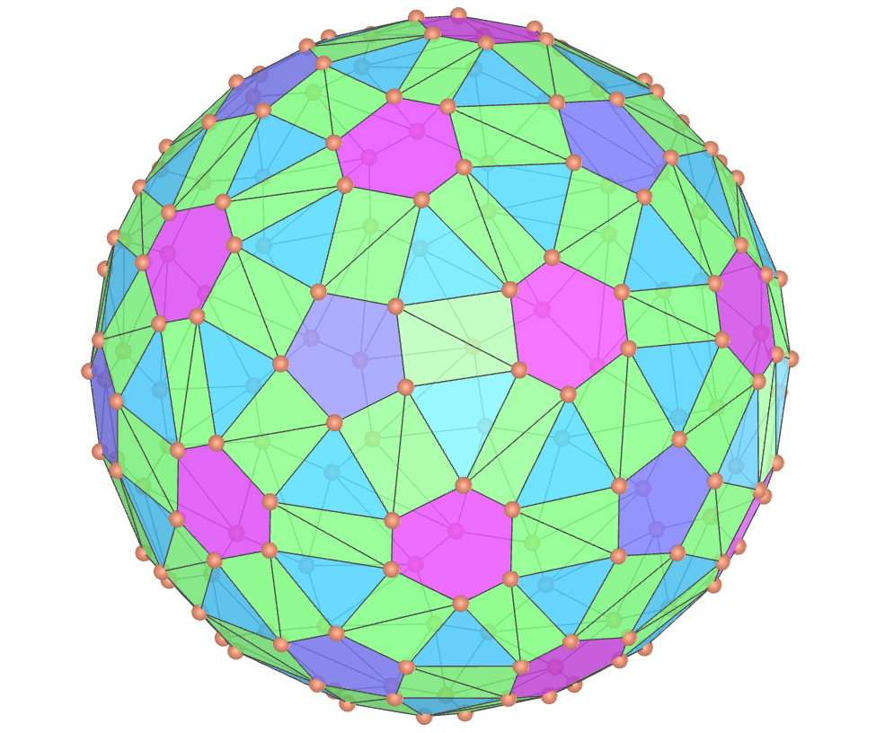</a>
    Um icosaedro truncado snub biscrito tem a forma do icosaedro truncado snub, mas as medidas das arestas são diferentes.
    <b>Faces:</b> 12 pentágonos regulares, 20 ditrígonos e 240 triângulos acutângulos | <b>Arestas:</b> 450 | <b>Vértices:</b> 180. <a href="http://dmccooey.com/polyhedra/BiscribedChiral.html" target="_blank">Mais sobre...</a>

<h4>36. Dual do icosaedro truncado snub biscrito</h4>

    Um dual do icosaedro truncado snub biscrito tem a forma do dual do icosaedro truncado snub, mas as medidas das arestas são diferentes.
    <b>Faces:</b> 180 pentágonos irregulares | <b>Arestas:</b> 450 | <b>Vértices:</b> 272. <a href="http://dmccooey.com/polyhedra/BiscribedChiral.html" target="_blank">Mais sobre...</a>

<h4>37. Cubo snub de hélice biscrito</h4>
<a href="../vr/BiscribedPropelloSnubCube.htm" target="_blank" title="modelo 3D" class="fotoA">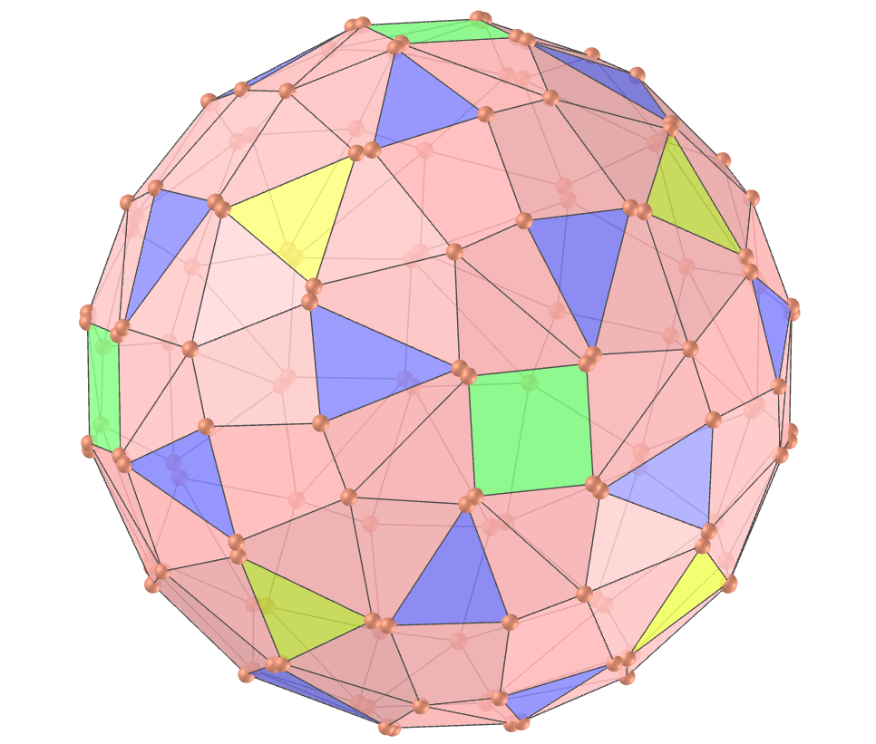</a>
    Um cubo snub de hélice biscrito tem a forma do cubo snub de hélice, mas as medidas das arestas são diferentes. É o sólido dual do icositetraedro pentagonal de hélice biscrito.
    <b>Faces:</b> 12 triângulos equiláteros, 120 tetrágonos irregulares, 6 quadrados e 24 triângulos acutângulos | <b>Arestas:</b> 300 | <b>Vértices:</b> 144. <a href="http://dmccooey.com/polyhedra/BiscribedChiral.html" target="_blank">Mais sobre...</a>

<h4>38. Icositetraedro pentagonal de hélice biscrito</h4>

    Um icositetraedro pentagonal de hélice biscrito tem a forma do icositetraedro pentagonal de hélice, mas as medidas das arestas são diferentes. É o sólido dual do cubo snub de hélice biscrito.
    <b>Faces:</b> 24 pentágonos irregulares e 120 tetrágonos irregulares | <b>Arestas:</b> 300 | <b>Vértices:</b> 158. <a href="http://dmccooey.com/polyhedra/BiscribedChiral.html" target="_blank">Mais sobre...</a>

<a href="#p1" class="topo">voltar ao topo</a>

  Biscribed polyhedra - Visualization of polyhedra with Augmented Reality and Virtual Reality de <a xmlns:cc="http://creativecommons.org/ns#" href="https://paulohscwb.github.io/polyhedra2/biscribed/pt-br/" property="cc:attributionName" rel="cc:attributionURL">Paulo Henrique Siqueira</a> está licenciado com uma Licença <a rel="license" href="http://creativecommons.org/licenses/by-nc-nd/4.0/">Creative Commons Atribuição-NãoComercial-SemDerivações 4.0 Internacional</a>.

<h4>Como citar este trabalho:</h4> 

Siqueira, P.H., "Biscribed polyhedra - Visualization of polyhedra with Augmented Reality and Virtual Reality". Disponível em: <https://paulohscwb.github.io/polyhedra2/biscribed/pt-br/>, Maio de 2024.

  <b>Referências:</b>
 Weisstein, Eric W. "Archimedean Solid" From MathWorld-A Wolfram Web Resource. <a href="http://mathworld.wolfram.com/ArchimedeanSolid.html" target="_blank">http://mathworld.wolfram.com/ArchimedeanSolid.html</a>
 Weisstein, Eric W. "Catalan Solid" From MathWorld-A Wolfram Web Resource. <a href="https://mathworld.wolfram.com/CatalanSolid.html" target="_blank">https://mathworld.wolfram.com/CatalanSolid.html</a>
 Wikipedia <a href="https://en.wikipedia.org/wiki/Archimedean_solid" target="_blank">https://en.wikipedia.org/wiki/Archimedean_solid</a>
 McCooey, David I. "Visual Polyhedra". <a href="http://dmccooey.com/polyhedra/" target="_blank">http://dmccooey.com/polyhedra/</a>
