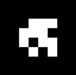

<link rel="stylesheet" href="../../scripts/style.css">
<meta charset="utf-8">
<link rel="icon" type="image/png" href="../vr/salas/imagens/icone.png">
<h2>Visualização de poliedros com Realidade Aumentada (RA) e Realidade Virtual (RV) em A-frame</h2>
<b>autor:</b> Paulo Henrique Siqueira - Universidade Federal do Paraná
 <b>contato:</b> <a href="#"> paulohscwb@gmail.com </a>
 <a href="https://paulohscwb.github.io/polyhedra2/chamfered/">english version</a>
<form style="margin: 0 auto; float:right; text-align:right; width:100%; margin-bottom:15px;">
	<select id="url" onchange="urlHandler(this.value)" style="color:royalblue;">
		<option disabled selected>Mais poliedros:</option>
		<option value="../../ArchimedeanCatalanHulls/pt-br/">Cascos convexos de Arquimedes e Catalan</option>
		<option value="../../fractalplatonic/pt-br/">Fractais dos poliedros de Platão</option>
		<option value="../../fractalnonconvex/pt-br/">Fractais dos poliedros não convexos</option>
		<option value="../../fractalarchimedean/pt-br/">Fractais dos poliedros de Arquimedes</option>
		<option value="../../chamfered/pt-br/">Poliedros chanfrados</option>
		<option value="../../propellor/pt-br/">Poliedros de hélice</option>
		<option value="../../diamonds/pt-br/">Poliedros de diamante</option>
		<option disabled value="../../biscribed/pt-br/">Poliedros biscritos</option>
	</select>
</form>

  <h2 align="center"> Poliedros biscritos</h2>
  Definimos um poliedro biscrito como qualquer poliedro convexo que possui esferas concêntricas circunscritas e inscritas, onde o centro da esfera também é o centróide dos vértices e o centróide dos pontos de tangência das faces.
 
<a href="#ra">Realidade Aumentada</a>&nbsp;&nbsp;|&nbsp;&nbsp;<a href="#m3d">Modelos 3D</a>&nbsp;&nbsp;|&nbsp;&nbsp;<a href="../../pt-br/">Página Inicial</a>

 <h3 align="center">Sala imersiva</h3>
  
<iframe width="100%" src="../sala.htm" title="Sala Imersiva dos Poliedros biscritos" frameborder="0" loading="lazy"></iframe>

  
<a href="../sala.htm" target="_blank">&#x1f517; link da sala</a>

  

  <h3 id="ra" align="center">Realidade Aumentada</h3>
  Para visualizar os poliedros biscritos em RA, visite a página:

<a href="../ra.html" class="raAR" target="_blank">https://paulohscwb.github.io/polyhedra2/biscribed/ra.html</a>
 
com qualquer navegador com um dispositivo de webcam (smartphone, tablet ou notebook).
 O acesso às páginas de RV é feito clicando no círculo azul que aparece em cima de cada marcador.

<h3 id="m3d" align="center">Modelos 3D</h3>
<!-- <iframe width="560" height="315" style="max-width:100%" src="https://www.youtube.com/embed/videoseries?list=PLy0I_lGW8HxXlieaiv7p0PWdsNRWPbWRv" title="YouTube video player" frameborder="0" allow="accelerometer; autoplay; clipboard-write; encrypted-media; gyroscope; picture-in-picture; web-share" allowfullscreen></iframe> -->
<h4>1. Octaedro truncado biscrito</h4>

    Um octaedro truncado biscrito tem a forma do octaedro truncado, um dos poliedros Arquimedianos, mas não possui os hexágonos regulares. É o sólido dual do hexaedro tetrakis biscrito.
    <b>Faces:</b> 6 quadrados e 8 ditrígonos | <b>Arestas:</b> 36 | <b>Vértices:</b> 24. <a href="http://dmccooey.com/polyhedra/BiscribedNonChiral.html" target="_blank">Mais sobre...</a>

<h4>2. Hexaedro tetrakis biscrito</h4>

    Um hexaedro tetrakis biscrito tem a forma do hexaedro tetrakis, um dos poliedros de Catalan, mas as medidas das arestas são diferentes. É o sólido dual do octaedro truncado biscrito.
    <b>Faces:</b> 24 triângulos isósceles | <b>Arestas:</b> 36 | <b>Vértices:</b> 14. <a href="http://dmccooey.com/polyhedra/BiscribedNonChiral.html" target="_blank">Mais sobre...</a>

 
<h4>3. Cuboctaedro truncado biscrito</h4>

    Um cuboctaedro truncado biscrito tem a forma do cuboctaedro truncado, um dos poliedros de Arquimedes, mas não possui faces regulares. É o sólido dual do dodecaedro disdyakis biscrito.
    <b>Faces:</b> 12 retângulos, 8 ditrígonos e 6 ditetrágonos | <b>Arestas:</b> 72 | <b>Vértices:</b> 48. <a href="http://dmccooey.com/polyhedra/BiscribedNonChiral.html" target="_blank">Mais sobre...</a>

<h4>4. Dodecaedro disdiakis biscrito</h4>

     Um dodecaedro disdiakis biscrito tem a forma do dodecaedro disdiakis, um dos poliedros de Catalan, mas as medidas das arestas são diferentes. É o sólido dual do cuboctaedro truncado biscrito.
    <b>Faces:</b> 48 triângulos acutângulos | <b>Arestas:</b> 72 | <b>Vértices:</b> 26. <a href="http://dmccooey.com/polyhedra/BiscribedNonChiral.html" target="_blank">Mais sobre...</a>

<h4>5. Icosaedro truncado biscrito</h4>

     Um icosaedro truncado biscrito tem a forma do icosaedro truncado, um dos poliedros de Arquimedes, mas não possui hexágonos regulares. É o sólido dual do dodecaedro pentakis biscrito.
    <b>Faces:</b> 12 pentágonos regulares e 20 ditrígonos | <b>Arestas:</b> 90 | <b>Vértices:</b> 60. <a href="http://dmccooey.com/polyhedra/BiscribedNonChiral.html" target="_blank">Mais sobre...</a>

<h4>6. Dodecaedro pentakis biscrito</h4>

    Um dodecaedro pentakis biscrito tem a forma do dodecaedro pentakis, um dos poliedros de Catalan, mas as medidas das arestas são diferentes. É o sólido dual do icosaedro truncado biscrito.
    <b>Faces:</b> 60 triângulos isósceles | <b>Arestas:</b> 90 | <b>Vértices:</b> 32. <a href="http://dmccooey.com/polyhedra/BiscribedNonChiral.html" target="_blank">Mais sobre...</a>

<h4>7. Icosidodecaedro truncado biscrito</h4>

     Um icosidodecaedro truncado biscrito tem a forma do icosidodecaedro truncado, um dos poliedros de Arquimedes, mas não possui faces regulares. É o sólido dual do triacontaedro disdiakis biscrito.
    <b>Faces:</b> 30 retângulos, 20 ditrígonos e 12 dipentágonos | <b>Arestas:</b> 180 | <b>Vértices:</b> 120. <a href="http://dmccooey.com/polyhedra/BiscribedNonChiral.html" target="_blank">Mais sobre...</a>

<h4>8. Triacontaedro disdiakis biscrito</h4>

    Um triacontaedro disdiakis biscrito tem a forma do triacontaedro disdiakis, um dos poliedros de Catalan, mas as medidas das arestas são diferentes. É o sólido dual do icosidodecaedro truncado biscrito.
    <b>Faces:</b> 120 triângulos acutângulos | <b>Arestas:</b> 180 | <b>Vértices:</b> 62. <a href="http://dmccooey.com/polyhedra/BiscribedNonChiral.html" target="_blank">Mais sobre...</a>

<a href="#p1" class="topo">voltar ao topo</a>

  Chamfered polyhedra - Visualization of polyhedra with Augmented Reality and Virtual Reality de <a xmlns:cc="http://creativecommons.org/ns#" href="https://paulohscwb.github.io/polyhedra2/chamfered/pt-br/" property="cc:attributionName" rel="cc:attributionURL">Paulo Henrique Siqueira</a> está licenciado com uma Licença <a rel="license" href="http://creativecommons.org/licenses/by-nc-nd/4.0/">Creative Commons Atribuição-NãoComercial-SemDerivações 4.0 Internacional</a>.

<h4>Como citar este trabalho:</h4> 

Siqueira, P.H., "Chamfered polyhedra - Visualization of polyhedra with Augmented Reality and Virtual Reality". Disponível em: <https://paulohscwb.github.io/polyhedra2/chamfered/pt-br/>, Novembro de 2023.

<!---->
  <b>Referências:</b>
 Weisstein, Eric W. "Archimedean Solid" From MathWorld-A Wolfram Web Resource. <a href="http://mathworld.wolfram.com/ArchimedeanSolid.html" target="_blank">http://mathworld.wolfram.com/ArchimedeanSolid.html</a>
 Weisstein, Eric W. "Platonic Solid" From MathWorld-A Wolfram Web Resource. <a href="http://mathworld.wolfram.com/PlatonicSolid.html" target="_blank">http://mathworld.wolfram.com/PlatonicSolid.html</a>
 Weisstein, Eric W. "Archimedean Dual" From MathWorld-A Wolfram Web Resource. <a href="https://mathworld.wolfram.com/ArchimedeanDual.html" target="_blank">https://mathworld.wolfram.com/ArchimedeanDual.html</a>
 Weisstein, Eric W. "Uniform Polyhedron." From MathWorld--A Wolfram Web Resource. <a href="https://mathworld.wolfram.com/UniformPolyhedron.html" target="_blank">https://mathworld.wolfram.com/UniformPolyhedron.html</a>
 Wikipedia <a href="https://en.wikipedia.org/wiki/Archimedean_solid" target="_blank">https://en.wikipedia.org/wiki/Archimedean_solid</a>
 Wikipedia <a href="https://en.wikipedia.org/wiki/en.wikipedia.org/wiki/Platonic_solid" target="_blank">https://en.wikipedia.org/wiki/Platonic_solid</a>
 McCooey, David I. "Visual Polyhedra". <a href="http://dmccooey.com/polyhedra/" target="_blank">http://dmccooey.com/polyhedra/</a>
