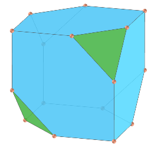
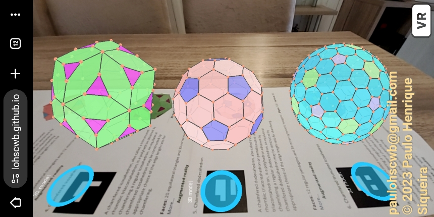
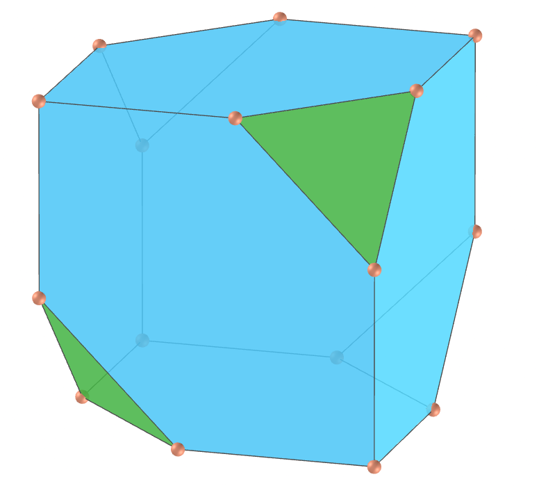
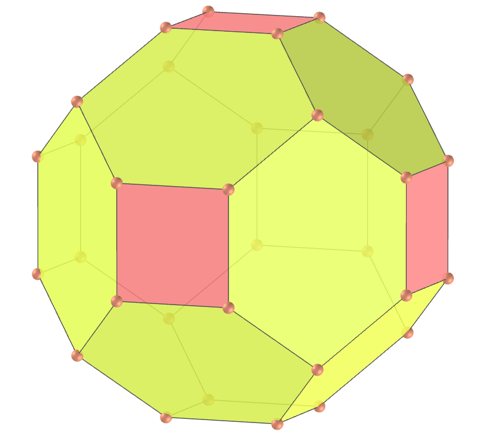
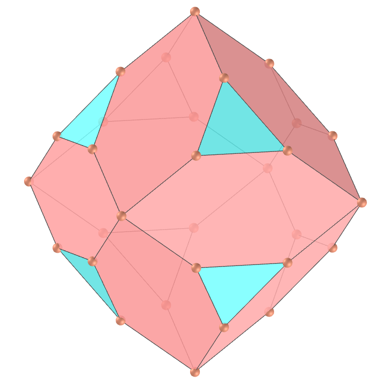
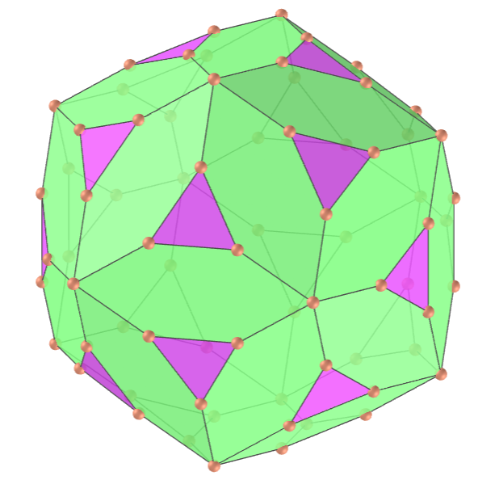
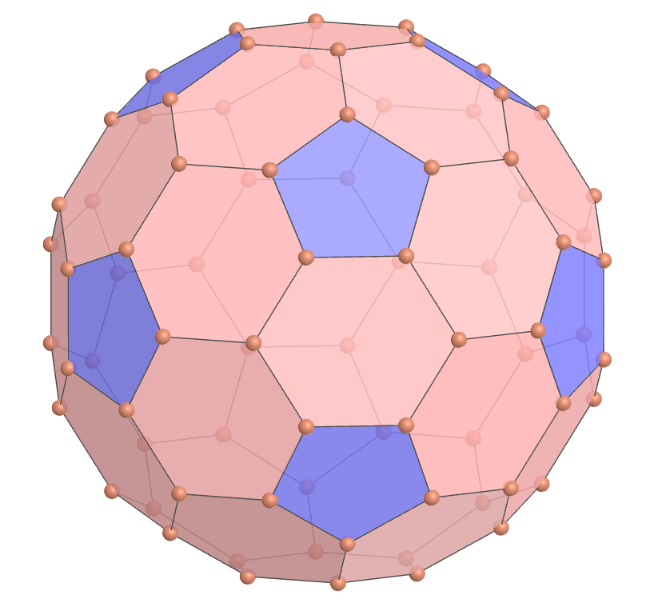
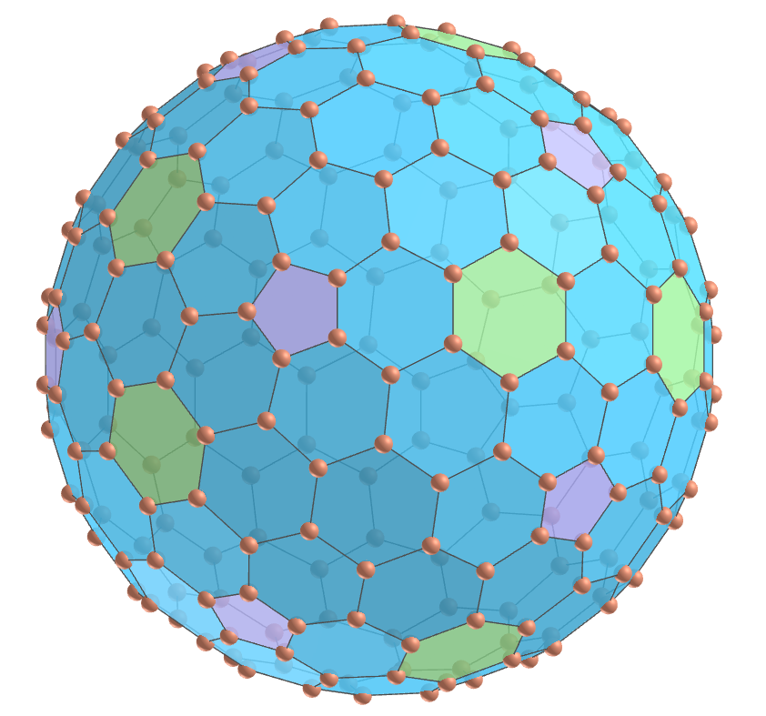

<link rel="stylesheet" href="../scripts/style.css">
<meta charset="utf-8">
<link rel="icon" type="image/png" href="vr/salas/imagens/icone.png">
<h2>Visualization of polyhedra with Augmented Reality (AR) and Virtual Reality (VR) in A-frame</h2>
 <b>author:</b> Paulo Henrique Siqueira - Universidade Federal do Paraná
  <b>contact:</b> <a href="#">paulohscwb@gmail.com</a>
  <a href="https://paulohscwb.github.io/polyhedra2/chamfered/pt-br/">versão em português</a>
 <form style="margin: 0 auto; float:right; text-align:right; width:100%; margin-bottom:15px;">
	<select id="url" onchange="urlHandler(this.value)" style="color:royalblue;">
		<option disabled selected value>More polyhedra:</option>
		<option value="../ArchimedeanCatalanHulls/">Archimedean and Catalan convex hulls</option>
		<option value="../fractalplatonic/">Platonic polyhedra fractals</option>
		<option value="../fractalnonconvex/">Non convex polyhedra fractals</option>
		<option value="../fractalarchimedean/">Archimedean polyhedra fractals</option>
		<option disabled value="../chamfered/">Chamfered polyhedra</option>
		<option value="../propellor/">Propellor polyhedra</option>
		<option value="../diamonds/">Diamond polyhedra</option>
	</select>
</form>

  <h2 align="center"> Chamfered polyhedra</h2>
We define the operation of "chamfering" as a truncation along the edges of a polyhedron. A chamfered polyhedron, also known as an egde-truncated polyhedron, is a polyhedron constructed from an original polyhedron by moving faces outward while retaining the original vertices, thus creating a new hexagon, in general not regular, in place of each original edge. On this page we have Plato's polyhedra and an Archimedes polyhedron "chamfered". The polyhedra obtained with the chamfer operation have all edges of the same length.

<a href="#ra">Augmented Reality</a>&nbsp;&nbsp;|&nbsp;&nbsp;<a href="#m3d">3D Models</a>&nbsp;&nbsp;|&nbsp;&nbsp;<a href="../">Home</a>

  

 <h3 align="center">Immersive room</h3>
  
<iframe width="100%" src="sala.htm" title="Sala Imersiva dos Poliedros chanfrados" frameborder="0" loading="lazy"></iframe>

  
<a href="sala.htm" target="_blank">&#x1f517; room link</a>
  
  

  <h3 id="ra" align="center">Augmented Reality</h3>
  To view chamfered polyhedra in AR, simply visit:

<a href="ra.html" class="raAR" target="_blank">https://paulohscwb.github.io/polyhedra2/chamfered/ra.html</a>
 
with any browser with a webcam device (smartphone, tablet or notebook). 
 Access to the VR sites is done by clicking on the blue circle that appears on top of the marker.

<h3 id="m3d" align="center">3D models</h3>
<!-- <iframe width="560" height="315" style="max-width:100%" src="https://www.youtube.com/embed/videoseries?list=PLy0I_lGW8HxXlieaiv7p0PWdsNRWPbWRv" title="YouTube video player" frameborder="0" allow="accelerometer; autoplay; clipboard-write; encrypted-media; gyroscope; picture-in-picture; web-share" allowfullscreen></iframe> -->
<h4>1. Chamfered tetrahedron</h4>

   A chamfered tetrahedron, also known as the alternate truncated cube, is a polyhedron obtained by chamfering a regular tetrahedron. An equilateral chamfered tetrahedron may be constructed by appropriate choice of the edge length ratio for chamfering.
    <b>Faces:</b> 4 equilateral triangles and 6 mirror-symmetric hexagons | <b>Edges:</b> 24 | <b>Vertices:</b> 16. <a href="https://mathworld.wolfram.com/topics/ChamferedPolyhedra.html" target="_blank">More...</a>
 

<h4>2. Chamfered cube</h4>

   A chamfered cube, also called truncated rhombic dodecahedron or tetratruncated rhombic dodecahedron, is a polyhedron obtained by chamfering a cube. An equilateral chamfered cube may be constructed by appropriate choice of the edge length ratio for chamfering.
    <b>Faces:</b> 6 squares and 12 mirror-symmetric hexagons | <b>Edges:</b> 48 | <b>Vertices:</b> 32. <a href="https://mathworld.wolfram.com/topics/ChamferedPolyhedra.html" target="_blank">More...</a>
 

<h4>3. Chamfered octahedron</h4>

   A chamfered octahedron, also called tritruncated rhombic dodecahedron, is a polyhedron obtained by chamfering a regular octahedron. An equilateral chamfered octahedron may be constructed by appropriate choice of the edge length ratio for chamfering.
    <b>Faces:</b> 8 equilateral triangles and 12 mirror-symmetric hexagons | <b>Edges:</b> 48 | <b>Vertices:</b> 30. <a href="https://mathworld.wolfram.com/topics/ChamferedPolyhedra.html" target="_blank">More...</a>
 

<h4>4. Chamfered icosahedron </h4>

   A chamfered icosahedron, also called a tritruncated rhombic triacontahedron, is a polyhedron obtained by chamfering a regular icosahedron. An equilateral chamfered icosahedron may be constructed by appropriate choice of the edge length ratio for chamfering.
    <b>Faces:</b> 20 equilateral triangles and 30 mirror-symmetric hexagons | <b>Edges:</b> 120 | <b>Vertices:</b> 72. <a href="https://mathworld.wolfram.com/topics/ChamferedPolyhedra.html" target="_blank">More...</a>
 

<h4>5. Chamfered dodecahedron</h4>

   A chamfered dodecahedron, also called truncated rhombic triacontahedron or pentatruncated rhombic triacontahedron, is a polyhedron obtained by chamfering a regular dodecahedron. An equilateral chamfered dodecahedron may be constructed by appropriate choice of the edge length ratio for chamfering.
    <b>Faces:</b> 12 regular pentagons and 30 mirror-symmetric hexagons | <b>Edges:</b> 120 | <b>Vertices:</b> 80. <a href="https://mathworld.wolfram.com/topics/ChamferedPolyhedra.html" target="_blank">More...</a>
 

<h4>6. Chamfered truncated icosahedron</h4>

   A chamfered truncated icosahedron is a polyhedron obtained by chamfering a regular truncated icosahedron. An equilateral chamfered truncated icosahedron may be constructed by appropriate choice of the edge length ratio for chamfering.
    <b>Faces:</b> 12 regular pentagons, 20 regular hexagons and 90 mirror-symmetric hexagons | <b>Edges:</b> 360 | <b>Vertices:</b> 240. <a href="https://mathworld.wolfram.com/topics/ChamferedPolyhedra.html" target="_blank">More...</a>
 

<a href="#p1" class="topo">back to top</a>

  Chamfered polyhedra - Visualization of polyhedra with Augmented Reality and Virtual Reality by <a xmlns:cc="http://creativecommons.org/ns#" href="https://paulohscwb.github.io/polyhedra2/chamfered/" property="cc:attributionName" rel="cc:attributionURL">Paulo Henrique Siqueira</a> is licensed with a license <a rel="license" href="http://creativecommons.org/licenses/by-nc-nd/4.0/">Creative Commons Attribution-NonCommercial-NoDerivatives 4.0 International</a>.

<h4>How to cite this work:</h4> 

Siqueira, P.H., "Chamfered polyhedra - Visualization of polyhedra with Augmented Reality and Virtual Reality". Available in: <https://paulohscwb.github.io/polyhedra2/chamfered/>, November 2023.

<!---->
  <b>References:</b>
 Weisstein, Eric W. "Archimedean Solid" From MathWorld-A Wolfram Web Resource. <a href="http://mathworld.wolfram.com/ArchimedeanSolid.html" target="_blank">http://mathworld.wolfram.com/ArchimedeanSolid.html</a>
 Weisstein, Eric W. "Platonic Solid" From MathWorld-A Wolfram Web Resource. <a href="http://mathworld.wolfram.com/PlatonicSolid.html" target="_blank">http://mathworld.wolfram.com/PlatonicSolid.html</a>
 Weisstein, Eric W. "Archimedean Dual" From MathWorld-A Wolfram Web Resource. <a href="https://mathworld.wolfram.com/ArchimedeanDual.html" target="_blank">https://mathworld.wolfram.com/ArchimedeanDual.html</a>
 Weisstein, Eric W. "Uniform Polyhedron." From MathWorld--A Wolfram Web Resource. <a href="https://mathworld.wolfram.com/UniformPolyhedron.html" target="_blank">https://mathworld.wolfram.com/UniformPolyhedron.html</a>
 Wikipedia <a href="https://en.wikipedia.org/wiki/Archimedean_solid" target="_blank">https://en.wikipedia.org/wiki/Archimedean_solid</a>
 Wikipedia <a href="https://en.wikipedia.org/wiki/en.wikipedia.org/wiki/Platonic_solid" target="_blank">https://en.wikipedia.org/wiki/Platonic_solid</a>
 McCooey, David I. "Visual Polyhedra". <a href="http://dmccooey.com/polyhedra/" target="_blank">http://dmccooey.com/polyhedra/</a>
