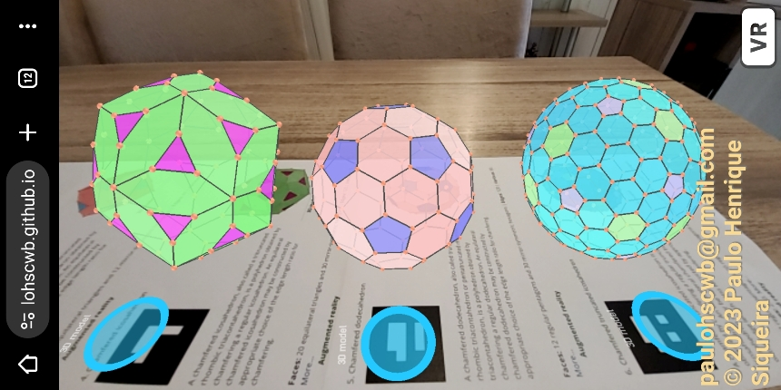
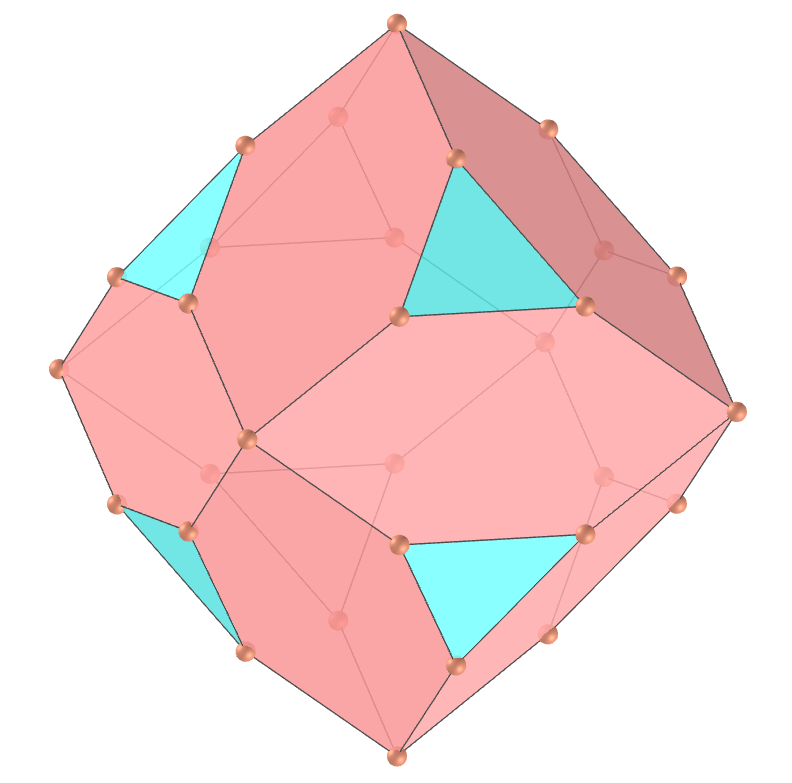

<link rel="stylesheet" href="../../scripts/style.css">
<meta charset="utf-8">
<link rel="icon" type="image/png" href="../vr/salas/imagens/icone.png">
<h2>Visualização de poliedros com Realidade Aumentada (RA) e Realidade Virtual (RV) em A-frame</h2>
<b>autor:</b> Paulo Henrique Siqueira - Universidade Federal do Paraná
 <b>contato:</b> <a href="#"> paulohscwb@gmail.com </a>
 <a href="https://paulohscwb.github.io/polyhedra2/chamfered/">english version</a>
<form style="margin: 0 auto; float:right; text-align:right; width:100%; margin-bottom:15px;">
	<select id="url" onchange="urlHandler(this.value)" style="color:royalblue;">
		<option disabled selected>Mais poliedros:</option>
		<option value="../../ArchimedeanCatalanHulls/pt-br/">Cascos convexos de Arquimedes e Catalan</option>
		<option value="../../fractalplatonic/pt-br/">Fractais dos poliedros de Platão</option>
		<option value="../../fractalnonconvex/pt-br/">Fractais dos poliedros não convexos</option>
		<option value="../../fractalarchimedean/pt-br/">Fractais dos poliedros de Arquimedes</option>
		<option disabled value="../../chamfered/pt-br/">Poliedros chanfrados</option>
		<option value="../../propellor/pt-br/">Poliedros de hélice</option>
		<option value="../../diamonds/pt-br/">Poliedros de diamante</option>
	</select>
</form>

  <h2 align="center"> Poliedros chanfrados</h2>
  Definimos a operação de "chanfrar" como um truncamento ao longo das arestas de um poliedro. Um poliedro chanfrado, também conhecido como poliedro truncado por exemplo, é um poliedro construído a partir de um poliedro original movendo as faces para fora, mantendo os vértices originais, criando assim um novo hexágono, em geral não regular, no lugar de cada aresta original. Nesta página temos os poliedros "chanfrados" de Platão e um poliedro de Arquimedes. Os poliedros obtidos com a operação de chanfro têm todas as arestas com mesmo comprimento.

 
<a href="#ra">Realidade Aumentada</a>&nbsp;&nbsp;|&nbsp;&nbsp;<a href="#m3d">Modelos 3D</a>&nbsp;&nbsp;|&nbsp;&nbsp;<a href="../../pt-br/">Página Inicial</a>

 <h3 align="center">Sala imersiva</h3>
  
<iframe width="100%" src="../sala.htm" title="Sala Imersiva dos Poliedros chanfrados" frameborder="0" loading="lazy"></iframe>

  
<a href="../sala.htm" target="_blank">&#x1f517; link da sala</a>

  

  <h3 id="ra" align="center">Realidade Aumentada</h3>
  Para visualizar os poliedros chanfrados em RA, visite a página:

<a href="../ra.html" class="raAR" target="_blank">https://paulohscwb.github.io/polyhedra2/chamfered/ra.html</a>
 
com qualquer navegador com um dispositivo de webcam (smartphone, tablet ou notebook).
 O acesso às páginas de RV é feito clicando no círculo azul que aparece em cima de cada marcador.

<h3 id="m3d" align="center">Modelos 3D</h3>
<!-- <iframe width="560" height="315" style="max-width:100%" src="https://www.youtube.com/embed/videoseries?list=PLy0I_lGW8HxU-mneUmSsccpRAAwbErHFq" title="YouTube video player" frameborder="0" allow="accelerometer; autoplay; clipboard-write; encrypted-media; gyroscope; picture-in-picture; web-share" allowfullscreen></iframe> -->
<h4>1. Tetraedro chanfrado</h4>

   Um tetraedro chanfrado, também conhecido como cubo truncado alternado, é um poliedro obtido chanfrando um tetraedro regular. Um tetraedro chanfrado equilátero pode ser construído pela escolha apropriada da relação de comprimento da aresta para chanframento.
    <b>Faces:</b> 4 triângulos equiláteros e 6 hexágonos simétricos | <b>Arestas:</b> 24 | <b>Vértices:</b> 16. <a href="https://mathworld.wolfram.com/topics/ChamferedPolyhedra.html" target="_blank">Mais sobre...</a>

<h4>2. Cubo chanfrado</h4>

   Um cubo chanfrado, também chamado de dodecaedro rômbico truncado ou dodecaedro rômbico tetratruncado, é um poliedro obtido chanfrando um cubo. Um cubo chanfrado equilátero pode ser construído pela escolha apropriada da relação de comprimento da aresta para chanframento.
    <b>Faces:</b> 6 quadrados e 12 hexágonos simétricos | <b>Arestas:</b> 48 | <b>Vértices:</b> 32. <a href="https://mathworld.wolfram.com/topics/ChamferedPolyhedra.html" target="_blank">Mais sobre...</a>

 
<h4>3. Octaedro chanfrado</h4>

   Um octaedro chanfrado, também chamado de dodecaedro rômbico tritruncado, é um poliedro obtido chanfrando um octaedro regular. Um octaedro chanfrado equilátero pode ser construído pela escolha apropriada da relação de comprimento da aresta para chanframento.
    <b>Faces:</b> 8 triângulos equiláteros e 12 hexágonos simétricos | <b>Arestas:</b> 48 | <b>Vértices:</b> 30. <a href="https://mathworld.wolfram.com/topics/ChamferedPolyhedra.html" target="_blank">Mais sobre...</a>

<h4>4. Icosaedro chanfrado</h4>

    Um icosaedro chanfrado, também chamado de triacontaedro rômbico tritruncado, é um poliedro obtido chanfrando um icosaedro regular. Um icosaedro chanfrado equilátero pode ser construído pela escolha apropriada da relação de comprimento da aresta para chanframento.
    <b>Faces:</b> 20 triângulos equiláteros e 30 hexágonos simétricos | <b>Arestas:</b> 120 | <b>Vértices:</b> 72. <a href="https://mathworld.wolfram.com/topics/ChamferedPolyhedra.html" target="_blank">Mais sobre...</a>

<h4>5. Dodecaedro chanfrado</h4>

    Um dodecaedro chanfrado, também chamado de triacontaedro rômbico truncado ou triacontaedro rômbico pentatruncado, é um poliedro obtido chanfrando um dodecaedro regular. Um dodecaedro chanfrado equilátero pode ser construído pela escolha apropriada da relação de comprimento da aresta para chanframento.
    <b>Faces:</b> 12 pentágonos regulares e 30 hexágonos simétricos | <b>Arestas:</b> 120 | <b>Vértices:</b> 80. <a href="https://mathworld.wolfram.com/topics/ChamferedPolyhedra.html" target="_blank">Mais sobre...</a>

<h4>6. Icosaedro truncado chanfrado</h4>

   Um icosaedro truncado chanfrado é um poliedro obtido chanfrando um icosaedro truncado regular. Um icosaedro truncado chanfrado equilátero pode ser construído pela escolha apropriada da relação de comprimento da borda para chanframento.
    <b>Faces:</b> 12 pentágonos regulares, 20 hexágonos regulares e 60 hexágonos simétricos | <b>Arestas:</b> 360 | <b>Vértices:</b> 240. <a href="https://mathworld.wolfram.com/topics/ChamferedPolyhedra.html" target="_blank">Mais sobre...</a>

<a href="#p1" class="topo">voltar ao topo</a>

  Chamfered polyhedra - Visualization of polyhedra with Augmented Reality and Virtual Reality de <a xmlns:cc="http://creativecommons.org/ns#" href="https://paulohscwb.github.io/polyhedra2/chamfered/pt-br/" property="cc:attributionName" rel="cc:attributionURL">Paulo Henrique Siqueira</a> está licenciado com uma Licença <a rel="license" href="http://creativecommons.org/licenses/by-nc-nd/4.0/">Creative Commons Atribuição-NãoComercial-SemDerivações 4.0 Internacional</a>.

<h4>Como citar este trabalho:</h4> 

Siqueira, P.H., "Chamfered polyhedra - Visualization of polyhedra with Augmented Reality and Virtual Reality". Disponível em: <https://paulohscwb.github.io/polyhedra2/chamfered/pt-br/>, Novembro de 2023.

<!---->
  <b>Referências:</b>
 Weisstein, Eric W. "Archimedean Solid" From MathWorld-A Wolfram Web Resource. <a href="http://mathworld.wolfram.com/ArchimedeanSolid.html" target="_blank">http://mathworld.wolfram.com/ArchimedeanSolid.html</a>
 Weisstein, Eric W. "Platonic Solid" From MathWorld-A Wolfram Web Resource. <a href="http://mathworld.wolfram.com/PlatonicSolid.html" target="_blank">http://mathworld.wolfram.com/PlatonicSolid.html</a>
 Weisstein, Eric W. "Archimedean Dual" From MathWorld-A Wolfram Web Resource. <a href="https://mathworld.wolfram.com/ArchimedeanDual.html" target="_blank">https://mathworld.wolfram.com/ArchimedeanDual.html</a>
 Weisstein, Eric W. "Uniform Polyhedron." From MathWorld--A Wolfram Web Resource. <a href="https://mathworld.wolfram.com/UniformPolyhedron.html" target="_blank">https://mathworld.wolfram.com/UniformPolyhedron.html</a>
 Wikipedia <a href="https://en.wikipedia.org/wiki/Archimedean_solid" target="_blank">https://en.wikipedia.org/wiki/Archimedean_solid</a>
 Wikipedia <a href="https://en.wikipedia.org/wiki/en.wikipedia.org/wiki/Platonic_solid" target="_blank">https://en.wikipedia.org/wiki/Platonic_solid</a>
 McCooey, David I. "Visual Polyhedra". <a href="http://dmccooey.com/polyhedra/" target="_blank">http://dmccooey.com/polyhedra/</a>
