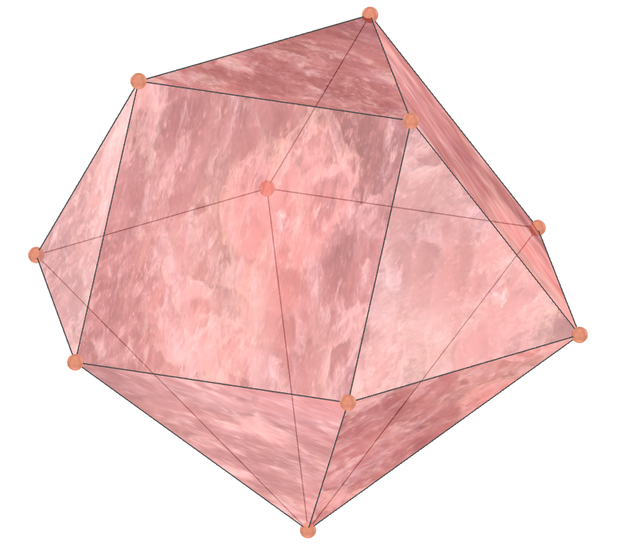
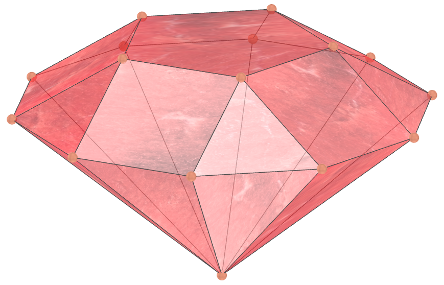
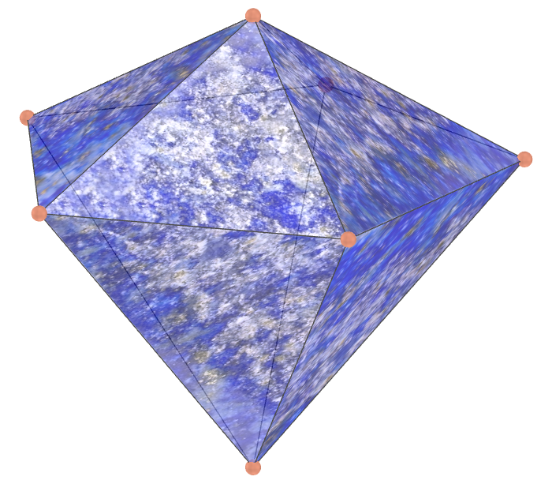
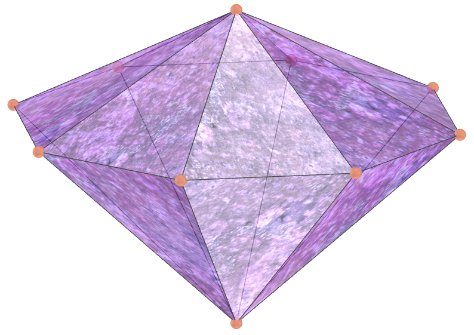
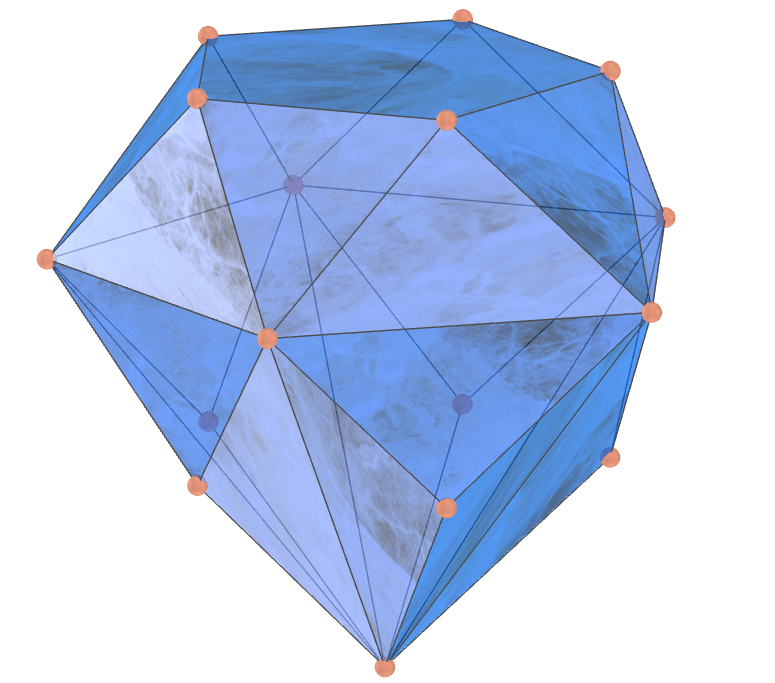
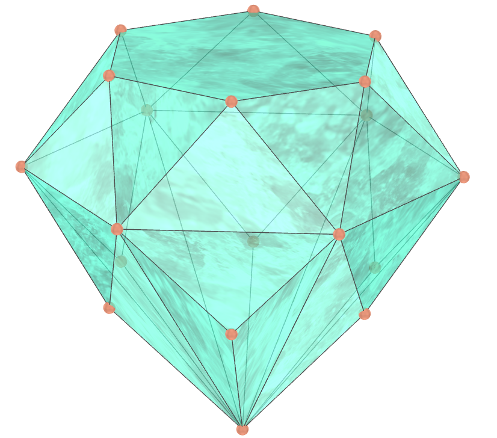
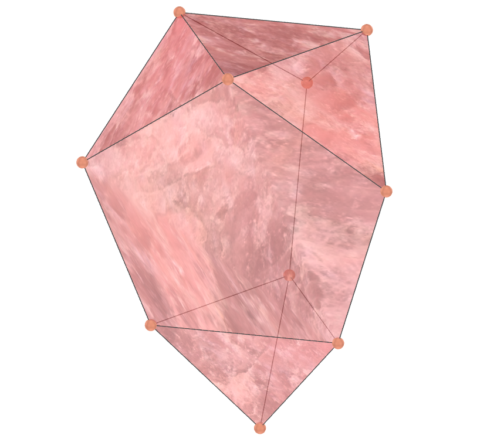
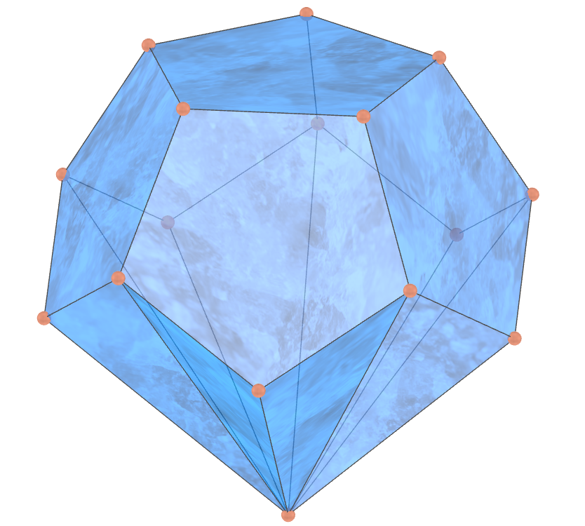
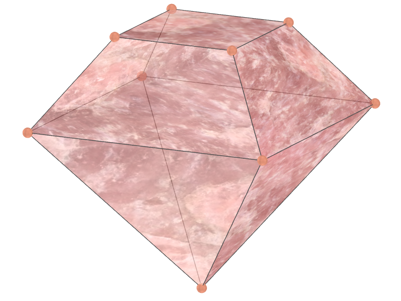
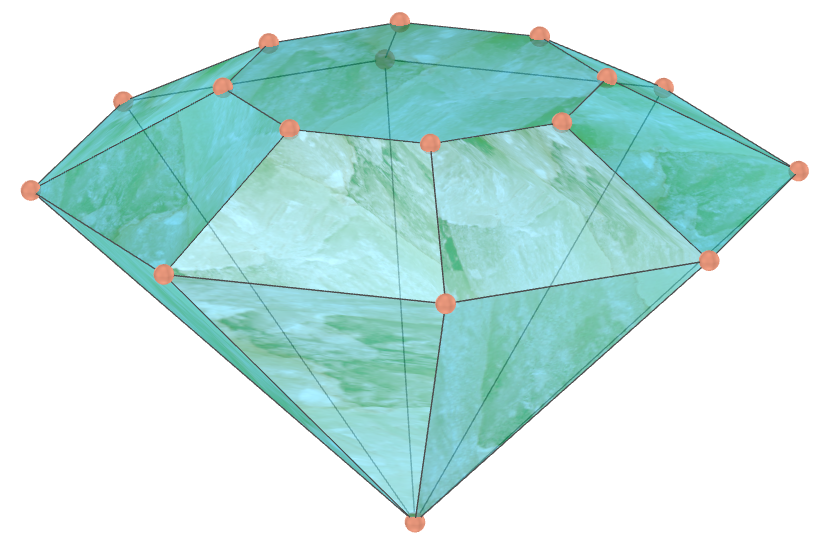

<link rel="stylesheet" href="../scripts/style.css">
<link rel="icon" type="image/png" href="vr/salas/imagens/icone.png">
<h2>Visualization of polyhedra with Augmented Reality (AR) and Virtual Reality (VR) in A-frame</h2>
 <b>author:</b> Paulo Henrique Siqueira - Universidade Federal do Paraná
  <b>contact:</b> <a href="#">paulohscwb@gmail.com</a>
  <a href="https://paulohscwb.github.io/polyhedra2/diamonds/pt-br/">versão em português</a>
 <form style="margin: 0 auto; float:right; text-align:right; width:100%; margin-bottom:15px;">
	<select id="url" onchange="urlHandler(this.value)" style="color:royalblue;">
		<option disabled selected value>More polyhedra:</option>
		<option value="../ArchimedeanCatalanHulls/">Archimedean and Catalan convex hulls</option>
		<option value="../fractalplatonic/">Platonic polyhedra fractals</option>
		<option value="../fractalnonconvex/">Non convex polyhedra fractals</option>
		<option value="../fractalarchimedean/">Archimedean polyhedra fractals</option>
		<option value="../chamfered/">Chamfered polyhedra</option>
		<option value="../propellor/">Propellor polyhedra</option>
		<option disabled value="../diamonds/">Diamond polyhedra</option>
	</select>
</form>

  <h2 align="center"> Diamond polyhedra</h2>
The diamonds.

 
<!-- 
<a href="#ra">Augmented Reality</a>&nbsp;&nbsp;|&nbsp;&nbsp;<a href="#m3d">3D Models</a>&nbsp;&nbsp;|&nbsp;&nbsp;<a href="../">Home</a>

  

 <h3 align="center">Immersive rooms</h3>

<iframe width="100%" src="sala1.htm" title="Sala Imersiva dos poliedros de diamante" frameborder="0" loading="lazy"></iframe>

  
<a href="sala1.htm" target="_blank">&#x1f517; room 1</a>&nbsp;&nbsp;|&nbsp;&nbsp;<a href="sala2.htm" target="_blank">&#x1f517; room 2</a>&nbsp;&nbsp;|&nbsp;&nbsp;<a href="sala3.htm" target="_blank">&#x1f517; room 3</a>&nbsp;&nbsp;|&nbsp;&nbsp;<a href="sala4.htm" target="_blank">&#x1f517; room 4</a>

  

  
 
  <h3 id="ra" align="center">Augmented Reality</h3>
  To view diamond polyhedra in AR, simply visit:

<a href="ra.html" class="raAR" target="_blank">https://paulohscwb.github.io/polyhedra2/diamonds/ra.html</a>
 
with any browser with a webcam device (smartphone, tablet or notebook). 
 Access to the VR sites is done by clicking on the blue circle that appears on top of the marker.

<h3 id="m3d" align="center">3D models</h3>
<!-- <iframe width="560" height="315" style="max-width:100%" src="https://www.youtube.com/embed/videoseries?list=PLy0I_lGW8HxU-mneUmSsccpRAAwbErHFq" title="YouTube video player" frameborder="0" allow="accelerometer; autoplay; clipboard-write; encrypted-media; gyroscope; picture-in-picture; web-share" allowfullscreen></iframe> -->
<h4>1. Diamond triangular cupola</h4>

   When we construct a right pyramid with a hexagonal base, which has the base coincident with the hexagonal face of a Johnson triangular cupola, we obtain a diamond triangular cupola. 
   <b>Faces:</b> 10 triangles and 3 squares | <b>Edges:</b> 21 | <b>Vertices:</b> 10. <a href="https://polytope.miraheze.org/wiki/Triangular_cupola" target="_blank">More...</a>
  

<h4>2. Diamond square cupola</h4>

   When we construct a right pyramid with a octagonal base, which has the base coincident with the octagonal face of a Johnson square cupola, we obtain a diamond square cupola.
   <b>Faces:</b> 12 triangles and 5 squares | <b>Edges:</b> 28 | <b>Vertices:</b> 13. <a href="https://polytope.miraheze.org/wiki/Square_cupola" target="_blank">More...</a>
  

<h4>3. Diamond pentagonal cupola</h4>

   When we construct a right pyramid with a decagonal base, which has the base coincident with the decagonal face of a Johnson pentagonal cupola, we obtain a diamond pentagonal cupola.
   <b>Faces:</b> 15 triangles, 5 squares and 1 pentagon | <b>Edges:</b> 35 | <b>Vertices:</b> 16. <a href="https://polytope.miraheze.org/wiki/Pentagonal_cupola" target="_blank">More...</a>
  

<h4>4. Diamond pentagonal rotunda</h4>

   When we construct a right pyramid with a decagonal base, which has the base coincident with the decagonal face of a Johnson pentagonal rotunda, we obtain a diamond pentagonal rotunda.
   <b>Faces:</b> 20 triangles and 6 pentagons | <b>Edges:</b> 45 | <b>Vertices:</b> 21. <a href="https://polytope.miraheze.org/wiki/Pentagonal_rotunda" target="_blank">More...</a>
  

<h4>5. Diamond pentagonal dipyramid</h4>

   If we construct a dipyramid using two right pentagonal pyramids with different heights, we obtain a diamond pentagonal dipyramid.
   <b>Faces:</b> 10 triangles | <b>Edges:</b> 15 | <b>Vertices:</b> 7. <a href="https://polytope.miraheze.org/wiki/Pentagonal_tegum" target="_blank">More...</a>
  

<h4>6. Diamond hexagonal dipyramid</h4>

   If we construct a dipyramid using two right hexagonal pyramids with different heights, we obtain a diamond hexagonal dipyramid.
   <b>Faces:</b> 12 triangles | <b>Edges:</b> 18 | <b>Vertices:</b> 8. <a href="https://mathworld.wolfram.com/HexagonalDipyramid.html" target="_blank">More...</a>
  

<h4>7. Diamond heptagonal dipyramid</h4>

   If we construct a dipyramid using two right heptagonal pyramids with different heights, we obtain a diamond heptagonal dipyramid. 
   <b>Faces:</b> 14 triangles | <b>Edges:</b> 21 | <b>Vertices:</b> 9. <a href="https://mathworld.wolfram.com/Dipyramid.html" target="_blank">More...</a>
  

<h4>8. Diamond octagonal dipyramid</h4>

   If we construct a dipyramid using two right octagonal pyramids with different heights, we obtain a diamond octagonal dipyramid.  
   <b>Faces:</b> 16 triangles | <b>Edges:</b> 24 | <b>Vertices:</b> 10. <a href="https://mathworld.wolfram.com/Dipyramid.html" target="_blank">More...</a>
  

<h4>9. Diamond square antiprism</h4>

   Consider a modified antiprism, with a square base reduced by a factor between 0.6 and 0.8. If we construct a right square pyramid with the base coinciding with the largest base of the antiprism, we obtain a diamond square antiprism. 
   <b>Faces:</b> 12 triangles and 1 square | <b>Edges:</b> 20 | <b>Vertices:</b> 9. <a href="https://mathworld.wolfram.com/Antiprism.html" target="_blank">More...</a>
  

<h4>10. Diamond pentagonal antiprism</h4>

   Consider a modified antiprism, with a pentagonal base reduced by a factor between 0.6 and 0.8. If we construct a right pentagonal pyramid with the base coinciding with the largest base of the antiprism, we obtain a diamond pentagonal antiprism. 
   <b>Faces:</b> 15 triangles and 1 pentagon | <b>Edges:</b> 25 | <b>Vertices:</b> 11. <a href="https://mathworld.wolfram.com/Antiprism.html" target="_blank">More...</a>
  

<h4>11. Diamond hexagonal antiprism</h4>

   Consider a modified antiprism, with a hexagonal base reduced by a factor between 0.6 and 0.8. If we construct a right hexagonal pyramid with the base coinciding with the largest base of the antiprism, we obtain a diamond hexagonal antiprism. 
   <b>Faces:</b> 18 triangles and 1 hexagon | <b>Edges:</b> 30 | <b>Vertices:</b> 13. <a href="https://mathworld.wolfram.com/Antiprism.html" target="_blank">More...</a>
  

<h4>12. Diamond heptagonal antiprism</h4>

   Consider a modified antiprism, with a heptagonal base reduced by a factor between 0.6 and 0.8. If we construct a right heptagonal pyramid with the base coinciding with the largest base of the antiprism, we obtain a diamond heptagonal antiprism. 
   <b>Faces:</b> 21 triangles and 1 heptagon | <b>Edges:</b> 35 | <b>Vertices:</b> 15. <a href="https://mathworld.wolfram.com/Antiprism.html" target="_blank">More...</a>
  

<h4>13. Diamond octagonal antiprism</h4>

   Consider a modified antiprism, with a octagonal base reduced by a factor between 0.6 and 0.8. If we construct a right octagonal pyramid with the base coinciding with the largest base of the antiprism, we obtain a diamond octagonal antiprism. 
   <b>Faces:</b> 24 triangles and 1 octagon | <b>Edges:</b> 40 | <b>Vertices:</b> 17. <a href="https://mathworld.wolfram.com/Antiprism.html" target="_blank">More...</a>
  

<h4>14. Diamond mirror square antiprism</h4>

   Consider a modified antiprism, with a square base reduced by a factor between 0.6 and 0.8. Find the reflection of the smaller base of the antiprism relative to the larger base. By joining the vertex of a right square pyramid with the vertices of the largest base and the reflected antiprism base, we find a diamond mirror square antiprism. 
   <b>Faces:</b> 20 triangles and 1 square | <b>Edges:</b> 32 | <b>Vertices:</b> 13. <a href="https://mathworld.wolfram.com/Antiprism.html" target="_blank">More...</a>
  

<h4>15. Diamond mirror pentagonal antiprism</h4>

   Consider a modified antiprism, with a pentagonal base reduced by a factor between 0.6 and 0.8. Find the reflection of the smaller base of the antiprism relative to the larger base. By joining the vertex of a right pentagonal pyramid with the vertices of the largest base and the reflected antiprism base, we find a diamond mirror pentagonal antiprism.
   <b>Faces:</b> 25 triangles and 1 pentagon | <b>Edges:</b> 40 | <b>Vertices:</b> 16. <a href="https://mathworld.wolfram.com/Antiprism.html" target="_blank">More...</a>
  

<h4>16. Diamond mirror hexagonal antiprism</h4>

   Consider a modified antiprism, with a hexagonal base reduced by a factor between 0.6 and 0.8. Find the reflection of the smaller base of the antiprism relative to the larger base. By joining the vertex of a right hexagonal pyramid with the vertices of the largest base and the reflected antiprism base, we find a diamond mirror hexagonal antiprism.
   <b>Faces:</b> 30 triangles and 1 hexagon | <b>Edges:</b> 48 | <b>Vertices:</b> 19. <a href="https://mathworld.wolfram.com/Antiprism.html" target="_blank">More...</a>
  

<h4>17. Diamond mirror heptagonal antiprism</h4>

   Consider a modified antiprism, with a heptagonal base reduced by a factor between 0.6 and 0.8. Find the reflection of the smaller base of the antiprism relative to the larger base. By joining the vertex of a right heptagonal pyramid with the vertices of the largest base and the reflected antiprism base, we find a diamond mirror heptagonal antiprism.
   <b>Faces:</b> 35 triangles and 1 heptagon | <b>Edges:</b> 56 | <b>Vertices:</b> 22. <a href="https://mathworld.wolfram.com/Antiprism.html" target="_blank">More...</a>
  

<h4>18. Diamond mirror octagonal antiprism</h4>

   Consider a modified antiprism, with a octagonal base reduced by a factor between 0.6 and 0.8. Find the reflection of the smaller base of the antiprism relative to the larger base. By joining the vertex of a right octagonal pyramid with the vertices of the largest base and the reflected antiprism base, we find a diamond mirror octagonal antiprism.
   <b>Faces:</b> 40 triangles and 1 octagon | <b>Edges:</b> 64 | <b>Vertices:</b> 25. <a href="https://mathworld.wolfram.com/Antiprism.html" target="_blank">More...</a>
  

<h4>19. Augmented tridiminished icosahedron</h4>

   Johnson's augmented tridiminished icosahedron can be considered a diamond polyhedron. It can be constructed by attaching a tetrahedron, seen as a triangular pyramid, to the triangular face of the tridiminished icosahedron which is connected only to the pentagons. It is the only Johnson solid that is constructed using decrease and increase, assuming that no decrease and increase cancel each other out.
   <b>Faces:</b> 7 triangles and 3 pentagons | <b>Edges:</b> 18 | <b>Vertices:</b> 10. <a href="https://polytope.miraheze.org/wiki/Augmented_tridiminished_icosahedron" target="_blank">More...</a>
  

<h4>20. Diamond augmented truncated tetrahedron</h4>

   When we construct a right pyramid with a triangular base, which has a base coinciding with a triangular face opposite the triangular copula, we obtain a diamond augmented truncated tetrahedron. 
   <b>Faces:</b> 10 triangles, 3 squares and 3 hexagons | <b>Edges:</b> 30 | <b>Vertices:</b> 16. <a href="https://polytope.miraheze.org/wiki/Augmented_truncated_tetrahedron" target="_blank">More...</a>
  

<h4>21. Diamond truncated snub square antiprism</h4>

   When we construct a right pyramid with an octagonal base, joining the apex vertex of this pyramid with the 8 vertices of one of the symmetrical parts of a snub square antiprism, we obtain a diamond truncated snub square antiprism.
   <b>Faces:</b> 20 triangles and 1 square | <b>Edges:</b> 32 | <b>Vertices:</b> 13. <a href="https://polytope.miraheze.org/wiki/Snub_square_antiprism" target="_blank">More...</a>
  

<h4>22. Diamond triangular hebesphenorotunda</h4>

   When we construct a right pyramid with a hexagonal base, which has the base coinciding with the hexagonal face of a triangular hebesphenorotunda, we obtain a diamond triangular hebesphenorotunda.
   <b>Faces:</b> 19 triangles, 3 squares and 3 pentagons | <b>Edges:</b> 42 | <b>Vertices:</b> 19. <a href="https://polytope.miraheze.org/wiki/Triangular_hebesphenorotunda" target="_blank">More...</a>
  

<h4>23. Diamond truncated triangular hebesphenorotunda</h4>

   Consider a modified triangular hebesphenorotunda, disregarding the hexagonal face and all other faces that are joined with the hexagon vertices. The solid obtained by joining a right pyramid with an enneagonal base with the other faces of the modified triangular hebesphenorotunda is a diamond truncated triangular hebesphenorotunda.
   <b>Faces:</b> 13 triangles and 3 pentagons | <b>Edges:</b> 27 | <b>Vertices:</b> 13. <a href="https://polytope.miraheze.org/wiki/Triangular_hebesphenorotunda" target="_blank">More...</a>
  

<h4>24. Diamond truncated triangular hebesphenorotunda</h4>

   Consider a modified triangular hebesphenorotunda, disregarding the pentagonal faces and the triangular face that is joined only with the pentagons vertices. The solid obtained by joining a right pyramid with an enneagonal base with the other faces of the modified triangular hebesphenorotunda is a diamond truncated triangular hebesphenorotunda.
   <b>Faces:</b> 18 triangles, 3 squares and 1 hexagon | <b>Edges:</b> 36 | <b>Vertices:</b> 15. <a href="https://polytope.miraheze.org/wiki/Triangular_hebesphenorotunda" target="_blank">More...</a>
  

<h4>25. Diamond truncated dodecahedron</h4>

   Consider a modified dodecahedron, disregarding one face and the 5 faces that are joined with this disregarded face. The solid obtained by joining a right decagonal pyramid with a the other faces of the modified dodecahedron is a diamond truncated dodecahedron.
   <b>Faces:</b> 10 triangles and 6 pentagons | <b>Edges:</b> 30 | <b>Vertices:</b> 16. <a href="https://mathworld.wolfram.com/Dodecahedron.html" target="_blank">More...</a>
  

<h4>26. Diamond truncated square pyramid</h4>

   When we construct a right square pyramid, which has the base coinciding with the base of a truncated square pyramid, we obtain a diamond truncated square pyramid.
   <b>Faces:</b> 4 triangles, 1 square and 4 trapezoids | <b>Edges:</b> 16 | <b>Vertices:</b> 9. <a href="https://mathworld.wolfram.com/PyramidalFrustum.html" target="_blank">More...</a>
  

<h4>27. Diamond truncated pentagonal pyramid</h4>

   When we construct a right pentagonal pyramid, which has the base coinciding with the base of a truncated pentagonal pyramid, we obtain a diamond truncated pentagonal pyramid.
   <b>Faces:</b> 5 triangles, 1 pentagon and 5 trapezoids | <b>Edges:</b> 20 | <b>Vertices:</b> 11. <a href="https://mathworld.wolfram.com/PyramidalFrustum.html" target="_blank">More...</a>
  

<h4>28. Diamond truncated hexagonal pyramid</h4>

   When we construct a right hexagonal pyramid, which has the base coinciding with the base of a truncated hexagonal pyramid, we obtain a diamond truncated hexagonal pyramid.
   <b>Faces:</b> 6 triangles, 1 hexagon and 6 trapezoids | <b>Edges:</b> 24 | <b>Vertices:</b> 13. <a href="https://mathworld.wolfram.com/PyramidalFrustum.html" target="_blank">More...</a>
  

<h4>29. Diamond truncated heptagonal pyramid</h4>

   When we construct a right heptagonal pyramid, which has the base coinciding with the base of a truncated heptagonal pyramid, we obtain a diamond truncated heptagonal pyramid.
   <b>Faces:</b> 7 triangles, 1 heptagon and 7 trapezoids | <b>Edges:</b> 28 | <b>Vertices:</b> 15. <a href="https://mathworld.wolfram.com/PyramidalFrustum.html" target="_blank">More...</a>
  

<h4>30. Diamond truncated octagonal pyramid</h4>

   When we construct a right octagonal pyramid, which has the base coinciding with the base of a truncated octagonal pyramid, we obtain a diamond truncated octagonal pyramid.
   <b>Faces:</b> 8 triangles, 1 octagon and 8 trapezoids | <b>Edges:</b> 32 | <b>Vertices:</b> 17. <a href="https://mathworld.wolfram.com/PyramidalFrustum.html" target="_blank">More...</a>
  

<h4>31. Diamond disdyakis dodecahedron</h4>

   When we construct a right octagonal pyramid, which has the base coinciding with the base of a truncated octagonal pyramid, we obtain a diamond truncated octagonal pyramid.
   <b>Faces:</b> 8 triangles, 1 octagon and 8 trapezoids | <b>Edges:</b> 32 | <b>Vertices:</b> 17. <a href="https://mathworld.wolfram.com/DisdyakisDodecahedron.html" target="_blank">More...</a>
  

<h4>32. Diamond triakis icosahedron</h4>

   When we construct a right octagonal pyramid, which has the base coinciding with the base of a truncated octagonal pyramid, we obtain a diamond truncated octagonal pyramid.
   <b>Faces:</b> 8 triangles, 1 octagon and 8 trapezoids | <b>Edges:</b> 32 | <b>Vertices:</b> 17. <a href="https://mathworld.wolfram.com/DisdyakisDodecahedron.html" target="_blank">More...</a>
  

<a href="#p1" class="topo">back to top</a>

  Diamond polyhedra - Visualization of polyhedra with Augmented Reality and Virtual Reality by <a xmlns:cc="http://creativecommons.org/ns#" href="https://paulohscwb.github.io/polyhedra2/diamonds/" property="cc:attributionName" rel="cc:attributionURL">Paulo Henrique Siqueira</a> is licensed with a license <a rel="license" href="http://creativecommons.org/licenses/by-nc-nd/4.0/">Creative Commons Attribution-NonCommercial-NoDerivatives 4.0 International</a>.

<h4>How to cite this work:</h4> 

Siqueira, P.H., "Diamond polyhedra - Visualization of polyhedra with Augmented Reality and Virtual Reality". Available in: <https://paulohscwb.github.io/polyhedra2/diamonds/>, November 2023.

<!---->
  <b>References:</b>
 Weisstein, Eric W. "Archimedean Solid" From MathWorld-A Wolfram Web Resource. <a href="http://mathworld.wolfram.com/ArchimedeanSolid.html" target="_blank">http://mathworld.wolfram.com/ArchimedeanSolid.html</a>
 Weisstein, Eric W. "Platonic Solid" From MathWorld-A Wolfram Web Resource. <a href="http://mathworld.wolfram.com/PlatonicSolid.html" target="_blank">http://mathworld.wolfram.com/PlatonicSolid.html</a>
 Weisstein, Eric W. "Archimedean Dual" From MathWorld-A Wolfram Web Resource. <a href="https://mathworld.wolfram.com/ArchimedeanDual.html" target="_blank">https://mathworld.wolfram.com/ArchimedeanDual.html</a>
 Weisstein, Eric W. "Uniform Polyhedron." From MathWorld--A Wolfram Web Resource. <a href="https://mathworld.wolfram.com/UniformPolyhedron.html" target="_blank">https://mathworld.wolfram.com/UniformPolyhedron.html</a>
 Wikipedia <a href="https://en.wikipedia.org/wiki/Archimedean_solid" target="_blank">https://en.wikipedia.org/wiki/Archimedean_solid</a>
 Wikipedia <a href="https://en.wikipedia.org/wiki/en.wikipedia.org/wiki/Platonic_solid" target="_blank">https://en.wikipedia.org/wiki/Platonic_solid</a>
 McCooey, David I. "Visual Polyhedra". <a href="http://dmccooey.com/polyhedra/" target="_blank">http://dmccooey.com/polyhedra/</a>
