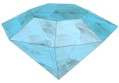
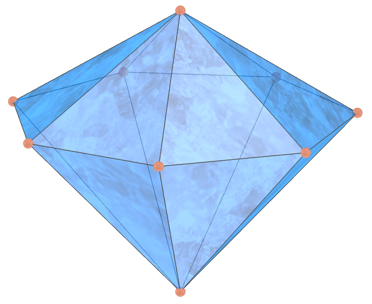

<link rel="stylesheet" href="../scripts/style.css">
<link rel="icon" type="image/png" href="vr/salas/imagens/icone.png">
<h2>Visualization of polyhedra with Augmented Reality (AR) and Virtual Reality (VR) in A-frame</h2>
 <b>author:</b> Paulo Henrique Siqueira - Universidade Federal do Paraná
  <b>contact:</b> <a href="#">paulohscwb@gmail.com</a>
  <a href="https://paulohscwb.github.io/polyhedra2/diamonds/pt-br/">versão em português</a>
 <form style="margin: 0 auto; float:right; text-align:right; width:100%; margin-bottom:15px;">
	<select id="url" onchange="urlHandler(this.value)" style="color:royalblue;">
		<option disabled selected value>More polyhedra:</option>
		<option value="../ArchimedeanCatalanHulls/">Archimedean and Catalan convex hulls</option>
		<option value="../fractalplatonic/">Platonic polyhedra fractals</option>
		<option value="../fractalnonconvex/">Non convex polyhedra fractals</option>
		<option value="../fractalarchimedean/">Archimedean polyhedra fractals</option>
		<option value="../chamfered/">Chamfered polyhedra</option>
		<option value="../propellor/">Propellor polyhedra</option>
		<option disabled value="../diamonds/">Diamond polyhedra</option>
	</select>
</form>

  <h2 align="center"> Diamond polyhedra</h2>
The diamonds.

 
<!-- 
<a href="#ra">Augmented Reality</a>&nbsp;&nbsp;|&nbsp;&nbsp;<a href="#m3d">3D Models</a>&nbsp;&nbsp;|&nbsp;&nbsp;<a href="../">Home</a>

  

 <h3 align="center">Immersive rooms</h3>

<iframe width="100%" src="sala1.htm" title="Sala Imersiva dos poliedros de diamante" frameborder="0" loading="lazy"></iframe>

  
<a href="sala1.htm" target="_blank">&#x1f517; room 1</a>&nbsp;&nbsp;|&nbsp;&nbsp;<a href="sala2.htm" target="_blank">&#x1f517; room 2</a>&nbsp;&nbsp;|&nbsp;&nbsp;<a href="sala3.htm" target="_blank">&#x1f517; room 3</a>&nbsp;&nbsp;|&nbsp;&nbsp;<a href="sala4.htm" target="_blank">&#x1f517; room 4</a>

  

  
 
  <h3 id="ra" align="center">Augmented Reality</h3>
  To view diamond polyhedra in AR, simply visit:

<a href="ra.html" class="raAR" target="_blank">https://paulohscwb.github.io/polyhedra2/diamonds/ra.html</a>
 
with any browser with a webcam device (smartphone, tablet or notebook). 
 Access to the VR sites is done by clicking on the blue circle that appears on top of the marker.

<h3 id="m3d" align="center">3D models</h3>
<!-- <iframe width="560" height="315" style="max-width:100%" src="https://www.youtube.com/embed/videoseries?list=PLy0I_lGW8HxU-mneUmSsccpRAAwbErHFq" title="YouTube video player" frameborder="0" allow="accelerometer; autoplay; clipboard-write; encrypted-media; gyroscope; picture-in-picture; web-share" allowfullscreen></iframe> -->
<h4>1. Triangular cupola</h4>

    A propellor tetrahedron is a polyhedron obtained by performing propellor operations on a regular tetrahedron. 
    <b>Faces:</b> 4 equilateral triangles and 12 kites | <b>Edges:</b> 30 | <b>Vertices:</b> 16. <a href="http://dmccooey.com/polyhedra/Propellor.html" target="_blank">More...</a>
  

<h4>2. Square cupola</h4>

    A propellor tetrahedron is a polyhedron obtained by performing propellor operations on a regular tetrahedron. 
    <b>Faces:</b> 4 equilateral triangles and 12 kites | <b>Edges:</b> 30 | <b>Vertices:</b> 16. <a href="http://dmccooey.com/polyhedra/Propellor.html" target="_blank">More...</a>
  

<h4>3. Pentagonal cupola</h4>

    A propellor tetrahedron is a polyhedron obtained by performing propellor operations on a regular tetrahedron. 
    <b>Faces:</b> 4 equilateral triangles and 12 kites | <b>Edges:</b> 30 | <b>Vertices:</b> 16. <a href="http://dmccooey.com/polyhedra/Propellor.html" target="_blank">More...</a>
  

<h4>4. Pentagonal rotunda</h4>

    A propellor tetrahedron is a polyhedron obtained by performing propellor operations on a regular tetrahedron. 
    <b>Faces:</b> 4 equilateral triangles and 12 kites | <b>Edges:</b> 30 | <b>Vertices:</b> 16. <a href="http://dmccooey.com/polyhedra/Propellor.html" target="_blank">More...</a>
  

<h4>5. Pentagonal dipyramid</h4>

    A propellor tetrahedron is a polyhedron obtained by performing propellor operations on a regular tetrahedron. 
    <b>Faces:</b> 4 equilateral triangles and 12 kites | <b>Edges:</b> 30 | <b>Vertices:</b> 16. <a href="http://dmccooey.com/polyhedra/Propellor.html" target="_blank">More...</a>
  

<h4>6. Heptagonal dipyramid</h4>

    A propellor tetrahedron is a polyhedron obtained by performing propellor operations on a regular tetrahedron. 
    <b>Faces:</b> 4 equilateral triangles and 12 kites | <b>Edges:</b> 30 | <b>Vertices:</b> 16. <a href="http://dmccooey.com/polyhedra/Propellor.html" target="_blank">More...</a>
  

<h4>7. Octagonal dipyramid</h4>

    A propellor tetrahedron is a polyhedron obtained by performing propellor operations on a regular tetrahedron. 
    <b>Faces:</b> 4 equilateral triangles and 12 kites | <b>Edges:</b> 30 | <b>Vertices:</b> 16. <a href="http://dmccooey.com/polyhedra/Propellor.html" target="_blank">More...</a>
  

<a href="#p1" class="topo">back to top</a>

  Diamond polyhedra - Visualization of polyhedra with Augmented Reality and Virtual Reality by <a xmlns:cc="http://creativecommons.org/ns#" href="https://paulohscwb.github.io/polyhedra2/diamonds/" property="cc:attributionName" rel="cc:attributionURL">Paulo Henrique Siqueira</a> is licensed with a license <a rel="license" href="http://creativecommons.org/licenses/by-nc-nd/4.0/">Creative Commons Attribution-NonCommercial-NoDerivatives 4.0 International</a>.

<h4>How to cite this work:</h4> 

Siqueira, P.H., "Diamond polyhedra - Visualization of polyhedra with Augmented Reality and Virtual Reality". Available in: <https://paulohscwb.github.io/polyhedra2/diamonds/>, November 2023.

<!---->
  <b>References:</b>
 Weisstein, Eric W. "Archimedean Solid" From MathWorld-A Wolfram Web Resource. <a href="http://mathworld.wolfram.com/ArchimedeanSolid.html" target="_blank">http://mathworld.wolfram.com/ArchimedeanSolid.html</a>
 Weisstein, Eric W. "Platonic Solid" From MathWorld-A Wolfram Web Resource. <a href="http://mathworld.wolfram.com/PlatonicSolid.html" target="_blank">http://mathworld.wolfram.com/PlatonicSolid.html</a>
 Weisstein, Eric W. "Archimedean Dual" From MathWorld-A Wolfram Web Resource. <a href="https://mathworld.wolfram.com/ArchimedeanDual.html" target="_blank">https://mathworld.wolfram.com/ArchimedeanDual.html</a>
 Weisstein, Eric W. "Uniform Polyhedron." From MathWorld--A Wolfram Web Resource. <a href="https://mathworld.wolfram.com/UniformPolyhedron.html" target="_blank">https://mathworld.wolfram.com/UniformPolyhedron.html</a>
 Wikipedia <a href="https://en.wikipedia.org/wiki/Archimedean_solid" target="_blank">https://en.wikipedia.org/wiki/Archimedean_solid</a>
 Wikipedia <a href="https://en.wikipedia.org/wiki/en.wikipedia.org/wiki/Platonic_solid" target="_blank">https://en.wikipedia.org/wiki/Platonic_solid</a>
 McCooey, David I. "Visual Polyhedra". <a href="http://dmccooey.com/polyhedra/" target="_blank">http://dmccooey.com/polyhedra/</a>
