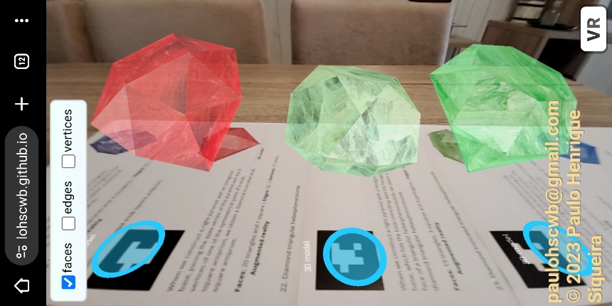
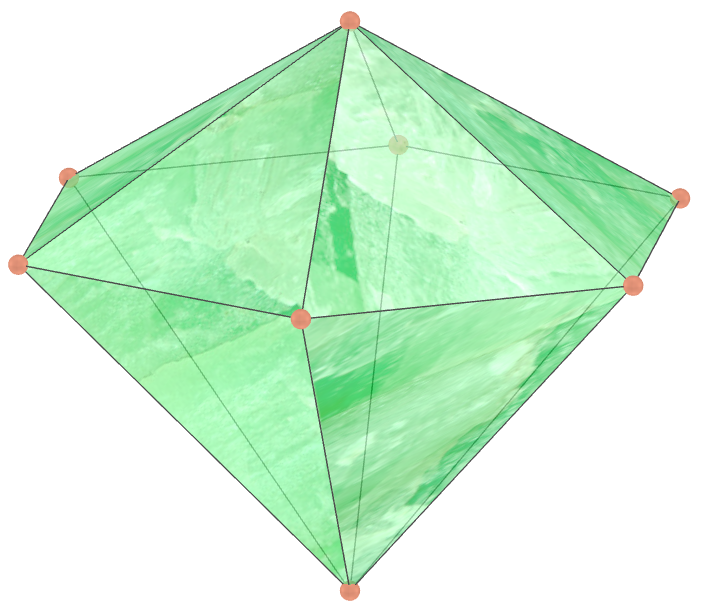
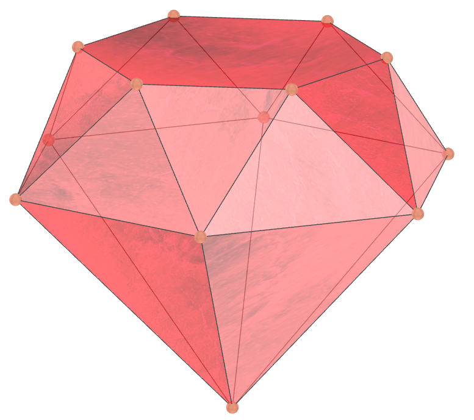
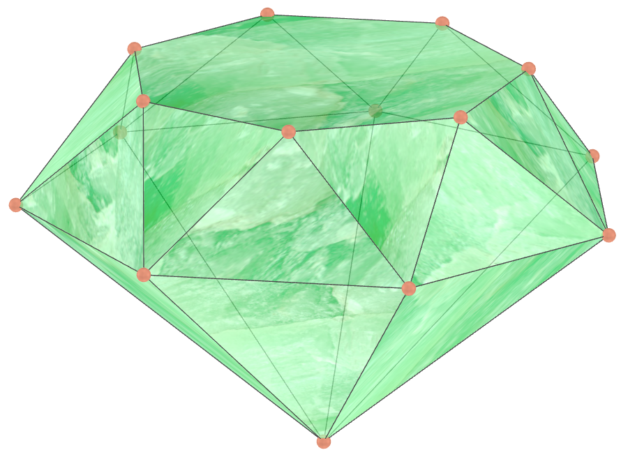
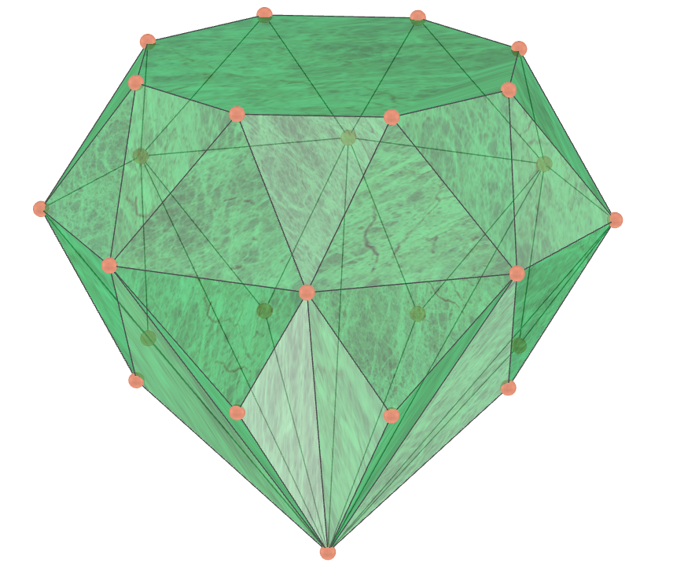
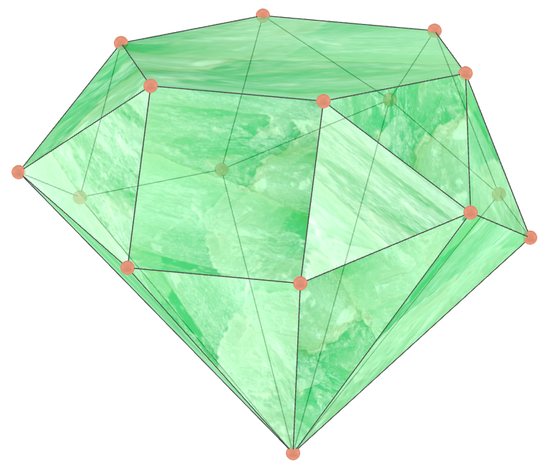

<link rel="stylesheet" href="../../scripts/style.css">
<link rel="icon" type="image/png" href="../vr/salas/imagens/icone.png">
<h2>Visualização de poliedros com Realidade Aumentada (RA) e Realidade Virtual (RV) em A-frame</h2>
<b>autor:</b> Paulo Henrique Siqueira - Universidade Federal do Paraná
 <b>contato:</b> <a href="#"> paulohscwb@gmail.com </a>
 <a href="https://paulohscwb.github.io/polyhedra2/diamonds/">english version</a>
<form style="margin: 0 auto; float:right; text-align:right; width:100%; margin-bottom:15px;">
	<select id="url" onchange="urlHandler(this.value)" style="color:royalblue;">
		<option disabled selected>Mais poliedros:</option>
		<option value="../../ArchimedeanCatalanHulls/pt-br/">Cascos convexos de Arquimedes e Catalan</option>
		<option value="../../fractalplatonic/pt-br/">Fractais dos poliedros de Platão</option>
		<option value="../../fractalnonconvex/pt-br/">Fractais dos poliedros não convexos</option>
		<option value="../../fractalarchimedean/pt-br/">Fractais dos poliedros de Arquimedes</option>
		<option value="../../chamfered/pt-br/">Poliedros chanfrados</option>
		<option value="../../propellor/pt-br/">Poliedros de hélice</option>
		<option disabled value="../../diamonds/pt-br/">Poliedros de diamante</option>
	</select>
</form>

  <h2 align="center"> Poliedros de diamante</h2>
  Os diamantes.
 

<a href="#ra">Realidade Aumentada</a>&nbsp;&nbsp;|&nbsp;&nbsp;<a href="#m3d">Modelos 3D</a>&nbsp;&nbsp;|&nbsp;&nbsp;<a href="../../pt-br/">Página Inicial</a>

<!-- <h3 align="center">Salas imersivas</h3>
  
<iframe width="100%" src="../sala1.htm" title="Sala Imersiva dos poliedros de diamante" frameborder="0" loading="lazy"></iframe>

  
<a href="../sala1.htm" target="_blank">&#x1f517; sala 1</a>&nbsp;&nbsp;|&nbsp;&nbsp;<a href="../sala2.htm" target="_blank">&#x1f517; sala 2</a>&nbsp;&nbsp;|&nbsp;&nbsp;<a href="../sala3.htm" target="_blank">&#x1f517; sala 3</a>&nbsp;&nbsp;|&nbsp;&nbsp;<a href="../sala4.htm" target="_blank">&#x1f517; sala 4</a>

  

  
 
  <h3 id="ra" align="center">Realidade Aumentada</h3>
  Para visualizar os poliedros de diamante em RA, visite a página:

<a href="../ra.html" class="raAR" target="_blank">https://paulohscwb.github.io/polyhedra2/diamonds/ra.html</a>
 
com qualquer navegador com um dispositivo de webcam (smartphone, tablet ou notebook).
 O acesso às páginas de RV é feito clicando no círculo azul que aparece em cima de cada marcador.

<h3 id="m3d" align="center">Modelos 3D</h3>
<!-- <iframe width="560" height="315" style="max-width:100%" src="https://www.youtube.com/embed/videoseries?list=PLy0I_lGW8HxU-mneUmSsccpRAAwbErHFq" title="YouTube video player" frameborder="0" allow="accelerometer; autoplay; clipboard-write; encrypted-media; gyroscope; picture-in-picture; web-share" allowfullscreen></iframe> -->
<h4>1. Cúpula triangular de diamante</h4>

   Quando construímos uma pirâmide reta de base hexagonal, que tem a base coincidente com a face hexagonal de uma cúpula triangular de Johnson, obtemos uma cúpula triangular de diamante. 
   <b>Faces:</b> 10 triângulos e 3 quadrados | <b>Arestas:</b> 21 | <b>Vértices:</b> 10. <a href="https://polytope.miraheze.org/wiki/Triangular_cupola" target="_blank">Mais sobre...</a>
  

<h4>2. Cúpula quadrada de diamante</h4>

   Quando construímos uma pirâmide reta de base octogonal, que tem a base coincidente com a face octogonal de uma cúpula quadrada de Johnson, obtemos uma cúpula quadrada de diamante. 
   <b>Faces:</b> 12 triângulos e 5 quadrados | <b>Arestas:</b> 28 | <b>Vértices:</b> 13. <a href="https://polytope.miraheze.org/wiki/Square_cupola" target="_blank">Mais sobre...</a>
  

<h4>3. Cúpula pentagonal de diamante</h4>

   Quando construímos uma pirâmide reta de base decagonal, que tem a base coincidente com a face decagonal de uma cúpula pentagonal de Johnson, obtemos uma cúpula pentagonal de diamante. 
   <b>Faces:</b> 15 triângulos, 5 quadrados e 1 pentágono | <b>Arestas:</b> 35 | <b>Vértices:</b> 16. <a href="https://polytope.miraheze.org/wiki/Pentagonal_cupola" target="_blank">Mais sobre...</a>
  

<h4>4. Rotunda pentagonal de diamante</h4>

   Quando construímos uma pirâmide reta de base decagonal, que tem a base coincidente com a face decagonal de uma rotunda pentagonal de Johnson, obtemos uma rotunda pentagonal de diamante.
   <b>Faces:</b> 20 triângulos e 6 pentágonos | <b>Arestas:</b> 45 | <b>Vértices:</b> 21. <a href="https://polytope.miraheze.org/wiki/Pentagonal_rotunda" target="_blank">Mais sobre...</a>
  

<h4>5. Dipirâmide pentagonal de diamante</h4>

   Se construirmos uma dipirâmide usando duas pirâmides pentagonais retas com alturas diferentes, obtemos uma dipirâmide pentagonal de diamante.
   <b>Faces:</b> 10 triângulos | <b>Arestas:</b> 15 | <b>Vértices:</b> 7. <a href="https://polytope.miraheze.org/wiki/Pentagonal_tegum" target="_blank">Mais sobre...</a>
  

<h4>6. Dipirâmide hexagonal de diamante</h4>

   Se construirmos uma dipirâmide usando duas pirâmides hexagonais retas com alturas diferentes, obtemos uma dipirâmide hexagonal de diamante.
   <b>Faces:</b> 12 triângulos | <b>Arestas:</b> 18 | <b>Vértices:</b> 8. <a href="https://mathworld.wolfram.com/HexagonalDipyramid.html" target="_blank">Mais sobre...</a>
  

<h4>7. Dipirâmide heptagonal de diamante</h4>

   Se construirmos uma dipirâmide usando duas pirâmides heptagonais retas com alturas diferentes, obtemos uma dipirâmide heptagonal de diamante. 
   <b>Faces:</b> 14 triângulos | <b>Arestas:</b> 21 | <b>Vértices:</b> 9. <a href="https://mathworld.wolfram.com/Dipyramid.html" target="_blank">Mais sobre...</a>
  

<h4>8. Dipirâmide octogonal de diamante</h4>

   Se construirmos uma dipirâmide usando duas pirâmides octogonais retas com alturas diferentes, obtemos uma dipirâmide octogonal de diamante. 
   <b>Faces:</b> 16 triângulos | <b>Arestas:</b> 24 | <b>Vértices:</b> 10. <a href="https://mathworld.wolfram.com/Dipyramid.html" target="_blank">Mais sobre...</a>
  

<h4>9. Antiprisma quadrado de diamante</h4>

   Considere um antiprisma modificado, com uma base quadrada reduzida com um fator entre 0.6 e 0.8. Se construirmos uma pirâmide reta quadrada com a base coincidente com a base maior do antiprisma, obtemos um antiprisma quadrado de diamante.
   <b>Faces:</b> 12 triângulos e 1 quadrado | <b>Arestas:</b> 20 | <b>Vértices:</b> 9. <a href="https://mathworld.wolfram.com/Antiprism.html" target="_blank">Mais sobre...</a>
  

<h4>10. Antiprisma pentagonal de diamante</h4>

   Considere um antiprisma modificado, com uma base pentagonal reduzida com um fator entre 0.6 e 0.8. Se construirmos uma pirâmide reta pentagonal com a base coincidente com a base maior do antiprisma, obtemos um antiprisma pentagonal de diamante. 
   <b>Faces:</b> 15 triângulos e 1 pentágono | <b>Arestas:</b> 25 | <b>Vértices:</b> 11. <a href="https://mathworld.wolfram.com/Antiprism.html" target="_blank">Mais sobre...</a>
  

<h4>11. Antiprisma hexagonal de diamante</h4>

   Considere um antiprisma modificado, com uma base hexagonal reduzida com um fator entre 0.6 e 0.8. Se construirmos uma pirâmide reta hexagonal com a base coincidente com a base maior do antiprisma, obtemos um antiprisma hexagonal de diamante.
   <b>Faces:</b> 18 triângulos e 1 hexágono | <b>Arestas:</b> 30 | <b>Vértices:</b> 13. <a href="https://mathworld.wolfram.com/Antiprism.html" target="_blank">Mais sobre...</a>
  

<h4>12. Antiprisma heptagonal de diamante</h4>

   Considere um antiprisma modificado, com uma base heptagonal reduzida com um fator entre 0.6 e 0.8. Se construirmos uma pirâmide reta heptagonal com a base coincidente com a base maior do antiprisma, obtemos um antiprisma heptagonal de diamante. 
   <b>Faces:</b> 21 triângulos e 1 heptágono | <b>Arestas:</b> 35 | <b>Vértices:</b> 15. <a href="https://mathworld.wolfram.com/Antiprism.html" target="_blank">Mais sobre...</a>
  

<h4>13. Antiprisma octogonal de diamante</h4>

   Considere um antiprisma modificado, com uma base octogonal reduzida com um fator entre 0.6 e 0.8. Se construirmos uma pirâmide reta octogonal com a base coincidente com a base maior do antiprisma, obtemos um antiprisma octogonal de diamante. 
   <b>Faces:</b> 24 triângulos e 1 octógono | <b>Arestas:</b> 40 | <b>Vértices:</b> 17. <a href="https://mathworld.wolfram.com/Antiprism.html" target="_blank">Mais sobre...</a>
  

<h4>14. Antiprisma quadrado refletido de diamante</h4>

   Considere um antiprisma modificado, com uma base quadrada reduzida com um fator entre 0.6 e 0.8. Encontre a reflexão da base menor do antiprisma em relação à base maior. Unindo-se o vértice de uma pirâmide reta quadrada com os vértices da base maior e da base refletida do antiprisma, encontramos um antiprisma quadrado refletido de diamante.  
   <b>Faces:</b> 20 triângulos e 1 quadrado | <b>Arestas:</b> 32 | <b>Vértices:</b> 13. <a href="https://mathworld.wolfram.com/Antiprism.html" target="_blank">Mais sobre...</a>
  

<h4>15. Antiprisma pentagonal refletido de diamante</h4>

   Considere um antiprisma modificado, com uma base pentagonal reduzida com um fator entre 0.6 e 0.8. Encontre a reflexão da base menor do antiprisma em relação à base maior. Unindo-se o vértice de uma pirâmide reta pentagonal com os vértices da base maior e da base refletida do antiprisma, encontramos um antiprisma pentagonal refletido de diamante.  
   <b>Faces:</b> 25 triângulos e 1 pentágono | <b>Arestas:</b> 40 | <b>Vértices:</b> 16. <a href="https://mathworld.wolfram.com/Antiprism.html" target="_blank">Mais sobre...</a>
  

<h4>16. Antiprisma hexagonal refletido de diamante</h4>

   Considere um antiprisma modificado, com uma base hexagonal reduzida com um fator entre 0.6 e 0.8. Encontre a reflexão da base menor do antiprisma em relação à base maior. Unindo-se o vértice de uma pirâmide reta hexagonal com os vértices da base maior e da base refletida do antiprisma, encontramos um antiprisma hexagonal refletido de diamante.  
   <b>Faces:</b> 30 triângulos e 1 hexágono | <b>Arestas:</b> 48 | <b>Vértices:</b> 19. <a href="https://mathworld.wolfram.com/Antiprism.html" target="_blank">Mais sobre...</a>
  

<h4>17. Antiprisma heptagonal refletido de diamante</h4>

   Considere um antiprisma modificado, com uma base heptagonal reduzida com um fator entre 0.6 e 0.8. Encontre a reflexão da base menor do antiprisma em relação à base maior. Unindo-se o vértice de uma pirâmide reta heptagonal com os vértices da base maior e da base refletida do antiprisma, encontramos um antiprisma heptagonal refletido de diamante. 
   <b>Faces:</b> 35 triângulos e 1 heptágono | <b>Arestas:</b> 56 | <b>Vértices:</b> 22. <a href="https://mathworld.wolfram.com/Antiprism.html" target="_blank">Mais sobre...</a>
  

<h4>18. Antiprisma octagonal refletido de diamante</h4>

   Considere um antiprisma modificado, com uma base octogonal reduzida com um fator entre 0.6 e 0.8. Encontre a reflexão da base menor do antiprisma em relação à base maior. Unindo-se o vértice de uma pirâmide reta octogonal com os vértices da base maior e da base refletida do antiprisma, encontramos um antiprisma octogonal refletido de diamante. 
   <b>Faces:</b> 40 triângulos e 1 octógono | <b>Arestas:</b> 64 | <b>Vértices:</b> 25. <a href="https://mathworld.wolfram.com/Antiprism.html" target="_blank">Mais sobre...</a>
  

<h4>19. Icosaedro tridiminuído aumentado</h4>

   O icosaedro tridiminuído aumentado de Johnson pode ser considerado um poliedro de diamante. Pode ser construído anexando um tetraedro, visto como uma pirâmide triangular, à face triangular do icosaedro tridiminuído que está conectada apenas aos pentágonos. É o único sólido de Johnson que é construído usando diminuição e aumento, assumindo que nenhuma diminuição e aumento se anulam. 
   <b>Faces:</b> 7 triângulos e 3 pentágonos | <b>Arestas:</b> 18 | <b>Vértices:</b> 10. <a href="https://polytope.miraheze.org/wiki/Augmented_tridiminished_icosahedron" target="_blank">Mais sobre...</a>
  

<h4>20. Tetraedro truncado aumentado de diamante</h4>

   Quando construímos uma pirâmide reta de base triangular, que tem a base coincidente com a face triangular oposta à cúpula triangular, obtemos um tetraedro truncado aumentado de diamante.
   <b>Faces:</b> 10 triângulos, 3 quadrados e 3 hexágonos | <b>Arestas:</b> 30 | <b>Vértices:</b> 16. <a href="https://polytope.miraheze.org/wiki/Augmented_truncated_tetrahedron" target="_blank">Mais sobre...</a>
  

<h4>21. Antiprisma snub quadrado truncado de diamante</h4>

   Quando construímos uma pirâmide reta de base octogonal, unindo o vértice principal desta pirâmide com os 8 vértices de uma das partes simétricas de um antiprisma snub quadrado, obtemos um antiprisma snub quadrado truncado de diamante.
   <b>Faces:</b> 20 triângulos e 1 quadrado | <b>Arestas:</b> 32 | <b>Vértices:</b> 13. <a href="https://polytope.miraheze.org/wiki/Snub_square_antiprism" target="_blank">Mais sobre...</a>
  

<h4>22. Hebesfenorotunda triangular de diamante</h4>

   Quando construímos uma pirâmide reta de base hexagonal, que tem a base coincidente com a face hexagonal de uma hebesfenorotunda triangular, obtemos uma hebesfenorotunda triangular de diamante. 
   <b>Faces:</b> 19 triângulos, 3 quadrados e 3 pentágonos | <b>Arestas:</b> 42 | <b>Vértices:</b> 19. <a href="https://polytope.miraheze.org/wiki/Triangular_hebesphenorotunda" target="_blank">Mais sobre...</a>
  

<h4>23. Hebesfenorotunda triangular truncada de diamante</h4>

   Considere uma hebesfenorotunda triangular modificada, desconsiderando a face hexagonal e todas as demais faces que estão unidas aos vértices do hexágono. O sólido obtido com a união de uma pirâmide reta de base eneagonal com as demais faces da hebesfenorotunda triangular modificada é uma hebesfenorotunda triangular truncada de diamante. 
   <b>Faces:</b> 13 triângulos e 3 pentágonos | <b>Arestas:</b> 27 | <b>Vértices:</b> 13. <a href="https://polytope.miraheze.org/wiki/Triangular_hebesphenorotunda" target="_blank">Mais sobre...</a>
  

<h4>24. Hebesfenorotunda triangular truncada de diamante</h4>

   Considere uma hebesfenorotunda triangular modificada, desconsiderando as faces pentagonais e a face triangular que está unida apenas com os vértices dos pentágonos. O sólido obtido com a união de uma pirâmide reta de base eneagonal com as demais faces da hebesfenorotunda triangular modificada é uma hebesfenorotunda triangular truncada de diamante. 
   <b>Faces:</b> 18 triângulos, 3 quadrados e 1 hexágono | <b>Arestas:</b> 36 | <b>Vértices:</b> 15. <a href="https://polytope.miraheze.org/wiki/Triangular_hebesphenorotunda" target="_blank">Mais sobre...</a>
  

<h4>25. Dodecaedro truncado de diamante</h4>

   Considere uma hebesfenorotunda triangular modificada, desconsiderando as faces pentagonais e a face triangular que está unida apenas com os vértices dos pentágonos. O sólido obtido com a união de uma pirâmide reta de base eneagonal com as demais faces da hebesfenorotunda triangular modificada é uma hebesfenorotunda triangular truncada de diamante. 
   <b>Faces:</b> 18 triângulos, 3 quadrados e 1 hexágono | <b>Arestas:</b> 36 | <b>Vértices:</b> 15. <a href="https://polytope.miraheze.org/wiki/Triangular_hebesphenorotunda" target="_blank">Mais sobre...</a>
  

<a href="#p1" class="topo">voltar ao topo</a>

  Diamond polyhedra - Visualization of polyhedra with Augmented Reality and Virtual Reality de <a xmlns:cc="http://creativecommons.org/ns#" href="https://paulohscwb.github.io/polyhedra2/diamonds/pt-br/" property="cc:attributionName" rel="cc:attributionURL">Paulo Henrique Siqueira</a> está licenciado com uma Licença <a rel="license" href="http://creativecommons.org/licenses/by-nc-nd/4.0/">Creative Commons Atribuição-NãoComercial-SemDerivações 4.0 Internacional</a>.

<h4>Como citar este trabalho:</h4> 

Siqueira, P.H., "Diamond polyhedra - Visualization of polyhedra with Augmented Reality and Virtual Reality". Disponível em: <https://paulohscwb.github.io/polyhedra2/diamonds/pt-br/>, Novembro de 2023.

<!---->
  <b>Referências:</b>
 Weisstein, Eric W. "Archimedean Solid" From MathWorld-A Wolfram Web Resource. <a href="http://mathworld.wolfram.com/ArchimedeanSolid.html" target="_blank">http://mathworld.wolfram.com/ArchimedeanSolid.html</a>
 Weisstein, Eric W. "Platonic Solid" From MathWorld-A Wolfram Web Resource. <a href="http://mathworld.wolfram.com/PlatonicSolid.html" target="_blank">http://mathworld.wolfram.com/PlatonicSolid.html</a>
 Weisstein, Eric W. "Archimedean Dual" From MathWorld-A Wolfram Web Resource. <a href="https://mathworld.wolfram.com/ArchimedeanDual.html" target="_blank">https://mathworld.wolfram.com/ArchimedeanDual.html</a>
 Weisstein, Eric W. "Uniform Polyhedron." From MathWorld--A Wolfram Web Resource. <a href="https://mathworld.wolfram.com/UniformPolyhedron.html" target="_blank">https://mathworld.wolfram.com/UniformPolyhedron.html</a>
 Wikipedia <a href="https://en.wikipedia.org/wiki/Archimedean_solid" target="_blank">https://en.wikipedia.org/wiki/Archimedean_solid</a>
 Wikipedia <a href="https://en.wikipedia.org/wiki/en.wikipedia.org/wiki/Platonic_solid" target="_blank">https://en.wikipedia.org/wiki/Platonic_solid</a>
 McCooey, David I. "Visual Polyhedra". <a href="http://dmccooey.com/polyhedra/" target="_blank">http://dmccooey.com/polyhedra/</a>
