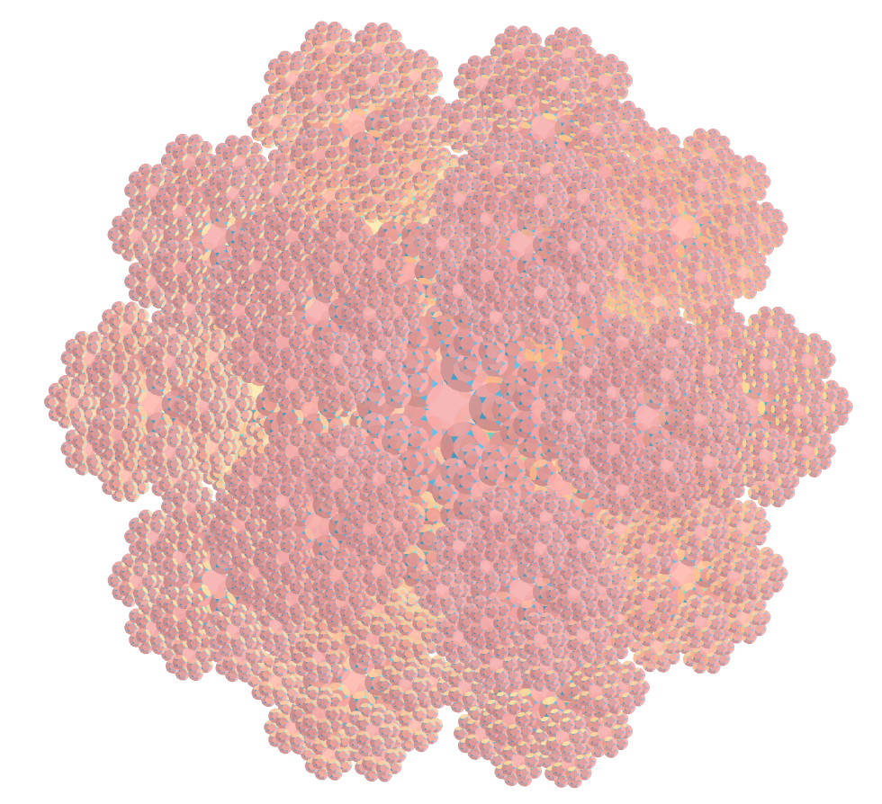
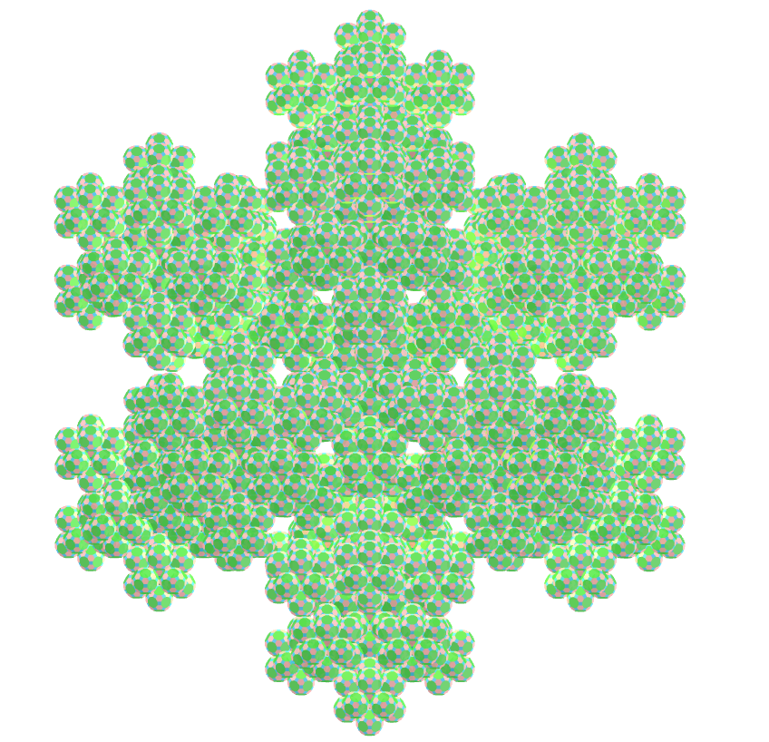
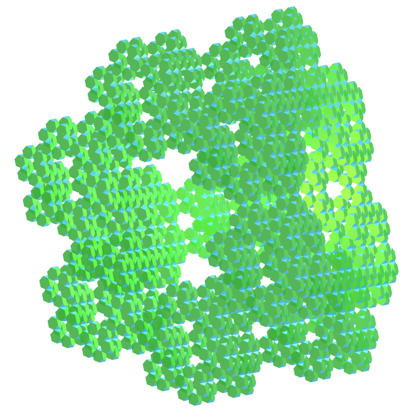

<link rel="stylesheet" href="../scripts/style.css">
<link rel="icon" type="image/png" href="vr/salas/imagens/icone.png">
<h2>Visualization of polyhedra with Augmented Reality (AR) and Virtual Reality (VR) in A-frame</h2>
 <b>author:</b> Paulo Henrique Siqueira - Universidade Federal do Paraná
  <b>contact:</b> <a href="#">paulohscwb@gmail.com</a>
  <a href="https://paulohscwb.github.io/polyhedra2/fractalarchimedean/pt-br/">versão em português</a>
 <form style="margin: 0 auto; float:right; text-align:right; width:100%; margin-bottom:15px;">
	<select id="url" onchange="urlHandler(this.value)" style="color:royalblue;">
		<option disabled selected value>More polyhedra:</option>
		<option value="../ArchimedeanCatalanHulls/pt-br/">Archimedean and Catalan convex hulls</option>
		<option value="../fractalplatonic/pt-br/">Platonic polyhedra fractals</option>
		<option value="../fractalnonconvex/pt-br/">Non convex polyhedra fractals</option>
		<option disabled value="../fractalarchimedean/pt-br/">Archimedean polyhedra fractals</option>
	</select>
</form>

  <h2 align="center"> Archimedean polyhedra fractals</h2>
Using the same principle as the construction of the Sierpinski triangle or the Koch curve, we can construct fractals from other regular polygons. When these polygons form a polyhedron, we have the construction of a fractal polyhedron.

 

<a href="#ra">Augmented Reality</a>&nbsp;&nbsp;|&nbsp;&nbsp;<a href="#m3d">3D Models</a>&nbsp;&nbsp;|&nbsp;&nbsp;<a href="../">Home</a>

  

<!--  <h3 align="center">Immersive room</h3>
  
<iframe width="100%" src="sala.htm" title="Sala Imersiva de Fractais de poliedros" frameborder="0" loading="lazy"></iframe>

  
<a href="sala.htm" target="_blank">&#x1f517; room link</a>

 
 -->
  <h3 id="ra" align="center">Augmented Reality</h3>
To view fractal polyhedra in AR, simply visit the pages indicated in the 3D solid models using any browser with a webcam device (smartphone, tablet or notebook).
 Access to the VR sites is done by clicking on the blue circle that appears on top of the marker.

<h3 id="m3d" align="center">3D models</h3>
<!-- <iframe width="560" height="315" style="max-width:100%" src="https://www.youtube.com/embed/videoseries?list=PLy0I_lGW8HxU-mneUmSsccpRAAwbErHFq" title="YouTube video player" frameborder="0" allow="accelerometer; autoplay; clipboard-write; encrypted-media; gyroscope; picture-in-picture; web-share" allowfullscreen></iframe> -->
<h4>1. Cuboctahedron fractal</h4>

   Applying the construction principle of the Koch curve to triangular faces of the cuboctahedron, we obtain a cuboctahedron fractal. In the first order of fractal construction, we construct a new solid at each triangular face of the original polyhedron. In this example, we have representations of the solid in orders 0, 1, 2 and 3.
 <table>
	<tr>
		<th>order</th>
		<th>polyhedra</th>
		<th>faces</th>
		<th>edges</th>
		<th>vertices</th>
	</tr>
	<tr>
		<td>0</td>
		<td>1</td>
		<td>14</td>
		<td>24</td>
		<td>12</td>
	</tr>
	<tr>
		<td>1</td>
		<td>9</td>
		<td>126</td>
		<td>216</td>
		<td>108</td>
	</tr>
	<tr>
		<td>2</td>
		<td>81</td>
		<td>1134</td>
		<td>1944</td>
		<td>972</td>
	</tr>
	<tr>
		<td>3</td>
		<td>729</td>
		<td>10206</td>
		<td>17496</td>
		<td>8748</td>
	</tr>
 </table>
 

<h4>2. Icosidodecahedron fractal</h4>

   Applying the construction principle of the Koch curve to triangular faces of the icosidodecahedron, we obtain a icosidodecahedron fractal. In the first order of fractal construction, we construct a new solid at each triangular face of the original polyhedron. In this example, we have representations of the solid in orders 0, 1, 2 and 3.
 <table>
	<tr>
		<th>order</th>
		<th>polyhedra</th>
		<th>faces</th>
		<th>edges</th>
		<th>vertices</th>
	</tr>
	<tr>
		<td>0</td>
		<td>1</td>
		<td>32</td>
		<td>60</td>
		<td>30</td>
	</tr>
	<tr>
		<td>1</td>
		<td>21</td>
		<td>672</td>
		<td>1260</td>
		<td>630</td>
	</tr>
	<tr>
		<td>2</td>
		<td>441</td>
		<td>14112</td>
		<td>26460</td>
		<td>13230</td>
	</tr>
	<tr>
		<td>3</td>
		<td>9261</td>
		<td>296352</td>
		<td>555660</td>
		<td>277830</td>
	</tr>
 </table>
 

<h4>3. Rhombicosidodecahedron fractal</h4>

   Applying the construction principle of the Koch curve to pentagonal faces of the rhombicosidodecahedron, we obtain a rhombicosidodecahedron fractal. In the first order of fractal construction, we construct a new solid at each pentagonal face of the original polyhedron. In this example, we have representations of the solid in orders 0, 1, 2 and 3.
 <table>
	<tr>
		<th>order</th>
		<th>polyhedra</th>
		<th>faces</th>
		<th>edges</th>
		<th>vertices</th>
	</tr>
	<tr>
		<td>0</td>
		<td>1</td>
		<td>62</td>
		<td>120</td>
		<td>60</td>
	</tr>
	<tr>
		<td>1</td>
		<td>13</td>
		<td>806</td>
		<td>1560</td>
		<td>780</td>
	</tr>
	<tr>
		<td>2</td>
		<td>169</td>
		<td>10478</td>
		<td>20280</td>
		<td>10140</td>
	</tr>
	<tr>
		<td>3</td>
		<td>2197</td>
		<td>136214</td>
		<td>263640</td>
		<td>131820</td>
	</tr>
 </table>
 

<h4>4. Rhombicuboctahedron fractal</h4>

   Applying the construction principle of the Koch curve to triangular faces of the rhombicuboctahedron, we obtain a rhombicuboctahedron fractal. In the first order of fractal construction, we construct a new solid at each triangular face of the original polyhedron. In this example, we have representations of the solid in orders 0, 1, 2 and 3.
 <table>
	<tr>
		<th>order</th>
		<th>polyhedra</th>
		<th>faces</th>
		<th>edges</th>
		<th>vertices</th>
	</tr>
	<tr>
		<td>0</td>
		<td>1</td>
		<td>26</td>
		<td>48</td>
		<td>24</td>
	</tr>
	<tr>
		<td>1</td>
		<td>9</td>
		<td>234</td>
		<td>432</td>
		<td>216</td>
	</tr>
	<tr>
		<td>2</td>
		<td>81</td>
		<td>2106</td>
		<td>3888</td>
		<td>1944</td>
	</tr>
	<tr>
		<td>3</td>
		<td>729</td>
		<td>18954</td>
		<td>34992</td>
		<td>17496</td>
	</tr>
 </table>
 

<h4>5. Snub cube fractal</h4>

   Applying the construction principle of the Koch curve to square faces of the snub cube, we obtain a snub cube fractal. In the first order of fractal construction, we construct a new solid at each square face of the original polyhedron. In this example, we have representations of the solid in orders 0, 1, 2, 3 and 4.
 <table>
	<tr>
		<th>order</th>
		<th>polyhedra</th>
		<th>faces</th>
		<th>edges</th>
		<th>vertices</th>
	</tr>
	<tr>
		<td>0</td>
		<td>1</td>
		<td>38</td>
		<td>60</td>
		<td>24</td>
	</tr>
	<tr>
		<td>1</td>
		<td>7</td>
		<td>266</td>
		<td>420</td>
		<td>168</td>
	</tr>
	<tr>
		<td>2</td>
		<td>49</td>
		<td>1862</td>
		<td>2940</td>
		<td>1176</td>
	</tr>
	<tr>
		<td>3</td>
		<td>343</td>
		<td>13034</td>
		<td>20580</td>
		<td>8232</td>
	</tr>
	<tr>
		<td>4</td>
		<td>2401</td>
		<td>91238</td>
		<td>144060</td>
		<td>57624</td>
	</tr>
 </table>
 
 

<h4>6. Snub dodecahedron fractal</h4>

   Applying the construction principle of the Koch curve to pentagonal faces of the snub dodecahedron, we obtain a snub dodecahedron fractal. In the first order of fractal construction, we construct a new solid at each pentagonal face of the original polyhedron. In this example, we have representations of the solid in orders 0, 1, 2 and 3.
 <table>
	<tr>
		<th>order</th>
		<th>polyhedra</th>
		<th>faces</th>
		<th>edges</th>
		<th>vertices</th>
	</tr>
	<tr>
		<td>0</td>
		<td>1</td>
		<td>92</td>
		<td>150</td>
		<td>60</td>
	</tr>
	<tr>
		<td>1</td>
		<td>13</td>
		<td>1196</td>
		<td>1950</td>
		<td>780</td>
	</tr>
	<tr>
		<td>2</td>
		<td>169</td>
		<td>15548</td>
		<td>25350</td>
		<td>10140</td>
	</tr>
	<tr>
		<td>3</td>
		<td>2197</td>
		<td>202124</td>
		<td>329550</td>
		<td>131820</td>
	</tr>
 </table>
 
 

 <h4>7. Truncated cuboctahedron fractal</h4>

   Applying the construction principle of the Koch curve to square faces of the truncated cuboctahedron, we obtain a truncated cuboctahedron fractal. In the first order of fractal construction, we construct a new solid at each square face of the original polyhedron. In this example, we have representations of the solid in orders 0, 1, 2 and 3.
 <table>
	<tr>
		<th>order</th>
		<th>polyhedra</th>
		<th>faces</th>
		<th>edges</th>
		<th>vertices</th>
	</tr>
	<tr>
		<td>0</td>
		<td>1</td>
		<td>26</td>
		<td>72</td>
		<td>48</td>
	</tr>
	<tr>
		<td>1</td>
		<td>13</td>
		<td>338</td>
		<td>936</td>
		<td>624</td>
	</tr>
	<tr>
		<td>2</td>
		<td>169</td>
		<td>4394</td>
		<td>12168</td>
		<td>8112</td>
	</tr>
	<tr>
		<td>3</td>
		<td>2197</td>
		<td>57122</td>
		<td>158184</td>
		<td>105456</td>
	</tr>
 </table>
 
 

 <h4>8. Truncated cube fractal</h4>

   Applying the construction principle of the Koch curve to triangular faces of the truncated cube, we obtain a truncated cube fractal. In the first order of fractal construction, we construct a new solid at each triangular face of the original polyhedron. In this example, we have representations of the solid in orders 0, 1, 2 and 3.
 <table>
	<tr>
		<th>order</th>
		<th>polyhedra</th>
		<th>faces</th>
		<th>edges</th>
		<th>vertices</th>
	</tr>
	<tr>
		<td>0</td>
		<td>1</td>
		<td>14</td>
		<td>36</td>
		<td>24</td>
	</tr>
	<tr>
		<td>1</td>
		<td>9</td>
		<td>126</td>
		<td>324</td>
		<td>216</td>
	</tr>
	<tr>
		<td>2</td>
		<td>81</td>
		<td>1134</td>
		<td>2916</td>
		<td>1944</td>
	</tr>
	<tr>
		<td>3</td>
		<td>729</td>
		<td>10206</td>
		<td>26244</td>
		<td>17496</td>
	</tr>
 </table>
 
 

 <h4>9. Truncated dodecahedron fractal</h4>

   Applying the construction principle of the Koch curve to triangular faces of the truncated dodecahedron, we obtain a truncated dodecahedron fractal. In the first order of fractal construction, we construct a new solid at each triangular face of the original polyhedron. In this example, we have representations of the solid in orders 0, 1, 2 and 3.
 <table>
	<tr>
		<th>order</th>
		<th>polyhedra</th>
		<th>faces</th>
		<th>edges</th>
		<th>vertices</th>
	</tr>
	<tr>
		<td>0</td>
		<td>1</td>
		<td>32</td>
		<td>150</td>
		<td>60</td>
	</tr>
	<tr>
		<td>1</td>
		<td>21</td>
		<td>672</td>
		<td>3150</td>
		<td>1260</td>
	</tr>
	<tr>
		<td>2</td>
		<td>441</td>
		<td>14112</td>
		<td>66150</td>
		<td>26460</td>
	</tr>
	<tr>
		<td>3</td>
		<td>9261</td>
		<td>296352</td>
		<td>1389150</td>
		<td>555660</td>
	</tr>
 </table>
 
 

 <h4>10. Truncated icosahedron fractal</h4>

   Applying the construction principle of the Koch curve to pentagonal faces of the truncated icosahedron, we obtain a truncated icosahedron fractal. In the first order of fractal construction, we construct a new solid at each pentagonal face of the original polyhedron. In this example, we have representations of the solid in orders 0, 1, 2 and 3.
 <table>
	<tr>
		<th>order</th>
		<th>polyhedra</th>
		<th>faces</th>
		<th>edges</th>
		<th>vertices</th>
	</tr>
	<tr>
		<td>0</td>
		<td>1</td>
		<td>32</td>
		<td>90</td>
		<td>60</td>
	</tr>
	<tr>
		<td>1</td>
		<td>13</td>
		<td>416</td>
		<td>1170</td>
		<td>780</td>
	</tr>
	<tr>
		<td>2</td>
		<td>169</td>
		<td>5408</td>
		<td>15210</td>
		<td>10140</td>
	</tr>
	<tr>
		<td>3</td>
		<td>2197</td>
		<td>70304</td>
		<td>197730</td>
		<td>131820</td>
	</tr>
 </table>
 
 

 <h4>11. Truncated icosidodecahedron fractal</h4>

   Applying the construction principle of the Koch curve to decagonal faces of the truncated icosidodecahedron, we obtain a truncated icosidodecahedron fractal. In the first order of fractal construction, we construct a new solid at each decagonal face of the original polyhedron. In this example, we have representations of the solid in orders 0, 1, 2, 3 and 4.
 <table>
	<tr>
		<th>order</th>
		<th>polyhedra</th>
		<th>faces</th>
		<th>edges</th>
		<th>vertices</th>
	</tr>
	<tr>
		<td>0</td>
		<td>1</td>
		<td>62</td>
		<td>180</td>
		<td>120</td>
	</tr>
	<tr>
		<td>1</td>
		<td>13</td>
		<td>806</td>
		<td>2340</td>
		<td>1560</td>
	</tr>
	<tr>
		<td>2</td>
		<td>169</td>
		<td>10478</td>
		<td>30420</td>
		<td>20280</td>
	</tr>
	<tr>
		<td>3</td>
		<td>2197</td>
		<td>136214</td>
		<td>395460</td>
		<td>263640</td>
	</tr>
	<tr>
		<td>4</td>
		<td>2401</td>
		<td>33614</td>
		<td>86436</td>
		<td>57624</td>
	</tr>
 </table>
 
 

 <h4>12. Truncated octahedron fractal</h4>

   Applying the construction principle of the Koch curve to square faces of the truncated octahedron, we obtain a truncated octahedron fractal. In the first order of fractal construction, we construct a new solid at each square face of the original polyhedron. In this example, we have representations of the solid in orders 0, 1, 2, 3 and 4.
 <table>
	<tr>
		<th>order</th>
		<th>polyhedra</th>
		<th>faces</th>
		<th>edges</th>
		<th>vertices</th>
	</tr>
	<tr>
		<td>0</td>
		<td>1</td>
		<td>14</td>
		<td>36</td>
		<td>24</td>
	</tr>
	<tr>
		<td>1</td>
		<td>7</td>
		<td>98</td>
		<td>252</td>
		<td>168</td>
	</tr>
	<tr>
		<td>2</td>
		<td>49</td>
		<td>686</td>
		<td>1764</td>
		<td>1176</td>
	</tr>
	<tr>
		<td>3</td>
		<td>343</td>
		<td>4802</td>
		<td>12348</td>
		<td>8232</td>
	</tr>
	<tr>
		<td>4</td>
		<td>343</td>
		<td>4802</td>
		<td>12348</td>
		<td>8232</td>
	</tr>
 </table>
 
 

 <h4>13. Truncated tetrahedron fractal</h4>

   Applying the construction principle of the Sierpinski triangle to triangular faces of the truncated tetrahedron, we obtain a truncated tetrahedron fractal. In the first order of fractal construction, we construct a new solid at each triangular face of the original polyhedron. In this example, we have representations of the solid in orders 0, 1, 2, 3 and 4.
 <table>
	<tr>
		<th>order</th>
		<th>polyhedra</th>
		<th>faces</th>
		<th>edges</th>
		<th>vertices</th>
	</tr>
	<tr>
		<td>0</td>
		<td>1</td>
		<td>8</td>
		<td>18</td>
		<td>12</td>
	</tr>
	<tr>
		<td>1</td>
		<td>4</td>
		<td>40</td>
		<td>90</td>
		<td>60</td>
	</tr>
	<tr>
		<td>2</td>
		<td>25</td>
		<td>200</td>
		<td>450</td>
		<td>300</td>
	</tr>
	<tr>
		<td>3</td>
		<td>125</td>
		<td>1000</td>
		<td>2250</td>
		<td>1500</td>
	</tr>
	<tr>
		<td>4</td>
		<td>625</td>
		<td>5000</td>
		<td>11250</td>
		<td>7500</td>
	</tr>
 </table>
 

<a href="#p1" class="topo">back to top</a>

  Archimedean polyhedra fractals - Visualization of polyhedra with Augmented Reality and Virtual Reality by <a xmlns:cc="http://creativecommons.org/ns#" href="https://paulohscwb.github.io/polyhedra2/fractalarchimedean/pt-br/" property="cc:attributionName" rel="cc:attributionURL">Paulo Henrique Siqueira</a> is licensed with a license <a rel="license" href="http://creativecommons.org/licenses/by-nc-nd/4.0/">Creative Commons Attribution-NonCommercial-NoDerivatives 4.0 International</a>.

<h4>How to cite this work:</h4> 

Siqueira, P.H., "Archimedean polyhedra fractals - Visualization of polyhedra with Augmented Reality and Virtual Reality". Available in: <https://paulohscwb.github.io/polyhedra2/fractalarchimedean/pt-br/>, October 2023.

<!---->
  <b>References:</b>
 Weisstein, Eric W. "Archimedean Solid" From MathWorld-A Wolfram Web Resource. <a href="http://mathworld.wolfram.com/ArchimedeanSolid.html" target="_blank">http://mathworld.wolfram.com/ArchimedeanSolid.html</a>
 Weisstein, Eric W. "Platonic Solid" From MathWorld-A Wolfram Web Resource. <a href="http://mathworld.wolfram.com/PlatonicSolid.html" target="_blank">http://mathworld.wolfram.com/PlatonicSolid.html</a>
 Weisstein, Eric W. "Archimedean Dual" From MathWorld-A Wolfram Web Resource. <a href="https://mathworld.wolfram.com/ArchimedeanDual.html" target="_blank">https://mathworld.wolfram.com/ArchimedeanDual.html</a>
 Weisstein, Eric W. "Uniform Polyhedron." From MathWorld--A Wolfram Web Resource. <a href="https://mathworld.wolfram.com/UniformPolyhedron.html" target="_blank">https://mathworld.wolfram.com/UniformPolyhedron.html</a>
 Wikipedia <a href="https://en.wikipedia.org/wiki/Archimedean_solid" target="_blank">https://en.wikipedia.org/wiki/Archimedean_solid</a>
 Wikipedia <a href="https://en.wikipedia.org/wiki/en.wikipedia.org/wiki/Platonic_solid" target="_blank">https://en.wikipedia.org/wiki/Platonic_solid</a>
 McCooey, David I. "Visual Polyhedra". <a href="http://dmccooey.com/polyhedra/" target="_blank">http://dmccooey.com/polyhedra/</a>
