<link rel="stylesheet" href="../../scripts/style.css">
<meta charset="utf-8">
<link rel="icon" type="image/png" href="../vr/salas/imagens/icone.png">
<h2>Visualização de poliedros com Realidade Aumentada (RA) e Realidade Virtual (RV) em A-frame</h2>
<b>autor:</b> Paulo Henrique Siqueira - Universidade Federal do Paraná
 <b>contato:</b> <a href="#"> paulohscwb@gmail.com </a>
 <a href="https://paulohscwb.github.io/polyhedra2/fractalarchimedean/">english version</a>
<form style="margin: 0 auto; float:right; text-align:right; width:100%; margin-bottom:15px;">
	<select id="url" onchange="urlHandler(this.value)" style="color:royalblue;">
		<option disabled selected>Mais poliedros:</option>
		<option value="../../ArchimedeanCatalanHulls/pt-br/">Cascos convexos de Arquimedes e Catalan</option>
		<option value="../../fractalplatonic/pt-br/">Fractais dos poliedros de Platão</option>
		<option value="../../fractalnonconvex/pt-br/">Fractais dos poliedros não convexos</option>
		<option disabled value="../../fractalarchimedean/pt-br/">Fractais dos poliedros de Arquimedes</option>
		<option value="../../chamfered/pt-br/">Poliedros chanfrados</option>
		<option value="../../propellor/pt-br/">Poliedros de hélice</option>
		<option value="../../diamonds/pt-br/">Poliedros de diamante</option>
		<option value="../../biscribed/pt-br/">Poliedros biscritos</option>
	</select>
</form>

  <h2 align="center">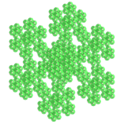 Fractais dos poliedros de Arquimedes</h2>
  Utilizando o mesmo princípio da construção do triângulo de Sierpinski ou da curva de Koch, podemos construir fractais de outros polígonos regulares. Quando estes polígonos formam um poliedro, temos a construção de um poliedro fractal.

 
<a href="#ra">Realidade Aumentada</a>&nbsp;&nbsp;|&nbsp;&nbsp;<a href="#m3d">Modelos 3D</a>&nbsp;&nbsp;|&nbsp;&nbsp;<a href="../../pt-br/">Página Inicial</a>

 <h3 align="center">Salas imersivas</h3>
  
<iframe width="100%" src="../sala1.htm" title="Sala Imersiva de fractais de poliedros" frameborder="0" loading="lazy"></iframe>

  
<a href="../sala1.htm" target="_blank">&#x1f517; sala 1</a>&nbsp;&nbsp;|&nbsp;&nbsp;<a href="../sala2.htm" target="_blank">&#x1f517; sala 2</a>&nbsp;&nbsp;|&nbsp;&nbsp;<a href="../sala3.htm" target="_blank">&#x1f517; sala 3</a>&nbsp;&nbsp;|&nbsp;&nbsp;<a href="../sala4.htm" target="_blank">&#x1f517; sala 4</a>&nbsp;&nbsp;|&nbsp;&nbsp;<a href="../sala5.htm" target="_blank">&#x1f517; sala 5</a>

  

  

  <h3 id="ra" align="center">Realidade Aumentada</h3>
  Para visualizar os fractais de poliedros em RA, visite as páginas indicadas nos modelos 3D dos sólidos utilizando qualquer navegador com um dispositivo de webcam (smartphone, tablet ou notebook).
 O acesso às páginas de RV é feito clicando no círculo azul que aparece em cima de cada marcador.

<h3 id="m3d" align="center">Modelos 3D</h3>
<iframe width="560" height="315" style="max-width:100%" src="https://www.youtube.com/embed/videoseries?list=PLy0I_lGW8HxXIEDyrj14E7sqOR33oFOdr" title="YouTube video player" frameborder="0" allow="accelerometer; autoplay; clipboard-write; encrypted-media; gyroscope; picture-in-picture; web-share" allowfullscreen></iframe>
<h4>1. Fractal do cuboctaedro</h4>

   Aplicando-se o princípio de construção da curva de Sierpinski nos vértices das faces quadradas do cuboctaedro, obtemos um fractal do cuboctaedro. Na primeira ordem de construção do fractal, construímos um novo sólido em cada vértice do poliedro original. Neste exemplo, temos as representações do sólido nas ordens 0, 1, 2 e 3.
 <table>
	<tr>
		<th>ordem</th>
		<th>poliedros</th>
		<th>faces</th>
		<th>arestas</th>
		<th>vértices</th>
	</tr>
	<tr>
		<td>0</td>
		<td>1</td>
		<td>14</td>
		<td>24</td>
		<td>12</td>
	</tr>
	<tr>
		<td>1</td>
		<td>12</td>
		<td>168</td>
		<td>288</td>
		<td>144</td>
	</tr>
	<tr>
		<td>2</td>
		<td>144</td>
		<td>2016</td>
		<td>3456</td>
		<td>1728</td>
	</tr>
	<tr>
		<td>3</td>
		<td>1728</td>
		<td>24192</td>
		<td>41472</td>
		<td>20736</td>
	</tr>
 </table>
 

<h4>2. Fractal do icosidodecaedro</h4>
<a href="../vr/FractalIcosidodecahedron.htm" target="_blank" title="modelo 3D" class="fotoA">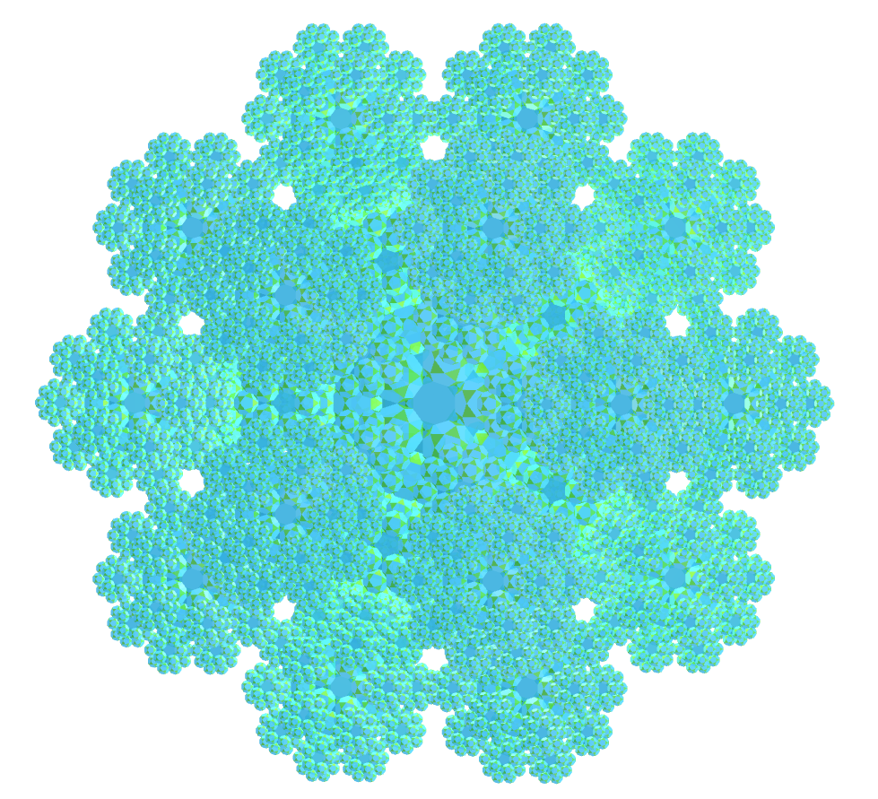</a>
   Aplicando-se o princípio de construção da curva de Koch nas faces triangulares do icosidodecaedro, obtemos um fractal do icosidodecaedro. Na primeira ordem de construção do fractal, construímos um novo sólido em cada face triangular do poliedro original. Neste exemplo, temos as representações do sólido nas ordens 0, 1, 2 e 3.
 <table>
	<tr>
		<th>ordem</th>
		<th>poliedros</th>
		<th>faces</th>
		<th>arestas</th>
		<th>vértices</th>
	</tr>
	<tr>
		<td>0</td>
		<td>1</td>
		<td>32</td>
		<td>60</td>
		<td>30</td>
	</tr>
	<tr>
		<td>1</td>
		<td>21</td>
		<td>672</td>
		<td>1260</td>
		<td>630</td>
	</tr>
	<tr>
		<td>2</td>
		<td>441</td>
		<td>14112</td>
		<td>26460</td>
		<td>13230</td>
	</tr>
	<tr>
		<td>3</td>
		<td>9261</td>
		<td>296352</td>
		<td>555660</td>
		<td>277830</td>
	</tr>
 </table>
 

<h4>3. Fractal do rombicosidodecaedro</h4>

   Aplicando-se o princípio de construção da curva de Koch nas faces pentagonais do rombicosidodecaedro, obtemos um fractal do rombicosidodecaedro. Na primeira ordem de construção do fractal, construímos um novo sólido em cada face pentagonal do poliedro original. Neste exemplo, temos as representações do sólido nas ordens 0, 1, 2 e 3.
 <table>
	<tr>
		<th>ordem</th>
		<th>poliedros</th>
		<th>faces</th>
		<th>arestas</th>
		<th>vértices</th>
	</tr>
	<tr>
		<td>0</td>
		<td>1</td>
		<td>62</td>
		<td>120</td>
		<td>60</td>
	</tr>
	<tr>
		<td>1</td>
		<td>13</td>
		<td>806</td>
		<td>1560</td>
		<td>780</td>
	</tr>
	<tr>
		<td>2</td>
		<td>169</td>
		<td>10478</td>
		<td>20280</td>
		<td>10140</td>
	</tr>
	<tr>
		<td>3</td>
		<td>2197</td>
		<td>136214</td>
		<td>263640</td>
		<td>131820</td>
	</tr>
 </table>
 

<h4>4. Fractal do rombicuboctaedro</h4>

   Aplicando-se o princípio de construção da curva de Koch nas faces triangulares do rombicuboctaedro, obtemos um fractal do rombicuboctaedro. Na primeira ordem de construção do fractal, construímos um novo sólido em cada face triangular do poliedro original. Neste exemplo, temos as representações do sólido nas ordens 0, 1, 2 e 3.
 <table>
	<tr>
		<th>ordem</th>
		<th>poliedros</th>
		<th>faces</th>
		<th>arestas</th>
		<th>vértices</th>
	</tr>
	<tr>
		<td>0</td>
		<td>1</td>
		<td>26</td>
		<td>48</td>
		<td>24</td>
	</tr>
	<tr>
		<td>1</td>
		<td>9</td>
		<td>234</td>
		<td>432</td>
		<td>216</td>
	</tr>
	<tr>
		<td>2</td>
		<td>81</td>
		<td>2106</td>
		<td>3888</td>
		<td>1944</td>
	</tr>
	<tr>
		<td>3</td>
		<td>729</td>
		<td>18954</td>
		<td>34992</td>
		<td>17496</td>
	</tr>
 </table>
 

<h4>5. Fractal do cubo snub</h4>

   Aplicando-se o princípio de construção da curva de Koch nas faces quadradas do cubo snub, obtemos um fractal do cubo snub. Na primeira ordem de construção do fractal, construímos um novo sólido em cada face quadrada do poliedro original. Neste exemplo, temos as representações do sólido nas ordens 0, 1, 2, e 4.
 <table>
	<tr>
		<th>ordem</th>
		<th>poliedros</th>
		<th>faces</th>
		<th>arestas</th>
		<th>vértices</th>
	</tr>
	<tr>
		<td>0</td>
		<td>1</td>
		<td>38</td>
		<td>60</td>
		<td>24</td>
	</tr>
	<tr>
		<td>1</td>
		<td>7</td>
		<td>266</td>
		<td>420</td>
		<td>168</td>
	</tr>
	<tr>
		<td>2</td>
		<td>49</td>
		<td>1862</td>
		<td>2940</td>
		<td>1176</td>
	</tr>
	<tr>
		<td>3</td>
		<td>343</td>
		<td>13034</td>
		<td>20580</td>
		<td>8232</td>
	</tr>
	<tr>
		<td>4</td>
		<td>2401</td>
		<td>91238</td>
		<td>144060</td>
		<td>57624</td>
	</tr>
 </table>
 

<h4>6. Fractal do dodecaedro snub</h4>
<a href="../vr/FractalSnubDodecahedron.htm" target="_blank" title="modelo 3D" class="fotoA">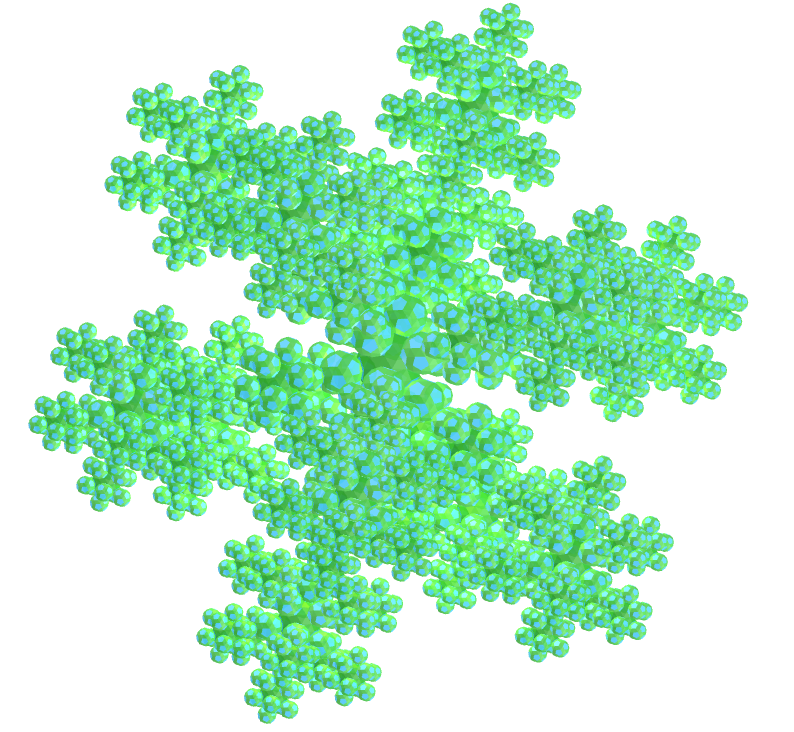</a>
   Aplicando-se o princípio de construção da curva de Koch nas faces pentagonais do dodecaedro snub, obtemos um fractal do dodecaedro snub. Na primeira ordem de construção do fractal, construímos um novo sólido em cada face pentagonal do poliedro original. Neste exemplo, temos as representações do sólido nas ordens 0, 1, 2 e 3.
 <table>
	<tr>
		<th>ordem</th>
		<th>poliedros</th>
		<th>faces</th>
		<th>arestas</th>
		<th>vértices</th>
	</tr>
	<tr>
		<td>0</td>
		<td>1</td>
		<td>92</td>
		<td>150</td>
		<td>60</td>
	</tr>
	<tr>
		<td>1</td>
		<td>13</td>
		<td>1196</td>
		<td>1950</td>
		<td>780</td>
	</tr>
	<tr>
		<td>2</td>
		<td>169</td>
		<td>15548</td>
		<td>25350</td>
		<td>10140</td>
	</tr>
	<tr>
		<td>3</td>
		<td>2197</td>
		<td>202124</td>
		<td>329550</td>
		<td>131820</td>
	</tr>
 </table>
 

<h4>7. Fractal do cuboctaedro truncado</h4>

   Aplicando-se o princípio de construção da curva de Koch nas faces quadradas do cuboctaedro truncado, obtemos um fractal do cuboctaedro truncado. Na primeira ordem de construção do fractal, construímos um novo sólido em cada face quadrada do poliedro original. Neste exemplo, temos as representações do sólido nas ordens 0, 1, 2 e 3.
 <table>
	<tr>
		<th>ordem</th>
		<th>poliedros</th>
		<th>faces</th>
		<th>arestas</th>
		<th>vértices</th>
	</tr>
	<tr>
		<td>0</td>
		<td>1</td>
		<td>26</td>
		<td>72</td>
		<td>48</td>
	</tr>
	<tr>
		<td>1</td>
		<td>13</td>
		<td>338</td>
		<td>936</td>
		<td>624</td>
	</tr>
	<tr>
		<td>2</td>
		<td>169</td>
		<td>4394</td>
		<td>12168</td>
		<td>8112</td>
	</tr>
	<tr>
		<td>3</td>
		<td>2197</td>
		<td>57122</td>
		<td>158184</td>
		<td>105456</td>
	</tr>
 </table>
 

<h4>8. Fractal do cubo truncado</h4>

   Aplicando-se o princípio de construção da curva de Koch nas faces triangulares do cubo truncado, obtemos um fractal do cubo truncado. Na primeira ordem de construção do fractal, construímos um novo sólido em cada face triangular do poliedro original. Neste exemplo, temos as representações do sólido nas ordens 0, 1, 2 e 3.
 <table>
	<tr>
		<th>ordem</th>
		<th>poliedros</th>
		<th>faces</th>
		<th>arestas</th>
		<th>vértices</th>
	</tr>
	<tr>
		<td>0</td>
		<td>1</td>
		<td>14</td>
		<td>36</td>
		<td>24</td>
	</tr>
	<tr>
		<td>1</td>
		<td>9</td>
		<td>126</td>
		<td>324</td>
		<td>216</td>
	</tr>
	<tr>
		<td>2</td>
		<td>81</td>
		<td>1134</td>
		<td>2916</td>
		<td>1944</td>
	</tr>
	<tr>
		<td>3</td>
		<td>729</td>
		<td>10206</td>
		<td>26244</td>
		<td>17496</td>
	</tr>
 </table>
 

<h4>9. Fractal do dodecaedro truncado</h4>

   Aplicando-se o princípio de construção da curva de Koch nas faces triangulares do dodecaedro truncado, obtemos um fractal do dodecaedro truncado. Na primeira ordem de construção do fractal, construímos um novo sólido em cada face triangular do poliedro original. Neste exemplo, temos as representações do sólido nas ordens 0, 1, 2 e 3.
 <table>
	<tr>
		<th>ordem</th>
		<th>poliedros</th>
		<th>faces</th>
		<th>arestas</th>
		<th>vértices</th>
	</tr>
	<tr>
		<td>0</td>
		<td>1</td>
		<td>32</td>
		<td>150</td>
		<td>60</td>
	</tr>
	<tr>
		<td>1</td>
		<td>21</td>
		<td>672</td>
		<td>3150</td>
		<td>1260</td>
	</tr>
	<tr>
		<td>2</td>
		<td>441</td>
		<td>14112</td>
		<td>66150</td>
		<td>26460</td>
	</tr>
	<tr>
		<td>3</td>
		<td>9261</td>
		<td>296352</td>
		<td>1389150</td>
		<td>555660</td>
	</tr>
 </table>
 

<h4>10. Fractal do icosaedro truncado</h4>
<a href="../vr/FractalTruncatedIcosahedron.htm" target="_blank" title="modelo 3D" class="fotoA">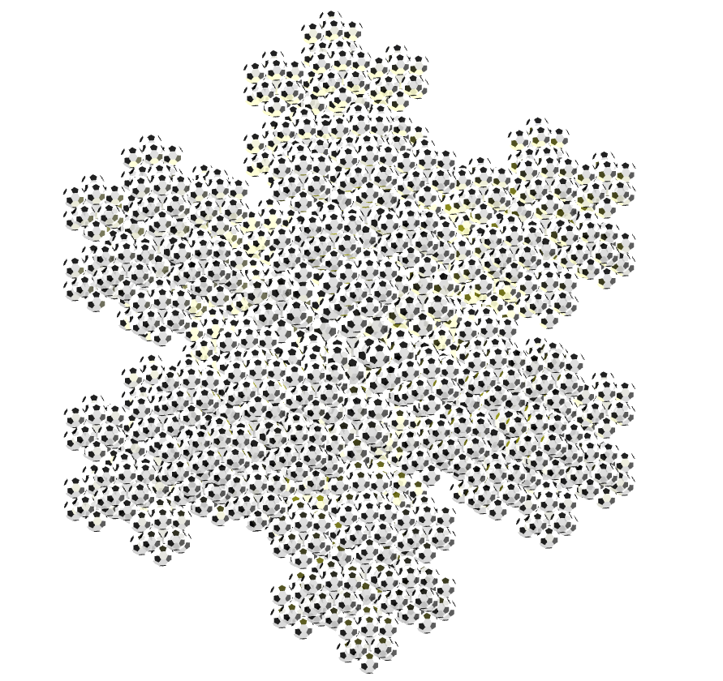</a>
   Aplicando-se o princípio de construção da curva de Koch nas faces pentagonais do icosaedro truncado, obtemos um fractal do icosaedro truncado. Na primeira ordem de construção do fractal, construímos um novo sólido em cada face pentagonal do poliedro original. Neste exemplo, temos as representações do sólido nas ordens 0, 1, 2 e 3.
 <table>
	<tr>
		<th>ordem</th>
		<th>poliedros</th>
		<th>faces</th>
		<th>arestas</th>
		<th>vértices</th>
	</tr>
	<tr>
		<td>0</td>
		<td>1</td>
		<td>32</td>
		<td>90</td>
		<td>60</td>
	</tr>
	<tr>
		<td>1</td>
		<td>13</td>
		<td>416</td>
		<td>1170</td>
		<td>780</td>
	</tr>
	<tr>
		<td>2</td>
		<td>169</td>
		<td>5408</td>
		<td>15210</td>
		<td>10140</td>
	</tr>
	<tr>
		<td>3</td>
		<td>2197</td>
		<td>70304</td>
		<td>197730</td>
		<td>131820</td>
	</tr>
 </table>
 
 
<a href="#p1" class="topo">voltar ao topo</a>

<h4>11. Fractal do icosidodecaedro truncado</h4>

   Aplicando-se o princípio de construção da curva de Koch nas faces decagonais do icosidodecaedro truncado, obtemos um fractal do icosidodecaedro truncado. Na primeira ordem de construção do fractal, construímos um novo sólido em cada face decagonal do poliedro original. Neste exemplo, temos as representações do sólido nas ordens 0, 1, 2 e 3.
 <table>
	<tr>
		<th>ordem</th>
		<th>poliedros</th>
		<th>faces</th>
		<th>arestas</th>
		<th>vértices</th>
	</tr>
	<tr>
		<td>0</td>
		<td>1</td>
		<td>62</td>
		<td>180</td>
		<td>120</td>
	</tr>
	<tr>
		<td>1</td>
		<td>13</td>
		<td>806</td>
		<td>2340</td>
		<td>1560</td>
	</tr>
	<tr>
		<td>2</td>
		<td>169</td>
		<td>10478</td>
		<td>30420</td>
		<td>20280</td>
	</tr>
	<tr>
		<td>3</td>
		<td>2197</td>
		<td>136214</td>
		<td>395460</td>
		<td>263640</td>
	</tr>
 </table>
 

<h4>12. Fractal do octaedro truncado</h4>

   Aplicando-se o princípio de construção da curva de Koch nas faces quadradas do octaedro truncado, obtemos um fractal do octaedro truncado. Na primeira ordem de construção do fractal, construímos um novo sólido em cada face quadrada do poliedro original. Neste exemplo, temos as representações do sólido nas ordens 0, 1, 2 e 3.
 <table>
	<tr>
		<th>ordem</th>
		<th>poliedros</th>
		<th>faces</th>
		<th>arestas</th>
		<th>vértices</th>
	</tr>
	<tr>
		<td>0</td>
		<td>1</td>
		<td>14</td>
		<td>36</td>
		<td>24</td>
	</tr>
	<tr>
		<td>1</td>
		<td>7</td>
		<td>98</td>
		<td>252</td>
		<td>168</td>
	</tr>
	<tr>
		<td>2</td>
		<td>49</td>
		<td>686</td>
		<td>1764</td>
		<td>1176</td>
	</tr>
	<tr>
		<td>3</td>
		<td>343</td>
		<td>4802</td>
		<td>12348</td>
		<td>8232</td>
	</tr>
	<tr>
		<td>4</td>
		<td>2401</td>
		<td>33614</td>
		<td>86436</td>
		<td>57624</td>
	</tr>
 </table>
 

<h4>13. Fractal do tetraedro truncado</h4>

   Aplicando-se o princípio de construção do triângulo de Sierpinski nos vértices das faces triangulares do tetraedro truncado, obtemos um fractal do tetraedro truncado. Na primeira ordem de construção do fractal, construímos um novo sólido em cada vértice do poliedro original. Neste exemplo, temos as representações do sólido nas ordens 0, 1, 2 e 3.
 <table>
	<tr>
		<th>ordem</th>
		<th>poliedros</th>
		<th>faces</th>
		<th>arestas</th>
		<th>vértices</th>
	</tr>
	<tr>
		<td>0</td>
		<td>1</td>
		<td>8</td>
		<td>18</td>
		<td>12</td>
	</tr>
	<tr>
		<td>1</td>
		<td>12</td>
		<td>96</td>
		<td>216</td>
		<td>144</td>
	</tr>
	<tr>
		<td>2</td>
		<td>144</td>
		<td>1152</td>
		<td>2592</td>
		<td>1728</td>
	</tr>
	<tr>
		<td>3</td>
		<td>1728</td>
		<td>13824</td>
		<td>31104</td>
		<td>20736</td>
	</tr>
 </table>
 
 

<h4>14. Esponja Menger: Cubo snub</h4>

   Aplicando-se o princípio de construção do tapete de Sierpinski nas 6 faces quadradas do cubo snub, obtemos um cubo snub fractal. Na primeira ordem de construção do fractal, construímos 8 novos sólidos em cada face quadrada do poliedro original, todas com ⅓ da medida da aresta do cubo snub. Neste exemplo, temos as representações do sólido nas ordens 0, 1, 2 e 3.
 
 

<h4>15. Cruz de Menger - Jerusalém: Cubo snub v1</h4>
<a href="../vr/FractalSnubCube2.htm" target="_blank" title="modelo 3D" class="fotoA">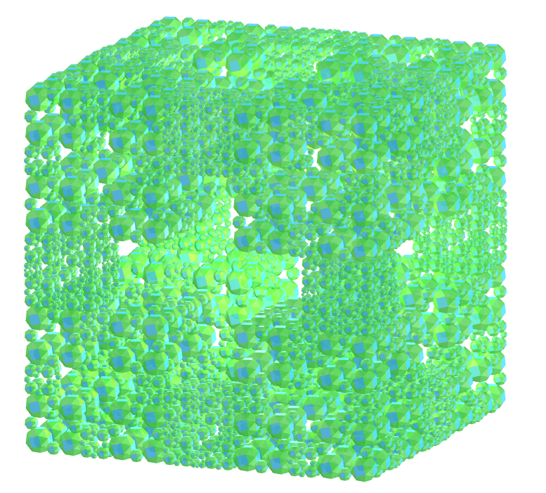</a>
   Considere um cubo snub. Podemos aumentar os tamanhos das arestas dos cubos snub dos cantos e diminuir os tamanhos das arestas dos cubos snub intermediários para revelar uma cruz. Nesta versão, temos 8 cubos snub homotéticos com proporção de &#8534; e 12 cubos snub homotéticos com proporção de &#8533;.
 
 

<h4>16. Cruz de Menger - Jerusalém: Cubo snub v2</h4>

   Considere um cubo snub. Podemos aumentar os tamanhos das arestas dos cubos snub dos cantos e diminuir os tamanhos das arestas dos cubos snub intermediários para revelar uma cruz. Nesta versão, temos 8 cubos snub homotéticos com proporção de &#8730;2 - 1 e 12 cubos snub homotéticos com proporção de (&#8730;2 - 1)&#xb2;.
 
 

<h4>17. Floco de neve Mosely: Cubo snub</h4>

   O floco de neve Mosely é um tipo de fractal Sierpinski-Menger obtido em duas variantes pela operação usada na criação do floco de neve Sierpinski-Menger. Neste caso, removemos oito cubos snub dos cantos e o cubo snub central em cada iteração.
 
 

<h4>18. Esponja Menger: Cubo truncado</h4>

   Aplicando-se o princípio de construção do tapete de Sierpinski nas 6 faces octogonais do cubo truncado, obtemos um cubo truncado fractal. Na primeira ordem de construção do fractal, construímos 8 novos sólidos em cada face octogonal do poliedro original, todas com ⅓ da medida da aresta do cubo truncado. Neste exemplo, temos as representações do sólido nas ordens 0, 1, 2 e 3.
 
 

<h4>19. Cruz de Menger - Jerusalém: Cubo truncado v1</h4>
<a href="../vr/FractalTruncatedCube2.htm" target="_blank" title="modelo 3D" class="fotoA">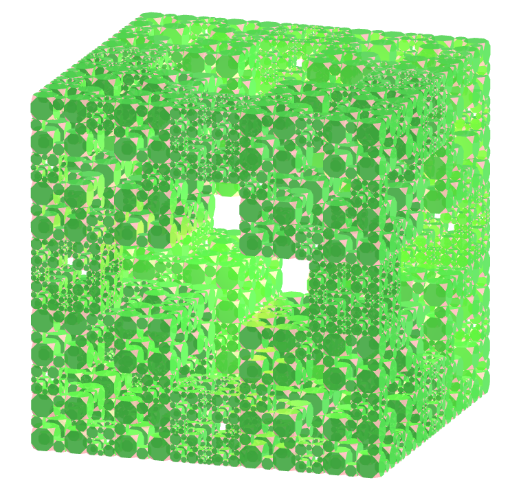</a>
   Considere um cubo truncado. Podemos aumentar os tamanhos das arestas dos cubos truncados dos cantos e diminuir os tamanhos das arestas dos cubos truncados intermediários para revelar uma cruz. Nesta versão, temos 8 cubos truncados homotéticos com proporção de &#8534; e 12 cubos truncados homotéticos com proporção de &#8533;.
 
 

<h4>20. Cruz de Menger - Jerusalém: Cubo truncado v2</h4>
<a href="../vr/FractalTruncatedCube3.htm" target="_blank" title="modelo 3D" class="fotoA">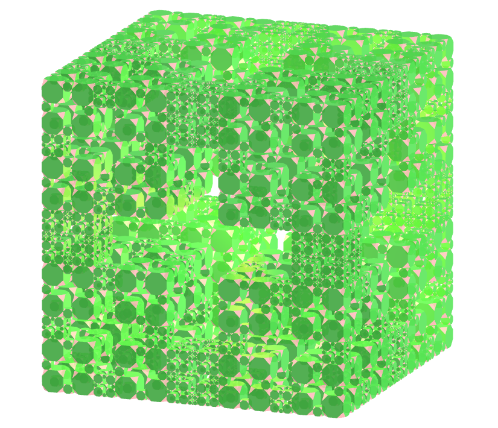</a>
   Considere um cubo truncado. Podemos aumentar os tamanhos das arestas dos cubos truncados dos cantos e diminuir os tamanhos das arestas dos cubos truncados intermediários para revelar uma cruz. Nesta versão, temos 8 cubos truncados homotéticos com proporção de &#8730;2 - 1 e 12 cubos truncados homotéticos com proporção de (&#8730;2 - 1)&#xb2;.
 
 
<a href="#p1" class="topo">voltar ao topo</a>

 

<h4>21. Floco de neve Mosely: Cubo truncado</h4>

   O floco de neve Mosely é um tipo de fractal Sierpinski-Menger obtido em duas variantes pela operação usada na criação do floco de neve Sierpinski-Menger. Neste caso, removemos oito cubos truncados dos cantos e o cubo truncado central em cada iteração.
 
 

<h4>22. Esponja Menger: Rombicuboctaedro</h4>

   Aplicando-se o princípio de construção do tapete de Sierpinski em 6 faces quadradas do rombicuboctaedro, obtemos um rombicuboctaedro fractal. Na primeira ordem de construção do fractal, construímos 8 novos sólidos nas faces quadradas do poliedro original, todas com ⅓ da medida da aresta do rombicuboctaedro. Neste exemplo, temos as representações do sólido nas ordens 0, 1, 2 e 3.
 
 

<h4>23. Cruz de Menger - Jerusalém: Rombicuboctaedro v1</h4>

   Considere um rombicuboctaedro. Podemos aumentar os tamanhos das arestas dos rombicuboctaedros dos cantos e diminuir os tamanhos das arestas dos rombicuboctaedros intermediários para revelar uma cruz. Nesta versão, temos 8 rombicuboctaedros homotéticos com proporção de &#8534; e 12 rombicuboctaedros homotéticos com proporção de &#8533;.
 
 

<h4>24. Cruz de Menger - Jerusalém: Rombicuboctaedro v2</h4>
<a href="../vr/FractalRhombicuboctahedron3.htm" target="_blank" title="modelo 3D" class="fotoA">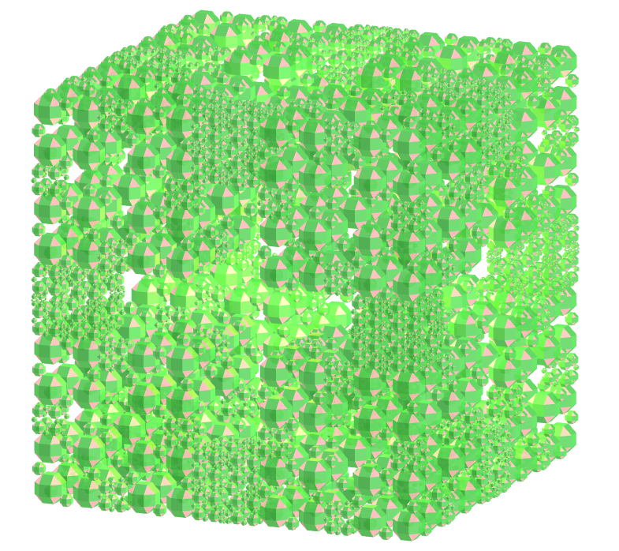</a>
   Considere um rombicuboctaedro. Podemos aumentar os tamanhos das arestas dos rombicuboctaedros dos cantos e diminuir os tamanhos das arestas dos rombicuboctaedros intermediários para revelar uma cruz. Nesta versão, temos 8 rombicuboctaedros homotéticos com proporção de &#8730;2 - 1 e 12 rombicuboctaedros homotéticos com proporção de (&#8730;2 - 1)&#xb2;.
 
 

<h4>25. Floco de neve Mosely: Rombicuboctaedro</h4>

   O floco de neve Mosely é um tipo de fractal Sierpinski-Menger obtido em duas variantes pela operação usada na criação do floco de neve Sierpinski-Menger. Neste caso, removemos oito rombicuboctaedros dos cantos e o rombicuboctaedro central em cada iteração.
 
 

<h4>26. Esponja Menger: Cuboctaedro</h4>
<a href="../vr/FractalCuboctahedron1.htm" target="_blank" title="modelo 3D" class="fotoA">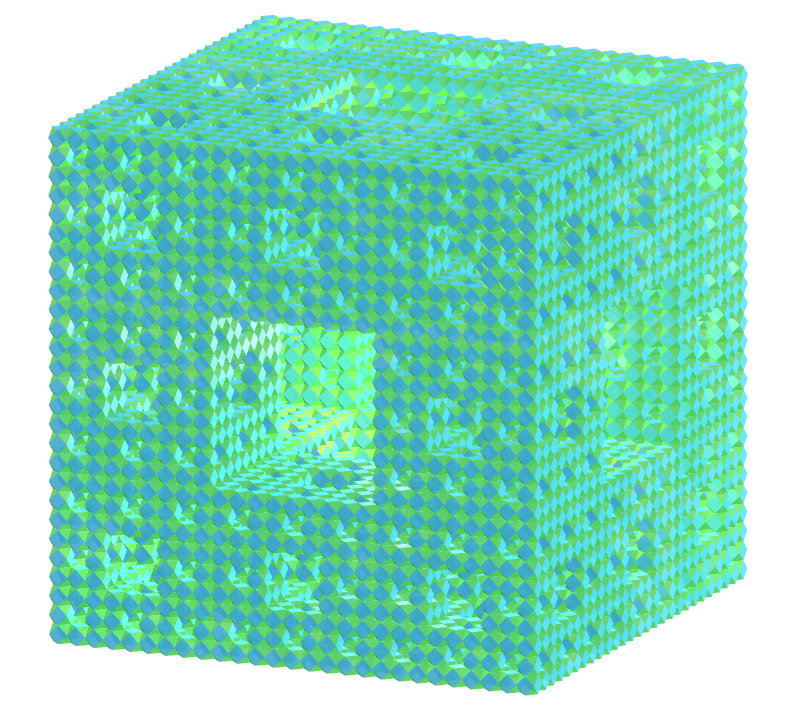</a>
   Aplicando-se o princípio de construção do tapete de Sierpinski nas 6 faces quadradas do cuboctaedro, obtemos um cuboctaedro fractal. Na primeira ordem de construção do fractal, construímos 8 novos sólidos nas faces quadradas do poliedro original, todas com ⅓ da medida da aresta do cuboctaedro. Neste exemplo, temos as representações do sólido nas ordens 0, 1, 2 e 3.
 
 

<h4>27. Cruz de Menger - Jerusalém: Cuboctaedro v1</h4>

   Considere um cuboctaedro. Podemos aumentar os tamanhos das arestas dos cuboctaedros dos cantos e diminuir os tamanhos das arestas dos cuboctaedros intermediários para revelar uma cruz. Nesta versão, temos 8 cuboctaedros homotéticos com proporção de &#8534; e 12 cuboctaedros homotéticos com proporção de &#8533;.
 
 

<h4>28. Cruz de Menger - Jerusalém: Cuboctaedro v2</h4>

   Considere um cuboctaedro. Podemos aumentar os tamanhos das arestas dos cuboctaedros dos cantos e diminuir os tamanhos das arestas dos cuboctaedros intermediários para revelar uma cruz. Nesta versão, temos 8 cuboctaedros homotéticos com proporção de &#8730;2 - 1 e 12 cuboctaedros homotéticos com proporção de (&#8730;2 - 1)&#xb2;.
 
 

<h4>29. Floco de neve Mosely: Cuboctaedro</h4>

   O floco de neve Mosely é um tipo de fractal Sierpinski-Menger obtido em duas variantes pela operação usada na criação do floco de neve Sierpinski-Menger. Neste caso, removemos oito cuboctaedros dos cantos e o cuboctaedro central em cada iteração.
 
 

<h4>30. Esponja Menger: Cuboctaedro truncado</h4>
<a href="../vr/FractalTruncatedCuboctahedron1.htm" target="_blank" title="modelo 3D" class="fotoA">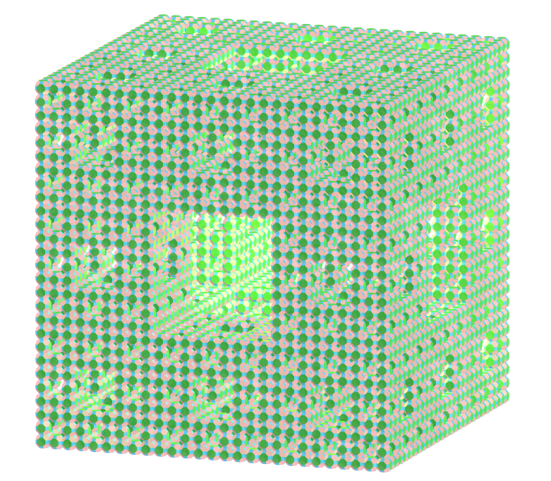</a>
   Aplicando-se o princípio de construção do tapete de Sierpinski nas 6 faces octogonais do cuboctaedro truncado, obtemos um cuboctaedro truncado fractal. Na primeira ordem de construção do fractal, construímos 8 novos sólidos nas faces octogonais do poliedro original, todas com ⅓ da medida da aresta do cuboctaedro truncado. Neste exemplo, temos as representações do sólido nas ordens 0, 1, 2 e 3.
 
 
<a href="#p1" class="topo">voltar ao topo</a>

 

<h4>31. Cruz de Menger - Jerusalém: Cuboctaedro truncado v1</h4>
<a href="../vr/FractalTruncatedCuboctahedron2.htm" target="_blank" title="modelo 3D" class="fotoA">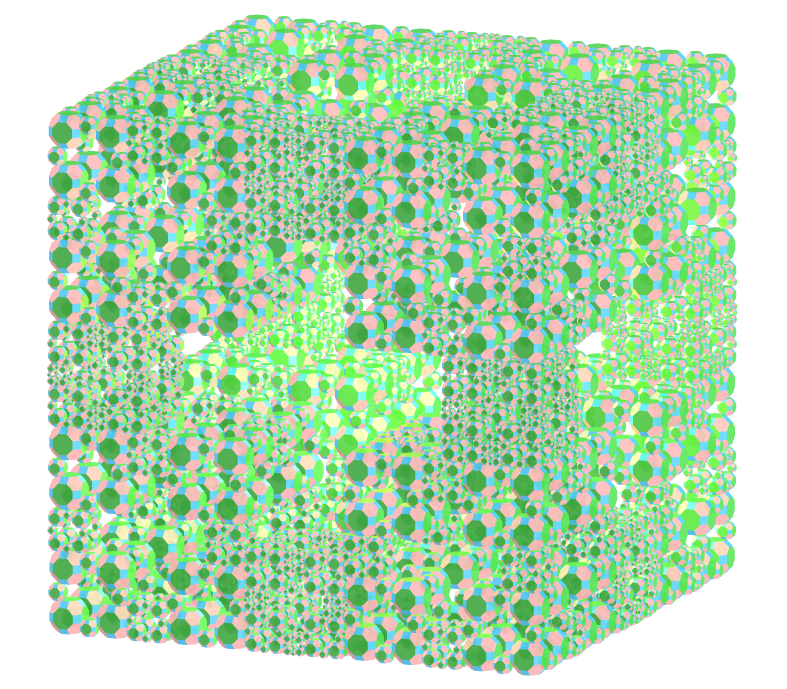</a>
   Considere um cuboctaedro truncado. Podemos aumentar os tamanhos das arestas dos cuboctaedros truncados dos cantos e diminuir os tamanhos das arestas dos cuboctaedros truncados intermediários para revelar uma cruz. Nesta versão, temos 8 cuboctaedros truncados homotéticos com proporção de &#8534; e 12 cuboctaedros truncados homotéticos com proporção de &#8533;.
 
 

<h4>32. Cruz de Menger - Jerusalém: Cuboctaedro truncado v2</h4>
<a href="../vr/FractalTruncatedCuboctahedron3.htm" target="_blank" title="modelo 3D" class="fotoA">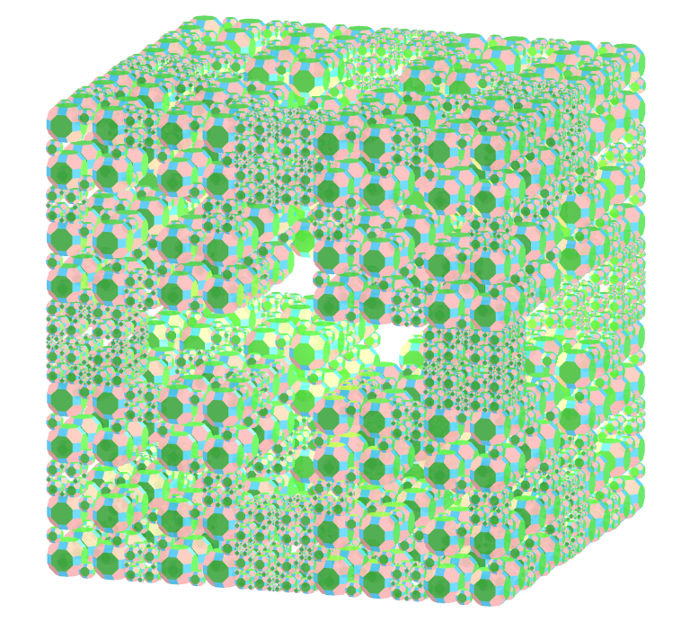</a>
   Considere um cuboctaedro truncado. Podemos aumentar os tamanhos das arestas dos cuboctaedros truncados dos cantos e diminuir os tamanhos das arestas dos cuboctaedros truncados intermediários para revelar uma cruz. Nesta versão, temos 8 cuboctaedros truncados homotéticos com proporção de &#8730;2 - 1 e 12 cuboctaedros truncados homotéticos com proporção de (&#8730;2 - 1)&#xb2;.
 
 

<h4>33. Floco de neve Mosely: Cuboctaedro truncado</h4>
<a href="../vr/FractalTruncatedCuboctahedron4.htm" target="_blank" title="modelo 3D" class="fotoA">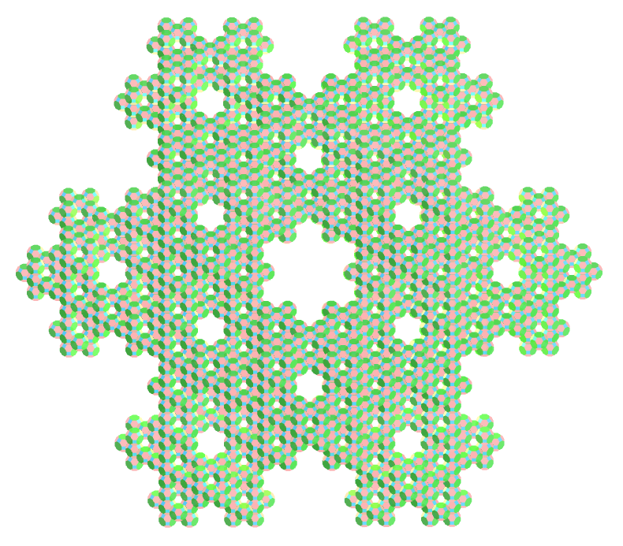</a>
   O floco de neve Mosely é um tipo de fractal Sierpinski-Menger obtido em duas variantes pela operação usada na criação do floco de neve Sierpinski-Menger. Neste caso, removemos oito cuboctaedros truncados dos cantos e o cuboctaedro truncado central em cada iteração.
 

<a href="#p1" class="topo">voltar ao topo</a>

  Archimedean polyhedra fractals - Visualization of polyhedra with Augmented Reality and Virtual Reality de <a xmlns:cc="http://creativecommons.org/ns#" href="https://paulohscwb.github.io/polyhedra2/fractalarchimedean/pt-br/" property="cc:attributionName" rel="cc:attributionURL">Paulo Henrique Siqueira</a> está licenciado com uma Licença <a rel="license" href="http://creativecommons.org/licenses/by-nc-nd/4.0/">Creative Commons Atribuição-NãoComercial-SemDerivações 4.0 Internacional</a>.

<h4>Como citar este trabalho:</h4> 

Siqueira, P.H., "Archimedean polyhedra fractals - Visualization of polyhedra with Augmented Reality and Virtual Reality". Disponível em: <https://paulohscwb.github.io/polyhedra2/fractalarchimedean/pt-br/>, Outubro de 2023.

  <b>Referências:</b>
 Weisstein, Eric W. "Archimedean Solid" From MathWorld-A Wolfram Web Resource. <a href="http://mathworld.wolfram.com/ArchimedeanSolid.html" target="_blank">http://mathworld.wolfram.com/ArchimedeanSolid.html</a>
 Weisstein, Eric W. "Platonic Solid" From MathWorld-A Wolfram Web Resource. <a href="http://mathworld.wolfram.com/PlatonicSolid.html" target="_blank">http://mathworld.wolfram.com/PlatonicSolid.html</a>
 Weisstein, Eric W. "Archimedean Dual" From MathWorld-A Wolfram Web Resource. <a href="https://mathworld.wolfram.com/ArchimedeanDual.html" target="_blank">https://mathworld.wolfram.com/ArchimedeanDual.html</a>
 Weisstein, Eric W. "Uniform Polyhedron." From MathWorld--A Wolfram Web Resource. <a href="https://mathworld.wolfram.com/UniformPolyhedron.html" target="_blank">https://mathworld.wolfram.com/UniformPolyhedron.html</a>
 Wikipedia <a href="https://en.wikipedia.org/wiki/Archimedean_solid" target="_blank">https://en.wikipedia.org/wiki/Archimedean_solid</a>
 Wikipedia <a href="https://en.wikipedia.org/wiki/en.wikipedia.org/wiki/Platonic_solid" target="_blank">https://en.wikipedia.org/wiki/Platonic_solid</a>
 McCooey, David I. "Visual Polyhedra". <a href="http://dmccooey.com/polyhedra/" target="_blank">http://dmccooey.com/polyhedra/</a>
