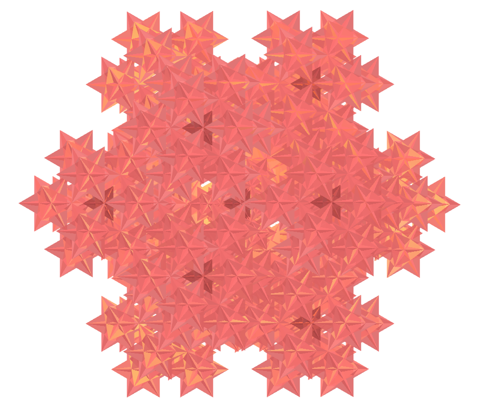
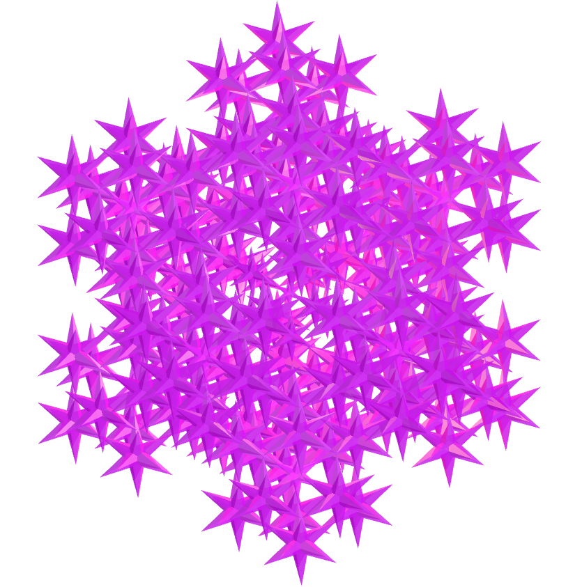
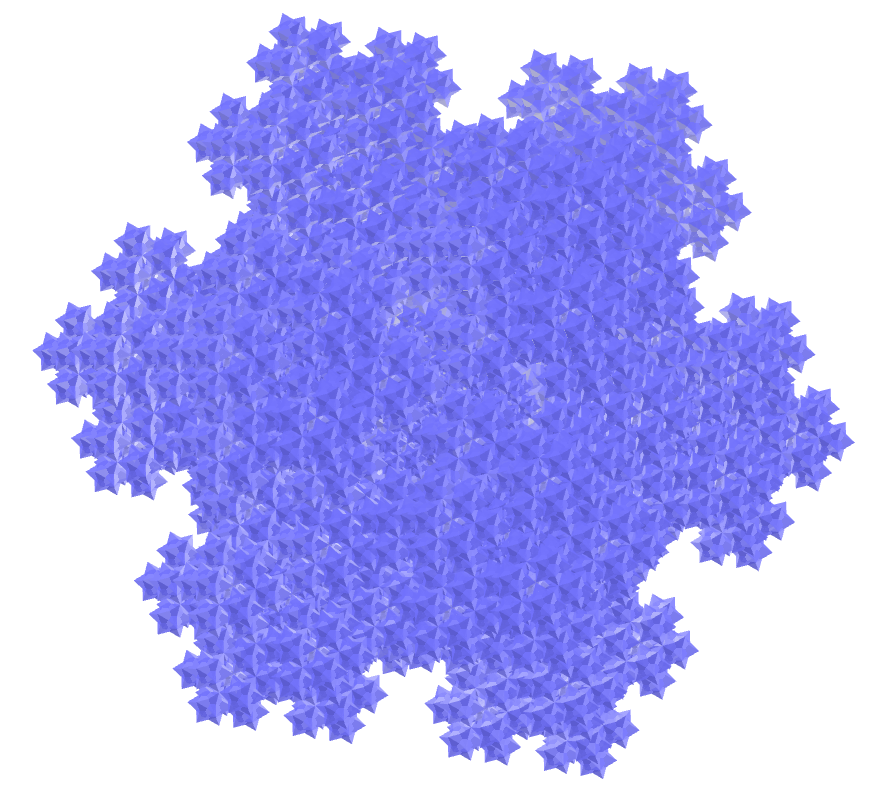
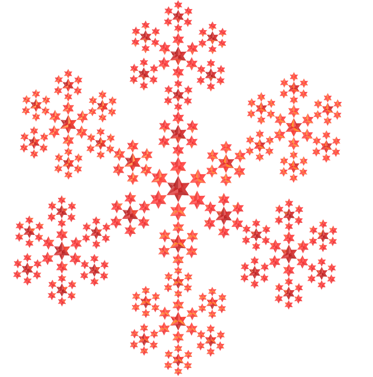
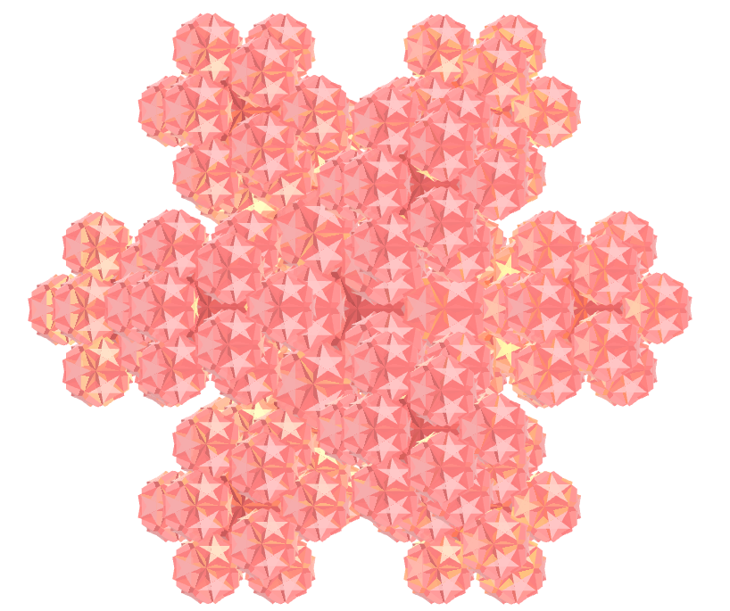

<link rel="stylesheet" href="../scripts/style.css">
<link rel="icon" type="image/png" href="vr/salas/imagens/icone.png">
<h2>Visualization of polyhedra with Augmented Reality (AR) and Virtual Reality (VR) in A-frame</h2>
 <b>author:</b> Paulo Henrique Siqueira - Universidade Federal do Paraná
  <b>contact:</b> <a href="#">paulohscwb@gmail.com</a>
  <a href="https://paulohscwb.github.io/polyhedra2/fractalnonconvex/pt-br/">versão em português</a>
 <form style="margin: 0 auto; float:right; text-align:right; width:100%; margin-bottom:15px;">
	<select id="url" onchange="urlHandler(this.value)" style="color:royalblue;">
		<option disabled selected value>More polyhedra:</option>
		<option value="../ArchimedeanCatalanHulls/pt-br/">Archimedean and Catalan convex hulls</option>
		<option value="../fractalplatonic/pt-br/">Platonic polyhedra fractals</option>
		<option disabled value="../fractalnonconvex/pt-br/">Non convex polyhedra fractals</option>
		<option value="../fractalarchimedean/pt-br/">Archimedean polyhedra fractals</option>
	</select>
</form>

  <h2 align="center"> Non convex polyhedra fractals</h2>
Using the same principle as the construction of the Sierpinski triangle or the Koch curve, we can construct fractals from other regular polygons. When these polygons form a polyhedron, we have the construction of a fractal polyhedron.

 

<a href="#ra">Augmented Reality</a>&nbsp;&nbsp;|&nbsp;&nbsp;<a href="#m3d">3D Models</a>&nbsp;&nbsp;|&nbsp;&nbsp;<a href="../">Home</a>

  

<!-- <h3 align="center">Immersive room</h3>
  
<iframe width="100%" src="sala.htm" title="Sala Imersiva de Fractais de poliedros" frameborder="0" loading="lazy"></iframe>

  
<a href="sala.htm" target="_blank">&#x1f517; room link</a>

 
 -->
  <h3 id="ra" align="center">Augmented Reality</h3>
To view fractal polyhedra in AR, simply visit the pages indicated in the 3D solid models using any browser with a webcam device (smartphone, tablet or notebook).
 Access to the VR sites is done by clicking on the blue circle that appears on top of the marker.

<h3 id="m3d" align="center">3D models</h3>
<!-- <iframe width="560" height="315" style="max-width:100%" src="https://www.youtube.com/embed/videoseries?list=PLy0I_lGW8HxU-mneUmSsccpRAAwbErHFq" title="YouTube video player" frameborder="0" allow="accelerometer; autoplay; clipboard-write; encrypted-media; gyroscope; picture-in-picture; web-share" allowfullscreen></iframe> -->
<h4>1. Escher solid fractal</h4>

   Applying the construction principle of the Sierpinski triangle to the 48 faces of the Escher solid, we obtain an Escher solid fractal. In the first order of fractal construction, we construct a new solid at 12 vertices of the original polyhedron. In this example, we have representations of the solid in orders 0, 1, 2 and 3.
 <table>
	<tr>
		<th>order</th>
		<th>polyhedra</th>
		<th>faces</th>
		<th>edges</th>
		<th>vertices</th>
	</tr>
	<tr>
		<td>0</td>
		<td>1</td>
		<td>48</td>
		<td>72</td>
		<td>26</td>
	</tr>
	<tr>
		<td>1</td>
		<td>12</td>
		<td>576</td>
		<td>864</td>
		<td>312</td>
	</tr>
	<tr>
		<td>2</td>
		<td>144</td>
		<td>6912</td>
		<td>10368</td>
		<td>3744</td>
	</tr>
	<tr>
		<td>3</td>
		<td>1728</td>
		<td>82944</td>
		<td>124416</td>
		<td>44928</td>
	</tr>
 </table>
 
 

<h4>2. Small stellated dodecahedron fractal</h4>

   Applying the construction principle of the Koch curve to the 12 faces of the small stellated dodecahedron, we obtain a small stellated dodecahedron fractal. In the first order of fractal construction, we construct a new solid at each vertex of the original polyhedron. In this example, we have representations of the solid in orders 0, 1, 2 and 3.
 <table>
	<tr>
		<th>order</th>
		<th>polyhedra</th>
		<th>faces</th>
		<th>edges</th>
		<th>vertices</th>
	</tr>
	<tr>
		<td>0</td>
		<td>1</td>
		<td>12</td>
		<td>30</td>
		<td>12</td>
	</tr>
	<tr>
		<td>1</td>
		<td>12</td>
		<td>144</td>
		<td>360</td>
		<td>144</td>
	</tr>
	<tr>
		<td>2</td>
		<td>144</td>
		<td>1728</td>
		<td>4320</td>
		<td>1728</td>
	</tr>
	<tr>
		<td>3</td>
		<td>1728</td>
		<td>20736</td>
		<td>51840</td>
		<td>20736</td>
	</tr>
 </table>
 
 

<h4>3. Great stellated dodecahedron fractal</h4>

   Applying the construction principle of the Koch curve to the 12 faces of the great stellated dodecahedron, we obtain a great stellated dodecahedron fractal. In the first order of fractal construction, we construct a new solid at each vertex of the original polyhedron. In this example, we have representations of the solid in orders 0, 1, 2 and 3.
 <table>
	<tr>
		<th>order</th>
		<th>polyhedra</th>
		<th>faces</th>
		<th>edges</th>
		<th>vertices</th>
	</tr>
	<tr>
		<td>0</td>
		<td>1</td>
		<td>12</td>
		<td>30</td>
		<td>20</td>
	</tr>
	<tr>
		<td>1</td>
		<td>21</td>
		<td>252</td>
		<td>630</td>
		<td>420</td>
	</tr>
	<tr>
		<td>2</td>
		<td>441</td>
		<td>5292</td>
		<td>13230</td>
		<td>8820</td>
	</tr>
	<tr>
		<td>3</td>
		<td>9261</td>
		<td>111132</td>
		<td>277830</td>
		<td>185220</td>
	</tr>
 </table>
 
 

<h4>4. Great icosahedron fractal</h4>

   Applying the construction principle of the Koch curve to the 20 faces of the great icosahedron, we obtain a great icosahedron fractal. In the first order of fractal construction, we construct a new solid at each vertex of the original polyhedron. In this example, we have representations of the solid in orders 0, 1, 2 and 3.
 <table>
	<tr>
		<th>order</th>
		<th>polyhedra</th>
		<th>faces</th>
		<th>edges</th>
		<th>vertices</th>
	</tr>
	<tr>
		<td>0</td>
		<td>1</td>
		<td>20</td>
		<td>30</td>
		<td>12</td>
	</tr>
	<tr>
		<td>1</td>
		<td>12</td>
		<td>240</td>
		<td>360</td>
		<td>144</td>
	</tr>
	<tr>
		<td>2</td>
		<td>144</td>
		<td>2880</td>
		<td>4320</td>
		<td>1728</td>
	</tr>
	<tr>
		<td>3</td>
		<td>1728</td>
		<td>34560</td>
		<td>51840</td>
		<td>20736</td>
	</tr>
 </table>
 
 

<h4>5. Great dodecahedron fractal</h4>

   Applying the construction principle of the Koch curve to the 12 faces of the great dodecahedron, we obtain a great dodecahedron fractal. In the first order of fractal construction, we construct a new solid at each vertex of the original polyhedron. In this example, we have representations of the solid in orders 0, 1, 2 and 3.
 <table>
	<tr>
		<th>order</th>
		<th>polyhedra</th>
		<th>faces</th>
		<th>edges</th>
		<th>vertices</th>
	</tr>
	<tr>
		<td>0</td>
		<td>1</td>
		<td>12</td>
		<td>30</td>
		<td>12</td>
	</tr>
	<tr>
		<td>1</td>
		<td>12</td>
		<td>144</td>
		<td>360</td>
		<td>144</td>
	</tr>
	<tr>
		<td>2</td>
		<td>144</td>
		<td>1728</td>
		<td>4320</td>
		<td>1728</td>
	</tr>
	<tr>
		<td>3</td>
		<td>1728</td>
		<td>20736</td>
		<td>51840</td>
		<td>20736</td>
	</tr>
 </table>
 
 

 <h4>6. Great stellapentakis dodecahedron fractal</h4>

   Applying the construction principle of the Koch curve to 20 faces of the great stellapentakis dodecahedron, we obtain a great stellapentakis dodecahedron fractal. In the first order of fractal construction, we construct a new solid at 20 vertices of the original polyhedron. In this example, we have representations of the solid in orders 0, 1, 2 and 3.
 <table>
	<tr>
		<th>order</th>
		<th>polyhedra</th>
		<th>faces</th>
		<th>edges</th>
		<th>vertices</th>
	</tr>
	<tr>
		<td>0</td>
		<td>1</td>
		<td>60</td>
		<td>90</td>
		<td>32</td>
	</tr>
	<tr>
		<td>1</td>
		<td>21</td>
		<td>1260</td>
		<td>1890</td>
		<td>672</td>
	</tr>
	<tr>
		<td>2</td>
		<td>441</td>
		<td>26460</td>
		<td>39690</td>
		<td>14112</td>
	</tr>
	<tr>
		<td>3</td>
		<td>9261</td>
		<td>555660</td>
		<td>833490</td>
		<td>296352</td>
	</tr>
 </table>
 

<h4>7. Pentagramic dipyramid fractal</h4>

   Applying the construction principle of the Koch curve to the edges that form the pentagram of the pentagramic dipyramid, we obtain a pentagramic dipyramid fractal. In the first order of fractal construction, we construct a new solid at 5 vertices of the original polyhedron. In this example, we have representations of the solid in orders 0, 1, 2, 3 and 4.
 <table>
	<tr>
		<th>order</th>
		<th>polyhedra</th>
		<th>faces</th>
		<th>edges</th>
		<th>vertices</th>
	</tr>
	<tr>
		<td>0</td>
		<td>1</td>
		<td>10</td>
		<td>15</td>
		<td>7</td>
	</tr>
	<tr>
		<td>1</td>
		<td>6</td>
		<td>60</td>
		<td>90</td>
		<td>42</td>
	</tr>
	<tr>
		<td>2</td>
		<td>36</td>
		<td>360</td>
		<td>540</td>
		<td>252</td>
	</tr>
	<tr>
		<td>3</td>
		<td>216</td>
		<td>2160</td>
		<td>3240</td>
		<td>1512</td>
	</tr>
	<tr>
		<td>4</td>
		<td>1296</td>
		<td>12960</td>
		<td>19440</td>
		<td>9072</td>
	</tr>
 </table>
 
 

<h4>8. Medial triambic icosahedron fractal</h4>

   Applying the construction principle of the Koch curve to 12 faces of the medial triambic icosahedron, we obtain a medial triambic icosahedron fractal. In the first order of fractal construction, we construct a new solid at 12 vertices of the original polyhedron. In this example, we have representations of the solid in orders 0, 1, 2 and 3.
 <table>
	<tr>
		<th>order</th>
		<th>polyhedra</th>
		<th>faces</th>
		<th>edges</th>
		<th>vertices</th>
	</tr>
	<tr>
		<td>0</td>
		<td>1</td>
		<td>20</td>
		<td>60</td>
		<td>24</td>
	</tr>
	<tr>
		<td>1</td>
		<td>13</td>
		<td>260</td>
		<td>780</td>
		<td>312</td>
	</tr>
	<tr>
		<td>2</td>
		<td>169</td>
		<td>3380</td>
		<td>10140</td>
		<td>4056</td>
	</tr>
	<tr>
		<td>3</td>
		<td>2197</td>
		<td>43940</td>
		<td>131820</td>
		<td>52728</td>
	</tr>
 </table>
 
 

 <h4>9. Great rhombic triacontahedron fractal</h4>

   Applying the construction principle of the Koch curve to 20 faces of the great rhombic triacontahedron, we obtain a great rhombic triacontahedron fractal. In the first order of fractal construction, we construct a new solid at 20 vertices of the original polyhedron. In this example, we have representations of the solid in orders 0, 1, 2 and 3.
 <table>
	<tr>
		<th>order</th>
		<th>polyhedra</th>
		<th>faces</th>
		<th>edges</th>
		<th>vertices</th>
	</tr>
	<tr>
		<td>0</td>
		<td>1</td>
		<td>30</td>
		<td>60</td>
		<td>32</td>
	</tr>
	<tr>
		<td>1</td>
		<td>21</td>
		<td>630</td>
		<td>1260</td>
		<td>672</td>
	</tr>
	<tr>
		<td>2</td>
		<td>441</td>
		<td>13230</td>
		<td>26460</td>
		<td>14112</td>
	</tr>
	<tr>
		<td>3</td>
		<td>9261</td>
		<td>277830</td>
		<td>555660</td>
		<td>296352</td>
	</tr>
 </table>
 
 

 <h4>10. Medial rhombic triacontahedron fractal</h4>

   Applying the construction principle of the Koch curve to 12 faces of the medial rhombic triacontahedron, we obtain a medial rhombic triacontahedron fractal. In the first order of fractal construction, we construct a new solid at 12 vertices of the original polyhedron. In this example, we have representations of the solid in orders 0, 1, 2 and 3.
 <table>
	<tr>
		<th>order</th>
		<th>polyhedra</th>
		<th>faces</th>
		<th>edges</th>
		<th>vertices</th>
	</tr>
	<tr>
		<td>0</td>
		<td>1</td>
		<td>30</td>
		<td>60</td>
		<td>24</td>
	</tr>
	<tr>
		<td>1</td>
		<td>13</td>
		<td>390</td>
		<td>780</td>
		<td>312</td>
	</tr>
	<tr>
		<td>2</td>
		<td>169</td>
		<td>5070</td>
		<td>10140</td>
		<td>4056</td>
	</tr>
	<tr>
		<td>3</td>
		<td>2197</td>
		<td>65910</td>
		<td>131820</td>
		<td>52728</td>
	</tr>
 </table>
 
 
<a href="#p1" class="topo">back to top</a>

 

 <h4>11. Small ditrigonal dodecacronic hexecontahedron fractal</h4>

   Applying the construction principle of the Koch curve to 12 faces of the small ditrigonal dodecacronic hexecontahedron, we obtain a small ditrigonal dodecacronic hexecontahedron fractal. In the first order of fractal construction, we construct a new solid at 12 vertices of the original polyhedron. In this example, we have representations of the solid in orders 0, 1, 2 and 3.
 <table>
	<tr>
		<th>order</th>
		<th>polyhedra</th>
		<th>faces</th>
		<th>edges</th>
		<th>vertices</th>
	</tr>
	<tr>
		<td>0</td>
		<td>1</td>
		<td>60</td>
		<td>120</td>
		<td>44</td>
	</tr>
	<tr>
		<td>1</td>
		<td>13</td>
		<td>780</td>
		<td>1560</td>
		<td>572</td>
	</tr>
	<tr>
		<td>2</td>
		<td>169</td>
		<td>10140</td>
		<td>20280</td>
		<td>7436</td>
	</tr>
	<tr>
		<td>3</td>
		<td>2197</td>
		<td>131820</td>
		<td>263640</td>
		<td>96668</td>
	</tr>
 </table>
 
 

 <h4>12. Rhombicosacron fractal</h4>

   Applying the construction principle of the Koch curve to 20 faces of the rhombicosacron, we obtain a rhombicosacron fractal. In the first order of fractal construction, we construct a new solid at 20 vertices of the original polyhedron. In this example, we have representations of the solid in orders 0, 1, 2 and 3.
 <table>
	<tr>
		<th>order</th>
		<th>polyhedra</th>
		<th>faces</th>
		<th>edges</th>
		<th>vertices</th>
	</tr>
	<tr>
		<td>0</td>
		<td>1</td>
		<td>60</td>
		<td>120</td>
		<td>50</td>
	</tr>
	<tr>
		<td>1</td>
		<td>21</td>
		<td>1260</td>
		<td>2520</td>
		<td>1050</td>
	</tr>
	<tr>
		<td>2</td>
		<td>441</td>
		<td>26460</td>
		<td>52920</td>
		<td>22050</td>
	</tr>
	<tr>
		<td>3</td>
		<td>9261</td>
		<td>555660</td>
		<td>1111320</td>
		<td>463050</td>
	</tr>
 </table>
 
 

 <h4>13. Small hexacronic icositetrahedron fractal</h4>

   Applying the construction principle of the Koch curve to 6 faces of the small hexacronic icositetrahedron, we obtain a small hexacronic icositetrahedron fractal. In the first order of fractal construction, we construct a new solid at 6 vertices of the original polyhedron. In this example, we have representations of the solid in orders 0, 1, 2 and 3.
 <table>
	<tr>
		<th>order</th>
		<th>polyhedra</th>
		<th>faces</th>
		<th>edges</th>
		<th>vertices</th>
	</tr>
	<tr>
		<td>0</td>
		<td>1</td>
		<td>24</td>
		<td>48</td>
		<td>20</td>
	</tr>
	<tr>
		<td>1</td>
		<td>7</td>
		<td>168</td>
		<td>336</td>
		<td>140</td>
	</tr>
	<tr>
		<td>2</td>
		<td>49</td>
		<td>1176</td>
		<td>2352</td>
		<td>980</td>
	</tr>
	<tr>
		<td>3</td>
		<td>343</td>
		<td>8232</td>
		<td>16464</td>
		<td>6860</td>
	</tr>
 </table>
 
  

 <h4>14. Great triakis octahedron fractal</h4>

   Applying the construction principle of the Koch curve to 8 faces of the great triakis octahedron, we obtain a great triakis octahedron fractal. In the first order of fractal construction, we construct a new solid at 8 vertices of the original polyhedron. In this example, we have representations of the solid in orders 0, 1, 2 and 3.
 <table>
	<tr>
		<th>order</th>
		<th>polyhedra</th>
		<th>faces</th>
		<th>edges</th>
		<th>vertices</th>
	</tr>
	<tr>
		<td>0</td>
		<td>1</td>
		<td>24</td>
		<td>36</td>
		<td>14</td>
	</tr>
	<tr>
		<td>1</td>
		<td>9</td>
		<td>216</td>
		<td>324</td>
		<td>126</td>
	</tr>
	<tr>
		<td>2</td>
		<td>81</td>
		<td>1944</td>
		<td>2916</td>
		<td>1134</td>
	</tr>
	<tr>
		<td>3</td>
		<td>729</td>
		<td>17496</td>
		<td>26244</td>
		<td>10216</td>
	</tr>
 </table>
 
 

 <h4>15. Great disdyakis dodecahedron fractal</h4>

   Applying the construction principle of the Koch curve to 8 faces of the great disdyakis dodecahedron, we obtain a great disdyakis dodecahedron fractal. In the first order of fractal construction, we construct a new solid at 8 vertices of the original polyhedron. In this example, we have representations of the solid in orders 0, 1, 2 and 3.
 <table>
	<tr>
		<th>order</th>
		<th>polyhedra</th>
		<th>faces</th>
		<th>edges</th>
		<th>vertices</th>
	</tr>
	<tr>
		<td>0</td>
		<td>1</td>
		<td>48</td>
		<td>72</td>
		<td>20</td>
	</tr>
	<tr>
		<td>1</td>
		<td>9</td>
		<td>432</td>
		<td>648</td>
		<td>180</td>
	</tr>
	<tr>
		<td>2</td>
		<td>81</td>
		<td>3888</td>
		<td>5832</td>
		<td>1620</td>
	</tr>
	<tr>
		<td>3</td>
		<td>729</td>
		<td>34992</td>
		<td>52488</td>
		<td>14580</td>
	</tr>
 </table>
 
 

 <h4>16. Small rhombidodecacron fractal</h4>

   Applying the construction principle of the Koch curve to 12 faces of the small rhombidodecacron, we obtain a small rhombidodecacron fractal. In the first order of fractal construction, we construct a new solid at 12 vertices of the original polyhedron. In this example, we have representations of the solid in orders 0, 1, 2 and 3.
 <table>
	<tr>
		<th>order</th>
		<th>polyhedra</th>
		<th>faces</th>
		<th>edges</th>
		<th>vertices</th>
	</tr>
	<tr>
		<td>0</td>
		<td>1</td>
		<td>60</td>
		<td>120</td>
		<td>42</td>
	</tr>
	<tr>
		<td>1</td>
		<td>13</td>
		<td>780</td>
		<td>1560</td>
		<td>546</td>
	</tr>
	<tr>
		<td>2</td>
		<td>169</td>
		<td>10140</td>
		<td>20280</td>
		<td>7098</td>
	</tr>
	<tr>
		<td>3</td>
		<td>2197</td>
		<td>131820</td>
		<td>263640</td>
		<td>92274</td>
	</tr>
 </table>
 
 

 <h4>17. Great triakis icosahedron fractal</h4>

   Applying the construction principle of the Koch curve to 12 faces of the great triakis icosahedron, we obtain a great triakis icosahedron fractal. In the first order of fractal construction, we construct a new solid at 12 faces of the original polyhedron. In this example, we have representations of the solid in orders 0, 1, 2 and 3.
 <table>
	<tr>
		<th>order</th>
		<th>polyhedra</th>
		<th>faces</th>
		<th>edges</th>
		<th>vertices</th>
	</tr>
	<tr>
		<td>0</td>
		<td>1</td>
		<td>60</td>
		<td>90</td>
		<td>32</td>
	</tr>
	<tr>
		<td>1</td>
		<td>13</td>
		<td>780</td>
		<td>1170</td>
		<td>416</td>
	</tr>
	<tr>
		<td>2</td>
		<td>169</td>
		<td>10140</td>
		<td>15210</td>
		<td>5408</td>
	</tr>
	<tr>
		<td>3</td>
		<td>2197</td>
		<td>131820</td>
		<td>197730</td>
		<td>70304</td>
	</tr>
 </table>
 
 

 <h4>18. Great truncated icosahedron fractal</h4>

   Applying the construction principle of the Koch curve to 12 faces of the great truncated icosahedron, we obtain a great truncated icosahedron fractal. In the first order of fractal construction, we construct a new solid at 12 faces of the original polyhedron. In this example, we have representations of the solid in orders 0, 1, 2 and 3.
 <table>
	<tr>
		<th>order</th>
		<th>polyhedra</th>
		<th>faces</th>
		<th>edges</th>
		<th>vertices</th>
	</tr>
	<tr>
		<td>0</td>
		<td>1</td>
		<td>32</td>
		<td>90</td>
		<td>60</td>
	</tr>
	<tr>
		<td>1</td>
		<td>13</td>
		<td>416</td>
		<td>1170</td>
		<td>780</td>
	</tr>
	<tr>
		<td>2</td>
		<td>169</td>
		<td>5408</td>
		<td>15210</td>
		<td>10140</td>
	</tr>
	<tr>
		<td>3</td>
		<td>2197</td>
		<td>70304</td>
		<td>197730</td>
		<td>131820</td>
	</tr>
 </table>
 
 

 <h4>19. Great pentakis dodecahedron fractal</h4>

   Applying the construction principle of the Koch curve to 12 vertices of the great pentakis dodecahedron, we obtain a great pentakis dodecahedron fractal. In the first order of fractal construction, we construct a new solid at 12 vertices of the original polyhedron. In this example, we have representations of the solid in orders 0, 1, 2 and 3.
 <table>
	<tr>
		<th>order</th>
		<th>polyhedra</th>
		<th>faces</th>
		<th>edges</th>
		<th>vertices</th>
	</tr>
	<tr>
		<td>0</td>
		<td>1</td>
		<td>60</td>
		<td>90</td>
		<td>24</td>
	</tr>
	<tr>
		<td>1</td>
		<td>13</td>
		<td>780</td>
		<td>1170</td>
		<td>312</td>
	</tr>
	<tr>
		<td>2</td>
		<td>169</td>
		<td>10140</td>
		<td>15210</td>
		<td>4056</td>
	</tr>
	<tr>
		<td>3</td>
		<td>2197</td>
		<td>131820</td>
		<td>197730</td>
		<td>52728</td>
	</tr>
 </table>
 
 

 <h4>20. Icosidodecadodecahedron fractal</h4>

   Applying the construction principle of the Koch curve to 12 faces of the icosidodecadodecahedron, we obtain an icosidodecadodecahedron fractal. In the first order of fractal construction, we construct a new solid at 12 faces of the original polyhedron. In this example, we have representations of the solid in orders 0, 1, 2 and 3.
 <table>
	<tr>
		<th>order</th>
		<th>polyhedra</th>
		<th>faces</th>
		<th>edges</th>
		<th>vertices</th>
	</tr>
	<tr>
		<td>0</td>
		<td>1</td>
		<td>44</td>
		<td>120</td>
		<td>60</td>
	</tr>
	<tr>
		<td>1</td>
		<td>13</td>
		<td>572</td>
		<td>1560</td>
		<td>780</td>
	</tr>
	<tr>
		<td>2</td>
		<td>169</td>
		<td>7436</td>
		<td>20280</td>
		<td>10140</td>
	</tr>
	<tr>
		<td>3</td>
		<td>2197</td>
		<td>96668</td>
		<td>263640</td>
		<td>131820</td>
	</tr>
 </table>
 

<a href="#p1" class="topo">back to top</a>

<h4>21. Rhombicosahedron fractal</h4>

   Applying the construction principle of the Koch curve to 12 faces of the rhombicosahedron, we obtain an rhombicosahedron fractal. In the first order of fractal construction, we construct a new solid at 12 faces of the original polyhedron. In this example, we have representations of the solid in orders 0, 1, 2 and 3.
 <table>
	<tr>
		<th>order</th>
		<th>polyhedra</th>
		<th>faces</th>
		<th>edges</th>
		<th>vertices</th>
	</tr>
	<tr>
		<td>0</td>
		<td>1</td>
		<td>50</td>
		<td>120</td>
		<td>60</td>
	</tr>
	<tr>
		<td>1</td>
		<td>13</td>
		<td>650</td>
		<td>1560</td>
		<td>780</td>
	</tr>
	<tr>
		<td>2</td>
		<td>169</td>
		<td>8450</td>
		<td>20280</td>
		<td>10140</td>
	</tr>
	<tr>
		<td>3</td>
		<td>2197</td>
		<td>109850</td>
		<td>263640</td>
		<td>131820</td>
	</tr>
 </table>
 
 

 <h4>22. Medial inverted pentagonal hexecontahedron fractal</h4>

   Applying the construction principle of the Koch curve to 12 vertices of the medial inverted pentagonal hexecontahedron, we obtain a medial inverted pentagonal hexecontahedron fractal. In the first order of fractal construction, we construct a new solid at 12 vertices of the original polyhedron. In this example, we have representations of the solid in orders 0, 1, 2 and 3.
 <table>
	<tr>
		<th>order</th>
		<th>polyhedra</th>
		<th>faces</th>
		<th>edges</th>
		<th>vertices</th>
	</tr>
	<tr>
		<td>0</td>
		<td>1</td>
		<td>60</td>
		<td>150</td>
		<td>84</td>
	</tr>
	<tr>
		<td>1</td>
		<td>13</td>
		<td>780</td>
		<td>1950</td>
		<td>1092</td>
	</tr>
	<tr>
		<td>2</td>
		<td>169</td>
		<td>10140</td>
		<td>25350</td>
		<td>14196</td>
	</tr>
	<tr>
		<td>3</td>
		<td>2197</td>
		<td>131820</td>
		<td>329550</td>
		<td>184548</td>
	</tr>
 </table>
 

<a href="#p1" class="topo">back to top</a>

  Non convex polyhedra fractals - Visualization of polyhedra with Augmented Reality and Virtual Reality by <a xmlns:cc="http://creativecommons.org/ns#" href="https://paulohscwb.github.io/polyhedra2/fractalnonconvex/pt-br/" property="cc:attributionName" rel="cc:attributionURL">Paulo Henrique Siqueira</a> is licensed with a license <a rel="license" href="http://creativecommons.org/licenses/by-nc-nd/4.0/">Creative Commons Attribution-NonCommercial-NoDerivatives 4.0 International</a>.

<h4>How to cite this work:</h4> 

Siqueira, P.H., "Non convex polyhedra fractals - Visualization of polyhedra with Augmented Reality and Virtual Reality". Available in: <https://paulohscwb.github.io/polyhedra2/fractalnonconvex/pt-br/>, October 2023.

<!---->
  <b>References:</b>
 Weisstein, Eric W. "Archimedean Solid" From MathWorld-A Wolfram Web Resource. <a href="http://mathworld.wolfram.com/ArchimedeanSolid.html" target="_blank">http://mathworld.wolfram.com/ArchimedeanSolid.html</a>
 Weisstein, Eric W. "Platonic Solid" From MathWorld-A Wolfram Web Resource. <a href="http://mathworld.wolfram.com/PlatonicSolid.html" target="_blank">http://mathworld.wolfram.com/PlatonicSolid.html</a>
 Weisstein, Eric W. "Archimedean Dual" From MathWorld-A Wolfram Web Resource. <a href="https://mathworld.wolfram.com/ArchimedeanDual.html" target="_blank">https://mathworld.wolfram.com/ArchimedeanDual.html</a>
 Weisstein, Eric W. "Uniform Polyhedron." From MathWorld--A Wolfram Web Resource. <a href="https://mathworld.wolfram.com/UniformPolyhedron.html" target="_blank">https://mathworld.wolfram.com/UniformPolyhedron.html</a>
 Wikipedia <a href="https://en.wikipedia.org/wiki/Archimedean_solid" target="_blank">https://en.wikipedia.org/wiki/Archimedean_solid</a>
 Wikipedia <a href="https://en.wikipedia.org/wiki/en.wikipedia.org/wiki/Platonic_solid" target="_blank">https://en.wikipedia.org/wiki/Platonic_solid</a>
 McCooey, David I. "Visual Polyhedra". <a href="http://dmccooey.com/polyhedra/" target="_blank">http://dmccooey.com/polyhedra/</a>
