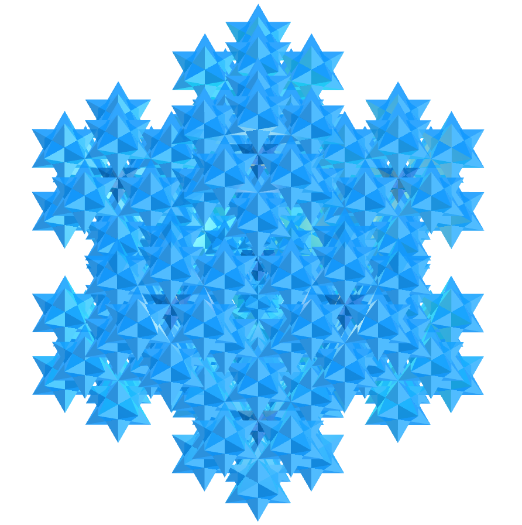
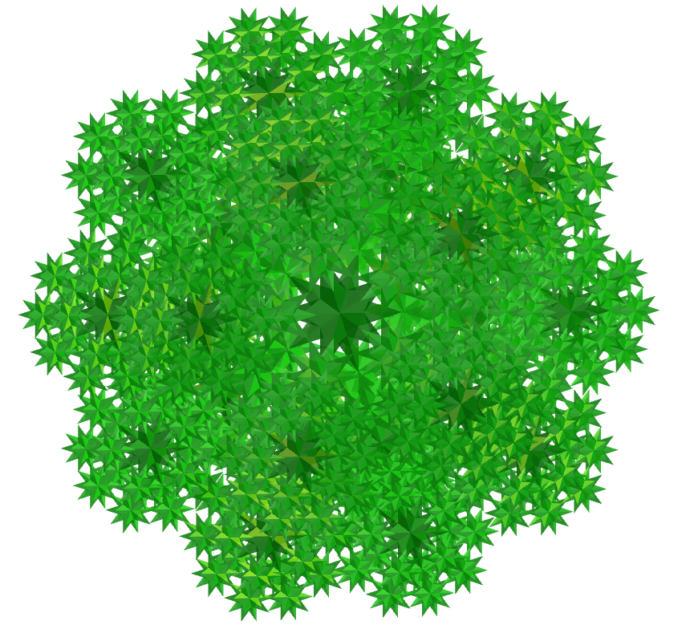
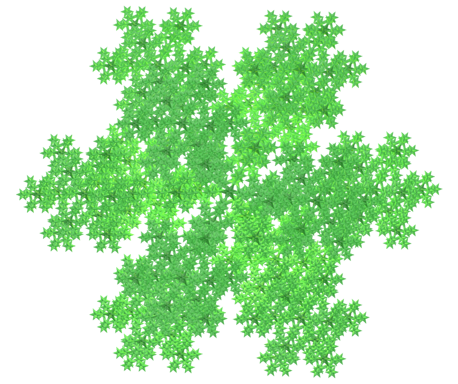
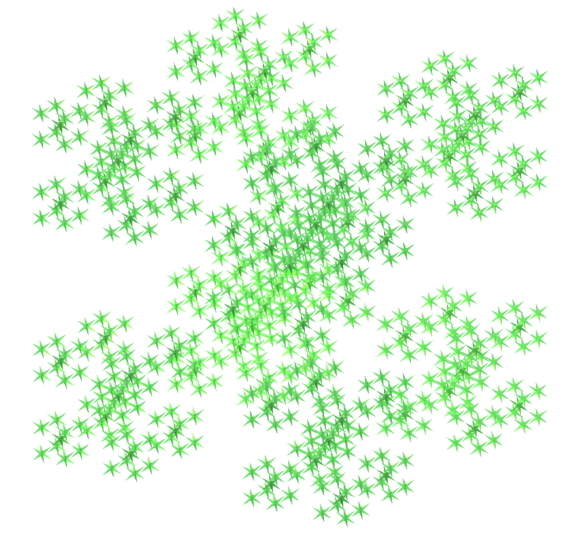
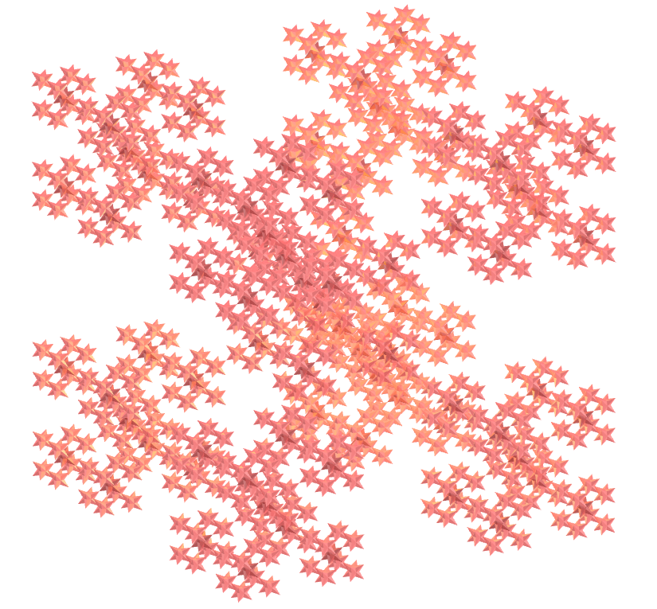
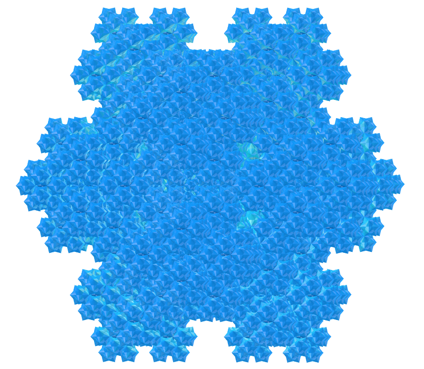
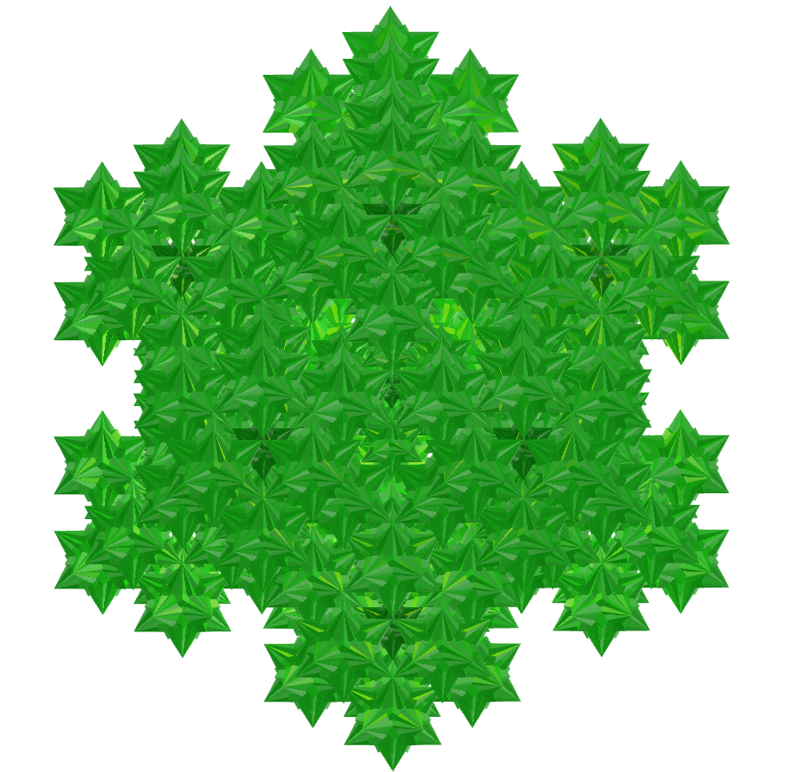
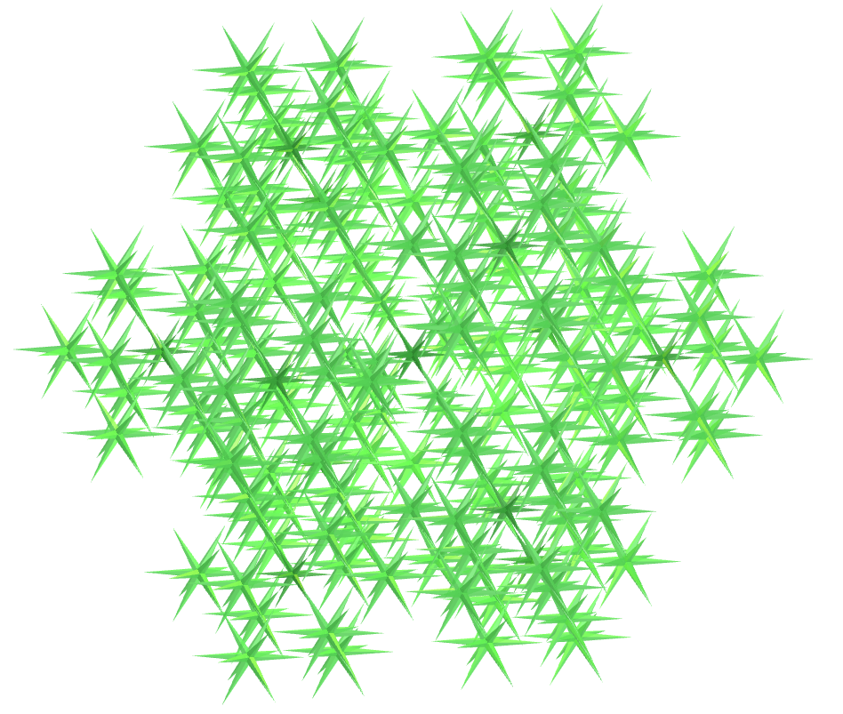

<link rel="stylesheet" href="../../scripts/style.css">
<link rel="icon" type="image/png" href="../vr/salas/imagens/icone.png">
<h2>Visualização de poliedros com Realidade Aumentada (RA) e Realidade Virtual (RV) em A-frame</h2>
<b>autor:</b> Paulo Henrique Siqueira - Universidade Federal do Paraná
 <b>contato:</b> <a href="#"> paulohscwb@gmail.com </a>
 <a href="https://paulohscwb.github.io/polyhedra2/fractalnonconvex/">english version</a>
<form style="margin: 0 auto; float:right; text-align:right; width:100%; margin-bottom:15px;">
	<select id="url" onchange="urlHandler(this.value)" style="color:royalblue;">
		<option disabled selected>Mais poliedros:</option>
		<option value="../../ArchimedeanCatalanHulls/pt-br/">Cascos convexos de Arquimedes e Catalan</option>
		<option value="../../fractalplatonic/pt-br/">Fractais dos poliedros de Platão</option>
		<option disabled value="../../fractalnonconvex/pt-br/">Fractais dos poliedros não convexos</option>
		<option value="../../fractalarchimedean/pt-br/">Fractais dos poliedros de Arquimedes</option>
		<option value="../../chamfered/pt-br/">Poliedros chanfrados</option>
	</select>
</form>

  <h2 align="center"> Fractais dos poliedros não convexos</h2>
  Utilizando o mesmo princípio da construção do triângulo de Sierpinski ou da curva de Koch, podemos construir fractais de outros polígonos regulares. Quando estes polígonos formam um poliedro, temos a construção de um poliedro fractal.
 

 
<a href="#ra">Realidade Aumentada</a>&nbsp;&nbsp;|&nbsp;&nbsp;<a href="#m3d">Modelos 3D</a>&nbsp;&nbsp;|&nbsp;&nbsp;<a href="../../pt-br/">Página Inicial</a>

  

 <h3 align="center">Salas imersivas</h3>
  
<iframe width="100%" src="../sala1.htm" title="Sala Imersiva de fractais de poliedros" frameborder="0" loading="lazy"></iframe>

  
<a href="../sala1.htm" target="_blank">&#x1f517; sala 1</a>&nbsp;&nbsp;|&nbsp;&nbsp;<a href="../sala2.htm" target="_blank">&#x1f517; sala 2</a>&nbsp;&nbsp;|&nbsp;&nbsp;<a href="../sala3.htm" target="_blank">&#x1f517; sala 3</a>&nbsp;&nbsp;|&nbsp;&nbsp;<a href="../sala4.htm" target="_blank">&#x1f517; sala 4</a>&nbsp;&nbsp;|&nbsp;&nbsp;<a href="../sala5.htm" target="_blank">&#x1f517; sala 5</a>&nbsp;&nbsp;|&nbsp;&nbsp;<a href="../sala6.htm" target="_blank">&#x1f517; sala 6</a>

  

 
  <h3 id="ra" align="center">Realidade Aumentada</h3>
  Para visualizar os fractais de poliedros em RA, visite as páginas indicadas nos modelos 3D dos sólidos utilizando qualquer navegador com um dispositivo de webcam (smartphone, tablet ou notebook).
 O acesso às páginas de RV é feito clicando no círculo azul que aparece em cima de cada marcador.

<h3 id="m3d" align="center">Modelos 3D</h3>
<!-- <iframe width="560" height="315" style="max-width:100%" src="https://www.youtube.com/embed/videoseries?list=PLy0I_lGW8HxU-mneUmSsccpRAAwbErHFq" title="YouTube video player" frameborder="0" allow="accelerometer; autoplay; clipboard-write; encrypted-media; gyroscope; picture-in-picture; web-share" allowfullscreen></iframe> -->
<h4>1. Fractal do sólido de Escher</h4>

   Aplicando-se o princípio de construção do triângulo de Sierpinski nas 48 faces do sólido de Escher, obtemos um fractal do sólido de Escher. Na primeira ordem de construção do fractal, construímos um novo sólido em 12 vértices do poliedro original. Neste exemplo, temos as representações do sólido nas ordens 0, 1, 2 e 3.
 <table>
	<tr>
		<th>ordem</th>
		<th>poliedros</th>
		<th>faces</th>
		<th>arestas</th>
		<th>vértices</th>
	</tr>
	<tr>
		<td>0</td>
		<td>1</td>
		<td>48</td>
		<td>72</td>
		<td>26</td>
	</tr>
	<tr>
		<td>1</td>
		<td>12</td>
		<td>576</td>
		<td>864</td>
		<td>312</td>
	</tr>
	<tr>
		<td>2</td>
		<td>144</td>
		<td>6912</td>
		<td>10368</td>
		<td>3744</td>
	</tr>
	<tr>
		<td>3</td>
		<td>1728</td>
		<td>82944</td>
		<td>124416</td>
		<td>44928</td>
	</tr>
 </table>
 
 

<h4>2. Fractal do pequeno dodecaedro estrelado</h4>

   Aplicando-se o princípio de construção da curva de Koch nas 12 faces do pequeno dodecaedro estrelado, obtemos um fractal do pequeno dodecaedro estrelado. Na primeira ordem de construção do fractal, construímos um novo sólido em cada vértice do poliedro original. Neste exemplo, temos as representações do sólido nas ordens 0, 1, 2 e 3.
 <table>
	<tr>
		<th>ordem</th>
		<th>poliedros</th>
		<th>faces</th>
		<th>arestas</th>
		<th>vértices</th>
	</tr>
	<tr>
		<td>0</td>
		<td>1</td>
		<td>12</td>
		<td>30</td>
		<td>12</td>
	</tr>
	<tr>
		<td>1</td>
		<td>12</td>
		<td>144</td>
		<td>360</td>
		<td>144</td>
	</tr>
	<tr>
		<td>2</td>
		<td>144</td>
		<td>1728</td>
		<td>4320</td>
		<td>1728</td>
	</tr>
	<tr>
		<td>3</td>
		<td>1728</td>
		<td>20736</td>
		<td>51840</td>
		<td>20736</td>
	</tr>
 </table>
 
 

<h4>3. Fractal do grande dodecaedro estrelado</h4>

   Aplicando-se o princípio de construção da curva de Koch nas 12 faces do grande dodecaedro estrelado, obtemos um fractal do grande dodecaedro estrelado. Na primeira ordem de construção do fractal, construímos um novo sólido em cada vértice do poliedro original. Neste exemplo, temos as representações do sólido nas ordens 0, 1, 2 e 3.
 <table>
	<tr>
		<th>ordem</th>
		<th>poliedros</th>
		<th>faces</th>
		<th>arestas</th>
		<th>vértices</th>
	</tr>
	<tr>
		<td>0</td>
		<td>1</td>
		<td>12</td>
		<td>30</td>
		<td>20</td>
	</tr>
	<tr>
		<td>1</td>
		<td>21</td>
		<td>252</td>
		<td>630</td>
		<td>420</td>
	</tr>
	<tr>
		<td>2</td>
		<td>441</td>
		<td>5292</td>
		<td>13230</td>
		<td>8820</td>
	</tr>
	<tr>
		<td>3</td>
		<td>9261</td>
		<td>111132</td>
		<td>277830</td>
		<td>185220</td>
	</tr>
 </table>
 
 

<h4>4. Fractal do grande icosaedro</h4>

   Aplicando-se o princípio de construção da curva de Koch nas 20 faces do grande icosaedro, obtemos um fractal do grande icosaedro. Na primeira ordem de construção do fractal, construímos um novo sólido em cada vértice do poliedro original. Neste exemplo, temos as representações do sólido nas ordens 0, 1, 2 e 3.
 <table>
	<tr>
		<th>ordem</th>
		<th>poliedros</th>
		<th>faces</th>
		<th>arestas</th>
		<th>vértices</th>
	</tr>
	<tr>
		<td>0</td>
		<td>1</td>
		<td>20</td>
		<td>30</td>
		<td>12</td>
	</tr>
	<tr>
		<td>1</td>
		<td>12</td>
		<td>240</td>
		<td>360</td>
		<td>144</td>
	</tr>
	<tr>
		<td>2</td>
		<td>144</td>
		<td>2880</td>
		<td>4320</td>
		<td>1728</td>
	</tr>
	<tr>
		<td>3</td>
		<td>1728</td>
		<td>34560</td>
		<td>51840</td>
		<td>20736</td>
	</tr>
 </table>
 
 

<h4>5. Fractal do grande dodecaedro</h4>

   Aplicando-se o princípio de construção da curva de Koch nas 12 faces do grande dodecaedro, obtemos um fractal do grande dodecaedro. Na primeira ordem de construção do fractal, construímos um novo sólido em cada vértice do poliedro original. Neste exemplo, temos as representações do sólido nas ordens 0, 1, 2 e 3.
 <table>
	<tr>
		<th>ordem</th>
		<th>poliedros</th>
		<th>faces</th>
		<th>arestas</th>
		<th>vértices</th>
	</tr>
	<tr>
		<td>0</td>
		<td>1</td>
		<td>12</td>
		<td>30</td>
		<td>12</td>
	</tr>
	<tr>
		<td>1</td>
		<td>12</td>
		<td>144</td>
		<td>360</td>
		<td>144</td>
	</tr>
	<tr>
		<td>2</td>
		<td>144</td>
		<td>1728</td>
		<td>4320</td>
		<td>1728</td>
	</tr>
	<tr>
		<td>3</td>
		<td>1728</td>
		<td>20736</td>
		<td>51840</td>
		<td>20736</td>
	</tr>
 </table>
 
 

<h4>6. Fractal do grande dodecaedro stellapentakis</h4>

   Aplicando-se o princípio de construção da curva de Koch em 20 faces do grande dodecaedro stellapentakis, obtemos um fractal do grande dodecaedro stellapentakis. Na primeira ordem de construção do fractal, construímos um novo sólido em 20 vértices do poliedro original. Neste exemplo, temos as representações do sólido nas ordens 0, 1, 2 e 3.
 <table>
	<tr>
		<th>ordem</th>
		<th>poliedros</th>
		<th>faces</th>
		<th>arestas</th>
		<th>vértices</th>
	</tr>
	<tr>
		<td>0</td>
		<td>1</td>
		<td>60</td>
		<td>90</td>
		<td>32</td>
	</tr>
	<tr>
		<td>1</td>
		<td>21</td>
		<td>1260</td>
		<td>1890</td>
		<td>672</td>
	</tr>
	<tr>
		<td>2</td>
		<td>441</td>
		<td>26460</td>
		<td>39690</td>
		<td>14112</td>
	</tr>
	<tr>
		<td>3</td>
		<td>9261</td>
		<td>555660</td>
		<td>833490</td>
		<td>296352</td>
	</tr>
 </table>
 

<h4>7. Fractal da dipirâmide pentagrâmica</h4>

   Aplicando-se o princípio de construção da curva de Koch nas arestas que formam o pentagrama da dipirâmide pentagrâmica, obtemos um fractal da dipirâmide pentagrâmica. Na primeira ordem de construção do fractal, construímos um novo sólido em 5 vértices do poliedro original. Neste exemplo, temos as representações do sólido nas ordens 0, 1, 2, 3 e 4.
 <table>
	<tr>
		<th>ordem</th>
		<th>poliedros</th>
		<th>faces</th>
		<th>arestas</th>
		<th>vértices</th>
	</tr>
	<tr>
		<td>0</td>
		<td>1</td>
		<td>10</td>
		<td>15</td>
		<td>7</td>
	</tr>
	<tr>
		<td>1</td>
		<td>6</td>
		<td>60</td>
		<td>90</td>
		<td>42</td>
	</tr>
	<tr>
		<td>2</td>
		<td>36</td>
		<td>360</td>
		<td>540</td>
		<td>252</td>
	</tr>
	<tr>
		<td>3</td>
		<td>216</td>
		<td>2160</td>
		<td>3240</td>
		<td>1512</td>
	</tr>
	<tr>
		<td>4</td>
		<td>1296</td>
		<td>12960</td>
		<td>19440</td>
		<td>9072</td>
	</tr>
 </table>
 
 

<h4>8. Fractal do icosaedro triâmbico medial</h4>

   Aplicando-se o princípio de construção da curva de Koch nas faces do icosaedro triâmbico medial, obtemos um fractal do icosaedro triâmbico medial. Na primeira ordem de construção do fractal, construímos um novo sólido em 12 vértices do poliedro original. Neste exemplo, temos as representações do sólido nas ordens 0, 1, 2 e 3.
 <table>
	<tr>
		<th>ordem</th>
		<th>poliedros</th>
		<th>faces</th>
		<th>arestas</th>
		<th>vértices</th>
	</tr>
	<tr>
		<td>0</td>
		<td>1</td>
		<td>20</td>
		<td>60</td>
		<td>24</td>
	</tr>
	<tr>
		<td>1</td>
		<td>13</td>
		<td>260</td>
		<td>780</td>
		<td>312</td>
	</tr>
	<tr>
		<td>2</td>
		<td>169</td>
		<td>3380</td>
		<td>10140</td>
		<td>4056</td>
	</tr>
	<tr>
		<td>3</td>
		<td>2197</td>
		<td>43940</td>
		<td>131820</td>
		<td>52728</td>
	</tr>
 </table>
 
 

<h4>9. Fractal do grande triacontaedro rômbico</h4>

   Aplicando-se o princípio de construção da curva de Koch em 20 faces do grande triacontaedro rômbico, obtemos um fractal do grande triacontaedro rômbico. Na primeira ordem de construção do fractal, construímos um novo sólido em 20 vértices do poliedro original. Neste exemplo, temos as representações do sólido nas ordens 0, 1, 2 e 3.
 <table>
	<tr>
		<th>ordem</th>
		<th>poliedros</th>
		<th>faces</th>
		<th>arestas</th>
		<th>vértices</th>
	</tr>
	<tr>
		<td>0</td>
		<td>1</td>
		<td>30</td>
		<td>60</td>
		<td>32</td>
	</tr>
	<tr>
		<td>1</td>
		<td>21</td>
		<td>630</td>
		<td>1260</td>
		<td>672</td>
	</tr>
	<tr>
		<td>2</td>
		<td>441</td>
		<td>13230</td>
		<td>26460</td>
		<td>14112</td>
	</tr>
	<tr>
		<td>3</td>
		<td>9261</td>
		<td>277830</td>
		<td>555660</td>
		<td>296352</td>
	</tr>
 </table>
 
 

<h4>10. Fractal do triacontaedro rômbico medial</h4>

   Aplicando-se o princípio de construção da curva de Koch em 12 faces do triacontaedro rômbico medial, obtemos um fractal do triacontaedro rômbico medial. Na primeira ordem de construção do fractal, construímos um novo sólido em 12 vértices do poliedro original. Neste exemplo, temos as representações do sólido nas ordens 0, 1, 2 e 3.
 <table>
	<tr>
		<th>ordem</th>
		<th>poliedros</th>
		<th>faces</th>
		<th>arestas</th>
		<th>vértices</th>
	</tr>
	<tr>
		<td>0</td>
		<td>1</td>
		<td>30</td>
		<td>60</td>
		<td>24</td>
	</tr>
	<tr>
		<td>1</td>
		<td>13</td>
		<td>390</td>
		<td>780</td>
		<td>312</td>
	</tr>
	<tr>
		<td>2</td>
		<td>169</td>
		<td>5070</td>
		<td>10140</td>
		<td>4056</td>
	</tr>
	<tr>
		<td>3</td>
		<td>2197</td>
		<td>65910</td>
		<td>131820</td>
		<td>52728</td>
	</tr>
 </table>
 
  
<a href="#p1" class="topo">voltar ao topo</a>

  

<h4>11. Fractal do pequeno hexecontaedro ditrigonal dodecacrônico</h4>

   Aplicando-se o princípio de construção da curva de Koch em 12 faces do pequeno hexecontaedro ditrigonal dodecacrônico, obtemos um fractal do pequeno hexecontaedro ditrigonal dodecacrônico. Na primeira ordem de construção do fractal, construímos um novo sólido em 12 vértices do poliedro original. Neste exemplo, temos as representações do sólido nas ordens 0, 1, 2 e 3.
 <table>
	<tr>
		<th>ordem</th>
		<th>poliedros</th>
		<th>faces</th>
		<th>arestas</th>
		<th>vértices</th>
	</tr>
	<tr>
		<td>0</td>
		<td>1</td>
		<td>60</td>
		<td>120</td>
		<td>44</td>
	</tr>
	<tr>
		<td>1</td>
		<td>13</td>
		<td>780</td>
		<td>1560</td>
		<td>572</td>
	</tr>
	<tr>
		<td>2</td>
		<td>169</td>
		<td>10140</td>
		<td>20280</td>
		<td>7436</td>
	</tr>
	<tr>
		<td>3</td>
		<td>2197</td>
		<td>131820</td>
		<td>263640</td>
		<td>96668</td>
	</tr>
 </table>
 
 

<h4>12. Fractal do rombicosacro</h4>

   Aplicando-se o princípio de construção da curva de Koch em 20 faces do rombicosacro, obtemos um fractal do rombicosacro. Na primeira ordem de construção do fractal, construímos um novo sólido em 20 vértices do poliedro original. Neste exemplo, temos as representações do sólido nas ordens 0, 1, 2 e 3.
 <table>
	<tr>
		<th>ordem</th>
		<th>poliedros</th>
		<th>faces</th>
		<th>arestas</th>
		<th>vértices</th>
	</tr>
	<tr>
		<td>0</td>
		<td>1</td>
		<td>60</td>
		<td>120</td>
		<td>50</td>
	</tr>
	<tr>
		<td>1</td>
		<td>21</td>
		<td>1260</td>
		<td>2520</td>
		<td>1050</td>
	</tr>
	<tr>
		<td>2</td>
		<td>441</td>
		<td>26460</td>
		<td>52920</td>
		<td>22050</td>
	</tr>
	<tr>
		<td>3</td>
		<td>9261</td>
		<td>555660</td>
		<td>1111320</td>
		<td>463050</td>
	</tr>
 </table>
 
 

<h4>13. Fractal do pequeno icositetraedro hexacrônico</h4>

   Aplicando-se o princípio de construção da curva de Koch em 6 faces do pequeno icositetraedro hexacrônico, obtemos um fractal do pequeno icositetraedro hexacrônico. Na primeira ordem de construção do fractal, construímos um novo sólido em 6 vértices do poliedro original. Neste exemplo, temos as representações do sólido nas ordens 0, 1, 2 e 3.
 <table>
	<tr>
		<th>ordem</th>
		<th>poliedros</th>
		<th>faces</th>
		<th>arestas</th>
		<th>vértices</th>
	</tr>
	<tr>
		<td>0</td>
		<td>1</td>
		<td>24</td>
		<td>48</td>
		<td>20</td>
	</tr>
	<tr>
		<td>1</td>
		<td>7</td>
		<td>168</td>
		<td>336</td>
		<td>140</td>
	</tr>
	<tr>
		<td>2</td>
		<td>49</td>
		<td>1176</td>
		<td>2352</td>
		<td>980</td>
	</tr>
	<tr>
		<td>3</td>
		<td>343</td>
		<td>8232</td>
		<td>16464</td>
		<td>6860</td>
	</tr>
 </table>
 
 

<h4>14. Fractal do grande octaedro triakis</h4>

   Aplicando-se o princípio de construção da curva de Koch em 8 faces do grande octaedro triakis, obtemos um fractal do grande octaedro triakis. Na primeira ordem de construção do fractal, construímos um novo sólido em 8 vértices do poliedro original. Neste exemplo, temos as representações do sólido nas ordens 0, 1, 2 e 3.
 <table>
	<tr>
		<th>ordem</th>
		<th>poliedros</th>
		<th>faces</th>
		<th>arestas</th>
		<th>vértices</th>
	</tr>
	<tr>
		<td>0</td>
		<td>1</td>
		<td>24</td>
		<td>36</td>
		<td>14</td>
	</tr>
	<tr>
		<td>1</td>
		<td>9</td>
		<td>216</td>
		<td>324</td>
		<td>126</td>
	</tr>
	<tr>
		<td>2</td>
		<td>81</td>
		<td>1944</td>
		<td>2916</td>
		<td>1134</td>
	</tr>
	<tr>
		<td>3</td>
		<td>729</td>
		<td>17496</td>
		<td>26244</td>
		<td>10216</td>
	</tr>
 </table>
 
 

<h4>15. Fractal do grande dodecaedro disdyakis</h4>

   Aplicando-se o princípio de construção da curva de Koch em 8 faces do grande dodecaedro disdyakis, obtemos um fractal do grande dodecaedro disdyakis. Na primeira ordem de construção do fractal, construímos um novo sólido em 8 vértices do poliedro original. Neste exemplo, temos as representações do sólido nas ordens 0, 1, 2 e 3.
 <table>
	<tr>
		<th>ordem</th>
		<th>poliedros</th>
		<th>faces</th>
		<th>arestas</th>
		<th>vértices</th>
	</tr>
	<tr>
		<td>0</td>
		<td>1</td>
		<td>48</td>
		<td>72</td>
		<td>20</td>
	</tr>
	<tr>
		<td>1</td>
		<td>9</td>
		<td>432</td>
		<td>648</td>
		<td>180</td>
	</tr>
	<tr>
		<td>2</td>
		<td>81</td>
		<td>3888</td>
		<td>5832</td>
		<td>1620</td>
	</tr>
	<tr>
		<td>3</td>
		<td>729</td>
		<td>34992</td>
		<td>52488</td>
		<td>14580</td>
	</tr>
 </table>
 
 

<h4>16. Fractal do pequeno rombidodecácrono</h4>

   Aplicando-se o princípio de construção da curva de Koch em 12 faces do pequeno rombidodecácrono, obtemos um fractal do pequeno rombidodecácrono. Na primeira ordem de construção do fractal, construímos um novo sólido em 12 vértices do poliedro original. Neste exemplo, temos as representações do sólido nas ordens 0, 1, 2 e 3.
 <table>
	<tr>
		<th>ordem</th>
		<th>poliedros</th>
		<th>faces</th>
		<th>arestas</th>
		<th>vértices</th>
	</tr>
	<tr>
		<td>0</td>
		<td>1</td>
		<td>60</td>
		<td>120</td>
		<td>42</td>
	</tr>
	<tr>
		<td>1</td>
		<td>13</td>
		<td>780</td>
		<td>1560</td>
		<td>546</td>
	</tr>
	<tr>
		<td>2</td>
		<td>169</td>
		<td>10140</td>
		<td>20280</td>
		<td>7098</td>
	</tr>
	<tr>
		<td>3</td>
		<td>2197</td>
		<td>131820</td>
		<td>263640</td>
		<td>92274</td>
	</tr>
 </table>
 
 

<h4>17. Fractal do grande icosaedro triakis</h4>

   Aplicando-se o princípio de construção da curva de Koch em 12 faces do grande icosaedro triakis, obtemos um fractal do grande icosaedro triakis. Na primeira ordem de construção do fractal, construímos um novo sólido em 12 vértices do poliedro original. Neste exemplo, temos as representações do sólido nas ordens 0, 1, 2 e 3.
 <table>
	<tr>
		<th>ordem</th>
		<th>poliedros</th>
		<th>faces</th>
		<th>arestas</th>
		<th>vértices</th>
	</tr>
	<tr>
		<td>0</td>
		<td>1</td>
		<td>60</td>
		<td>90</td>
		<td>32</td>
	</tr>
	<tr>
		<td>1</td>
		<td>13</td>
		<td>780</td>
		<td>1170</td>
		<td>416</td>
	</tr>
	<tr>
		<td>2</td>
		<td>169</td>
		<td>10140</td>
		<td>15210</td>
		<td>5408</td>
	</tr>
	<tr>
		<td>3</td>
		<td>2197</td>
		<td>131820</td>
		<td>197730</td>
		<td>70304</td>
	</tr>
 </table>
 
 

<h4>18. Fractal do grande icosaedro truncado</h4>

   Aplicando-se o princípio de construção da curva de Koch em 12 faces do grande icosaedro truncado, obtemos um fractal do grande icosaedro truncado. Na primeira ordem de construção do fractal, construímos um novo sólido em 12 faces do poliedro original. Neste exemplo, temos as representações do sólido nas ordens 0, 1, 2 e 3.
 <table>
	<tr>
		<th>ordem</th>
		<th>poliedros</th>
		<th>faces</th>
		<th>arestas</th>
		<th>vértices</th>
	</tr>
	<tr>
		<td>0</td>
		<td>1</td>
		<td>32</td>
		<td>90</td>
		<td>60</td>
	</tr>
	<tr>
		<td>1</td>
		<td>13</td>
		<td>416</td>
		<td>1170</td>
		<td>780</td>
	</tr>
	<tr>
		<td>2</td>
		<td>169</td>
		<td>5408</td>
		<td>15210</td>
		<td>10140</td>
	</tr>
	<tr>
		<td>3</td>
		<td>2197</td>
		<td>70304</td>
		<td>197730</td>
		<td>131820</td>
	</tr>
 </table>
 
 

 

<h4>19. Fractal da dipirâmide pentagrâmica</h4>

   Aplicando-se o princípio de repetição de sólidos nos vértices da dipirâmide pentagrâmica, obtemos um fractal da dipirâmide pentagrâmica. Na primeira ordem de construção do fractal, construímos um novo sólido correspondente a cada vértice do poliedro original. Neste exemplo, temos as representações do sólido nas ordens 0, 1, 2, 3, 4 e 5.
 <table>
	<tr>
		<th>ordem</th>
		<th>poliedros</th>
		<th>faces</th>
		<th>arestas</th>
		<th>vértices</th>
	</tr>
	<tr>
		<td>0</td>
		<td>1</td>
		<td>10</td>
		<td>15</td>
		<td>7</td>
	</tr>
	<tr>
		<td>1</td>
		<td>6</td>
		<td>60</td>
		<td>90</td>
		<td>42</td>
	</tr>
	<tr>
		<td>2</td>
		<td>11</td>
		<td>110</td>
		<td>165</td>
		<td>77</td>
	</tr>
	<tr>
		<td>3</td>
		<td>21</td>
		<td>210</td>
		<td>315</td>
		<td>147</td>
	</tr>
	<tr>
		<td>4</td>
		<td>41</td>
		<td>410</td>
		<td>615</td>
		<td>287</td>
	</tr>
	<tr>
		<td>5</td>
		<td>81</td>
		<td>810</td>
		<td>1215</td>
		<td>567</td>
	</tr>
 </table>
 
 

<h4>20. Fractal da dipirâmide heptagrâmica</h4>

   Aplicando-se o princípio de repetição de sólidos nos vértices da dipirâmide heptagrâmica, obtemos um fractal da dipirâmide heptagrâmica. Na primeira ordem de construção do fractal, construímos um novo sólido correspondente a cada vértice do poliedro original. Neste exemplo, temos as representações do sólido nas ordens 0, 1, 2, 3, 4 e 5.
 <table>
	<tr>
		<th>ordem</th>
		<th>poliedros</th>
		<th>faces</th>
		<th>arestas</th>
		<th>vértices</th>
	</tr>
	<tr>
		<td>0</td>
		<td>1</td>
		<td>14</td>
		<td>21</td>
		<td>9</td>
	</tr>
	<tr>
		<td>1</td>
		<td>8</td>
		<td>112</td>
		<td>168</td>
		<td>72</td>
	</tr>
	<tr>
		<td>2</td>
		<td>15</td>
		<td>210</td>
		<td>315</td>
		<td>135</td>
	</tr>
	<tr>
		<td>3</td>
		<td>29</td>
		<td>406</td>
		<td>609</td>
		<td>261</td>
	</tr>
	<tr>
		<td>4</td>
		<td>57</td>
		<td>798</td>
		<td>1197</td>
		<td>513</td>
	</tr>
	<tr>
		<td>5</td>
		<td>113</td>
		<td>1582</td>
		<td>2373</td>
		<td>1017</td>
	</tr>
 </table>
 
 
<a href="#p1" class="topo">voltar ao topo</a>

 

<h4>21. Fractal do grande dodecaedro pentakis</h4>

   Aplicando-se o princípio de construção da curva de Koch em 12 vértices do grande dodecaedro pentakis, obtemos um fractal do grande dodecaedro pentakis. Na primeira ordem de construção do fractal, construímos um novo sólido em 12 vértices do poliedro original. Neste exemplo, temos as representações do sólido nas ordens 0, 1, 2 e 3.
 <table>
	<tr>
		<th>ordem</th>
		<th>poliedros</th>
		<th>faces</th>
		<th>arestas</th>
		<th>vértices</th>
	</tr>
	<tr>
		<td>0</td>
		<td>1</td>
		<td>60</td>
		<td>90</td>
		<td>24</td>
	</tr>
	<tr>
		<td>1</td>
		<td>13</td>
		<td>780</td>
		<td>1170</td>
		<td>312</td>
	</tr>
	<tr>
		<td>2</td>
		<td>169</td>
		<td>10140</td>
		<td>15210</td>
		<td>4056</td>
	</tr>
	<tr>
		<td>3</td>
		<td>2197</td>
		<td>131820</td>
		<td>197730</td>
		<td>52728</td>
	</tr>
 </table>
 
 

<h4>22. Fractal do icosidodecadodecaedro</h4>

   Aplicando-se o princípio de construção da curva de Koch em 12 faces do icosidodecadodecaedro, obtemos um fractal do icosidodecadodecaedro. Na primeira ordem de construção do fractal, construímos um novo sólido em 12 faces do poliedro original. Neste exemplo, temos as representações do sólido nas ordens 0, 1, 2 e 3.
 <table>
	<tr>
		<th>ordem</th>
		<th>poliedros</th>
		<th>faces</th>
		<th>arestas</th>
		<th>vértices</th>
	</tr>
	<tr>
		<td>0</td>
		<td>1</td>
		<td>44</td>
		<td>120</td>
		<td>60</td>
	</tr>
	<tr>
		<td>1</td>
		<td>13</td>
		<td>572</td>
		<td>1560</td>
		<td>780</td>
	</tr>
	<tr>
		<td>2</td>
		<td>169</td>
		<td>7436</td>
		<td>20280</td>
		<td>10140</td>
	</tr>
	<tr>
		<td>3</td>
		<td>2197</td>
		<td>96668</td>
		<td>263640</td>
		<td>131820</td>
	</tr>
 </table>
 

<h4>23. Fractal do Rombicosaedro</h4>

   Aplicando-se o princípio de construção da curva de Koch em 12 faces do rombicosaedro, obtemos um fractal do rombicosaedro. Na primeira ordem de construção do fractal, construímos um novo sólido em 12 faces do poliedro original. Neste exemplo, temos as representações do sólido nas ordens 0, 1, 2 e 3.
 <table>
	<tr>
		<th>ordem</th>
		<th>poliedros</th>
		<th>faces</th>
		<th>arestas</th>
		<th>vértices</th>
	</tr>
	<tr>
		<td>0</td>
		<td>1</td>
		<td>50</td>
		<td>120</td>
		<td>60</td>
	</tr>
	<tr>
		<td>1</td>
		<td>13</td>
		<td>650</td>
		<td>1560</td>
		<td>780</td>
	</tr>
	<tr>
		<td>2</td>
		<td>169</td>
		<td>8450</td>
		<td>20280</td>
		<td>10140</td>
	</tr>
	<tr>
		<td>3</td>
		<td>2197</td>
		<td>109850</td>
		<td>263640</td>
		<td>131820</td>
	</tr>
 </table>
 
 

<h4>24. Fractal do hexecontaedro pentagonal invertido medial</h4>

   Aplicando-se o princípio de construção da curva de Koch em 12 vértices do hexecontaedro pentagonal invertido medial, obtemos um fractal do hexecontaedro pentagonal invertido medial. Na primeira ordem de construção do fractal, construímos um novo sólido em 12 vértices do poliedro original. Neste exemplo, temos as representações do sólido nas ordens 0, 1, 2 e 3.
 <table>
	<tr>
		<th>ordem</th>
		<th>poliedros</th>
		<th>faces</th>
		<th>arestas</th>
		<th>vértices</th>
	</tr>
	<tr>
		<td>0</td>
		<td>1</td>
		<td>60</td>
		<td>150</td>
		<td>84</td>
	</tr>
	<tr>
		<td>1</td>
		<td>13</td>
		<td>780</td>
		<td>1950</td>
		<td>1092</td>
	</tr>
	<tr>
		<td>2</td>
		<td>169</td>
		<td>10140</td>
		<td>25350</td>
		<td>14196</td>
	</tr>
	<tr>
		<td>3</td>
		<td>2197</td>
		<td>131820</td>
		<td>329550</td>
		<td>184548</td>
	</tr>
 </table>
 
 

<h4>25. Fractal da dipirâmide heptagrâmica</h4>

   Aplicando-se o princípio de construção da curva de Koch nos vértices da dipirâmide heptagrâmica, obtemos um fractal da dipirâmide heptagrâmica. Na primeira ordem de construção do fractal, construímos um novo sólido nos vértices do poliedro original. Neste exemplo, temos as representações do sólido nas ordens 0, 1, 2, 3 e 4.
 <table>
	<tr>
		<th>ordem</th>
		<th>poliedros</th>
		<th>faces</th>
		<th>arestas</th>
		<th>vértices</th>
	</tr>
	<tr>
		<td>0</td>
		<td>1</td>
		<td>14</td>
		<td>21</td>
		<td>9</td>
	</tr>
	<tr>
		<td>1</td>
		<td>8</td>
		<td>112</td>
		<td>168</td>
		<td>72</td>
	</tr>
	<tr>
		<td>2</td>
		<td>64</td>
		<td>896</td>
		<td>1344</td>
		<td>576</td>
	</tr>
	<tr>
		<td>3</td>
		<td>512</td>
		<td>7168</td>
		<td>10752</td>
		<td>4608</td>
	</tr>
	<tr>
		<td>4</td>
		<td>4096</td>
		<td>57344</td>
		<td>86016</td>
		<td>36864</td>
	</tr>
 </table>
 

<a href="#p1" class="topo">voltar ao topo</a>

  Non convex polyhedra fractals - Visualization of polyhedra with Augmented Reality and Virtual Reality de <a xmlns:cc="http://creativecommons.org/ns#" href="https://paulohscwb.github.io/polyhedra2/fractalnonconvex/pt-br/" property="cc:attributionName" rel="cc:attributionURL">Paulo Henrique Siqueira</a> está licenciado com uma Licença <a rel="license" href="http://creativecommons.org/licenses/by-nc-nd/4.0/">Creative Commons Atribuição-NãoComercial-SemDerivações 4.0 Internacional</a>.

<h4>Como citar este trabalho:</h4> 

Siqueira, P.H., "Non convex polyhedra fractals - Visualization of polyhedra with Augmented Reality and Virtual Reality". Disponível em: <https://paulohscwb.github.io/polyhedra2/fractalnonconvex/pt-br/>, Outubro de 2023.

<!---->
  <b>Referências:</b>
 Weisstein, Eric W. "Archimedean Solid" From MathWorld-A Wolfram Web Resource. <a href="http://mathworld.wolfram.com/ArchimedeanSolid.html" target="_blank">http://mathworld.wolfram.com/ArchimedeanSolid.html</a>
 Weisstein, Eric W. "Platonic Solid" From MathWorld-A Wolfram Web Resource. <a href="http://mathworld.wolfram.com/PlatonicSolid.html" target="_blank">http://mathworld.wolfram.com/PlatonicSolid.html</a>
 Weisstein, Eric W. "Archimedean Dual" From MathWorld-A Wolfram Web Resource. <a href="https://mathworld.wolfram.com/ArchimedeanDual.html" target="_blank">https://mathworld.wolfram.com/ArchimedeanDual.html</a>
 Weisstein, Eric W. "Uniform Polyhedron." From MathWorld--A Wolfram Web Resource. <a href="https://mathworld.wolfram.com/UniformPolyhedron.html" target="_blank">https://mathworld.wolfram.com/UniformPolyhedron.html</a>
 Wikipedia <a href="https://en.wikipedia.org/wiki/Archimedean_solid" target="_blank">https://en.wikipedia.org/wiki/Archimedean_solid</a>
 Wikipedia <a href="https://en.wikipedia.org/wiki/en.wikipedia.org/wiki/Platonic_solid" target="_blank">https://en.wikipedia.org/wiki/Platonic_solid</a>
 McCooey, David I. "Visual Polyhedra". <a href="http://dmccooey.com/polyhedra/" target="_blank">http://dmccooey.com/polyhedra/</a>
