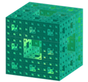
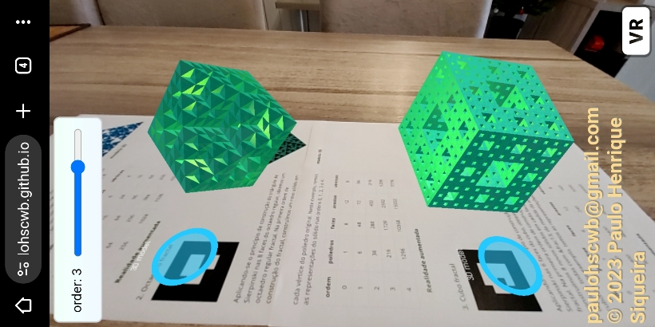
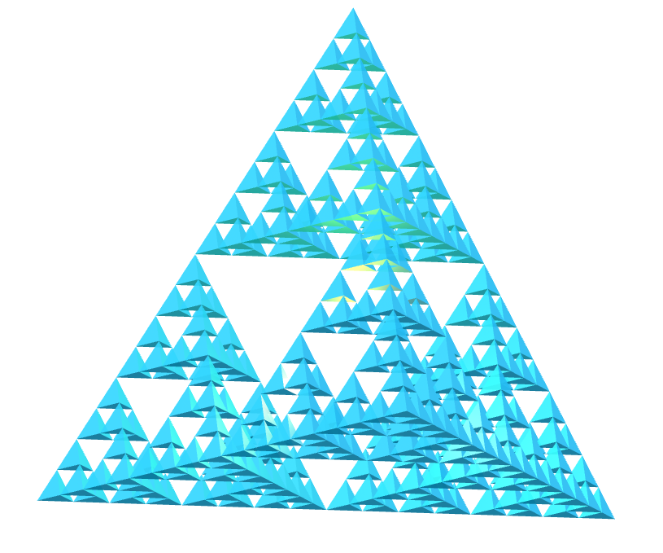
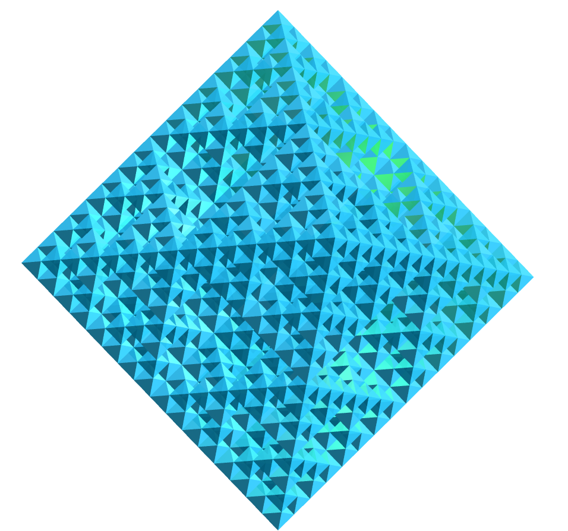
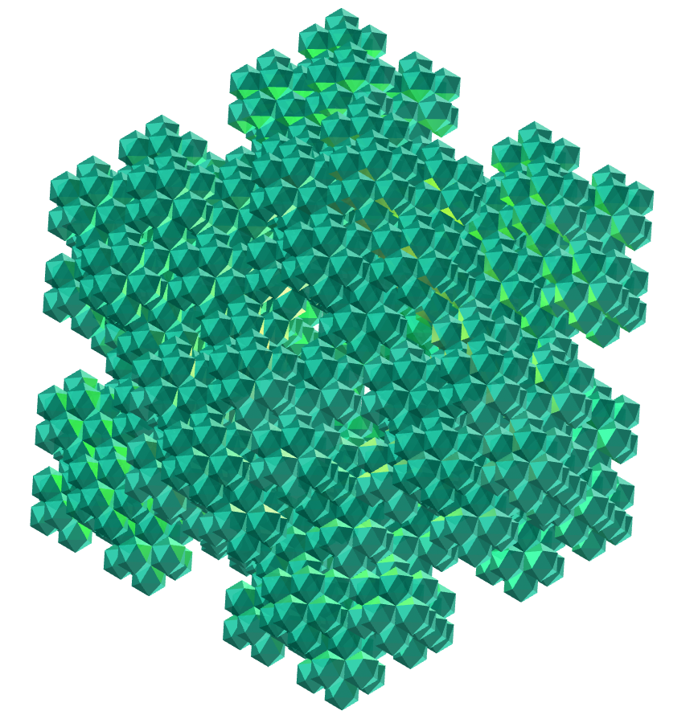
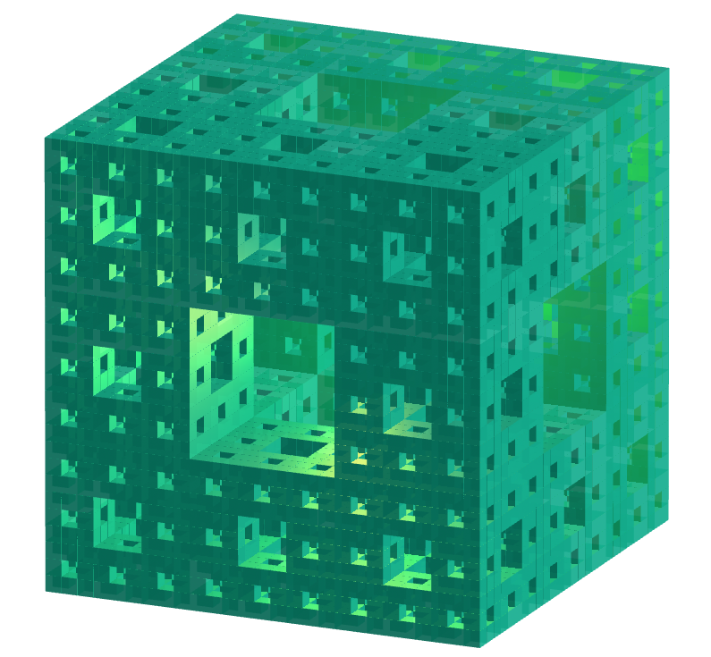
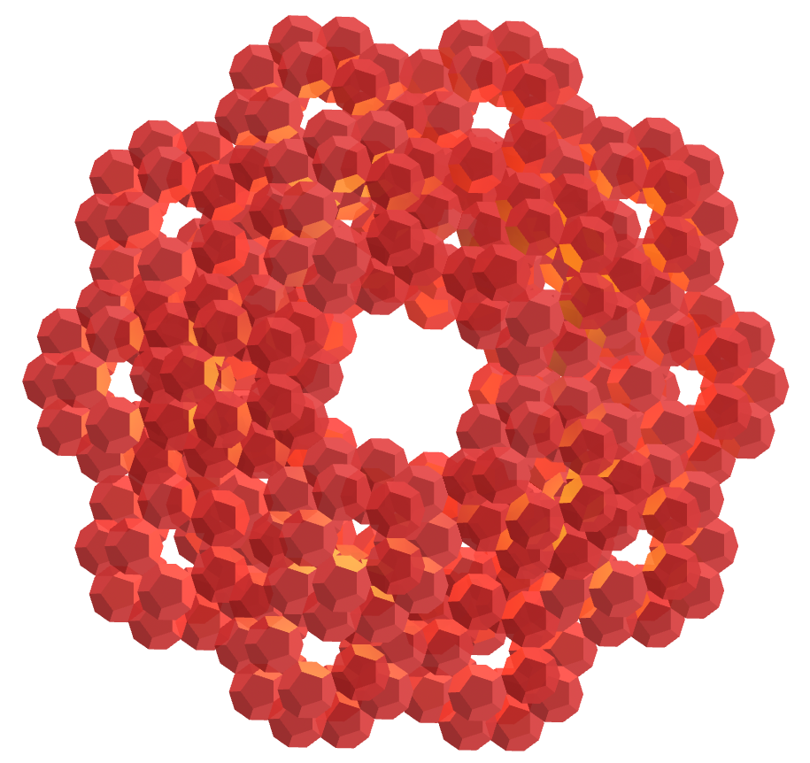

<link rel="stylesheet" href="../scripts/style.css">
<link rel="icon" type="image/png" href="vr/salas/imagens/icone.png">
<h2>Visualization of polyhedra with Augmented Reality (AR) and Virtual Reality (VR) in A-frame</h2>
 <b>author:</b> Paulo Henrique Siqueira - Universidade Federal do Paraná
  <b>contact:</b> <a href="#">paulohscwb@gmail.com</a>
  <a href="https://paulohscwb.github.io/polyhedra2/fractalplatonic/pt-br/">versão em português</a>
 <form style="margin: 0 auto; float:right; text-align:right; width:100%; margin-bottom:15px;">
	<select id="url" onchange="urlHandler(this.value)" style="color:royalblue;">
		<option disabled selected value>More polyhedra:</option>
		<option value="../ArchimedeanCatalanHulls/pt-br/">Archimedean and Catalan convex hulls</option>
		<option disabled value="../fractalplatonic/pt-br/">Platonic polyhedra fractals</option>
		<option value="../fractalnonconvex/pt-br/">Non convex polyhedra fractals</option>
		<option value="../fractalarchimedean/pt-br/">Archimedean polyhedra fractals</option>
	</select>
</form>

  <h2 align="center"> Platonic polyhedra fractals</h2>
Using the same principle as the construction of the Sierpinski triangle or the Koch curve, we can construct fractals from other regular polygons. When these polygons form a polyhedron, we have the construction of a fractal polyhedron.

 
<!--
<a href="#ra">Augmented Reality</a>&nbsp;&nbsp;|&nbsp;&nbsp;<a href="#m3d">3D Models</a>&nbsp;&nbsp;|&nbsp;&nbsp;<a href="../">Home</a>

  

  <h3 align="center">Immersive room</h3>
  
<iframe width="100%" src="sala.htm" title="Sala Imersiva de Fractais de poliedros" frameborder="0" loading="lazy"></iframe>

  
<a href="sala.htm" target="_blank">&#x1f517; room link</a>

 

  <h3 id="ra" align="center">Augmented Reality</h3>
To view fractal polyhedra in AR, simply visit:

<a href="ra.html" target="_blank">https://paulohscwb.github.io/polyhedra2/fractalplatonic/ra.html</a>
 
with any browser with a webcam device (smartphone, tablet or notebook). 
 Access to the VR sites is done by clicking on the blue circle that appears on top of the marker.

<h3 id="m3d" align="center">3D models</h3>
<iframe width="560" height="315" style="max-width:100%" src="https://www.youtube.com/embed/videoseries?list=PLy0I_lGW8HxU-mneUmSsccpRAAwbErHFq" title="YouTube video player" frameborder="0" allow="accelerometer; autoplay; clipboard-write; encrypted-media; gyroscope; picture-in-picture; web-share" allowfullscreen></iframe>-->
<h4>1. Fractal tetrahedron</h4>

   Applying the construction principle of the Sierpinski triangle to the 4 faces of the regular tetrahedron, we obtain a regular fractal tetrahedron. In the first order of fractal construction, we construct a new solid at each vertex of the original polyhedron. In this example, we have representations of the solid in orders 0, 1, 2, 3 and 4.
 <table>
	<tr>
		<th>order</th>
		<th>polyhedra</th>
		<th>faces</th>
		<th>edges</th>
		<th>vertices</th>
	</tr>
	<tr>
		<td>0</td>
		<td>1</td>
		<td>4</td>
		<td>6</td>
		<td>4</td>
	</tr>
	<tr>
		<td>1</td>
		<td>4</td>
		<td>16</td>
		<td>24</td>
		<td>16</td>
	</tr>
	<tr>
		<td>2</td>
		<td>16</td>
		<td>64</td>
		<td>96</td>
		<td>64</td>
	</tr>
	<tr>
		<td>3</td>
		<td>64</td>
		<td>256</td>
		<td>384</td>
		<td>256</td>
	</tr>
	<tr>
		<td>4</td>
		<td>256</td>
		<td>1024</td>
		<td>1536</td>
		<td>1024</td>
	</tr>
 </table>

<h4>2. Fractal octahedron</h4>

   Applying the construction principle of the Sierpinski triangle to the 8 faces of the regular octahedron, we obtain a regular fractal octahedron. In the first order of fractal construction, we construct a new solid at each vertex of the original polyhedron. In this example, we have representations of the solid in orders 0, 1, 2, 3 and 4.
 <table>
	<tr>
		<th>order</th>
		<th>polyhedra</th>
		<th>faces</th>
		<th>edges</th>
		<th>vertices</th>
	</tr>
	<tr>
		<td>0</td>
		<td>1</td>
		<td>8</td>
		<td>12</td>
		<td>6</td>
	</tr>
	<tr>
		<td>1</td>
		<td>6</td>
		<td>48</td>
		<td>72</td>
		<td>36</td>
	</tr>
	<tr>
		<td>2</td>
		<td>36</td>
		<td>288</td>
		<td>432</td>
		<td>216</td>
	</tr>
	<tr>
		<td>3</td>
		<td>216</td>
		<td>1728</td>
		<td>2592</td>
		<td>1296</td>
	</tr>
	<tr>
		<td>4</td>
		<td>1296</td>
		<td>10368</td>
		<td>15552</td>
		<td>7776</td>
	</tr>
 </table>
 

<h4>3. Fractal icosahedron</h4>

   Applying the construction principle of the Koch curve to the 20 faces of the regular icosahedron, we obtain a regular fractal icosahedron. In the first order of fractal construction, we construct a new solid at each vertex of the original polyhedron. In this example, we have representations of the solid in orders 0, 1, 2 and 3.
 <table>
	<tr>
		<th>order</th>
		<th>polyhedra</th>
		<th>faces</th>
		<th>edges</th>
		<th>vertices</th>
	</tr>
	<tr>
		<td>0</td>
		<td>1</td>
		<td>20</td>
		<td>30</td>
		<td>12</td>
	</tr>
	<tr>
		<td>1</td>
		<td>12</td>
		<td>240</td>
		<td>360</td>
		<td>144</td>
	</tr>
	<tr>
		<td>2</td>
		<td>144</td>
		<td>2880</td>
		<td>4320</td>
		<td>1728</td>
	</tr>
	<tr>
		<td>3</td>
		<td>1728</td>
		<td>34560</td>
		<td>51840</td>
		<td>20736</td>
	</tr>
 </table>
 

<h4>4. Fractal cube</h4>

   Applying the construction principle of the Sierpinski carpet to the 6 faces of the cube, we obtain a fractal cube. In the first order of construction of the fractal, we construct 8 new solids on each face of the original polyhedron, all with &frac13; the measurement of the cube's edge. In this example, we have representations of the solid in orders 0, 1, 2 and 3.
 <table>
	<tr>
		<th>order</th>
		<th>polyhedra</th>
		<th>faces</th>
		<th>edges</th>
		<th>vertices</th>
	</tr>
	<tr>
		<td>0</td>
		<td>1</td>
		<td>6</td>
		<td>12</td>
		<td>8</td>
	</tr>
	<tr>
		<td>1</td>
		<td>20</td>
		<td>120</td>
		<td>240</td>
		<td>160</td>
	</tr>
	<tr>
		<td>2</td>
		<td>400</td>
		<td>2400</td>
		<td>4800</td>
		<td>3200</td>
	</tr>
	<tr>
		<td>3</td>
		<td>8000</td>
		<td>48000</td>
		<td>96000</td>
		<td>64000</td>
	</tr>
 </table>
 

<h4>5. Fractal dodecahedron</h4>

   Applying the construction principle of the Koch curve to the 12 faces of the regular dodecahedron, we obtain a regular fractal dodecahedron. In the first order of fractal construction, we construct a new solid at each vertex of the original polyhedron. In this example, we have representations of the solid in orders 0, 1, 2 and 3.
 <table>
	<tr>
		<th>order</th>
		<th>polyhedra</th>
		<th>faces</th>
		<th>edges</th>
		<th>vertices</th>
	</tr>
	<tr>
		<td>0</td>
		<td>1</td>
		<td>12</td>
		<td>30</td>
		<td>20</td>
	</tr>
	<tr>
		<td>1</td>
		<td>20</td>
		<td>240</td>
		<td>600</td>
		<td>400</td>
	</tr>
	<tr>
		<td>2</td>
		<td>400</td>
		<td>4800</td>
		<td>12000</td>
		<td>8000</td>
	</tr>
	<tr>
		<td>3</td>
		<td>8000</td>
		<td>96000</td>
		<td>240000</td>
		<td>160000</td>
	</tr>
 </table>

<a href="#p1" class="topo">back to top</a>

  Platonic polyhedra fractals - Visualization of polyhedra with Augmented Reality and Virtual Reality by <a xmlns:cc="http://creativecommons.org/ns#" href="https://paulohscwb.github.io/polyhedra2/fractalplatonic/pt-br/" property="cc:attributionName" rel="cc:attributionURL">Paulo Henrique Siqueira</a> is licensed with a license <a rel="license" href="http://creativecommons.org/licenses/by-nc-nd/4.0/">Creative Commons Attribution-NonCommercial-NoDerivatives 4.0 International</a>.

<h4>How to cite this work:</h4> 

Siqueira, P.H., "Platonic polyhedra fractals - Visualization of polyhedra with Augmented Reality and Virtual Reality". Available in: <https://paulohscwb.github.io/polyhedra2/fractalplatonic/pt-br/>, October 2023.

<!---->
  <b>References:</b>
 Weisstein, Eric W. "Archimedean Solid" From MathWorld-A Wolfram Web Resource. <a href="http://mathworld.wolfram.com/ArchimedeanSolid.html" target="_blank">http://mathworld.wolfram.com/ArchimedeanSolid.html</a>
 Weisstein, Eric W. "Platonic Solid" From MathWorld-A Wolfram Web Resource. <a href="http://mathworld.wolfram.com/PlatonicSolid.html" target="_blank">http://mathworld.wolfram.com/PlatonicSolid.html</a>
 Weisstein, Eric W. "Archimedean Dual" From MathWorld-A Wolfram Web Resource. <a href="https://mathworld.wolfram.com/ArchimedeanDual.html" target="_blank">https://mathworld.wolfram.com/ArchimedeanDual.html</a>
 Weisstein, Eric W. "Uniform Polyhedron." From MathWorld--A Wolfram Web Resource. <a href="https://mathworld.wolfram.com/UniformPolyhedron.html" target="_blank">https://mathworld.wolfram.com/UniformPolyhedron.html</a>
 Wikipedia <a href="https://en.wikipedia.org/wiki/Archimedean_solid" target="_blank">https://en.wikipedia.org/wiki/Archimedean_solid</a>
 Wikipedia <a href="https://en.wikipedia.org/wiki/en.wikipedia.org/wiki/Platonic_solid" target="_blank">https://en.wikipedia.org/wiki/Platonic_solid</a>
 McCooey, David I. "Visual Polyhedra". <a href="http://dmccooey.com/polyhedra/" target="_blank">http://dmccooey.com/polyhedra/</a>
