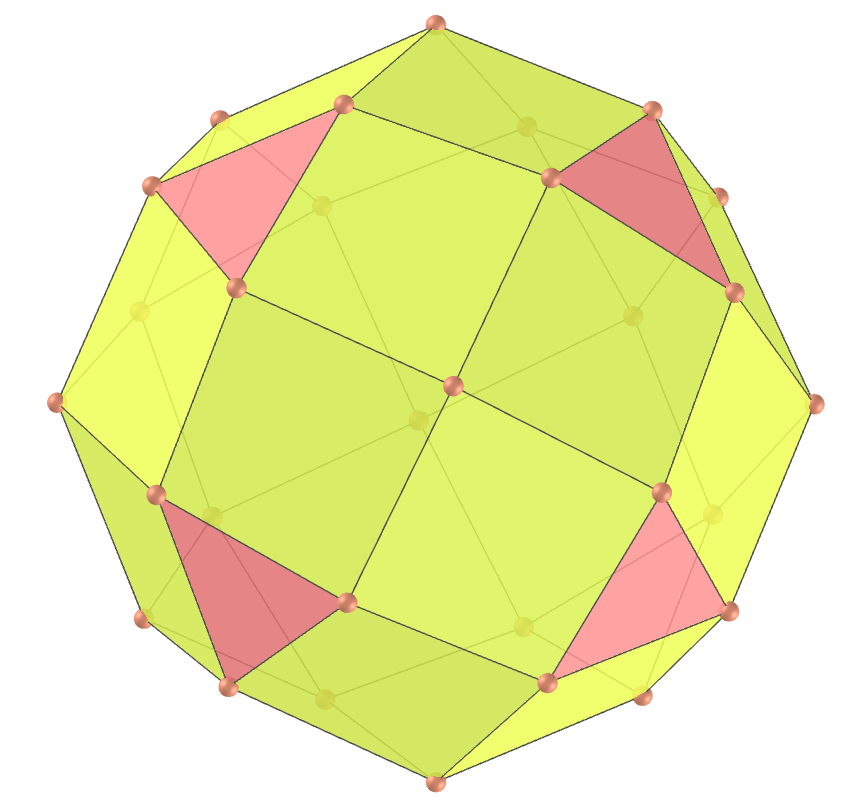

<link rel="stylesheet" href="../scripts/style.css">
<meta charset="utf-8">
<link rel="icon" type="image/png" href="vr/salas/imagens/icone.png">
<h2>Visualization of polyhedra with Augmented Reality (AR) and Virtual Reality (VR) in A-frame</h2>
 <b>author:</b> Paulo Henrique Siqueira - Universidade Federal do Paraná
  <b>contact:</b> <a href="#">paulohscwb@gmail.com</a>
  <a href="https://paulohscwb.github.io/polyhedra2/propellor/pt-br/">versão em português</a>
 <form style="margin: 0 auto; float:right; text-align:right; width:100%; margin-bottom:15px;">
	<select id="url" onchange="urlHandler(this.value)" style="color:royalblue;">
		<option disabled selected value>More polyhedra:</option>
		<option value="../ArchimedeanCatalanHulls/">Archimedean and Catalan convex hulls</option>
		<option value="../fractalplatonic/">Platonic polyhedra fractals</option>
		<option value="../fractalnonconvex/">Non convex polyhedra fractals</option>
		<option value="../fractalarchimedean/">Archimedean polyhedra fractals</option>
		<option value="../chamfered/">Chamfered polyhedra</option>
		<option disabled value="../propellor/">Propellor polyhedra</option>
		<option value="../diamonds/">Diamond polyhedra</option>
		<option value="../biscribed/">Biscribed polyhedra</option>
	</select>
</form>

  <h2 align="center"> Propellor polyhedra</h2>
The polyhedra of this page were created by applying George Hart's propellor operation to the Platonic solids and some of the Archimedean and Catalan solids. Each face is surrounded by a "propellor" of quadrilaterals, with rotational symmetry of its underlying Platonic solid.

 
<a href="#ra">Augmented Reality</a>&nbsp;&nbsp;|&nbsp;&nbsp;<a href="#m3d">3D Models</a>&nbsp;&nbsp;|&nbsp;&nbsp;<a href="../">Home</a>

  

 <h3 align="center">Immersive room</h3>
  
<iframe width="100%" src="sala.htm" title="Sala Imersiva dos Poliedros de hélice" frameborder="0" loading="lazy"></iframe>

  
<a href="sala.htm" target="_blank">&#x1f517; room link</a>
  
  
 
  <h3 id="ra" align="center">Augmented Reality</h3>
  To view propellor polyhedra in AR, simply visit:

<a href="ra.html" class="raAR" target="_blank">https://paulohscwb.github.io/polyhedra2/propellor/ra.html</a>
 
with any browser with a webcam device (smartphone, tablet or notebook). 
 Access to the VR sites is done by clicking on the blue circle that appears on top of the marker.

<h3 id="m3d" align="center">3D models</h3>
<!-- <iframe width="560" height="315" style="max-width:100%" src="https://www.youtube.com/embed/videoseries?list=PLy0I_lGW8HxU_sUZZg_ch86wAhxp8K2_x" title="YouTube video player" frameborder="0" allow="accelerometer; autoplay; clipboard-write; encrypted-media; gyroscope; picture-in-picture; web-share" allowfullscreen></iframe> -->
<h4>1. Propellor tetrahedron</h4>

    A propellor tetrahedron is a polyhedron obtained by performing propellor operations on a regular tetrahedron. 
    <b>Faces:</b> 4 equilateral triangles and 12 kites | <b>Edges:</b> 30 | <b>Vertices:</b> 16. <a href="http://dmccooey.com/polyhedra/Propellor.html" target="_blank">More...</a>
  

<h4>2. Propellor cube</h4>

    A propellor cube is a polyhedron obtained by performing propellor operations on a cube. 
    <b>Faces:</b> 6 squares and 24 kites | <b>Edges:</b> 60 | <b>Vertices:</b> 32. <a href="http://dmccooey.com/polyhedra/Propellor.html" target="_blank">More...</a>
  

<h4>3. Propellor octahedron</h4>

    A propellor octahedron is a polyhedron obtained by performing propellor operations on a regular octahedron. 
    <b>Faces:</b> 8 equilateral triangles and 24 kites | <b>Edges:</b> 60 | <b>Vertices:</b> 30. <a href="http://dmccooey.com/polyhedra/Propellor.html" target="_blank">More...</a>
  

<h4>4. Propellor icosahedron</h4>

    A propellor icosahedron is a polyhedron obtained by performing propellor operations on a regular icosahedron. 
    <b>Faces:</b> 20 equilateral triangles and 60 kites | <b>Edges:</b> 150 | <b>Vertices:</b> 72. <a href="http://dmccooey.com/polyhedra/Propellor.html" target="_blank">More...</a>
  

<h4>5. Propellor dodecahedron</h4>

    A propellor dodecahedron is a polyhedron obtained by performing propellor operations on a regular dodecahedron. 
    <b>Faces:</b> 12 regular pentagons and 60 kites | <b>Edges:</b> 150 | <b>Vertices:</b> 80. <a href="http://dmccooey.com/polyhedra/Propellor.html" target="_blank">More...</a>
  

<h4>6. Propellor truncated octahedron</h4>

    A propellor truncated octahedron is a polyhedron obtained by performing propellor operations on an Archimedean truncated octahedron. 
    <b>Faces:</b> 6 squares, 8 hexagons and 72 quadrilaterals | <b>Edges:</b> 180 | <b>Vertices:</b> 96. <a href="http://dmccooey.com/polyhedra/Propellor.html" target="_blank">More...</a>
  

<h4>7. Propellor tetrakis hexahedron</h4>

    A propellor tetrakis hexahedron is a polyhedron obtained by performing propellor operations on a Catalan tetrakis hexahedron. 
    <b>Faces:</b> 24 acute triangles, 24 kites and 48 quadrilaterals | <b>Edges:</b> 180 | <b>Vertices:</b> 86. <a href="http://dmccooey.com/polyhedra/Propellor.html" target="_blank">More...</a>
  

<h4>8. Propellor snub cube</h4>

    A propellor snub cube is a polyhedron obtained by performing propellor operations on an Archimedean snub cube. 
    <b>Faces:</b> 8 equilateral triangles, 24 acute triangles, 6 squares and 120 quadrilaterals | <b>Edges:</b> 300 | <b>Vertices:</b> 144. <a href="http://dmccooey.com/polyhedra/Propellor.html" target="_blank">More...</a>
  

<h4>9. Propellor pentagonal icositetrahedron</h4>

    A propellor pentagonal icositetrahedron is a polyhedron obtained by performing propellor operations on a Catalan pentagonal icositetrahedron. 
    <b>Faces:</b> 48 kites, 72 quadrilaterals and 24 pentagons | <b>Edges:</b> 300 | <b>Vertices:</b> 158. <a href="http://dmccooey.com/polyhedra/Propellor.html" target="_blank">More...</a>
  

<h4>10. Propellor truncated cuboctahedron</h4>

    A propellor truncated cuboctahedron is a polyhedron obtained by performing propellor operations on an Archimedean truncated cuboctahedron. 
    <b>Faces:</b> 12 rhombi, 150 quadrilaterals, 6 octagons and 8 hexagons | <b>Edges:</b> 360 | <b>Vertices:</b> 192. <a href="http://dmccooey.com/polyhedra/Propellor.html" target="_blank">More...</a>
  
 
<a href="#p1" class="topo">back to top</a>

<h4>11. Propellor disdyakis dodecahedron</h4>

    A propellor disdyakis dodecahedron is a polyhedron obtained by performing propellor operations on a Catalan disdyakis dodecahedron. 
    <b>Faces:</b> 48 acute triangles and 144 quadrilaterals | <b>Edges:</b> 360 | <b>Vertices:</b> 170. <a href="http://dmccooey.com/polyhedra/Propellor.html" target="_blank">More...</a>
  

<h4>12. Propellor truncated icosahedron</h4>

    A propellor truncated icosahedron is a polyhedron obtained by performing propellor operations on an Archimedean truncated icosahedron. 
    <b>Faces:</b> 12 regular pentagons, 20 hexagons and 180 quadrilaterals | <b>Edges:</b> 450 | <b>Vertices:</b> 240. <a href="http://dmccooey.com/polyhedra/Propellor.html" target="_blank">More...</a>
  

<h4>13. Propellor pentakis dodecahedron</h4>

    A propellor pentakis dodecahedron is a polyhedron obtained by performing propellor operations on a Catalan pentakis dodecahedron. 
    <b>Faces:</b> 60 acute triangles, 60 kites and 120 quadrilaterals | <b>Edges:</b> 450 | <b>Vertices:</b> 212. <a href="http://dmccooey.com/polyhedra/Propellor.html" target="_blank">More...</a>
  

<h4>14. Propellor truncated icosidodecahedron</h4>

    A propellor truncated icosidodecahedron is a polyhedron obtained by performing propellor operations on an Archimedean truncated icosidodecahedron. 
    <b>Faces:</b> 30 rhombi, 20 hexagons, 12 decagons and 360 quadrilaterals | <b>Edges:</b> 900 | <b>Vertices:</b> 480. <a href="http://dmccooey.com/polyhedra/Propellor.html" target="_blank">More...</a>
  

<h4>15. Propellor disdyakis triacontahedron</h4>

    A propellor disdyakis triacontahedron is a polyhedron obtained by performing propellor operations on a Catalan disdyakis triacontahedron. 
    <b>Faces:</b> 120 acute triangles and 360 quadrilaterals | <b>Edges:</b> 900 | <b>Vertices:</b> 422. <a href="http://dmccooey.com/polyhedra/Propellor.html" target="_blank">More...</a>
  

<a href="#p1" class="topo">back to top</a>

  Propellor polyhedra - Visualization of polyhedra with Augmented Reality and Virtual Reality by <a xmlns:cc="http://creativecommons.org/ns#" href="https://paulohscwb.github.io/polyhedra2/propellor/" property="cc:attributionName" rel="cc:attributionURL">Paulo Henrique Siqueira</a> is licensed with a license <a rel="license" href="http://creativecommons.org/licenses/by-nc-nd/4.0/">Creative Commons Attribution-NonCommercial-NoDerivatives 4.0 International</a>.

<h4>How to cite this work:</h4> 

Siqueira, P.H., "Propellor polyhedra - Visualization of polyhedra with Augmented Reality and Virtual Reality". Available in: <https://paulohscwb.github.io/polyhedra2/propellor/>, November 2023.

<!---->
  <b>References:</b>
 Weisstein, Eric W. "Archimedean Solid" From MathWorld-A Wolfram Web Resource. <a href="http://mathworld.wolfram.com/ArchimedeanSolid.html" target="_blank">http://mathworld.wolfram.com/ArchimedeanSolid.html</a>
 Weisstein, Eric W. "Platonic Solid" From MathWorld-A Wolfram Web Resource. <a href="http://mathworld.wolfram.com/PlatonicSolid.html" target="_blank">http://mathworld.wolfram.com/PlatonicSolid.html</a>
 Weisstein, Eric W. "Archimedean Dual" From MathWorld-A Wolfram Web Resource. <a href="https://mathworld.wolfram.com/ArchimedeanDual.html" target="_blank">https://mathworld.wolfram.com/ArchimedeanDual.html</a>
 Weisstein, Eric W. "Uniform Polyhedron." From MathWorld--A Wolfram Web Resource. <a href="https://mathworld.wolfram.com/UniformPolyhedron.html" target="_blank">https://mathworld.wolfram.com/UniformPolyhedron.html</a>
 Wikipedia <a href="https://en.wikipedia.org/wiki/Archimedean_solid" target="_blank">https://en.wikipedia.org/wiki/Archimedean_solid</a>
 Wikipedia <a href="https://en.wikipedia.org/wiki/en.wikipedia.org/wiki/Platonic_solid" target="_blank">https://en.wikipedia.org/wiki/Platonic_solid</a>
 McCooey, David I. "Visual Polyhedra". <a href="http://dmccooey.com/polyhedra/" target="_blank">http://dmccooey.com/polyhedra/</a>
