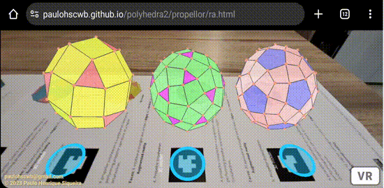
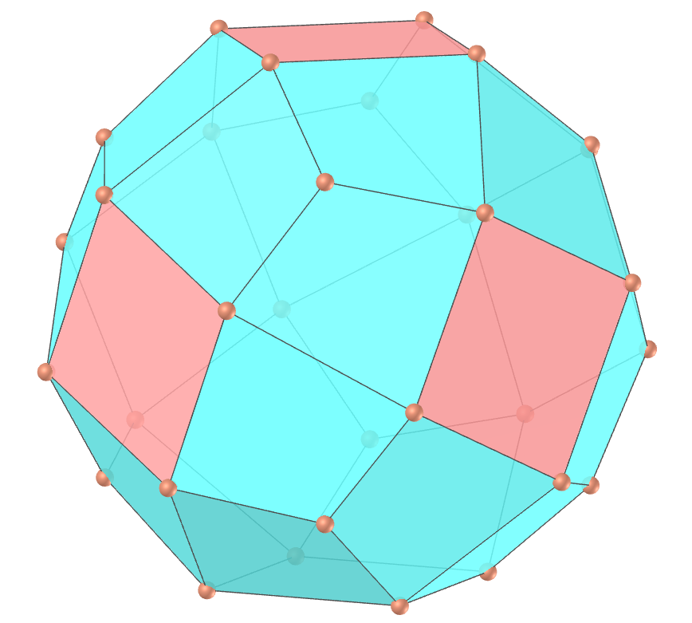
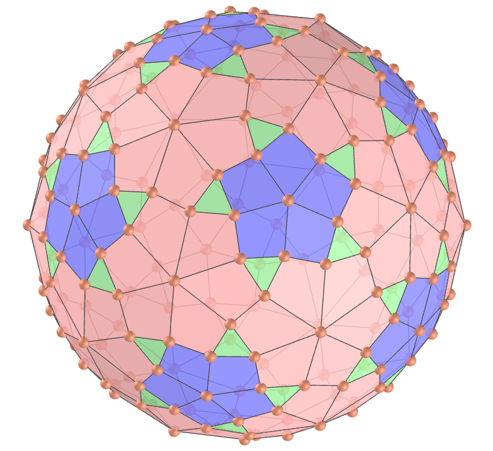
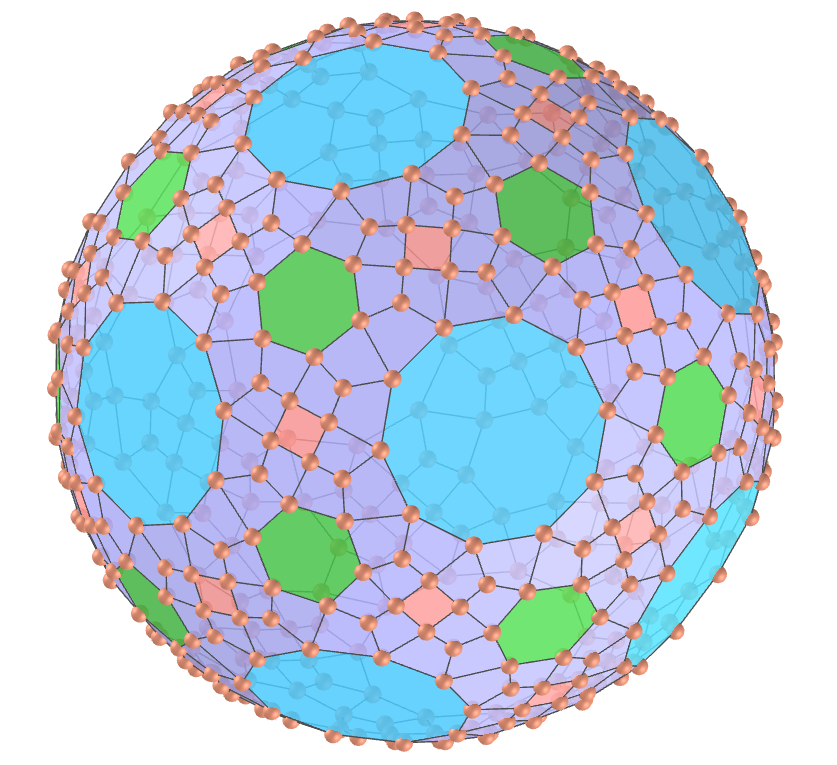

<link rel="stylesheet" href="../../scripts/style.css">
<meta charset="utf-8">
<link rel="icon" type="image/png" href="../vr/salas/imagens/icone.png">
<h2>Visualização de poliedros com Realidade Aumentada (RA) e Realidade Virtual (RV) em A-frame</h2>
<b>autor:</b> Paulo Henrique Siqueira - Universidade Federal do Paraná
 <b>contato:</b> <a href="#"> paulohscwb@gmail.com </a>
 <a href="https://paulohscwb.github.io/polyhedra2/propellor/">english version</a>
<form style="margin: 0 auto; float:right; text-align:right; width:100%; margin-bottom:15px;">
	<select id="url" onchange="urlHandler(this.value)" style="color:royalblue;">
		<option disabled selected>Mais poliedros:</option>
		<option value="../../ArchimedeanCatalanHulls/pt-br/">Cascos convexos de Arquimedes e Catalan</option>
		<option value="../../fractalplatonic/pt-br/">Fractais dos poliedros de Platão</option>
		<option value="../../fractalnonconvex/pt-br/">Fractais dos poliedros não convexos</option>
		<option value="../../fractalarchimedean/pt-br/">Fractais dos poliedros de Arquimedes</option>
		<option value="../../chamfered/pt-br/">Poliedros chanfrados</option>
		<option disabled value="../../propellor/pt-br/">Poliedros de hélice</option>
		<option value="../../diamonds/pt-br/">Poliedros de diamante</option>
		<option value="../../biscribed/pt-br/">Poliedros biscritos</option>
	</select>
</form>

  <h2 align="center"> Poliedros de hélice</h2>
  Os poliedros desta página foram criados aplicando a operação de hélice de George Hart aos sólidos platônicos e alguns dos sólidos de Arquimedes e de Catalan. Cada face é cercada por uma "hélice" de quadriláteros, com simetria rotacional de seu sólido platônico subjacente.

<a href="#ra">Realidade Aumentada</a>&nbsp;&nbsp;|&nbsp;&nbsp;<a href="#m3d">Modelos 3D</a>&nbsp;&nbsp;|&nbsp;&nbsp;<a href="../../pt-br/">Página Inicial</a>

 <h3 align="center">Sala imersiva</h3>
  
<iframe width="100%" src="../sala.htm" title="Sala Imersiva dos Poliedros de hélice" frameborder="0" loading="lazy"></iframe>

  
<a href="../sala.htm" target="_blank">&#x1f517; link da sala</a>
  
 
  <h3 id="ra" align="center">Realidade Aumentada</h3>
  Para visualizar os poliedros de hélice em RA, visite a página:

<a href="../ra.html" class="raAR" target="_blank">https://paulohscwb.github.io/polyhedra2/propellor/ra.html</a>
 
com qualquer navegador com um dispositivo de webcam (smartphone, tablet ou notebook).
 O acesso às páginas de RV é feito clicando no círculo azul que aparece em cima de cada marcador.

<h3 id="m3d" align="center">Modelos 3D</h3>
<iframe width="560" height="315" style="max-width:100%" src="https://www.youtube.com/embed/videoseries?list=PLy0I_lGW8HxU_sUZZg_ch86wAhxp8K2_x" title="YouTube video player" frameborder="0" allow="accelerometer; autoplay; clipboard-write; encrypted-media; gyroscope; picture-in-picture; web-share" allowfullscreen></iframe>
<h4>1. Tetraedro de hélice</h4>

   Um tetraedro de hélice é um poliedro obtido por meio de operações de hélice de George Hart em um tetraedro regular. 
    <b>Faces:</b> 4 triângulos equiláteros e 12 pipas | <b>Arestas:</b> 30 | <b>Vértices:</b> 16. <a href="http://dmccooey.com/polyhedra/Propellor.html" target="_blank">Mais sobre...</a>
  

<h4>2. Cubo de hélice</h4>

   Um cubo de hélice é um poliedro obtido por meio de operações de hélice de George Hart em um cubo. 
    <b>Faces:</b> 6 quadrados e 24 pipas | <b>Arestas:</b> 60 | <b>Vértices:</b> 32. <a href="http://dmccooey.com/polyhedra/Propellor.html" target="_blank">Mais sobre...</a>
  

<h4>3. Octaedro de hélice</h4>

   Um octaedro de hélice é um poliedro obtido por meio de operações de hélice de George Hart em um octaedro regular. 
    <b>Faces:</b> 8 triângulos equiláteros e 24 pipas | <b>Arestas:</b> 60 | <b>Vértices:</b> 30. <a href="http://dmccooey.com/polyhedra/Propellor.html" target="_blank">Mais sobre...</a>
  

<h4>4. Icosaedro de hélice</h4>

   Um icosaedro de hélice é um poliedro obtido por meio de operações de hélice de George Hart em um icosaedro regular. 
    <b>Faces:</b> 20 triângulos equiláteros e 60 pipas | <b>Arestas:</b> 150 | <b>Vértices:</b> 72. <a href="http://dmccooey.com/polyhedra/Propellor.html" target="_blank">Mais sobre...</a>
  

<h4>5. Dodecaedro de hélice</h4>

   Um dodecaedro de hélice é um poliedro obtido por meio de operações de hélice de George Hart em um dodecaedro regular. 
    <b>Faces:</b> 12 pentágonos regulares e 60 pipas | <b>Arestas:</b> 150 | <b>Vértices:</b> 80. <a href="http://dmccooey.com/polyhedra/Propellor.html" target="_blank">Mais sobre...</a>
  

<h4>6. Octaedro truncado de hélice</h4>

   Um octaedro truncado de hélice é um poliedro obtido por meio de operações de hélice de George Hart em um octaedro truncado de Arquimedes.
    <b>Faces:</b> 6 quadrados, 8 hexágonos e 72 quadriláteros | <b>Arestas:</b> 180 | <b>Vértices:</b> 96. <a href="http://dmccooey.com/polyhedra/Propellor.html" target="_blank">Mais sobre...</a>
  

<h4>7. Hexaedro tetrakis de hélice</h4>

   Um hexaedro tetrakis de hélice é um poliedro obtido por meio de operações de hélice de George Hart em um hexaedro tetrakis de Catalan.
    <b>Faces:</b> 24 triângulos acutângulos, 24 pipas e 48 quadriláteros | <b>Arestas:</b> 180 | <b>Vértices:</b> 86. <a href="http://dmccooey.com/polyhedra/Propellor.html" target="_blank">Mais sobre...</a>
  

<h4>8. Cubo snub de hélice</h4>

   Um cubo snub de hélice é um poliedro obtido por meio de operações de hélice de George Hart em um cubo snub de Arquimedes.
    <b>Faces:</b> 8 triângulos equiláteros, 24 triângulos acutângulos, 6 quadrados e 120 quadriláteros | <b>Arestas:</b> 300 | <b>Vértices:</b> 144. <a href="http://dmccooey.com/polyhedra/Propellor.html" target="_blank">Mais sobre...</a>
  

<h4>9. Icositetraedro pentagonal de hélice</h4>

   Um icositetraedro pentagonal de hélice é um poliedro obtido por meio de operações de hélice de George Hart em um icositetraedro pentagonal de Catalan.
    <b>Faces:</b> 48 pipas, 72 quadriláteros e 24 pentágonos | <b>Arestas:</b> 300 | <b>Vértices:</b> 158. <a href="http://dmccooey.com/polyhedra/Propellor.html" target="_blank">Mais sobre...</a>
  

<h4>10. Cuboctaedro truncado de hélice</h4>

   Um cuboctaedro truncado de hélice é um poliedro obtido por meio de operações de hélice de George Hart em um cuboctaedro truncado de Arquimedes.
    <b>Faces:</b> 12 losangos, 150 quadriláteros, 6 octógonos e 8 hexágonos | <b>Arestas:</b> 360 | <b>Vértices:</b> 192. <a href="http://dmccooey.com/polyhedra/Propellor.html" target="_blank">Mais sobre...</a>
  
 
<a href="#p1" class="topo">voltar ao topo</a>

<h4>11. Dodecaedro disdiakis de hélice</h4>

   Um dodecaedro disdiakis de hélice é um poliedro obtido por meio de operações de hélice de George Hart em um dodecaedro disdiakis de Catalan.
    <b>Faces:</b> 48 triângulos equiláteros e 144 quadriláteros | <b>Arestas:</b> 360 | <b>Vértices:</b> 170. <a href="http://dmccooey.com/polyhedra/Propellor.html" target="_blank">Mais sobre...</a>
  

<h4>12. Icosaedro truncado de hélice</h4>

   Um icosaedro truncado de hélice é um poliedro obtido por meio de operações de hélice de George Hart em um icosaedro truncado de Arquimedes.
    <b>Faces:</b> 12 pentágonos regulares, 20 hexágonos e 180 quadriláteros | <b>Arestas:</b> 450 | <b>Vértices:</b> 240. <a href="http://dmccooey.com/polyhedra/Propellor.html" target="_blank">Mais sobre...</a>
  

<h4>13. Dodecaedro pentakis de hélice</h4>

   Um dodecaedro pentakis de hélice é um poliedro obtido por meio de operações de hélice de George Hart em um dodecaedro pentakis de Catalan.
    <b>Faces:</b> 60 triângulos equiláteros, 60 pipas e 120 quadriláteros | <b>Arestas:</b> 450 | <b>Vértices:</b> 212. <a href="http://dmccooey.com/polyhedra/Propellor.html" target="_blank">Mais sobre...</a>
  

<h4>14. Icosidodecaedro truncado de hélice</h4>

   Um icosidodecaedro truncado de hélice é um poliedro obtido por meio de operações de hélice de George Hart em um icosidodecaedro truncado de Arquimedes.
    <b>Faces:</b> 30 losangos, 20 hexágonos, 12 decágonos e 360 quadriláteros | <b>Arestas:</b> 900 | <b>Vértices:</b> 480. <a href="http://dmccooey.com/polyhedra/Propellor.html" target="_blank">Mais sobre...</a>
  

<h4>15. Triacontaedro disdiakis de hélice</h4>

   Um triacontaedro disdiakis de hélice é um poliedro obtido por meio de operações de hélice de George Hart em um triacontaedro disdiakis de Catalan.
    <b>Faces:</b> 120 triângulos equiláteros e 360 quadriláteros | <b>Arestas:</b> 900 | <b>Vértices:</b> 422. <a href="http://dmccooey.com/polyhedra/Propellor.html" target="_blank">Mais sobre...</a>
  

<a href="#p1" class="topo">voltar ao topo</a>

  Propellor polyhedra - Visualization of polyhedra with Augmented Reality and Virtual Reality de <a xmlns:cc="http://creativecommons.org/ns#" href="https://paulohscwb.github.io/polyhedra2/propellor/pt-br/" property="cc:attributionName" rel="cc:attributionURL">Paulo Henrique Siqueira</a> está licenciado com uma Licença <a rel="license" href="http://creativecommons.org/licenses/by-nc-nd/4.0/">Creative Commons Atribuição-NãoComercial-SemDerivações 4.0 Internacional</a>.

<h4>Como citar este trabalho:</h4> 

Siqueira, P.H., "Propellor polyhedra - Visualization of polyhedra with Augmented Reality and Virtual Reality". Disponível em: <https://paulohscwb.github.io/polyhedra2/propellor/pt-br/>, Novembro de 2023.

  <b>Referências:</b>
 Weisstein, Eric W. "Archimedean Solid" From MathWorld-A Wolfram Web Resource. <a href="http://mathworld.wolfram.com/ArchimedeanSolid.html" target="_blank">http://mathworld.wolfram.com/ArchimedeanSolid.html</a>
 Weisstein, Eric W. "Platonic Solid" From MathWorld-A Wolfram Web Resource. <a href="http://mathworld.wolfram.com/PlatonicSolid.html" target="_blank">http://mathworld.wolfram.com/PlatonicSolid.html</a>
 Weisstein, Eric W. "Catalan Solid" From MathWorld-A Wolfram Web Resource. <a href="https://mathworld.wolfram.com/CatalanSolid.html" target="_blank">https://mathworld.wolfram.com/CatalanSolid.html</a>
 Wikipedia <a href="https://en.wikipedia.org/wiki/Archimedean_solid" target="_blank">https://en.wikipedia.org/wiki/Archimedean_solid</a>
 Wikipedia <a href="https://en.wikipedia.org/wiki/en.wikipedia.org/wiki/Platonic_solid" target="_blank">https://en.wikipedia.org/wiki/Platonic_solid</a>
 McCooey, David I. "Visual Polyhedra". <a href="http://dmccooey.com/polyhedra/" target="_blank">http://dmccooey.com/polyhedra/</a>
