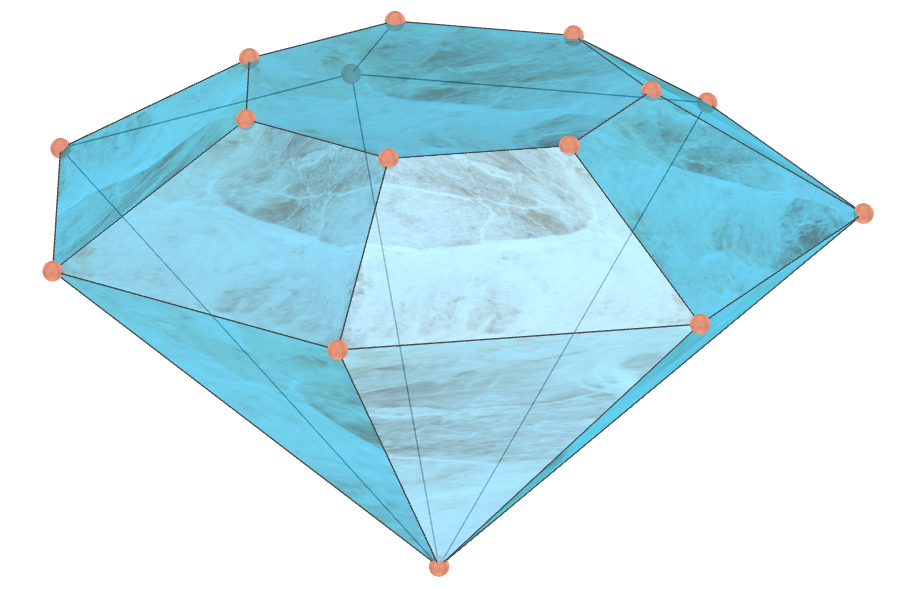

<link rel="stylesheet" href="../scripts/style.css">
<meta charset="utf-8">
<link rel="icon" type="image/png" href="../ArchimedeanCatalanHulls/vr/salas/imagens/icone.png">
<h2>Visualização de poliedros com Realidade Aumentada (RA) e Realidade Virtual (RV) em A-frame</h2>
<b>autor:</b> Paulo Henrique Siqueira - Universidade Federal do Paraná
 <b>contato:</b> <a href="#"> paulohscwb@gmail.com </a>
 <a href="https://paulohscwb.github.io/polyhedra2/">english version</a>

  Nova página: os poliedros e fractais podem ser vistos em Realidade Aumentada (RA) com os marcadores indicados, e por meio dos links criados nos marcadores, o modelo 3D de cada poliedro pode ser visto em Realidade Virtual (RV).

<h3 style="margin-top:3px"><a target="_blank" href="../ArchimedeanCatalanHulls/pt-br/"> Cascos convexos de Arquimedes e Catalan</a></h3>
<h3 style="margin-top:3px"><a target="_blank" href="../fractalplatonic/pt-br/"> Fractais dos poliedros de Platão</a></h3>
<h3 style="margin-top:3px"><a target="_blank" href="../fractalnonconvex/pt-br/"> Fractais dos poliedros não convexos</a></h3>
<h3 style="margin-top:3px"><a target="_blank" href="../fractalarchimedean/pt-br/"> Fractais dos poliedros de Arquimedes</a></h3>
<h3 style="margin-top:3px"><a target="_blank" href="../chamfered/pt-br/"> Poliedros chanfrados</a></h3>
<h3 style="margin-top:3px"><a target="_blank" href="../propellor/pt-br/"> Poliedros de hélice</a></h3>
<h3 style="margin-top:3px"><a target="_blank" href="../diamonds/pt-br/"> Poliedros de diamante</a></h3>
<h3 style="margin-top:3px"><a target="_blank" href="../biscribed/pt-br/"> Poliedros biscritos</a></h3>

<h3 style="margin-top:5px; text-align:center;"><a target="_blank" href="../todos/">&#x1f4c4; Lista completa dos poliedros</a></h3>
<h3 style="margin-top:5px; text-align:center;"><a target="_blank" href="../../polyhedra/pt-br/">&#x2B50; Poliedros - primeira parte</a></h3>
<h3 style="margin-top:5px; text-align:center;"><a target="_blank" href="../../polyhedra3/pt-br/">&#x2B50; Poliedros - terceira parte</a></h3>

<h3 align="center">Salas imersivas</h3>

<h3 align="center">Realidade Aumentada e modelos 3D</h3>

 Os ambientes de Realidade Aumentada foram criados com os scripts de <b>Jerome Etienne</b>: <a href="https://github.com/jeromeetienne/AR.js" target="_blank"> AR.js - Augmented Reality for the Web</a>.
 Os scripts de órbita desenvolvidos por <b>Kevin Ngo</b> foram usados nas páginas de Realidade Virtual dos modelos 3D: <a href="https://github.com/supermedium/superframe/tree/master/components/orbit-controls/" target="_blank"> Orbit controls for A-Frame</a>.
 As salas imersivas utilizam as propriedades físicas dos objetos 3D desenvolvidas por <b>Micah Blumberg</b>: <a  href="https://github.com/c-frame/aframe-physics-system" target="_blank"> Physics for A-Frame VR</a>
 Os controles de interação usados nas salas imersivas foram desenvolvidos por <b>Will Murphy</b>: <a  href="https://github.com/c-frame/aframe-super-hands-component" target="_blank"> Super Hands</a>
 

  Polyhedra 2: Visualization of polyhedra with Augmented Reality and Virtual Reality de <a xmlns:cc="http://creativecommons.org/ns#" href="https://paulohscwb.github.io/polyhedra2/" property="cc:attributionName" rel="cc:attributionURL">Paulo Henrique Siqueira</a> está licenciado com uma Licença <a rel="license" href="http://creativecommons.org/licenses/by-nc-nd/4.0/">Creative Commons Atribuição-NãoComercial-SemDerivações 4.0 Internacional</a>.

<h4>Como citar este trabalho:</h4> 

Siqueira, P.H., "Polyhedra 2: Visualization of polyhedra with Augmented Reality and Virtual Reality". Disponível em: <https://paulohscwb.github.io/polyhedra2/>, Outubro de 2023.

 <b>Referências:</b>
 Weisstein, Eric W. "Archimedean Solid" From MathWorld-A Wolfram Web Resource. <a href="http://mathworld.wolfram.com/ArchimedeanSolid.html" target="_blank">http://mathworld.wolfram.com/ArchimedeanSolid.html</a>
 Weisstein, Eric W. "Platonic Solid" From MathWorld-A Wolfram Web Resource. <a href="http://mathworld.wolfram.com/PlatonicSolid.html" target="_blank">http://mathworld.wolfram.com/PlatonicSolid.html</a>
 Weisstein, Eric W. "Catalan Solid" From MathWorld-A Wolfram Web Resource. <a href="https://mathworld.wolfram.com/CatalanSolid.html" target="_blank">https://mathworld.wolfram.com/CatalanSolid.html</a>
 Weisstein, Eric W. "Uniform Polyhedron." From MathWorld--A Wolfram Web Resource. <a href="https://mathworld.wolfram.com/UniformPolyhedron.html" target="_blank">https://mathworld.wolfram.com/UniformPolyhedron.html</a>
 Weisstein, Eric W. "Fractal" From MathWorld-A Wolfram Web Resource. <a href="https://mathworld.wolfram.com/Fractal.html" target="_blank">https://mathworld.wolfram.com/Fractal.html</a>
 Weisstein, Eric W. "Johnson Solid" From MathWorld-A Wolfram Web Resource. <a href="https://mathworld.wolfram.com/JohnsonSolid.html" target="_blank">https://mathworld.wolfram.com/JohnsonSolid.html</a>
 McCooey, David I. "Visual Polyhedra". <a href="http://dmccooey.com/polyhedra/" target="_blank">http://dmccooey.com/polyhedra/</a>
